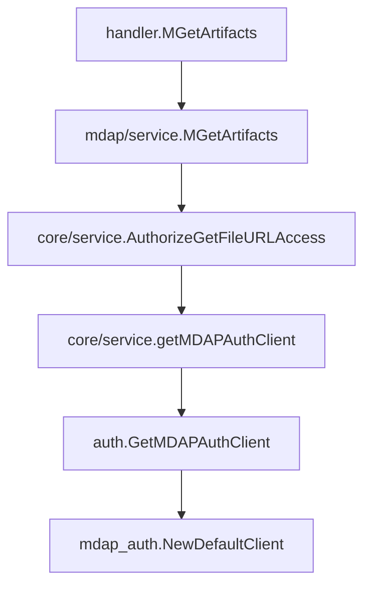

# MDAP Assets and Processing — auth

## 模块概览

`mdap/auth` 模块负责为 MDAP 相关业务提供全局复用的鉴权客户端。当前模块只有一个导出函数：

```go
func GetMDAPAuthClient() (mdapauth.Client, error)
```

它封装了 `code.byted.org/videoarch/mdap_auth` 的默认客户端初始化逻辑，并通过 `sync.Once` 保证进程内只初始化一次。

## 核心实现

模块级变量：

```go
var (
	mdapAuthClientOnce sync.Once
	mdapAuthClient     mdapauth.Client
	mdapAuthClientErr  error
)
```

`GetMDAPAuthClient` 的执行逻辑是：

1. 首次调用时进入 `mdapAuthClientOnce.Do(...)`。
2. 调用 `mdapauth.NewDefaultClient()` 创建默认 MDAP 鉴权客户端。
3. 将客户端和错误缓存到包级变量 `mdapAuthClient`、`mdapAuthClientErr`。
4. 后续调用直接返回缓存结果，不会再次初始化。

```go
func GetMDAPAuthClient() (mdapauth.Client, error) {
	mdapAuthClientOnce.Do(func() {
		mdapAuthClient, mdapAuthClientErr = mdapauth.NewDefaultClient()
	})
	return mdapAuthClient, mdapAuthClientErr
}
```

这里的关键模式是“懒加载单例”：

- `sync.Once` 提供并发安全的只执行一次语义。
- 初始化成功后，所有调用方共享同一个 `mdapauth.Client`。
- 初始化失败后，错误也会被缓存；后续调用会继续返回同一个错误，不会自动重试。

## 在代码库中的角色

`mdap/auth` 不直接执行业务鉴权判断，而是提供底层 MDAP Auth Client 的统一入口。实际业务调用方会拿到 `mdapauth.Client` 后，再在各自服务逻辑中执行具体的权限校验。

当前主要调用入口包括：

- `core/service/pack_url.go` 中的 `getMDAPAuthClient`
- `mdap/service/start_processing_auth.go` 中的 `getStartProcessingAuthClient`

典型执行链路之一是获取文件 URL 权限校验：



另一个相关链路是按资产组查询产物：

```text
queryArtifactsByAssetGroupID
  -> AuthorizeGetFileURLAccess
  -> getMDAPAuthClient
  -> GetMDAPAuthClient
```

这说明 `GetMDAPAuthClient` 位于“业务服务层”和外部 `mdap_auth` SDK 之间，承担统一初始化与复用客户端的职责。

## 错误行为

`GetMDAPAuthClient` 返回 `(mdapauth.Client, error)`，调用方必须处理错误：

```go
client, err := auth.GetMDAPAuthClient()
if err != nil {
	return err
}
```

需要注意的是，`sync.Once` 会缓存第一次初始化的结果。如果 `mdapauth.NewDefaultClient()` 第一次失败，`mdapAuthClientErr` 会持续返回该错误，除非进程重启或未来代码显式引入重置机制。

因此，调用方不应假设再次调用 `GetMDAPAuthClient()` 可以恢复临时初始化失败。

## 并发与生命周期

该模块适合被请求路径上的代码直接调用：

- 多个 goroutine 同时首次调用时，只有一个 goroutine 会执行 `mdapauth.NewDefaultClient()`。
- 其他 goroutine 会等待初始化完成后读取同一份结果。
- 客户端生命周期与当前进程一致，没有显式关闭逻辑。

如果未来 `mdapauth.Client` 引入连接池、后台刷新或资源释放能力，需要重新评估这个单例生命周期是否需要增加关闭或重建机制。

## 维护注意事项

修改该模块时需要特别关注以下行为：

- 不要绕过 `sync.Once` 直接初始化多个 `mdapauth.Client`，否则可能破坏连接复用或认证配置一致性。
- 如果要支持初始化失败后的重试，不能只在现有 `sync.Once` 中加逻辑，需要重新设计缓存状态和并发控制。
- 如果要支持测试注入，需要考虑如何替换 `mdapAuthClient`，同时避免影响并发调用路径。
- 业务鉴权逻辑不应放进 `mdap/auth`，应继续保留在 `core/service` 或 `mdap/service` 等调用层中。