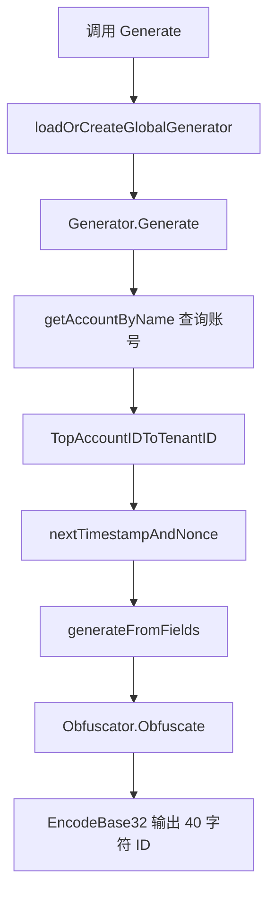

# MDAP Assets and Processing — id

## 模块概览

`mdap/id` 负责 MDAP 资源 ID 的生成、解析、字段编码和兼容性处理。模块产出的 ID 固定为 40 字符，底层表示为 200 bits / 25 bytes，并使用自定义 Base32 字符集 `0123456789abcdefghjkmnpqrstvwxyz` 编码。

模块覆盖两类 ID：

- 标准 MDAP ID：由 `Generator.Generate` / 包级 `Generate` 生成，由 `Parser.Parse` / 包级 `Parse` 解析。
- AssetGroupID：由 `GenerateAssetGroupID` / `BuildAssetGroupID` 生成，由 `ParseAssetGroupID` 解析，采用专门的可读前缀和固定字段布局。

`mdap/service` 会直接依赖本模块：例如 `CreateArtifact`、`CreateSource` 会通过 `ParseAssetGroupID` 校验 asset group 归属，通过 `Generate` 创建 artifact/source ID，通过 `Parse` 反解 source/artifact 的账号、VDC、GroupKey 等字段。

## 标准 MDAP ID 布局

标准 ID 总长度为 200 bits，编码后为 40 个 Base32 字符。

```text
明文前缀 60 bits:
T(5) + TEN6(30) + SUB4(20) + KV1(5)

混淆后缀 140 bits:
SET11(55) + DC2(10) + MT(5) + TS7(35) + X1(5) + RAND6(30)
```

字段含义定义在 `IDFields`：

- `EntityType`：实体类型，支持 `EntityTypeAsset`、`EntityTypeSource`、`EntityTypeArtifact`、`EntityTypeAssetGroup`。
- `TenantID`：由账号的 `TopAccountID` 经 `TopAccountIDToTenantID` 派生。
- `AccountID`：账号 ID，来自 account 服务返回的 `AccountInfo.ID`。
- `Space`：账号名称，生成时由调用方传入，解析时通过 `AccountID` 查询 account 服务补齐。
- `GroupKey`：父 AssetGroup 的短键，用于子实体 ID 关联 asset group。
- `KeyVersion`：混淆密钥版本，位于明文前缀，解析时用于选择 `Obfuscator`。
- `VDC`：虚拟数据中心字符串，通过 `VDCToCode` / `CodeToVDC` 与 10-bit 数值互转。
- `MIMEType`：MIME 顶层类型，使用 `MIMEType` 枚举。
- `Timestamp`：以 `EpochMs` 为起点的 100ms 时间桶。
- `Extension`、`WorkerID`、`Sequence`：共同承载 35-bit nonce；新 ID 要求 `Extension != 0`，用于区别历史 `X1=0` 布局。

## 生成流程

`Generate(ctx, entityType, space, groupKey, vdc, mimeType)` 是包级入口，会懒加载全局 `Generator`。全局生成器的 `WorkerID` 来自 `workerIDFromPodName`，它对 `env.PodName()` 做 FNV-1a hash，并截断为 15 bits。

核心流程：



`Generator.Generate` 会先查询 account 服务，再校验：

- `entityType.IsValid()`
- `tenantID <= MaxTenantID`
- `AccountInfo.ID` 在 `[0, MaxAccountID]`
- `groupKey <= MaxGroupKey`
- `VDCToCode(vdc)` 可识别

随后调用 `nextTimestampAndNonce` 生成时间戳和 nonce。nonce 在每个 100ms 时间桶内随机初始化，然后进程内递增；如果同一时间桶耗尽到 `MaxNonce`，会通过 `waitForNext100ms` 等待下一个时间桶。

`generateFromFields` 负责位级组装：先构造 60-bit 明文前缀，再构造 140-bit 后缀，并通过 `Obfuscator.Obfuscate` 做仿射置换，最后合并为 25 字节并调用 `EncodeBase32`。

## 解析流程

`Parse(ctx, id)` 是包级入口，实际委托给 `DefaultParser.Parse`。

解析步骤与生成相反：

1. `DecodeBase32` 将 40 字符 ID 解码为 `[TotalBytes]byte`。
2. 使用 `big.Int` 读取 200-bit 整数。
3. 高 60 bits 作为明文前缀，直接提取 `EntityType`、`TenantID`、`AccountID`、`KeyVersion`。
4. 低 140 bits 作为混淆后缀，根据 `KeyVersion` 从 `KeyManager` 获取 `Obfuscator`。
5. 调用 `Deobfuscate` 还原后缀字段。
6. 解析 `GroupKey`、`VDC`、`MIMEType`、`Timestamp`、`Extension`、`WorkerID`、`Sequence`。
7. 调用 `getAccountByID` 查询账号名称，填充 `IDFields.Space`。

如果密钥版本不存在，`Parser.Parse` 会返回包装了 `ErrParseFailed` 的错误；如果 VDC code 不存在，也会返回 `ErrParseFailed: unknown vdc code ...`。

## AssetGroupID

AssetGroupID 使用独立布局，不经过 `Obfuscator`，但仍保持 40 字符长度：

```text
g + accountPart(4) + groupKeyPart(11) + dcPart(2) + padding(22)
```

相关入口：

- `GenerateAssetGroupID(ctx, space)`：通过 `getAccountByName` 查询账号，生成随机 `groupKey`，使用当前 `env.VDC()`，再调用 `BuildAssetGroupID`。
- `BuildAssetGroupID(accountID, groupKey, vdc)`：直接按固定宽度 Base32 片段拼接。
- `ParseAssetGroupID(ctx, id)`：调用 `decodeAssetGroupID` 解析字段，再通过 `getAccountByID` 补齐 `Space`。

`decodeAssetGroupID` 会进行严格校验：长度必须等于 `TotalChars`，前缀必须为 `g`，尾部 padding 必须等于 `assetGroupIDPadding`，`accountID` 和 `dcCode` 必须合法。输入会先 `strings.ToLower`，因此大小写 ID 可解析。

`randomGroupKey` 使用 `crypto/rand` 生成 64-bit 随机数并裁剪到 `MaxGroupKey`，同时拒绝 0。

## Base32 与二进制转换

`base32.go` 提供两组编码能力：

- `EncodeBase32` / `DecodeBase32`：处理完整 25 字节 ID。
- `EncodeBase32Uint` / `DecodeBase32Uint`：处理固定宽度整数片段，主要用于 AssetGroupID。

`IsValidID` 只检查长度和字符集，不校验字段语义、VDC、密钥版本或 account 存在性。需要字段级校验时应使用 `Parse` 或 `ParseAssetGroupID`。

数据库存储可使用：

- `ParseToBinary(id)`：字符串转 `[TotalBytes]byte`
- `BinaryToString(data)`：二进制转字符串

## 混淆与密钥管理

`Obfuscator` 对 140-bit 后缀做可逆变换：

```text
混淆:   C = (P * A + B) mod 2^140
解混淆: P = ((C - B) * A^-1) mod 2^140
```

`A` 必须是奇数，才能在模 `2^140` 下存在乘法逆元。`NewDefaultObfuscator` 使用内置默认密钥，`GenerateRandomKey` 可生成随机 `(A, B)`。

`KeyManager` 维护 `keyVersion -> Obfuscator` 的映射。`DefaultKeyManager` 在 `init` 中注册版本 `0`。生成器创建时，如果 `GeneratorConfig.Obfuscator` 为空，会优先从 `DefaultKeyManager` 按 `KeyVersion` 获取；不存在时退回 `NewDefaultObfuscator`。

## VDC 编码约束

`vdc.go` 维护模块内固定的 `vdcList` 快照。编码从 1 开始，0 保留为非法值。

开发时必须遵守一个重要约束：新增 VDC 只能追加到 `vdcList` 末尾，不能重排或删除已有项。否则历史 ID 中的 `dcCode` 会被解释成错误的 VDC。

`VDCToCode` 用于生成路径，`CodeToVDC` 用于解析路径。AssetGroupID 和标准 MDAP ID 都依赖这组映射。

## 与业务层的连接点

`mdap/service` 主要通过以下方式使用本模块：

- `generateAssetGroupID` 调用 `GenerateAssetGroupID` 创建 asset group ID。
- `CreateArtifact` 和 `CreateSource` 调用 `ParseAssetGroupID` 解析并校验 asset group 的 `Space`、`AccountID`、`GroupKey`、`VDC`。
- `generateArtifactID` 调用包级 `Generate` 创建 artifact ID。
- `parseSpaceFromSourceID`、`parseSourceFromQuery`、`resolveStartProcessingInput`、`validateArtifactDeriveID` 调用 `Parse` 反解标准 ID。

因此，本模块不仅是编码工具，还承担了跨服务身份一致性的基础校验：ID 中的 account、space、VDC、GroupKey 会被业务层用于判断请求是否引用了正确的资源归属。

## 开发注意事项

修改位宽、字段顺序、`Base32Charset`、`EpochMs`、`vdcList` 顺序或默认密钥都会影响历史 ID 兼容性，除非明确设计迁移路径，否则不要改动。

新增实体类型或 MIME 类型时，需要同时维护 `types.go` 中的常量、`String` 方法，以及 `charToBits` / `bitsToChar` 可覆盖的字符范围。生成路径依赖 `charToBits[byte(...)]`，解析路径依赖 `bitsToChar[index]`。

测试中可替换包级变量 `getAccountByName`、`getAccountByID`、`getPodName` 来隔离外部依赖。现有测试已经覆盖生成解析闭环、默认解析器、legacy worker/sequence 布局、非零 extension nonce、AssetGroupID malformed 字段拒绝等关键行为。