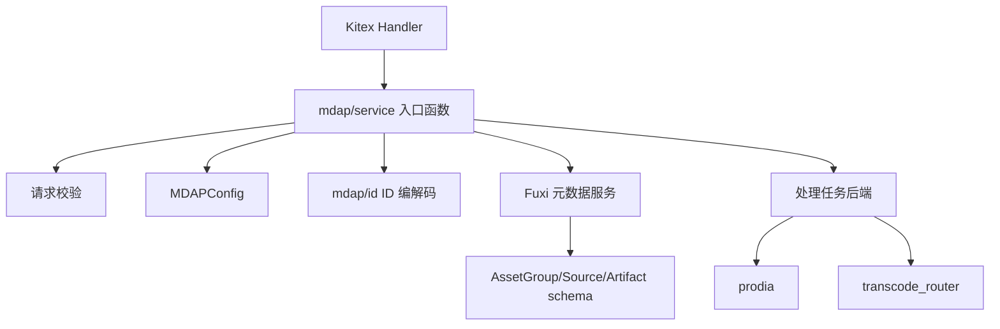

# MDAP Assets and Processing — service

## 模块职责

`mdap/service` 是 MDAP 资产元数据与处理任务的服务层。它把 Kitex handler 收到的 `mdap` / `compound` 请求转换为底层 Fuxi 元数据操作，并负责：

- 管理 `AssetGroup`、`Source`、`Artifact` 的创建、查询、更新和删除。
- 统一校验请求参数、ID 合法性、配置格式和内容 payload。
- 将 Thrift 模型扁平化为 Fuxi `AttrVal`，并从查询结果还原为 `mdap_model` 对象。
- 支持从历史 `media_digest` schema 查询摘要结果，并转换为 MDAP `Artifact`。
- 为 Artifact 中的 TOS 路径按需填充下载签名 URL。
- 启动处理任务，按配置切换 `prodia` 或 `transcode_router` 后端。

核心入口由 `handler/handler.go` 调用，例如 `CreateAssetGroup`、`MGetSources`、`QueryArtifacts`、`StartProcessing` 等。服务层不直接暴露 RPC，它返回统一的 `resp.Resp[*base.BaseResp]` 和业务模型对象。

## 总体结构



模块文件分工如下：

- `mdap.go`：资产组、源、产物 CRUD，属性构建与解析，digest 兼容查询，签名 URL 填充。
- `mdap_validator.go`：请求参数与模型 payload 校验。
- `parser.go`：Fuxi 查询结果解析、基础类型转换、数组属性辅助函数。
- `start_processing.go`：`StartProcessing` 主流程、输入归一化、操作归一化、执行计划构建。
- `start_processing_auth.go`：prodia 后端启动权限校验。
- `start_processing_prodia.go`：构建并提交 prodia workflow。
- `start_processing_transcode_router.go`：构建并提交 transcode_router HTTP 请求。

## 配置加载

`getMDAPConfig` 使用 `sync.Once` 缓存 `config.MDAPConfig`：

```go
func getMDAPConfig() *config.MDAPConfig {
    mdapConfigOnce.Do(initMDAPConfig)
    return mdapConfig
}
```

`initMDAPConfig` 从 `conf.GetWithYAML[config.MDAPConfig](ctx, config.MDAP)` 读取配置。读取失败时：

- 如果不是 `conf.IsNotFound(err)`，会打印日志。
- 最终回退为空的 `config.MDAPConfig{}`，避免 nil 配置导致服务层 panic。

该配置用于获取 schema、ArtifactType 到 digest schema 的映射、处理后端类型、prodia 参数、transcode_router 参数和 fallback task list。

## 元数据存储模型

本模块使用 Fuxi 的属性式存储。业务模型会被转换成 `[]*compound.AttrVal`，属性名使用 JSONPath 风格：

```go
&compound.AttrVal{Name: "$.name", Val: assetGroup.Name}
&compound.AttrVal{Name: "$.source_configs[0].locations[0].path", Val: loc.Path}
```

数组字段使用显式下标展开。读取时再通过 `fmt.Sscanf` 和 map 按下标重建顺序。

公共辅助函数：

- `appendAttr`：追加单个属性。
- `appendIndexedStringValues`：写入 `$.tags[0]`、`$.tags[1]` 这类字符串数组。
- `parseOrderedQueryResults`：保持 Fuxi 返回顺序，将 `[][][]*compound.AttrVal` 转为 `[]queryResult`。
- `parseQueryResults`：在 `MGet` 场景下转为 `map[id]attrs`。
- `orderedStrings` / `orderedInts`：按下标恢复数组。

需要注意，`orderedStrings` 和 `orderedInts` 按 `len(map)` 构造结果，如果中间下标缺失，会留下对应类型零值。

## AssetGroup 流程

`AssetGroup` 是 MDAP 的资产集合边界，也是后续 `Source` 和 `Artifact` 归属校验的基础。

### 创建

`CreateAssetGroup` 的执行顺序：

1. `ValidateCreateAssetGroupRequest` 校验 `Space`、`Name`、`SourceConfigs`、`MediaTypes`、`Creator` 和 `ArtifactConfig`。
2. `generateAssetGroupID` 调用 `mdapid.GenerateAssetGroupID`，ID 内编码 `space`。
3. 构造 `mdap_model.AssetGroup`，初始化 `SourceCount`、`Size`、`CreateTime`、`UpdateTime`。
4. `buildAssetGroupAttrs` 扁平化字段。
5. 调用 `fuxi_s.SetAttr` 写入 `cfg.GetAssetGroupSchema()`。

写入时 `SetAttrReq` 带有 `Space` 和 `Where` 的 `$.space == assetGroup.Space` 过滤，避免跨 space 写入。

### 查询与解析

`MGetAssetGroups` 会从第一个 ID 调用 `parseSpaceFromAssetGroupID` 得到 space，再通过 `buildAssetGroupWhereClause` 构造带 `Ids` 和 `$.space` filter 的查询条件。

`QueryAssetGroups` 支持按以下条件组合查询：

- `Space`
- `Name`
- `MediaTypes`

`buildQueryAssetGroupsWhereClause` 使用 `AND` 合并条件，并按 `$.create_time` 倒序排序。查询完成后还会调用 `fuxi_s.Count` 返回总数。

`parseAssetGroupFromQuery` 负责从属性 map 还原：

- 基础字段：`Space`、`Name`、`Creator`、`SourceCount`、`Size`、时间戳。
- `MediaTypes`
- `SourceConfigs`
- `ArtifactConfig.StoreLocations`
- `ArtifactConfig.JobExecution`

`ArtifactConfig` 会默认初始化为非 nil，且 `StoreLocations` 初始化为空切片。

### 更新与删除

`UpdateAssetGroup` 使用 `buildUpdateAttrs` 只写入请求中显式设置的字段，并总是更新 `$.update_time`。支持更新：

- `Name`
- `Description`
- `SourceCount`
- `Size`
- `ArtifactConfig`
- `SourceConfigs`

`DeleteAssetGroup` 解析 ID 中的 space，构造 `compound.DelReq`，调用 `fuxi_s.Del` 删除对应 schema 下的数据。

## Source 流程

`Source` 表示某个资产组下的输入媒体源。Source ID 使用 `mdapid.Generate` 生成，包含 entity type、space、group key、VDC 和 MIME 顶层类型。

### 创建

`CreateSource` 的关键步骤：

1. `ValidateCreateSourceRequest` 校验 `AssetGroupID`、`BizID`、`MediaType`、`Format`、`Config`、`Meta`。
2. `mdapid.ParseAssetGroupID` 从 `AssetGroupID` 解析 `Space` 和 `GroupKey`。
3. `generateSourceID` 将 `MediaType` 转成 `mdapid.MIMEType`，不支持的顶层 MIME 会返回错误。
4. 构造 `mdap_model.Source`，写入 `cfg.GetSourceSchema()`。

`buildSourceAttrs` 会持久化：

- `$.biz_id`
- `$.asset_group_id`
- `$.name`
- `$.media_type`
- `$.format`
- 可选 `$.asset_id`
- `$.config.*`
- `$.meta`
- `$.tags[i]`
- `$.created_time` / `$.updated_time`

### 查询与一致性校验

`MGetSources` 通过 Source ID 解析 space，再按 `Ids` 查询 `cfg.GetSourceSchema()`。

`QuerySources` 必须传 `AssetGroupID`，可选 `BizID`。其中 `buildSourceQueryWhereClause` 固定包含：

```go
$.asset_group_id == req.GetAssetGroupID()
```

当 `BizID` 为空时，`QuerySources` 会额外调用 `fuxi_s.Count` 返回总数；当按 `BizID` 精确过滤时，总数返回 `nil`。

`parseSourceFromQuery` 除了恢复字段，还会做重要一致性检查：

- 持久化属性必须包含 `$.asset_group_id`。
- Source ID 解析出的 `GroupKey`、`AccountID` 必须与持久化 `AssetGroupID` 一致。
- 允许 VDC 不同，但不允许资产组身份不匹配。

这可以防止错误迁移或手工写入导致 Source 跨资产组串联。

### 更新

`UpdateSource` 使用 `buildUpdateSourceAttrs` 更新显式设置字段，并总是写入 `$.updated_time`。如果同时设置了 `Config` 和 `FetchStatus`，`FetchStatus` 以请求顶层的 `FetchStatus` 为准，避免被 `Config.FetchStatus` 覆盖。

## Artifact 流程

`Artifact` 表示源或产物派生出的处理结果。它既支持写入 MDAP 自有 `Artifact` schema，也支持从历史 digest schema 查询并转换。

### 创建

`CreateArtifact` 的执行顺序：

1. `ValidateCreateArtifactRequest` 校验 `DeriveID`、`Name`、`AssetGroupID`、`DeriveType` 和 `Contents`。
2. `mdapid.ParseAssetGroupID` 解析资产组身份。
3. `validateArtifactDeriveID` 校验 `DeriveID`：
   - `DeriveType_Source` 要求 `DeriveID` 是 Source ID。
   - `DeriveType_Artifact` 要求 `DeriveID` 是 Artifact ID。
   - `AccountID` 和 `GroupKey` 必须属于同一个 `AssetGroupID`。
4. `generateArtifactID` 根据首个 content 的类型选择 MIME 类型并生成 ID。
5. `calculateArtifactSize` 计算总大小。
6. `buildArtifactAttrs` 扁平化后写入 `cfg.GetArtifactSchema()`。

`calculateArtifactSize` 的规则：

- 如果 `ArtifactContent.Blobs` 非空，直接累加每个 `ArtifactBlob.Size`。
- 否则解析 `ArtifactContent.Contents` 中的 JSON payload：
  - `ArtifactType_Snapshots`：解析为 `ArtifactSnapshots`，累加 snapshots 和 sprites meta size。
  - `ArtifactType_Audio`：解析为 `ArtifactAudio`，使用 `AudioMeta.Size`。
  - `ArtifactType_Image`：解析为 `ArtifactImage`，使用 `ImageMeta.Size`。

### 内容持久化格式

`buildArtifactAttrs` 会将 `ArtifactContent.Contents` 的二进制 payload 使用 base64 存储：

```go
attrs = appendAttr(attrs,
    fmt.Sprintf("$.contents[%d].contents[%d]", i, j),
    base64.StdEncoding.EncodeToString(payload),
)
```

读取时 `parseArtifactFromQuery` 使用 `base64.StdEncoding.DecodeString` 还原。Blob 信息则按：

- `$.contents[i].blobs[j].location.type`
- `$.contents[i].blobs[j].location.path`
- `$.contents[i].blobs[j].size`
- `$.contents[i].blobs[j].content_type`

进行展开和重建。

## Artifact 查询的两种形态

`QueryArtifacts` 支持两类查询入口，参数互斥。

### 按 `AssetGroupID` 查询 MDAP Artifact schema

当 `req.GetAssetGroupID() != ""` 时，`QueryArtifacts` 走 `queryArtifactsByAssetGroupID`：

1. 从 `AssetGroupID` 解析 space。
2. 可选执行 `fuxi_s.AuthorizeGetFileURLAccess`。
3. 按 `$.asset_group_id == req.GetAssetGroupID()` 查询 `cfg.GetArtifactSchema()`。
4. 按 `$.created_time` 倒序排序。
5. 调用 `fuxi_s.Count` 返回总数。
6. 如 `WithSignedURLs` 为 true，调用 `populateArtifactDownloadURLs` 填充下载地址。

该模式不允许同时设置 `DeriveType`、`DeriveIDs`、`SourceBizIDs`、`Types`、`Name`、`Space`。

### 按 `SourceBizIDs + Types + Name + Space` 查询 digest schema

当未设置 `AssetGroupID` 时，`ValidateQueryArtifactsRequest` 要求：

- `Space` 必填。
- `SourceBizIDs` 非空。
- `Types` 长度必须为 1。
- `Name` 必填。
- 当前不支持 `DeriveType` 和 `DeriveIDs`。

查询流程：

1. 通过 `cfg.GetArtifactTypeConfig(typeName)` 找到对应 digest schema 与 `DigestType`。
2. 对每个 `SourceBizID` 构造查询 ID：

   ```go
   buildArtifactID(sourceBizID, typeCfg.DigestType, req.GetName())
   ```

   ID 格式为 `{biz_id}/{DigestType}/{DigestName}`。

3. 查询配置中的 digest schema。
4. `convertQueryToArtifact` 将 digest 结果转换为 `mdap_model.Artifact`。

`MGetArtifacts` 也支持这种 `{biz_id}/{DigestType}/{DigestName}` 形式的查询 ID，但这种 ID 本身不编码 space，因此请求必须显式传 `Space`。

## digest schema 到 Artifact 的转换

历史 digest schema 查询结果先由 `parseMediaDigestFromQuery` 转为 `dto.MediaDigest`。字段映射包括：

- `$.meta_data` → `MediaDigest.Metadata`
- `$.user_data` → `MediaDigest.UserData`
- `$.idemp_key` → `MediaDigest.IdempKey`
- `$.object_list[i].uri/size` → `MediaDigest.ObjectList`
- `$.drts_object_list[i]` → `MediaDigest.DRTSObjectList`
- `$.drts_object_expire_at` → `MediaDigest.DRTSObjectExpireAt`
- `$.created_at` → `MediaDigest.CreatedAt`

随后 `convertMediaDigestToArtifact` 使用 `mediaDigest.ToDigestInfo(digestType)` 得到 `dto.DigestInfo`，再由 `convertDigestInfoToContent` 转换为具体 payload：

- `SnapshotDigest` → `convertSnapshotDigestToArtifactSnapshots` → `mdap_model.ArtifactSnapshots`
- `AudioTrackDigest` → `convertAudioTrackDigestToArtifactAudio` → `mdap_model.ArtifactAudio`

如果转换得到的实际 `ArtifactType` 与请求配置的类型不一致，会返回错误。

`MediaDigest.ObjectList` 会通过 `convertMediaDigestObjectsToArtifactBlobs` 转为 `ArtifactBlob`，默认 `StoreType` 为 `mdap_model.StoreType_TOS`。

## 签名 URL 填充

`MGetArtifacts` 和 `QueryArtifacts` 都支持 `WithSignedURLs`。参数校验阶段会调用 `fuxi_s.ValidateSignedURLRequest`，执行前会调用 `fuxi_s.AuthorizeGetFileURLAccess`。

真正填充由 `populateArtifactDownloadURLs` 完成：

- 对 `ArtifactContent.Blobs`，调用 `populateArtifactBlobDownloadURLs`。
- 对 `ArtifactContent.Contents` 中的 JSON payload：
  - `ArtifactType_Snapshots`：反序列化 `ArtifactSnapshots`，填充 snapshots 和 sprites 的 `Location.DownloadURL`，再序列化回 payload。
  - `ArtifactType_Audio`：填充 `ArtifactAudio.Location.DownloadURL`。
  - `ArtifactType_Image`：填充 `ArtifactImage.Location.DownloadURL`。

底层统一使用：

```go
fuxi_s.GetFileURL(ctx, &compound.UriInfo{Uri: location.GetPath()}, urlParam, provider)
```

其中 `provider` 实际传入的是 space。

## 参数校验策略

`mdap_validator.go` 将校验集中在 `Validate*Request` 函数中。服务入口通常第一步调用对应校验函数，失败时直接返回 `mdap_resp.InvalidParam` 或其他业务错误。

重要校验点：

- `ValidateCreateAssetGroupRequest`：要求 `Space`、`Name`、`SourceConfigs`、`MediaTypes`、`Creator`。
- `validateStoreLocationsUnique`：同一组 `StoreLocation` 中每种 `StoreType` 只能出现一次。
- `validateSourceConfigConfig`：按 `SourceConfig.Type` 校验 `Config` JSON：
  - `SourceType_VDA` → `SourceConfigVDA`，要求 `VodSpace`。
  - `SourceType_TOS` → `SourceConfigTOS`，要求 `Bucket`。
  - `SourceType_URL` → `SourceConfigURL`。
  - `SourceType_MessEngine`、`SourceType_HDFS` 暂无额外结构校验。
- `validateSourceMeta`：按 `MediaType` 校验 `Meta` 可反序列化为 `VideoMeta`、`ImageMeta`、`AudioMeta` 或 `TextMeta`。
- `validateArtifactContentPayload`：按 `ArtifactType` 校验 content payload 可反序列化。
- `validateArtifactBlobs`：要求 blob、location、location path 存在，且 size 非负。

一个实现细节是 `ValidateUpdateSourceRequest` 只有在同时设置 `Meta` 和 `MediaType` 时才校验 meta 类型；只更新 `Meta` 而不更新 `MediaType` 时，不会读取已有 Source 来判断类型。

## StartProcessing 主流程

`StartProcessing` 是处理任务启动入口，接收 `compound.StartProcessingRequest`，按配置选择 `prodia` 或 `transcode_router`。

```mermaid
flowchart TD
    A[StartProcessing] --> B[校验 Auth 和后端类型]
    B --> C[buildStartProcessingPlan]
    C --> D[归一化输入]
    C --> E[归一化操作]
    C --> F[解析 space 和 taskListID]
    F --> G{后端}
    G --> H[startProcessingWithProdia]
    G --> I[startProcessingWithTranscodeRouter]
```



### 输入归一化

`normalizeStartProcessingInputs` 要求 `Input` 和 `MultiInput` 必须二选一：

- `Input`：单输入模式。
- `MultiInput`：多输入模式，不能为空。

每个输入由 `resolveStartProcessingInput` 解析，优先级为：

1. `SourceID`
   - 不能同时设置 `AssetID`、`VID`、`AssetGroupID`。
   - 使用 `MGetSources` 查询 Source，取 `Source.AssetGroupID` 和 `Source.BizID`。
2. `AssetID`
   - 当前不支持，直接返回 `InvalidParam`。
3. `VID + AssetGroupID`
   - 两者必须同时设置。
   - 会调用 `CreateSource` 自动创建一个 video/mp4 Source。
4. 其他情况返回错误。

多输入时所有输入必须属于同一个 `AssetGroupID`。

### 操作归一化

`normalizeStartProcessingOperations` 支持两种模式：

- 顶层 `OperatorId`、`TemplateId`、`UserData`：单操作。
- `MultiOperation`：多操作，不能和顶层操作字段混用。

`normalizeStartProcessingOperation` 会做两件事：

- `validateStartProcessingOperatorID` 校验 `OperatorId` 必须是 `cfg.ArtifactTypes[*].DigestType` 中配置过的值。
- `cfg.GetDigestTaskParamsByTemplateID(templateID)` 获取 `DigestTaskParams`，为空则返回内部错误。

归一化后的 `startProcessingCVDOperation` 会设置 `force: true`。

### 执行计划

`buildStartProcessingPlan` 汇总输入和操作后：

1. 从 `AssetGroupID` 解析 `space`。
2. 调用 `getTaskListIDForTranscodeRouter` 从 `AssetGroup.ArtifactConfig.JobExecution` 中选择 task list。
3. 如果资产组未配置可用 task list，使用 `cfg.GetTranscodeRouterFallbackTaskListID()`。
4. 收集所有 `vids`。

`getTaskListIDForTranscodeRouter` 优先选择 `JobExecution.Type == operatorID` 的 `JobExecution.ID`；找不到时使用第一个非空 `JobExecution.ID`。

## prodia 后端

当 `cfg.GetProcessingBackendType()` 为 `prodia` 时，`StartProcessing` 会先执行 `authorizeStartProcessing`：

- 使用 `getStartProcessingAuthClient` 获取 `mdap_auth` client。
- `ExtractPrincipal` 解析 auth。
- `CheckPermission` 检查 `mdap.tenant.start_task` 对当前 space 的权限。

`startProcessingWithProdia` 构建 prodia workflow：

1. `buildProdiaCallbackURI` 从配置生成 `{type}:{cluster}:{topic}`。
2. `buildProdiaCallbackArgs` 将 MDAP 内部 callback 参数和用户 callback 参数封装在一起。
3. `buildRunMedigestTaskRequest` 生成 `medigest.RunMedigestTaskRequest`。
4. `startProdiaWorkflow` 将 protobuf payload 发送给 prodia SDK。

`buildRunMedigestTaskRequest` 根据 plan 自动选择：

- 单输入：设置 `RunMedigestTaskRequest.Input`。
- 多输入：设置 `RunMedigestTaskRequest.MultiInput`。
- 单操作：`TaskType` 为 `CVD`，设置 `Operation.CVD`。
- 多操作：`TaskType` 为 `MultiCVD`，设置 `Operation.MultiCVD`。

prodia client 由 `getProdiaWorkflowClient` 按 `idc + cluster + secret` 缓存，避免重复创建。

## transcode_router 后端

当后端为 `transcode_router` 时，只支持单输入和单操作。`StartProcessing` 会在 plan 构建后校验：

```go
if backend == "transcode_router" && (len(plan.inputs) != 1 || len(plan.cvdOps) != 1) {
    return mdap_resp.InvalidParam.WithMsgF("transcode_router backend does not support MultiInput or MultiOperation"), ""
}
```

`startProcessingWithTranscodeRouter` 构建 HTTP JSON payload：

- `Input.Type = "Vid"`
- `Input.Vid = plan.inputs[0].vid`
- `Upload.Type = "Mdap"`
- `Upload.Mdap.Space = plan.space`
- `Control.TaskListId = plan.taskListID`
- `Operation.Task.Type = "CVD"`
- `Operation.Task.CVD` 填入 digest 参数

`getTranscodeRouterTtEnv` 会按顺序读取环境：

1. `req.Params.Env["X-Tt-Env"]`
2. `req.Params.Env["x-tt-env"]`
3. `req.Base.TrafficEnv.Env`，且要求 `TrafficEnv.Open == true`

`startTranscodeRouterExecution` 使用 Hertz client 发送请求：

- 设置 `Content-Type: application/json`
- 如果有 tt env，设置 `X-Tt-Env`
- 如果有 auth，设置 `X-Jwt-Token`
- 如果 `withSD` 为 true，设置服务发现选项和目标集群
- 如果调用方 context 没有 deadline，默认加 10 秒超时

响应要求 HTTP 2xx，并从 `response.RunId` 或 `response.RunID` 中取 run id。

## 与外部模块的连接

本模块主要依赖以下外部能力：

- `fuxi/core/service`
  - `SetAttr`：创建或更新元数据。
  - `Query`：查询元数据。
  - `Count`：统计分页总数。
  - `Del`：删除元数据。
  - `GetFileURL`、`AuthorizeGetFileURLAccess`、`ValidateSignedURLRequest`：签名 URL 能力。
- `mdap/id`
  - `GenerateAssetGroupID`、`ParseAssetGroupID`
  - `Generate`、`Parse`
  - `MIMETopLevelToChar`
- `fuxi/core/config`
  - `MDAPConfig` 提供 schema、ArtifactTypes、处理后端和回调配置。
- `videoarch/azeroth/v2/dto`
  - `MediaDigest.ToDigestInfo` 用于兼容 digest schema 查询。
- `videoarch/prodia-sdk-go`
  - prodia workflow 启动。
- `middleware/hertz/byted`
  - transcode_router HTTP 调用。
- `mdap/auth` 与 `videoarch/mdap_auth`
  - prodia 启动权限校验。

## 贡献时需要注意的约束

新增字段时，需要同时维护写入和读取逻辑：

- 创建路径：`buildAssetGroupAttrs`、`buildSourceAttrs` 或 `buildArtifactAttrs`。
- 更新路径：对应 `buildUpdate*Attrs`。
- 解析路径：`parseAssetGroupFromQuery`、`parseSourceFromQuery` 或 `parseArtifactFromQuery`。
- 校验路径：必要时补充 `Validate*Request` 或内部 `validate*` 函数。

新增 `ArtifactType` 时，至少需要检查：

- `artifactMIMEType`
- `artifactPayloadSize`
- `validateArtifactContentPayload`
- `populateArtifactDownloadURLs`
- `convertDigestInfoToContent`，如果该类型需要从 digest schema 转换
- `config.MDAPConfig.ArtifactTypes` 中对应类型名、`DigestType` 和 schema 配置

修改 `StartProcessing` 时，需要分别考虑 `prodia` 和 `transcode_router` 的能力差异。当前 `prodia` 支持多输入和多操作，`transcode_router` 明确只支持单输入和单操作。