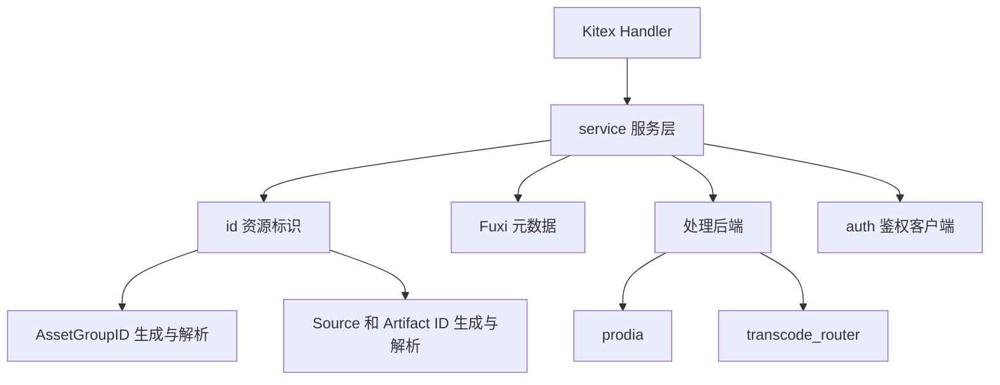

# MDAP Assets and Processing

# MDAP Assets and Processing

## 模块概览

`mdap` 资产与处理模块围绕 MDAP 资源生命周期组织：先通过 [id](id.md) 生成和解析稳定资源标识，再由 [service](service.md) 完成 AssetGroup、Source、Artifact 的元数据管理与处理任务调度；[auth](auth.md) 提供进程内复用的 MDAP 鉴权客户端，作为后续访问受保护 MDAP 能力的基础设施。

三个子模块的分工是：

- [auth](auth.md)：通过 `GetMDAPAuthClient` 懒加载并缓存默认 MDAP 鉴权客户端。
- [id](id.md)：负责 `Generate`、`Parse`、`GenerateAssetGroupID`、`ParseAssetGroupID` 等 ID 编解码能力。
- [service](service.md)：承接 Kitex handler 请求，完成校验、ID 使用、Fuxi 元数据读写、摘要兼容转换和处理任务启动。

## 协作关系

`service` 是模块组的业务编排中心。它不会直接实现 ID 位布局或鉴权客户端初始化，而是依赖 `id` 和 `auth` 提供的基础能力，把这些能力组合进资产创建、查询和处理任务启动流程中。

## 关键跨模块流程

创建资产组时，`CreateAssetGroup` 使用 [id](id.md) 中的 `GenerateAssetGroupID` / `BuildAssetGroupID` 生成带空间信息的 AssetGroupID，再将 AssetGroup 属性写入 Fuxi 元数据服务。

创建 Source 或 Artifact 时，`CreateSource`、`CreateArtifact` 会先通过 `ParseAssetGroupID` 校验资源归属，再调用标准 ID 生成能力为 Source / Artifact 创建 40 字符 MDAP ID。后续查询、反解或校验资源字段时，`Parse` 会恢复账号、VDC、GroupKey 等编码字段。

查询链路由 [service](service.md) 统一封装。`MGetAssetGroups`、`MGetSources`、`QueryArtifacts` 等入口把请求条件转换为 Fuxi 查询，并通过 parser 将查询结果还原为 `mdap_model` 对象；其中 `QueryArtifacts` 还会按 AssetGroupID 解析空间，并兼容历史 `media_digest` schema 的摘要数据。

处理链路从 `StartProcessing` 进入。`service` 先解析 AssetGroupID、归一化 operation、构造处理计划，再根据 `MDAPConfig` 选择 `startProcessingWithProdia` 或 `startProcessingWithTranscodeRouter`，分别对接 `prodia` workflow 或 `transcode_router` 任务接口。

## 阅读建议

如果只关心业务入口和数据流，优先阅读 [service](service.md)。如果需要理解 MDAP ID 的稳定性、字段布局或 AssetGroupID 兼容规则，阅读 [id](id.md)。鉴权客户端的初始化和复用逻辑集中在 [auth](auth.md)。