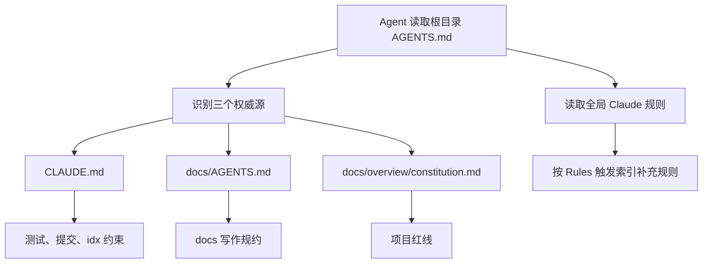

# Other — AGENTS.md

## AGENTS.md 协作入口

`AGENTS.md` 是仓库根目录下的 Agent 协作入口文件。它不定义具体工程规则，而是把 Codex、Claude 或其他 AI agent 路由到项目内的权威规则文件。

该模块没有函数、类、运行时调用或执行流；它的作用是文档级配置索引，通过文件约定影响开发、测试、提交和文档写作流程。

## 核心职责

| 区域 | 作用 |
|---|---|
| `三个权威源` | 明确仓库级规则的来源和职责边界 |
| `全局规则` | 说明项目规则与用户级 Claude 规则之间的优先级关系 |
| `写文档前` | 要求所有 `docs/` 写入动作必须由 `doc-init` skill 主导 |
| `测试 / Commit / idx 包变更` | 将测试策略、提交规范、`idx` 包约束统一指向 `CLAUDE.md` |

## 权威源分工

`AGENTS.md` 将项目规则拆分到三个文件中：

- [`CLAUDE.md`](./CLAUDE.md)：Agent 协作主配置，包含 commit 规范、测试执行策略、`idx` 包专项约束，以及文档规约入口。
- [`docs/AGENTS.md`](./docs/AGENTS.md)：项目级文档规约，承接 `doc-init` 体系在本仓库中的扩展规则。
- [`docs/overview/constitution.md`](./docs/overview/constitution.md)：项目级红线，由架构组维护，用于约束不能突破的架构和工程边界。

这种结构避免把所有规则集中堆叠在根目录入口文件中。根目录 `AGENTS.md` 只负责定位和分流，具体规则由各自领域的文件维护。

## 规则解析流程



## 与全局规则的关系

跨项目通用规则位于：

- `~/.claude/CLAUDE.md`
- `~/.claude/rules/*.md`
- `~/.claude/skills/`

本仓库的项目级规则以 `AGENTS.md` 指向的三个权威源为准。当项目规则与全局规则冲突时，需要按照 `~/.claude/CLAUDE.md` 中的「Rules 触发索引」读取对应规则，并结合本仓库权威源判断适用优先级。

## 文档写作约束

任何对 `docs/` 目录的写动作都不能直接开始编辑，必须先由 `doc-init` skill 主导：

```text
/doc-init
```

实际规约入口是 [`docs/AGENTS.md`](./docs/AGENTS.md)。开发者或 Agent 在修改 `docs/` 内容前，应先读取该文件，确认当前文档属于哪个文档体系、是否需要初始化、是否需要遵守特定模板或元数据要求。

## 测试、提交与 idx 包变更

`AGENTS.md` 不直接展开测试命令、commit 格式或 `idx` 包限制，而是统一指向 [`CLAUDE.md`](./CLAUDE.md)。

涉及以下操作时，应先读取 `CLAUDE.md` 对应段落：

- 运行或选择测试命令
- 编写 commit message
- 修改 `idx` 相关包
- 判断 Agent 协作流程中的默认行为

## 维护原则

修改 `AGENTS.md` 时应保持它的入口定位，不应把具体规则直接写入此文件。适合放在这里的内容是：

- 新增或调整权威规则文件的入口链接
- 更新各权威源的职责说明
- 调整全局规则与项目规则的查找方式
- 明确某类操作应跳转到哪个规则文件

不适合放在这里的内容是：

- 具体测试命令
- 详细 commit message 模板
- 文档模板正文
- 架构红线细则
- 某个包或模块的实现约束

这些内容应继续维护在 `CLAUDE.md`、`docs/AGENTS.md` 或 `docs/overview/constitution.md` 中。