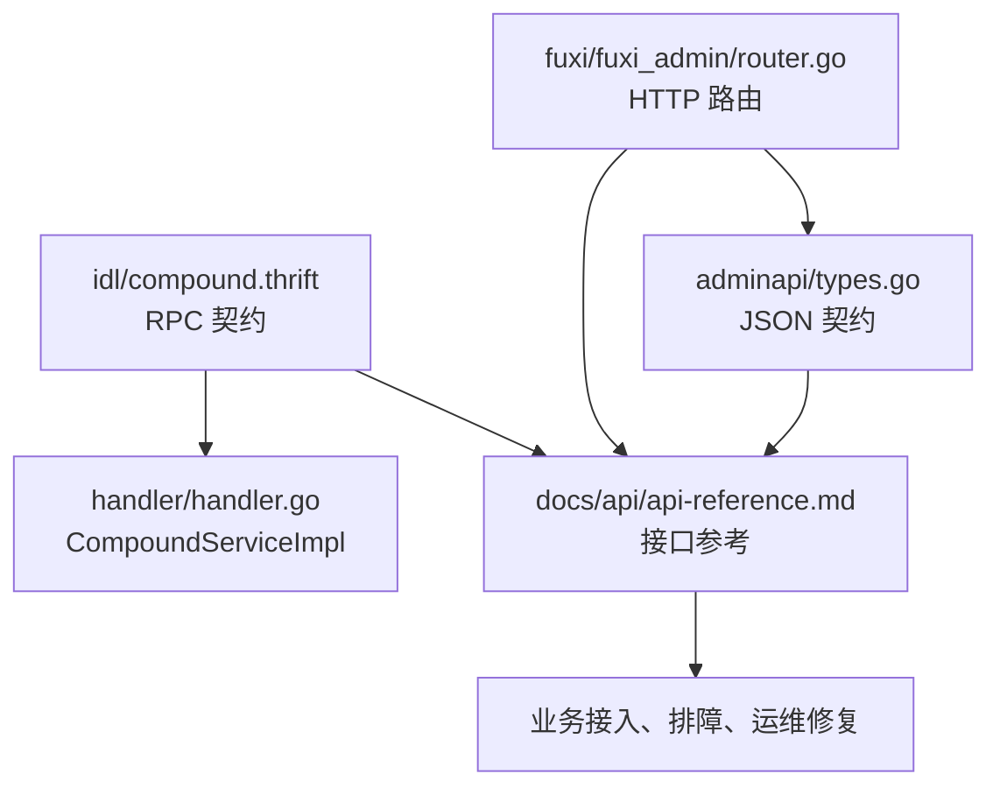

# Other — api

## 模块定位

`docs/api` 是 Compound 的接口契约文档入口，覆盖两类接口：

- Thrift RPC：以 `idl/compound.thrift` 为权威源，服务实现入口是 `handler/handler.go` 中的 `CompoundServiceImpl`。
- Admin HTTP：以 `fuxi/fuxi_admin/router.go` 的路由和 `fuxi/fuxi_admin/adminapi/types.go` 的 JSON 结构为权威源。

该模块本身不承载运行时代码，因此没有内部调用图；它的价值是把 IDL、handler、Admin 路由和错误码整理成开发者可读的接口说明，帮助接入方、排障人员和维护者理解 Compound 暴露了什么能力、请求响应契约是什么、实现入口在哪里。

## 文档组成

`docs/api/README.md` 是导航页，说明 API 文档覆盖范围、权威源和读者入口。

`docs/api/api-reference.md` 是完整参考文档，当前包含：

- `CompoundService` 的 11 个 RPC 方法
- 核心 Thrift 枚举与结构体
- `SetAttr`、`CopyAttr`、`DelAttr`、`Query`、`Del`、`Count`、`TTL` 的请求、响应和业务语义
- `UpdateIdxWithEventForInternal`、`RefreshIdxForInternal`、`RepairIdxEntryForInternal`、`RepairIdxBucketForInternal` 4 个内部 GSI 接口
- Admin HTTP 的 Schema Definition、Schema Binding、Configuration Management 和 Legacy Schema API 路由
- RPC 与 Admin HTTP 的错误码和响应包装约定
- 外部 IDL 依赖，包括 `video_data_access.thrift` 和 `abase.thrift`

## 权威源关系



维护本文档时需要遵守一个原则：文档不能成为新的事实来源。字段编号、字段名、required/optional、枚举值、JSON tag、路由路径和错误码都必须回到代码核对。

## RPC 接口边界

RPC 契约由 `idl/compound.thrift` 中的 `CompoundService` 定义。文档按接口使用场景组织，而不是按源码文件顺序展开。

对外核心接口包括：

- `SetAttr`：创建或更新对象属性。
- `CopyAttr`：同 Schema 内复制对象属性，最终通过 `SetAttr` 完成写入。
- `DelAttr`：删除对象属性。
- `Query`：按 ID 或表达式查询对象，返回列式结构。
- `Del`：删除对象，支持单对象和基于 `Where` 的批量删除。
- `Count`：按条件计数，可在满足条件时命中 GSI posting collection。
- `TTL`：内部过期处理接口。

内部 GSI 接口包括：

- `UpdateIdxWithEventForInternal`：消费变更事件并维护索引。
- `RefreshIdxForInternal`：基于主表当前快照刷新对象索引。
- `RepairIdxEntryForInternal`：修复离线对账发现的 GSI entry 异常。
- `RepairIdxBucketForInternal`：清理事务模式下的空封口桶。

这些接口的实现入口都在 `handler/handler.go`，文档中每个内部接口都会继续指向实际 service 层方法，例如 `HandleEvent`、`Refresh`、`RepairIdxEntry`、`RepairIdxBucket`。

## 核心数据模型

`api-reference.md` 中的核心结构体来自 `idl/compound.thrift`，包括：

- `Version`：记录对象更新前后的版本号。
- `Created`、`Updated`、`Deleted`：描述属性级变更。
- `Event`：描述一次对象变更事件，是 MQ、GSI 更新和内部修复链路的重要输入。
- `WhereClause`、`Expression`、`LeafCondition`：表达查询和写入条件。
- `OrderByClause`：表达排序。
- `AttrVal`、`AttrMeta`、`ChangedAttr`：表达属性值、列元数据和变更结果。

其中 `Event.Syncs` 和 `Event.IdxSnapshot` 是 GSI 链路的重要字段。`Syncs` 由生产端预判本次事件命中的内部订阅系统，当前主要用于 `GSI` 分流；`IdxSnapshot` 用于补全索引列当前值，减少消费端回源主表的需要。

## 写入接口语义

`SetAttrReq` 是写入链路最关键的请求结构。它包含：

- `Schema`、`ID`、`Space`、`SchemaVersion`：定位对象和 Schema。
- `Values`：要设置的属性列表。
- `Where`：业务乐观锁条件。
- `WriteMode`：写模式，默认为 `WriteMode.Upsert`。
- `Extra`、`Base`：扩展信息和基础请求上下文。

`WriteMode.InsertOnly` 是一个需要特别注意的契约：对象已存在时返回 `AlreadyExists`，不修改主表、不产生 MQ 事件、不触发 idx 更新。对象不存在时行为与 `Upsert` 一致。

`Where.Filter` 用于写入前的业务乐观锁预判。文档明确它是 fail-fast 机制：Filter 不匹配时返回 `InternalError`，避免进入事件构造、唯一索引处理和主表写入等更重路径。

## 查询接口语义

`Query` 的响应不是对象数组，而是列式结构：

```thrift
struct QueryResp {
    1: required list<AttrMeta>                 AttrMetas,
    2: required list<list<list<AttrVal>>>      AttrVals,
    255: required base.BaseResp BaseResp,
}
```

阅读或维护文档时要保留这个结构说明：`AttrMetas[i]` 描述第 `i` 列，`AttrVals[obj][i]` 是第 `obj` 个对象在第 `i` 列上的所有值。数组属性可能返回多个 `AttrVal`，所以是三层列表。

查询条件通过 `WhereClause` 表达：

- `Ids`：按对象 ID 列表查询。
- `Filter`：按递归表达式树查询。

表达式树由 `Expression`、`LeafCondition`、`LogicType` 和 `Operator` 组成，操作符包括 `EQ`、`NEQ`、`GT`、`LT`、`GTE`、`LTE`、`IN`、`NOT_IN`。

## GSI 内部接口

GSI 相关 RPC 是内部接口，不面向普通业务接入方，但对排障和一致性修复很重要。

`UpdateIdxWithEventForInternal` 接收 `UpdateIdxWithEventReq`，其中 `TrimmedEvent` 是裁剪后的事件。入口方法是 `UpdateIdxWithEventForInternal`，核心处理落到 `fuxi/core/service/index.go` 的 `HandleEvent`。事件类型决定索引动作：创建写入索引、删除移除索引、属性更新则对比前后值更新索引桶。

`RefreshIdxForInternal` 用于按主表当前状态重建指定对象索引。它适合修复场景，不适合热路径调用。

`RepairIdxEntryForInternal` 处理 entry 缺失、孤儿 entry、key 错位和版本滞后。服务端会根据主表快照自行决策 `added`、`removed`、`skipped` 或 `failed`，调用方不需要提前判断异常类型。

`RepairIdxBucketForInternal` 清理空封口桶，只允许删除非活跃且为空的 sealed bucket。活跃桶和非空桶都会返回 `skipped`，底层 `DeleteBucket` 还包含 CAS 与活跃桶拒绝保护。

## Admin HTTP 接口

Admin HTTP 文档覆盖 `fuxi/fuxi_admin/router.go` 中的控制面路由，JSON 请求响应结构来自 `fuxi/fuxi_admin/adminapi/types.go`。

所有 `/admin/api/v1/*` 成功响应统一使用 `DataResponse`：

```json
{
  "data": {},
  "status_code": 0,
  "status_message": "OK"
}
```

错误响应使用 `BaseResponse` 或 `ErrorResponse`，通常不包含 `data`。

主要接口分为三组：

- Schema Definition：创建、查询、列出 Schema 定义。
- Schema Binding：创建、查询、列出 Schema 绑定。
- Configuration Management：更新绑定配置、查询配置历史。

此外还保留 Legacy Schema API，例如 `/schemas/:name`、`/spaces/:space/schemas/:name`、`/validate` 等路径。

维护 Admin 文档时要特别核对 JSON tag。例如 TTL 配置字段应使用 `created_time_attr`、`ttl_range`、`ttl_time`；`storage_policy` 是大小写敏感值，`Bytedoc` 首字母大写。

## 与其他模块的连接

`docs/api` 不直接被运行时代码调用，但它连接了多个实现区域：

- `idl/compound.thrift`：RPC 契约来源。
- `idl/base.thrift`：`base.Base` 和 `base.BaseResp` 的来源。
- `kitex_gen/`：由 IDL 生成的 Go 类型，验证字段和枚举时需要参考。
- `handler/handler.go`：RPC handler 入口。
- `fuxi/core/service/`：写入、查询、索引、修复等业务逻辑实现。
- `fuxi/fuxi_admin/router.go`：Admin HTTP 路由定义。
- `fuxi/fuxi_admin/adminapi/types.go`：Admin HTTP 请求响应结构。
- `docs/architecture/`：接口背后的业务逻辑、数据流、版本冲突和数据模型说明。
- `docs/specs/`：各 capability 的行为契约。

因此，API 文档更新通常不应只改 `docs/api/api-reference.md`。如果接口语义变化来自 IDL、handler 或 Admin 结构体，相关架构文档和 specs 也可能需要同步。

## 维护建议

修改 RPC 契约时，先更新并核对 `idl/compound.thrift`，再检查 `kitex_gen/`、`handler/handler.go` 和对应 service 实现，最后同步 `docs/api/api-reference.md`。

修改 Admin HTTP 接口时，先核对 `router.go` 的路径和方法，再核对 `adminapi/types.go` 的 struct tag、响应包装和错误响应，最后同步文档示例。

修改错误码时，需要同时检查 RPC 的 `base.BaseResp` 使用方式、Admin HTTP 的 `status_code` / `status_message` 约定，以及文档中每个接口的错误码表。

文档示例应优先展示真实字段名和当前代码接受的结构，不应为了可读性改写字段名。尤其是 Thrift 的字段名、枚举值、JSON tag 和响应 envelope，必须与代码保持一致。