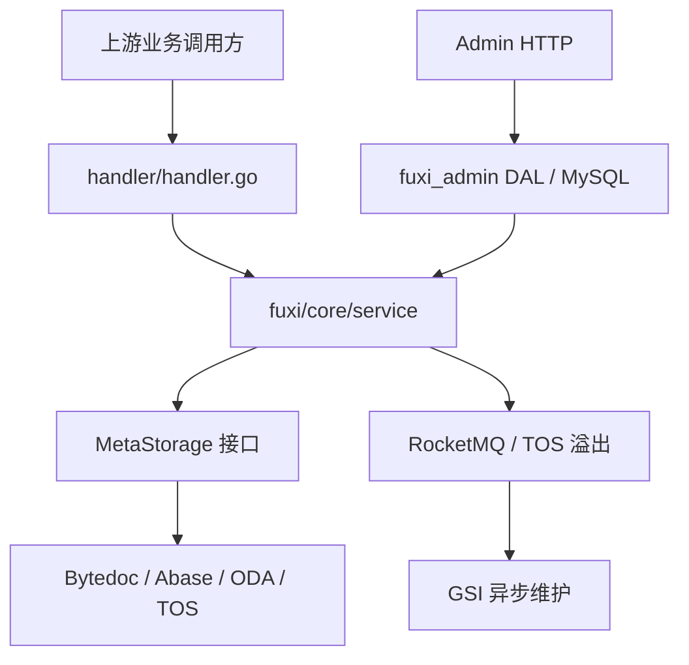

# Other — architecture

## 模块定位

`docs/architecture/` 是 Compound 的架构知识入口，不承载运行时代码，而是把 RPC 数据面、Admin 管理面、存储抽象、GSI、事件链路、配置与数据模型串成可维护的开发者视图。开发者在修改 `handler/`、`fuxi/core/service/`、`fuxi/core/service/meta/`、`fuxi/core/service/idx/`、`rocketmq/`、`fuxi/client/` 或 `fuxi/fuxi_admin/` 前，应先从本模块确认调用边界与不变式。

核心入口是 `docs/architecture/README.md`，它提供专题地图；深度说明在 `architecture-detailed.md`，业务路径在 `business-logic.md` 和 `data-flow.md`，数据与配置分别由 `data-model.md`、`configuration.md` 承接。

## 架构主线

Compound 分为两条平行控制面：

数据面由 `CompoundServiceImpl` 暴露 Kitex RPC，典型方法包括 `SetAttr`、`DelAttr`、`Query`、`Del`、`Count`、`CopyAttr`。Handler 只做参数接入和响应包装，核心逻辑下沉到 `service.SetAttr`、`service.DelAttr`、`service.Query`、`service.Del` 等函数。

管理面由 Admin HTTP 服务维护 Schema、Binding 和 Configuration。`SchemaDefinitionsDAL`、`SchemaBindingsDAL`、`ConfigurationsDAL` 负责 MySQL 持久化，运行时再通过 `admin.GetSchema`、`admin.GetStorage`、`admin.GetIdxCfg` 等入口影响数据面的存储路由、TTL、GSI 与文件删除策略。

## 关键不变式

本模块最重要的价值是沉淀跨包不变式：

- `MetaStorage` 实现层不自行重试；`iface.WrongVersion` 等冲突错误统一返回到 Service 层，由 `maxRetryTimes=3` 驱动重试。
- 数据面和管理面分离：RPC 主服务监听 `:8888`，Admin HTTP 监听 `:6789`，两者故障域和数据通路独立。
- 业务逻辑只依赖 `MetaStorage.QueryAttr`、`MetaStorage.Count`、`MetaStorage.UpdateAttr`、`MetaStorage.DelID`，不直接感知 Bytedoc、Abase、ODA 或 TOS 差异。
- GSI 非唯一索引通过 RocketMQ 事件异步维护，唯一索引在写路径同步处理。
- GSI event 只有 `vda_sync` 一个消费者，回调 `compound.UpdateIdxWithEventForInternal` 后再写 idx posting。
- 大事件由 `rocketmq.QuickSent` / `sendChangeEvent` 判断大小，超过阈值时上传 TOS，并在 MQ 中只保留 `Event.URI`。
- VOD 删除场景中，`checker.CheckVideoDelete` 返回 `executed=true` 且无有效本地 storage 时可以早退，避免错误进入 `MetaStorageSelector`。

## 文档组成

`README.md` 是导航层，列出架构原则、关键不变式、模块文档地图和横切话题。它适合用来判断“某个问题该读哪篇”。

`architecture-detailed.md` 是整体架构展开，覆盖 Handler、Service、Client、Storage、Interface、Common、Event、Admin 等层次，并给出 `SetAttr`、`Query`、`Del`、中间件、存储选择、跨区域和事件发布的完整路径。

`business-logic.md` 面向核心 CRUD 贡献者，详细描述 `SetAttr`、`DelAttr`、`Query`、`Del`、`Count`、`CopyAttr`、TTL、VideoDelete、事件系统和 GSI 编排。写路径修改通常要同步检查这篇。

`data-flow.md` 是快速路径图，按 `SetAttr`、`Query`、`Del`、GSI Event 四条主链路描述执行顺序和一致性边界。

`data-model.md` 描述 Admin MySQL 表、`MetaStorage` 抽象、内置字段映射、TOS 序列化、文件存储和 GSI posting 结构。

`configuration.md` 描述静态配置、TCC、Admin 配置、中间件、metrics、日志、外部客户端和联邦配置。

`modules/` 下是专题深挖，例如 `gsi.md`、`gsi-service-meta.md`、`gsi-reconcile.md`、`hlc-encoding.md`、`tos-storage.md`、`update-wrapper.md`、`version-conflict.md`、`video-delete-early-exit.md`。

## 与代码的对应关系

一次 `SetAttr` 请求的文档映射如下：

1. `handler/handler.go` 中的 `CompoundServiceImpl.SetAttr` 接收请求。
2. `service.SetAttr` 获取 Schema、解析分片键、读取旧值、计算 `Created` / `Updated`。
3. `meta.GetMeta` 通过 `MetaStorage.QueryAttr` 读取当前版本。
4. `meta.SetMeta` 通过 `MetaStorage.UpdateAttr` 写入新版本；冲突时返回 `iface.WrongVersion`。
5. 唯一索引由 `HandleUniqIdx` 同步维护，非唯一索引由事件后续维护。
6. 文件替换时调用 `storage.BatchDelIgn404Async` 异步清理旧 URI。
7. 事件由 `rocketmq.QuickSent` 发出，`detectSyncs` / `hitGSI` 预判内部订阅目标。
8. TTL 属性变化时调用 `postpone.SendTask`。

GSI 查询和写入相关内容应同时阅读 `business-logic.md`、`modules/gsi-service-meta.md` 和 `modules/gsi.md`。service 层通过 `idx.GetOperator(cfg)` 选择 simple 或 bucket 模式；simple 模式核心原语包括 `simpleOperator.AddToIndex`、`RemoveFromIndex`、`UpdateIndex`、`QueryByIndex`。

## 贡献注意事项

修改运行时代码后，应同步检查本模块是否需要更新。尤其是以下变更不能只改代码：

- `MetaStorage` 接口签名、错误码或重试语义变化。
- `service.SetAttr`、`service.DelAttr`、`service.Del` 的副作用顺序变化。
- `rocketmq.Event` 字段、TOS spillover 行为或 `Event.Syncs` 规则变化。
- GSI simple / bucket 模式、`idx.GetOperator(cfg)` 路由或 reconcile 语义变化。
- Admin 配置结构、Schema Binding、StoragePolicy、TTLConfig 或 GSI 配置格式变化。
- 中间件链、限流、metrics、日志字段或外部客户端初始化策略变化。

`docs/architecture/` 下的写入必须遵守项目文档规约，按仓库说明由 `doc-init` 体系主导。文档内容应以真实代码和测试为准，避免把规划中的字段写成已落地能力；例如 `CASFilter` 在现有说明中明确标注为未实现，当前可用的业务乐观锁路径是 `Where.Filter`。