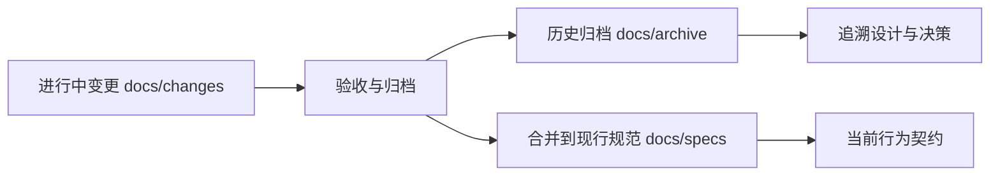

# Other — archive

## 归档模块

`docs/archive/` 保存已经完成或冻结的文档化变更记录。它不是运行时代码模块，也不参与调用链；它的作用是保留历史决策、需求 delta、实施清单、迁移说明和验收证据，帮助开发者理解当前 `docs/specs/`、架构文档和代码约束是如何演进到现在的。

当前行为契约以 `docs/specs/<capability>/spec.md` 为准；归档目录中的 `spec.md` 是当时 change 的 delta 或历史快照，不能直接当作最新事实来源。

## 目录组织

常规归档目录使用 `YYYY-MM-DD-<change-slug>/` 命名，通常包含：

| 文件 | 作用 |
|---|---|
| `proposal.md` | 说明为什么做、改什么、影响范围 |
| `design.md` | 记录上下文、目标、关键决策、风险和迁移计划 |
| `tasks.md` | 记录实施清单和验收状态 |
| `specs/<capability>/spec.md` | 记录该 change 对 capability 的需求 delta |
| `ARCHIVED.md` | 记录归档元数据、关联 commit、测试结果、delta 合并说明和红线确认 |

部分目录不是常规 change archive，而是明确标注的状态快照或迁移报告，例如 `2026-04-04-gsi-feature-status-snapshot/` 和 `2026-05-07-setup-unified-doc-system/MIGRATION-FINAL-REPORT.md`。

## 主要归档内容

### Abase 库表配置

`2026-02-21-abase-db-table-config/` 记录为 `storage_policy=abase` 增加结构化配置 `abase_config` 的设计。该配置通过 `AbaseConfig` 表达 `db_name` 和 `table_name`，目标是让 `fuxi-admin` 在写入或更新 schema binding 时校验 Abase 的库名和表名。

关键约束是向后兼容：历史 binding 即使缺失 `abase_config`，读取和展示链路仍然可用；但新增或更新 `storage_policy=abase` 时必须提供非空的 `abase_config.db_name` 和 `abase_config.table_name`。

### 移除旧连接配置字段

`2026-02-25-remove-legacy-config-fields/` 记录从 `adminapi/types.go` 中移除已经迁移到 TCC `fuxi_init_config` 的连接参数。涉及结构包括 `TosStorage`、`RedisProtocol`、`Block`、`AbaseConfig`、`LocalCache`。

该归档明确了保留字段和移除字段的边界：`TosStorage.Bucket`、`RedisProtocol.Cluster`、`Block.Cluster` 继续作为 TCC 查找 key；`AK`、`SK`、`Password`、`Timeout`、`PoolSize` 等连接参数移除；`BigDataConfig` 被移除；`LocalCache.CachePercent` 被补齐以对齐 SDK。

### ODA kitex_gen 依赖升级

`2026-03-15-upgrade-oda-kitex-gen/` 记录将 `code.byted.org/videoarch/object_data_access/kitex_gen` 从 `aea39368ddea` 升级到 `af117077` 的依赖变更。该变更不修改 `BytedocFind`、`BytedocCount`、`QueryBson`、`CountBson` 的调用方式，主要目标是保证新版 Kitex 生成代码编译通过并保持业务行为兼容。

### GSI 功能状态快照

`2026-04-04-gsi-feature-status-snapshot/` 是状态快照，不是 change archive。`ARCHIVED.md` 明确说明它用于保留 `docs/features/gsi-feature-status.md` 的历史证据，后续状态不再回填该快照。

快照内容覆盖 GSI 的数据模型、存储操作、`idx` CRUD、service 编排、handler/API、后台任务、配置下发和测试状态。当前 GSI 行为应以这些 living spec 为准：`gsi-index-runtime`、`gsi-service-meta-orchestration`、`gsi-reconcile-framework`、`binding-index-config`、`offline-snapshot-reader`。

### SetAttr 耗时埋点

`2026-04-18-add-setattr-timing-logs/` 记录为 `SetAttr` 两条 Query 链路增加耗时统计的设计。归档中定义了 `Recorder`、`WithRecorder`、`FromContext`、`Track` 等辅助接口，并要求在 `SetAttr`、`QueryWithFuxiAttr`、`queryWithID`、`meta.GetMeta`、`GetMetaByIDWithLimit`、`storage.QueryAttr`、`abase.QueryAttr`、`abase.query`、`wrap.Set`、`meta.SetMeta`、`selector.UpdateAttr`、`abase.UpdateAttr`、`setAttr` 等环节记录耗时。

设计原则是埋点不改变返回值、错误语义、重试行为、事件发送或 TTL 处理；只有整体耗时超过默认阈值 `200ms` 时，才在 `SetAttr` 返回前输出汇总日志。

### Fuxi Admin 表名前缀

`2026-04-18-fuxi-admin-table-prefix/` 记录通过 `TablePrefixPlugin` 支持多个联邦共享同一个 RDS 的设计。该方案在 `DBConf` 中增加 `TablePrefix`，并在 `Dal.Init()` 中、`gorm.Open` 之后和 `query.Use(db)` 之前注册 GORM Callback Plugin。

该方案避免修改 `dal/model/*.gen.go` 和 `dal/query/*.gen.go`，通过 GORM Create、Query、Update、Delete、Raw、Row 回调统一修改 `Statement.Table`，在表名未带前缀时自动添加配置的前缀。

### 统一文档体系

`2026-05-07-setup-unified-doc-system/` 是 doc-init 体系自身的元归档。它记录了从 OpenSpec 风格目录迁移到 `docs/changes`、`docs/specs`、`docs/archive` 的过程，也定义了 living spec、change delta、archive、ADR、EARS 句式和文档分层规则。

其中 `MOVED.md` 保存旧路径到新路径的重定向表；`MIGRATION-FINAL-REPORT.md` 记录归档后的补丁处理结果。这个目录是理解当前文档治理规则的重要入口，但具体写文档时仍应优先读取 `docs/AGENTS.md` 和 `docs/overview/constitution.md`。

## 使用建议

查看历史变更时，优先读对应目录的 `ARCHIVED.md`，再读 `proposal.md`、`design.md`、`specs/*/spec.md` 和 `tasks.md`。如果归档内容与 `docs/specs/` 冲突，以 `docs/specs/` 为准。

新增归档时，不应手动改写已有历史目录。正常流程是先在 `docs/changes/<slug>/` 完成 proposal、design、tasks 和 spec delta，验收后将 delta 合并到 living spec，再移动到 `docs/archive/YYYY-MM-DD-<slug>/` 并补齐 `ARCHIVED.md`。