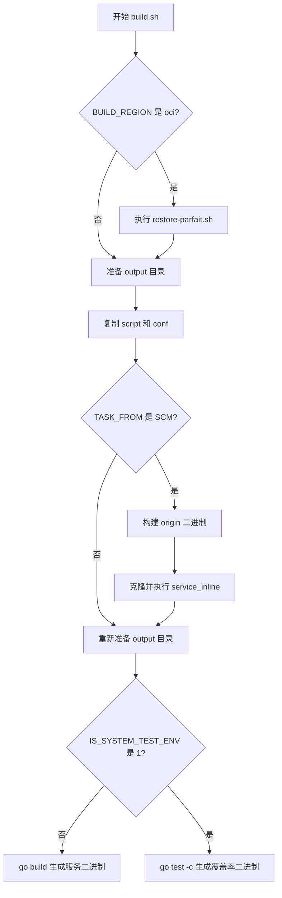

# Other — build.sh

## 模块概览

`build.sh` 是仓库的构建入口脚本，负责把服务二进制、启动脚本和配置文件打包到 `output/` 目录。它根据构建环境变量选择不同路径：

- `BUILD_REGION=oci` 时，先执行 `/opt/common_tools/restore-parfait.sh`。
- `TASK_FROM=SCM` 时，先构建原始二进制，再运行 `service_inline` 做代码合并或内联处理。
- `IS_SYSTEM_TEST_ENV=1` 时，生成带覆盖率插桩的测试二进制；否则生成普通服务二进制。

最终服务产物固定输出为：

```text
output/bin/bytedance.videoarch.compound
```

SCM 构建路径还会额外生成：

```text
output/bin/bytedance.videoarch.compound.origin
```

## 构建流程



## 关键变量

`RUN_NAME` 定义服务二进制名称：

```bash
RUN_NAME="bytedance.videoarch.compound"
```

所有最终二进制都以该变量命名，避免构建脚本中散落硬编码路径。当前脚本会使用它生成：

- `output/bin/${RUN_NAME}`
- `output/bin/${RUN_NAME}.origin`

`BUILD_REGION` 控制 OCI 区域下的前置恢复步骤：

```bash
if [ "$BUILD_REGION" = "oci" ]; then
    bash /opt/common_tools/restore-parfait.sh
fi
```

`TASK_FROM` 控制是否启用 SCM 专用构建流程：

```bash
if [ "$TASK_FROM" = "SCM" ]; then
    go build -o output/bin/${RUN_NAME}.origin
    bvc clone bytedance/framework/service_inline /opt/tiger/service_inline && /opt/tiger/service_inline/service_inline -c conf/service_inline_config.yaml || exit 1
fi
```

`IS_SYSTEM_TEST_ENV` 控制最终产物是普通运行二进制还是系统测试覆盖率二进制：

```bash
if [ "$IS_SYSTEM_TEST_ENV" != "1" ]; then
    go build -o output/bin/${RUN_NAME}
else
    go test -c -covermode=set -o output/bin/${RUN_NAME} -coverpkg=./...
fi
```

## 输出目录结构

脚本会创建并填充以下目录：

```text
output/
  bootstrap.sh
  bin/
    bytedance.videoarch.compound
    bytedance.videoarch.compound.origin   # 仅 SCM 构建路径生成
  conf/
    ...
```

`script/*` 会被复制到 `output/` 根目录，`conf/*` 会被复制到 `output/conf/`。复制完成后，脚本会确保启动脚本可执行：

```bash
chmod +x output/bootstrap.sh
```

## SCM 构建路径

当 `TASK_FROM=SCM` 时，脚本先执行一次普通构建，生成原始镜像二进制：

```bash
go build -o output/bin/${RUN_NAME}.origin
```

随后通过 `bvc clone` 拉取 `bytedance/framework/service_inline` 到 `/opt/tiger/service_inline`，并执行：

```bash
/opt/tiger/service_inline/service_inline -c conf/service_inline_config.yaml
```

这一步依赖 `conf/service_inline_config.yaml`。脚本注释说明，CDC 调试分支需要把当前发布分支透传给 `service_inline`，否则 `service_inline` 会回退到 SCM 仓库级 `merge_build` 配置里的 `master`。

`service_inline` 执行失败时，脚本会立即退出：

```bash
|| exit 1
```

## 为什么会复制两次资源

脚本在 SCM 逻辑前后都执行了相同的资源准备步骤：

```bash
mkdir -p output/bin output/conf
cp script/* output/
cp -r conf/* output/conf/
chmod +x output/bootstrap.sh
```

第二次复制用于覆盖 `service_inline` 过程可能影响到的旧数据，并确保内联服务后的最终 `output/` 内容仍包含最新的启动脚本和配置文件。

## 系统测试构建

普通环境下，最终二进制由 `go build` 生成：

```bash
go build -o output/bin/${RUN_NAME}
```

系统测试环境下，脚本改用 `go test -c` 生成测试二进制，并开启覆盖率：

```bash
go test -c -covermode=set -o output/bin/${RUN_NAME} -coverpkg=./...
```

这会把测试可执行文件输出到与普通服务二进制相同的位置，方便下游部署或测试流程使用统一路径读取产物。