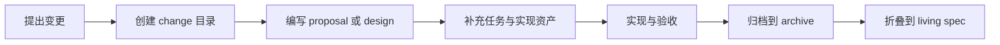
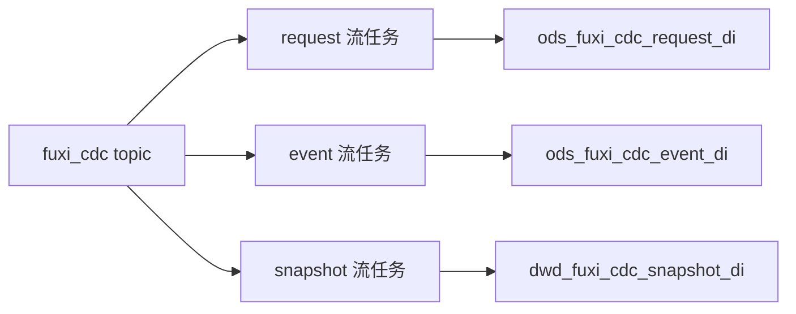

# Other — changes

## 变更治理模块

`docs/changes/` 是 Compound 文档体系中记录“进行中 change”的入口目录，用于承载还未归档的设计、实施计划、SQL、任务拆解和 spec-delta。它不是运行时代码模块，没有函数调用图；它通过文档结构约束工程变更的生命周期，并与 `docs/specs/`、`docs/archive/` 和 `docs/AGENTS.md` 共同组成 doc-init 治理模型。

## 目录职责

`docs/changes/README.md` 提供当前 active change 索引，表格字段包括：

- `Slug`：change 目录名，例如 `fuxi-cdc-warehouse/`、`gsi-simple-flat-rows/`
- `主题`：变更目标摘要
- `Owner`：负责团队或角色
- `当前状态`：例如 `Plan`、`Design`、`Implement`

README 中还明确两条流程规则：

- 每个 change 一个独立目录，目录内承载 proposal、design、tasks、spec-delta 或配套资产。
- 完成验收后通过 archive checklist 归档到 `docs/archive/`，spec-delta 折叠进 `docs/specs/` 下的 living spec。

该目录的写入流程不直接由普通编辑驱动。`docs/changes/README.md` 指向 `docs/AGENTS.md` 和 doc-init workflow，表示新 change 的创建、推进和归档应遵循项目文档治理规则。

## Change 生命周期



典型生命周期如下：

1. 在 `docs/changes/README.md` 的 Active 表中登记 change。
2. 在 `docs/changes/<slug>/` 下维护变更材料。
3. 设计阶段主要产物通常是 `proposal.md` 或 `design.md`。
4. 实施阶段补充 `implementation-plan.md`、`tasks.md`、SQL、配置或验收说明。
5. 实现完成并验收后，将 change 归档到 `docs/archive/`。
6. 与长期行为相关的结论需要折叠进 `docs/specs/`，避免只停留在 change 文档中。

## 关键目录与文件

### `docs/changes/README.md`

这是 active change 的人工索引。当前表中包含 GSI、Bytedoc、Fuxi CDC、fuxi_admin 启动校验等变更主题。

需要注意，README 末尾记录了部分 GSI / Bytedoc change 已在 `2026-06-16` 归档，并说明 spec-delta 已折叠进 living spec。维护该索引时应避免 Active 表与归档说明长期不一致：若某个 slug 已归档，应从 Active 表移除或更新状态说明。

### `docs/changes/fuxi-cdc-warehouse/`

该 change 收口 Fuxi CDC 入仓链路中数仓侧的 Hive DDL 与 Dorado 流任务 SQL。它明确区分 Metis 与 Compound / Fuxi 的职责：

- Metis：标准化多来源 CDC 事件并写入区域 `fuxi_cdc` topic。
- Compound / Fuxi：定义数仓三张表的建表口径和落表 SQL。

核心文件包括：

- `proposal.md`：背景、三张表口径、线上落表方式、SQL 清单和区域替换规则。
- `sql/hive/ddl_ods_fuxi_cdc_request_di.sql`：request ODS 表 DDL。
- `sql/hive/ddl_ods_fuxi_cdc_event_di.sql`：event ODS 表 DDL。
- `sql/hive/ddl_dwd_fuxi_cdc_snapshot_di.sql`：snapshot DWD 拉链表 DDL。
- `sql/hive/dwd_fuxi_cdc_snapshot_di.sql`：历史分区补写或一次性回放 SQL。
- `sql/hive/init_dwd_fuxi_cdc_snapshot_branches.sql`：snapshot / delta branch 初始化。
- `sql/dorado/ods_fuxi_cdc_request_di.sql`：request 流任务。
- `sql/dorado/ods_fuxi_cdc_event_di.sql`：event 流任务。
- `sql/dorado/dwd_fuxi_cdc_snapshot_di.sql`：snapshot 流任务。

### `docs/changes/gsi-simple-flat-rows/`

该 change 记录 GSI Simple 模式从“单文档 `entries[]` 数组”改造为“每个 oid 一行”的设计与实施计划。

核心文件包括：

- `design.md`：方案 G++ 的正式设计，覆盖数据模型、CRUD 原语、Operator 接口、Query dedup、reconcile 决策树、风险和验收标准。
- `implementation-plan.md`：按阶段拆解实现任务，覆盖 `FindOneAndUpdate` wrapper、`TxnStore` 扩展、`simpleOperator`、`bucketedOperator`、调用方迁移、测试与文档同步。

## Fuxi CDC Warehouse change

`fuxi-cdc-warehouse` 的目标是定义 Fuxi CDC 数仓三张表及其线上落表方式。

三张表的口径如下：

| 表 | 粒度 | 主要用途 | 降级策略 |
|---|---|---|---|
| `ods_fuxi_cdc_request_di` | 一条 request 消息一行 | 计量计费、请求级审计、按 LogID 排障 | 不可降级 |
| `ods_fuxi_cdc_event_di` | 一个对象变更 item 一行 | 对象级事件明细、回溯修复 | 可暂停或降并发，但必须保留 offset 和最后成功分区 |
| `dwd_fuxi_cdc_snapshot_di` | 同一对象最新态一行 | TTL 候选判定、生命周期治理 | 不可降级 |

线上常态链路由三个独立 `stream_sql` 任务消费 `fuxi_cdc`：



### Request 流任务

`sql/dorado/ods_fuxi_cdc_request_di.sql` 创建 `fuxi_cdc_source`，消费 `event_type = 'REQUEST'` 且 `source.event_source = 'APPL_CDC'` 的请求事实，并写入 `paimon.videoarch_mix.ods_fuxi_cdc_request_di`。

关键字段包括：

- `request_event_id`：Metis request-level `event_id`
- `source_request_id`：ODA APPL_CDC `request_id`
- `log_id`：ODA log_id
- `method_type`：通过 `COALESCE(source.method_type, 'write')` 兜底
- `request_detail`：请求级明细原因，例如 `zero_affected_count`
- `date` / `hour`：由 `event_time_ns` 派生的分区字段

`request_di` 是 Paimon 非主键表，只追加、不去重。

### Event 流任务

`sql/dorado/ods_fuxi_cdc_event_di.sql` 同样定义 `fuxi_cdc_source`，并通过 `fuxi_cdc_base` 临时视图规整字段。

写入逻辑由两段 `UNION ALL` 组成：

- 非 `REQUEST` 事件直接写入对象事件明细。
- `APPL_CDC REQUEST` 通过 `CROSS JOIN UNNEST(base.items)` 展开 `items[]`，为每个对象 item 写一行。

对象级 `event_id` 对 request item 使用：

```sql
SHA1(CONCAT(
    base.event_id,
    '|',
    COALESCE(base.source_request_id, ''),
    '|',
    COALESCE(T.`primary_key`, ''),
    '|',
    COALESCE(T.`event_type`, ''),
    '|',
    COALESCE(T.`payload_mode`, '')
))
```

`object_event_enabled` 会落到 `event_di`，但不在 event 表中过滤。snapshot 侧再使用该字段过滤对象主链路，避免 APPL_CDC 排查明细与 OPLOG / FULL_SCAN 主链路重复归并。

### Snapshot 流任务

`sql/dorado/dwd_fuxi_cdc_snapshot_di.sql` 直接写 `paimon.videoarch_mix.dwd_fuxi_cdc_snapshot_di`。它不是 event 任务的同源双写，也不需要手动初始化 branch。

核心规则：

- 只消费 `object_event_enabled = TRUE` 的对象主链路事件。
- 非 `REQUEST` 事件直接写最终态。
- `APPL_CDC REQUEST` 展开 `items[]` 后写对象最终态。
- `DELETE` 或 `payload_mode = 'TOMBSTONE'` 时，`full_document` 置空，`is_deleted = 1`。
- 去重与最终态归并由 Paimon 主键表、`sequence.field=event_time_ns,process_time,event_id` 和 chain table 自动完成。

对应 Hive DDL `ddl_dwd_fuxi_cdc_snapshot_di.sql` 使用：

```sql
'primary_key' = 'date,hour,fed,space_name,schema_name,primary_key',
'sequence.field' = 'event_time_ns,process_time,event_id',
'chain.table.enabled' = 'true',
'chain.table.snapshot.branch' = 'snapshot',
'chain.table.delta.branch' = 'delta'
```

### 历史补写 SQL

`sql/hive/dwd_fuxi_cdc_snapshot_di.sql` 只用于历史分区补写或一次性回放，不是线上常态链路。它从 `ods_fuxi_cdc_event_di` 中读取指定 `${date}` / `${hour}` 分区，并使用：

```sql
ROW_NUMBER() OVER (
    PARTITION BY fed, space_name, schema_name, primary_key
    ORDER BY event_time_ns DESC, process_time DESC, event_id DESC
) AS rn
```

只写入当前小时内同一对象主键的最新状态。

## GSI Simple Flat Rows change

`gsi-simple-flat-rows` 关注 GSI Simple 模式的数据模型和 idx 包接口重构。现有 Simple 模式名义上不分桶，但底层仍复用 bucketed 模式的单文档 `entries[]` 数组结构。该设计将其改为真正的行级模型。

### 新数据模型

Simple 模式新行结构为：

```js
{
  _id: ObjectId,
  idx: "索引名",
  space: "ByteDoc space",
  schema: "ByteDoc schema",
  col1: "索引列值",
  col2: "索引列值",
  ver: 123,
  val: {
    _id: "主表对象 id",
    sk: {
      "分片键名": "分片键值"
    }
  }
}
```

相比原 bucket 文档，Simple 行级模型移除：

- `entries[]`
- `cnt`
- `idx_ver`
- `min_ver`
- `max_ver`

普通索引为：

```text
(idx, space, schema, col1, col2, ..., colN, val._id)
```

该索引不是唯一索引。设计接受极小并发窗口下的重复物理行，并依赖 Query dedup、Update 清理和 reconcile cleanup 收敛。

### CRUD 原语

`AddToIndexWithShardingKeys` 的目标语义是确保一条完整行存在。底层计划使用 `FindOneAndUpdate`、`$setOnInsert` 和 `upsert=true`：

```go
fullDoc := bson.M{
    "idx": idx,
    "space": space,
    "schema": schema,
    "col1": cols[0],
    "ver": ver,
    "val": bson.M{"_id": oid, "sk": shardingKeys},
}
update := bson.M{"$setOnInsert": fullDoc}
```

`RemoveFromIndex` 区分两种删除语义：

- 主表删除：`ver <= upperVer`
- `UpdateIndex` 内部清理旧行：`ver < newVer`

`UpdateIndexWithShardingKeys` 的关键决策是 cols-only early return：

```go
if stringSlicesEqual(oldCols, newCols) {
    return nil
}
```

当索引列不变时，idx 行的 `ver` 不追主表 dataVer；`ver` 只是行写入时的主表版本快照。

### Query dedup

由于设计中确认 ODA 不支持 `BytedocAggregate` / `BytedocDistinct`，Query 路径降级为应用层 dedup：

- 物理行上限：`MaxRowsPhysical = 30000`
- distinct oid 上限：`MaxRowsPerQuery = 10000`
- 按 `val._id` 取最大 `ver` 行
- `QueryEntriesCrossSpace` 按 `(space, val._id)` dedup

当物理行命中上限时返回 `ErrMaxRowsExceeded`，作为热点信号。

### Operator 接口重构

设计将原来的 `*Simple` 后缀分流改为按配置选择实例：

```go
func GetOperator(cfg entity.IdxCfg) Operator {
    if cfg.BucketEnabled {
        return bucketedOp
    }
    return simpleOp
}
```

调用方统一使用无后缀方法：

```go
op := idx.GetOperator(cfg)
return op.AddToIndexWithShardingKeys(ctx, collection, cfg.Space, cfg.Schema, cfg.Name, cols, oid, ver, sk)
```

该设计影响以下调用面：

- `fuxi/core/service/index.go`
- `fuxi/core/service/index_repair.go`
- `fuxi/core/service/meta/meta.go`
- `fuxi/core/service/idx/reconcile/applier.go`
- idx 包内测试和 service / meta / handler 相关测试

Simple 实现中的桶级维护方法应统一返回 `ErrNotSupportedInSimpleMode`，包括 `ReadBucket`、`DeleteBucket`、`SealBucket`、`DedupBucketEntries`、`MergeBucketInto`、`RemoveEntryFromBucket` 和 `TryMergeBucket`。

## 与代码库其他部分的连接

`docs/changes/` 本身不被 Go 代码调用，但它对代码库有三类连接。

第一类是设计驱动实现。例如 `gsi-simple-flat-rows/design.md` 明确影响 `fuxi/core/service/idx/`、`fuxi/client/doc/`、`fuxi/core/service/meta/`、`fuxi/fuxi_admin/` 和 reconcile 包。

第二类是 SQL 资产直接服务线上任务。例如 `fuxi-cdc-warehouse/sql/dorado/*.sql` 是 Dorado stream job 的模板，`sql/hive/*.sql` 是 Paimon 表 DDL、历史回放和 branch 初始化脚本。

第三类是文档治理连接。change 完成后，结论不能只留在 `docs/changes/`，需要同步到长期文档，例如 `docs/specs/`、`docs/comprehensive/` 或 idx 包内 README / SOP 文档。

## 维护约定

新增或修改 `docs/changes/` 时应保持以下约定：

- 一个 change 使用一个稳定 slug 目录。
- README Active 表中的状态要和目录真实状态一致。
- `proposal.md` 说明“为什么做”和“范围是什么”。
- `design.md` 说明“怎么做”和“关键取舍是什么”。
- `implementation-plan.md` 或 `tasks.md` 拆到可执行步骤，并列出受影响文件。
- SQL、DDL、配置模板应放在 change 目录内的明确子目录，例如 `sql/hive/`、`sql/dorado/`。
- 已完成 change 应归档，并把长期有效的行为同步到 living spec。
- 涉及 `docs/` 下写动作时，应遵循 `docs/AGENTS.md` 指向的 doc-init 流程。