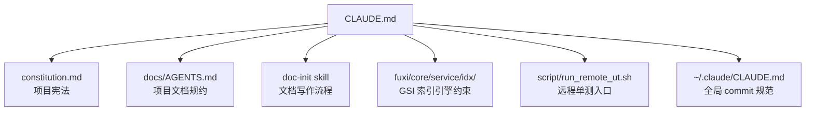

# Other — CLAUDE.md

## 模块定位

`CLAUDE.md` 是 Compound 仓库的 AI 协作配置入口，约束 Claude Code / Codex 等 agent 在本仓库中的工作方式。它不是运行时代码，不参与 Go 编译，也没有函数、类、调用边或执行流；它的作用是定义“改代码、写文档、跑测试、提交 commit”之前必须遵守的项目级规则。

该文件重点覆盖四类事项：

- 项目宪法导入：通过 `@./constitution.md` 强制加载最高优先级原则。
- 文档规约入口：所有 `docs/` 写动作必须由 `doc-init` skill 主导。
- `fuxi/core/service/idx/` 专项红线：GSI 索引引擎变更需要额外分析、文档同步和用户放行。
- 工程流程约束：commit body、远程单测、本地测试边界。

## 配置关系



`CLAUDE.md` 本身不保存完整文档制度，而是作为路由层指向权威来源。开发者或 agent 需要根据任务类型继续读取对应文件，避免在多个入口之间维护重复规则。

## 核心原则导入

文件开头通过：

```md
@./constitution.md
```

显式导入项目宪法。该导入被标记为“最高优先级”，意味着 agent 在分析任何问题之前，都应先加载 `constitution.md` 中的架构红线和项目原则。

这里的设计意图是把稳定、长期有效的工程原则从日常协作配置中分离出来：

- `constitution.md` 维护项目级不可违反原则。
- `CLAUDE.md` 维护具体协作流程和执行约束。
- 其他专项规则通过路径引用进入，而不是复制到本文件。

## 文档写作规约

本仓库所有文档规则以 [docs/AGENTS.md](./docs/AGENTS.md) 为项目级入口。任何写入 `docs/` 的动作都必须由 `doc-init` skill 主导，不能直接按普通 Markdown 修改处理。

主要路径约束如下：

- 新功能或重大变更：使用 `docs/changes/<slug>/`，按 `proposal → design → tasks → spec-delta → archive` 流程推进。
- 架构决策：写入 `docs/decisions/NNNN-<topic>.md`，编号必须为 4 位，并且不跳号、不复用。
- living spec 修改：必须经过一个 change 的 archive，不能直接改最终规格。
- spec / spec-delta：必须使用 EARS 五种句式之一，并包含 `Scenario` 与测试路径覆盖。

需要特别注意的是，`brainstorming` skill 默认输出路径 `docs/superpowers/specs/` 在本项目不适用。Compound 的设计文档必须放入对应的 `docs/changes/<slug>/` 目录，不得新建 `docs/superpowers/`。

## `idx` 包专项约束

`fuxi/core/service/idx/` 是 GSI 索引引擎核心实现，涉及多步非事务写入、CAS 乐观锁、中间态修复等高风险逻辑。因此 `CLAUDE.md` 对该目录设置了比普通 Go 代码更严格的变更门槛。

### 文档与代码一致性

任何 `idx` 包变更前，都必须先核对文档是否与代码一致。必查文档包括：

- `fuxi/core/service/idx/README.md`
- `fuxi/core/service/idx/archive/docs/compound-ops/*.md`
- `fuxi/core/service/idx/archive/docs/reconcile-compound-ops/*.md`
- `fuxi/core/service/idx/archive/docs/{invariants,tla-outline}.md`
- 相关函数的 godoc，尤其是首行中的相对路径引用

代码修改过程中，只要触及复合操作，对应 `compound-ops/xxx.md` 就必须同步校对决策树、分层保证、并发场景和总结图。变更后，commit body 必须列出同步更新的文档路径。

合并、cherry-pick、重构后合流进 `idx` 包时，还需要执行“接收侧文档巡查”。该巡查覆盖活文档、历史快照、架构文档、API 文档和 godoc，发现缺口必须当场补齐或追加专项 commit。

### 逻辑变更前分析

`idx` 包中的任何逻辑变更都不能直接进入实现阶段。包括但不限于：

- 新增或删除接口
- 修改 CAS filter
- 调整重试策略
- 改变路由规则
- 引入新的中间态修复路径

实现前必须产出 `.claude/idx-change-<topic>.md` 中间分析材料，至少包含两部分：

- 包级功能影响面分析：公开接口、调用方、内部复合操作、Simple 模式、分桶模式、合并路径、修复路径。
- 漏洞与风险分析：至少 3 个并发交错组合、新的中间态、检测与修复路径、CAS 协议冲突、版本路由不变式、幂等约定、容量约束影响。

该文件是进入实现阶段的前置产物，不能只用口头说明替代。

### 显式 Review 放行

`idx` 包逻辑变更在修改 `.go` 文件前，必须通过 `AskUserQuestion` 工具向用户展示：

- 变更方案摘要
- 功能影响面分析关键结论
- 漏洞与风险分析关键结论
- 需要新增或修改的文档清单
- 实现步骤和每步验收标准

用户明确放行前，不得修改 `fuxi/core/service/idx/` 下任何 `.go` 文件。纯文档、注释或格式调整不受该限制，但 commit message 必须注明“仅文档”。

### 豁免范围

以下变更不会触发 `idx` 专项流程：

- 纯测试文件变更，例如 `*_test.go` 中的 mock 或断言调整。
- 函数签名不变的 import 调整、typo 修复。
- 用户明确授权“跳过 idx 专项流程”。

## Commit 规范

基础 commit 格式来自全局 `~/.claude/CLAUDE.md`。Compound 额外要求 commit body 包含文档关联信息，例如：

```text
相关文档: docs/changes/example-change/design.md
```

提交前需要确认：

- `docs/` 已按规约同步更新。
- 文档与代码一致。
- commit message 包含文档变更说明。
- 若涉及 `idx` 包，commit body 列出所有同步更新的文档路径。

## 测试执行策略

Compound 的单测优先通过远程 CI 环境执行，统一入口是：

```bash
bash script/run_remote_ut.sh
```

常见执行方式包括：

```bash
# 指定测试文件
TEST_KIND=file TEST_FILES=./pkg/a/a_test.go bash script/run_remote_ut.sh

# 指定测试包
TEST_KIND=package TEST_PACKAGE_PATH=./pkg/foo bash script/run_remote_ut.sh

# 指定目录
TEST_KIND=directory TEST_DIRECTORY=./fuxi/core/service bash script/run_remote_ut.sh

# 指定文件并匹配测试名
TEST_KIND=file TEST_FILES=./fuxi/core/service/idx/idx_test.go PATTERN="TestGSI" bash script/run_remote_ut.sh
```

测试结果写入 `.utd/runs/<latest>/`：

- `report.txt`：文本报告，适合人工快速查看。
- `report.json`：结构化报告，适合脚本或工具解析。

本地测试只适用于不依赖外部服务的纯逻辑测试：

```bash
go test ./...
```

## 与代码库的关系

Compound 是视频架构元数据管理服务，模块路径为：

```text
code.byted.org/videoarch/compound
```

技术栈为 Go 1.23、Kitex RPC 和 Hertz HTTP。`CLAUDE.md` 不直接连接这些运行时模块，但它决定 agent 如何安全地修改它们，尤其是涉及文档一致性、远程测试和高风险索引引擎变更时。

开发者贡献代码时，应把 `CLAUDE.md` 看作仓库级工作流守卫：

- 普通代码变更：遵守文档同步、测试执行和 commit 规范。
- `docs/` 变更：先进入 `doc-init` 体系。
- `fuxi/core/service/idx/` 逻辑变更：先分析、再请求用户放行、最后编码。
- 合并或 cherry-pick 后影响 `idx`：额外执行接收侧文档巡查。