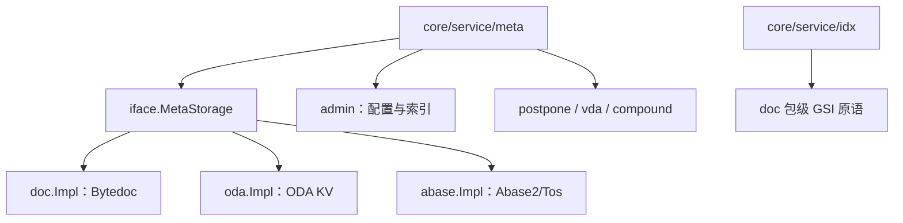

# Other — client

## fuxi/client 客户端模块

`fuxi/client/` 是 Compound 与外部系统、底层存储之间的适配层。它把 Bytedoc、ODA KV、Abase、fuxi-admin、账号、视频删除、VDA、Postpone 等外部能力收敛成服务层可调用的 Go 包，并在存储类客户端中实现统一的 `iface.MetaStorage` 接口。

### 统一存储接口

`doc.Impl`、`oda.Impl`、`abase.Impl` 都实现 `iface.MetaStorage`：

- `QueryAttr(ctx, metaSpace, queryFilter, orderBy, limit, offset)`
- `Count(ctx, metaSpace, queryFilter)`
- `UpdateAttr(ctx, metaSpace, queryFilter, update, version)`
- `DelID(ctx, namespace, queryFilter, version, cnt)`

服务层通过 `iface.QueryFilter` 传递 ID 列表、`compound.Expression` 和属性类型映射，通过 `iface.UpdateWrapper` 传递 set/delete 操作。Bytedoc 会把表达式转换成 Mongo `bson.M`；ODA 和 Abase 是 KV 后端，只支持按 ID 访问。KV 后端的共同规则是：有 ID 时即使带 `expr` 也按 ID 回源并忽略表达式；无 ID 且只有表达式时返回 `iface.NotSupportedInCurrentStorage`。

### admin：配置读取与注册属性索引

`fuxi/client/admin` 是对 `fuxi-admin-sdk` 的薄封装，同时补齐 Compound 内部类型转换。

主要入口：

- `GetTTL(ctx, space, schema)`：读取 TTL 配置。
- `GetRegAttrMap(ctx, space, name, version)`：读取注册属性类型，返回 `map[string]compound.AttrType`；SDK 返回 nil 或空 map 时返回非 nil 空 map。
- `GetStorage(ctx, space, schema)`：把 SDK 存储类型映射到 `entity.StorageType`，未命中时返回默认 `entity.Bytedoc` 和 `ok=false`。
- `GetBytedocCollection(ctx, space, schema)`、`GetBytedocIdx(ctx, space, schema)`：读取 Bytedoc collection、分片键和索引配置。
- `GetIdxCfg(ctx, space, schema)`：读取当前 space/schema 的 GSI 配置，优先使用 `cctx.GetContainerOrEmpty(ctx).IdxCfg` 注入值，其次调用 `fuxi_admin.GetGSIIndexes`。
- `GetIdxCfgBySchema(ctx, schema)`：schema-only 查询使用，只返回 `GroupTypeAll` 级 binding 的 GSI，忽略 account/space 级配置，并按 binding ID 升序稳定去重。
- `GetIdxBucketEnabled(ctx, space, schema, indexName)`：从 `GetIdxCfg` 结果中读取索引分桶开关。
- `GetDelFile(ctx, space, schema)`：读取 schema binding 的 `Configurations.DeleteFile`，未配置默认 false。

`GetIdxCfg` 和 `GetIdxCfgBySchema` 都硬编码 `entity.IdxCfg.TxnSupported = true`，不消费 SDK 下发字段。这是 GSI 事务实现的强约束，放开时必须同步修改 idx operator 选择逻辑。

注册属性查找走 `RegAttrIndex`：

- `BuildRegAttrIndex(attrs)` 将 pattern 分为 literal、prefix、default 三类。
- `Lookup(key)` 优先级固定为 literal > prefix > default。
- 同桶内按 pattern 字符串升序排序，保证重叠 pattern 下命中稳定。
- `FuxiAttrIndex()` 返回系统保留列索引，应优先于 `GetAdminAttrIndex(ctx, space, schema, schemaVer)` 查询。

### doc：Bytedoc 存储与 GSI 原语

`fuxi/client/doc` 是功能最完整的存储适配器，既实现 `iface.MetaStorage`，也提供 GSI 索引层直接使用的 BSON 原语。

MetaStorage 行为：

- `Count` 和 `QueryAttr` 调用 `BuildMongoFilter` 把 `compound.Expression` 转成 Mongo filter；有 ID 时把业务 ID 转成 `_id = namespace + "::" + id`。
- `QueryAttr` 在表达式查询时注入 `_space`、`_schema`，帮助 Bytedoc 路由到正确分片。
- `UpdateAttr` 使用 `BuildMongoUpdate` 生成点号键 `$set`，避免覆盖父对象；新增路径用 `BuildMongoAdd` 生成嵌套 BSON。
- `DelID` 使用 `DelBson` 删除匹配文档；当期望删除数不满足且带版本时返回 `iface.WrongVersion`。
- 版本冲突检测依赖 `MatchedCount`，不是 `ModifiedCount`，避免“值未变化但命中过滤器”被误判为冲突。

BSON 工具函数：

- `BuildMongoFilter(expr, attrMap)`：递归转换 AND/OR 和叶子条件，操作符由 `convertOperator` 映射。
- `BuildMongoUpdate(attrs, attrMap)`：更新路径使用点号键。
- `BuildMongoAdd(attrs, attrMap)`：插入路径生成嵌套结构。
- `BsonToMap(data)`：把嵌套 BSON 展平成 `map[string]string`。
- `ValidateExpression(expr)`：严格校验叶子/复合节点结构。
- `HasConcreteFieldConstraintInAllBranches(expr, field)`：判断所有 OR 分支是否都有某字段的 EQ/IN 具体约束。
- `ExprIdHandler(metaspace, expr)`：归一化表达式路径，并把 `_id` 值转换为 Bytedoc 文档 ID。

GSI 直接使用的包级函数：

- `RawUpdate(ctx, collection, space, schema, rawUpdate, filter, expectedMatched)`：透传任意 Mongo update；`expectedMatched` 非 nil 时启用 ODA `ConsistentTransaction`。
- `TryInsert(ctx, collection, space, schema, m)`：插入单文档，唯一键冲突返回 `ErrDuplicateKey`。
- `FindOne`、`FindAll`、`FindWithLimit`、`DeleteMany`、`CountBson`：直接操作 posting collection。
- `FindOneAndUpdate(ctx, collection, space, schema, filter, update, upsert)`：封装 `BytedocFindOneAndUpdate`，远端未部署该 RPC 且 `upsert=true` 时降级到 `BytedocUpdateMany(Upsert=true)`。
- `BulkWrite(ctx, collection, space, schema, ops)`：把多步 insert/update/delete 作为单 RPC 事务提交，默认 `Ordered=true` 且 `Transaction=MustTransaction`。

常见错误映射：

| ODA 状态 | doc 语义 |
|---|---|
| `402` | `ErrShardingKeyNotSet` |
| `403` / `11000` | `ErrDuplicateKey`（部分路径映射为 `iface.WrongVersion`） |
| `409` | `iface.WrongVersion` |
| `511` | `iface.ErrTxnConflict` |
| `512` | `RawUpdate`/`FindOneAndUpdate` 为 `iface.WrongVersion`，`BulkWrite` 为 `iface.ErrConsistentTxnFailed` |

### oda：ODA KV 存储

`fuxi/client/oda` 封装 `objectdataaccessservice.Client` 的 group/item KV 接口：

- `QueryAttr` 使用 `MQueryGroups` 批量按 ID 查询。
- `SetAttr` 使用 `UpsertGroupItem` 写属性。
- `DelAttr` 逐个调用 `DeleteGroupItem` 删除属性。
- `DelID` 使用 `DeleteGroup` 删除整个对象。
- `Count` 不支持，直接返回 `iface.NotSupportedInCurrentStorage`。

返回数据结构中，每个属性作为一个 `GroupItem`，实际值保存在 `Attributes["key"]`。查询时会根据 `Group.CreateTime` 调用 `shield.IsShielded`，被屏蔽的 ID 不进入结果。

ODA KV 写路径会把 `BUSY=2` 或状态码 `2` 识别为并发更新冲突，并翻译成 `iface.WrongVersion`。对象缺失状态码 `4002` 在未指定版本时映射为 `iface.ErrObjNotFound`，指定版本时映射为 `iface.WrongVersion`。

### abase：Abase2/Tos 存储

`fuxi/client/abase` 也是 KV 存储实现，底层使用 ODA 的 Abase RPC：

- `query(ctx, metaSpace, id, useMaster)` 调用 `cli.Get`，并用 `serializer.Unmarshal` 解析 JSON 字符串。
- `UpdateAttr` 通过 `setAttr` 做读改写；版本控制依赖 Abase `Generation`。
- `Add` 走 `vers.NotExists()`，直接以 create-only CAS 语义写入。
- `DelID` 调用 `cli.Delete`，带版本时传 `Generation`。
- `Count` 不支持。

`query` 会识别 `created_at` 字段并调用 `shield.IsShielded`；如果命中屏蔽，返回 `iface.ErrObjNotFound`。`created_at` 非 int64 字符串会直接返回解析错误。

### 其它外部客户端

`account` 负责账号体系接入：

- `loadConfig` 调用 `cli.MGetAccount`，用 `atomic.Pointer` 刷新 ID 到账号名、space 到 top account 的缓存。
- `init` 会启动 10 分钟周期刷新，并加入随机抖动。
- `GetAccountName`、`GetTopicAccountBySpace` 查本地缓存。
- `GetAccountByName`、`GetAccountByID` 把 SDK `acc.ErrNotFound` 统一转成 `ErrAccountNotFound`。
- `GetAccountMDAPDomains` 使用 `DomainDict` 把 `mdap.DomainType` 转成 account-sdk domain type。

`compound` 是对 Compound 自身 Kitex 服务的跨 IDC 调用封装，提供 `SetAttr`、`DelAttr`、`Del`，都使用 `retry.DoCanAbort` 并通过 `callopt.WithIDC(idc)` 指定 IDC。

`bktmeta` 只封装 `GetBucket(ctx, bucket)`，底层客户端以 `config.PSM` 作为 calling PSM 初始化。

`postpone` 用于 TTL 延迟任务：`TtlTasks` 异步遍历时间戳并调用 `ttlTask`，通过 `postpone-go-sdk` 发送 `CompoundServiceTTLArgs`，实际触发 Compound 的 `TTL` 方法。

`vda` 是可选的视频数据读取补充路径。`GetQueryResp(ctx, vids)` 只有在 `ifReadFromVDA(ctx)` 返回 true 时才读取 VDA；当前实现固定 false。启用后会调用 `ctxReadRawVideo` 读取 `VideoUpload`、`VideoInfo`、`VideoExtra`，再组装成 `AttrMeta` 和三维 `AttrVal` 结果。

`video_delete` 封装视频删除服务，提供 `DeleteTranscodeVideo`、`DeleteVideo`、`DelVideoDup`、`CancelDelOrgVideo`、`CancelDelEncodedVideo`。这些函数会自动补 `TagID`，并对 `WrongRegion`、`VideoNotExists`、`RecordNotFound`、`AlreadyHardDeleted` 等状态做幂等化处理。

### 开发注意事项

这些客户端大多在包 `init` 中初始化全局 `cli`，初始化失败会 `panic`。单测通常通过 `mockey.MockValue(&cli)` 或对应 mock client 替换全局客户端。

新增存储能力时优先保持 `iface.MetaStorage` 语义一致：Bytedoc 可以下推表达式和分页，ODA/Abase 只能可靠支持 ID 路径。不要让 KV 后端在无 ID 表达式场景静默返回空结果，应返回 `iface.NotSupportedInCurrentStorage`。

涉及 GSI 的写路径应优先使用 `doc.RawUpdate`、`doc.FindOneAndUpdate`、`doc.BulkWrite` 等包级原语，而不是绕过 `doc` 直接调用 ODA RPC。这样可以复用统一的错误码翻译、事务选项和测试替身。