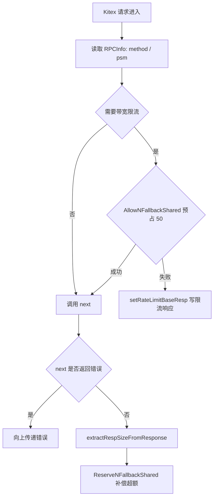

# Other — comm

## 模块定位

`fuxi/comm` 是 Fuxi 侧的通用基础模块，主要提供 Kitex 中间件、响应封装、指标上报、HLC 版本号、限流器、任务池、配置、缓存、日志和测试辅助工具。它不承载具体业务模型，但被业务入口、存储层、索引层、测试代码反复复用。

## 中间件

`fuxi/comm/midware` 提供两个主要中间件：

`LogMidware[T resp.RespIf](key string)` 包装 Kitex `endpoint.Endpoint`，在调用前后读取 `rpcinfo.GetRPCInfo(ctx)`，记录方法名、调用方、请求、响应、耗时和错误，并通过 `metrics.ReportAPIStatus` 上报 `api_status`。它通过反射读取响应对象的 `Success` 字段，再断言为 `resp.RPCResp[T]` 取得 `BaseResp` 状态码。

`DownstreamRateLimitMiddleware(next endpoint.Endpoint)` 是下游带宽限流入口。当前 `methodNeedBandwidthLimiter` 对所有方法返回 `true`。中间件会用 `harden.HardenClient.AllowNFallbackShared` 预占 `BandwidthPreQuota`，失败时调用 `setRateLimitBaseResp` 把响应写成 `set_meta_resp.BandwidthLimitExceeded`，并跳过下游调用；成功时执行 `next`，然后通过 `bandwidthLimiterCompensation` 按实际响应大小补偿超出的带宽。

限流响应依赖 Kitex result 的常见结构：外层响应实现 `GetResult() interface{}`，内部 success 对象实现 `GetOrSetBaseResp() interface{}`，并且外层结构存在名为 `Success` 的字段。响应大小提取要求 `GetResult()` 返回值实现 `msgp.Sizer`，否则大小按 `0` 处理。

## 响应封装

`fuxi/comm/utils/resp` 把业务返回码和 Kitex `BaseResp` 的转换集中起来：

- `Result` / `NewResult()`：为每个定义的结果分配递增 ID。
- `ResultBase[T]`：用 `NewResultBase[T]()` 创建结果注册表，通过 `NewResp(res, code, msg)` 注册 `Resp[T]`。
- `Resp[T]`：保存 `Code`、`Msg` 和 `Result`，提供 `WithMsgF`、`WithMsgE`、`ToBaseResp`。
- `RPCResp[T]`：要求响应类型实现 `GetBaseResp() T`。
- `RespIf`：约束 `BaseResp` 必须支持 `GetStatusMessage`、`GetStatusCode`、`SetStatusMessage`、`SetStatusCode`。

`Resp.ToBaseResp(ctx)` 使用 `generic.Init[T]()` 创建目标 `BaseResp`，并写入状态码和状态信息。非零状态码会通过 `log.PrintE` 打印错误响应日志。`GetRespByCode[T](code)` 用于指标上报时把状态码映射回注册过的消息。

## 指标上报

`fuxi/comm/utils/metrics` 封装 `code.byted.org/gopkg/metrics/v3`。`newMetrics` 创建带固定 tag 列表的 `Metric`，`newTag` 会通过 `EscapeTagValueSimple` 统一清理 tag 值，空字符串会变成 `EMPTY_VALUE`。

主要上报函数包括：

- `ReportAPIStatus(ctx, method, space, schema, status, cost)`：上报 API 耗时和 QPS，tag 包含 `method`、`caller`、`space`、`schema`、`storage_policy`、`fed`、`status`。
- `ReportAttrFormatInvalid(ctx, method, space, schema, reason)`：记录属性格式错误。
- `ReportGSIOps`、`ReportGSIQueryBucketCount`、`ReportGSIAsyncPoolActive`、`ReportGSIAsyncPoolRejected`：记录 GSI 操作、查询桶数量和异步池状态。
- `ReportSetAttrStage`：按微秒记录 SetAttr 各阶段耗时。
- `ReportMDAPStartProcessing`：记录 MDAP 开始处理事件。
- `RecordShielded`：记录 shielded 状态。
- `ReportTTL`：当前实现使用 `ApiStatus` 指标名上报 TTL 相关状态。

测试中可调用 `metrics.Mock()` 切换到内存记录模式，再用 `PopRecords(name)` 取出 `MetricsRecord` 断言 tag 和 value。

## HLC 版本号

`fuxi/comm/utils/hlc` 实现混合逻辑时钟。`HLC` 内部包含 `physicalTime`、`logical` 和 `encoding`。当前 V1 编码使用毫秒时间戳，高位存物理时间，低 16 位中 `bit[15:14] == 01` 表示 V1，剩余 14 位是 logical counter。

常用入口：

- `ParseInt64Str(str)`：从十进制字符串解析 HLC。
- `IsV1Encoding(v)`：判断 int64 是否为合法 V1 编码。
- `New(remoteHLC)`：基于远端 HLC 推进本地 V1 时钟。
- `ToInt64()` / `ToInt64Str()`：编码为 int64 或字符串。
- `NewerThan(a, b)` / `OlderThan(a, b)`：比较两个 int64 编码版本。
- `HLC.NewerThan(other)`：比较两个已解析 HLC。

迁移兼容规则很重要：V0 是旧版纳秒编码，可能因为截断出现负值或很大的正值；跨 V0/V1 比较时，代码明确认为 V1 永远比 V0 新，不能直接用裸 `int64` 大小判断。

## 并发与限流工具

`limiter.NewParallelLimit[T](limit)` 创建可动态调整的并发限制器。`Run(f)` 在当前运行数小于 limit 时执行函数并返回 `(executed=true, res, err)`；达到限制时返回 `executed=false` 和类型零值。`UpdateLimit(n)` 会更新后续调用的并发上限。

`limiter.NewSlidingWinRateLimiter(percentage, windowSize)` 创建按秒窗口统计的滑动窗口比例限流器。调用方先用 `Put()` 记录进入量，再用 `TryAcquire()` 消费允许释放的额度。每个窗口的可释放数量是 `putCount * percentage / 100`，旧窗口会在超过 `windowSize` 后清理。

`pool.New(size)` 创建轻量异步任务池，`Submit(fn)` 非阻塞提交，池满返回 `false`。任务 goroutine 内部会 `recover()`，保证 panic 后释放信号量。`RetryPool` 在 `Pool` 上增加 `SubmitRetry(fn func() error)`，失败后用指数退避和 ±25% jitter 重试；退避等待期间不占用池槽位，`Wait()` 只等待当前已经提交并运行中的任务，不等待尚未触发的 timer。

## 通用工具

`comm` 包提供上下文和 URI 辅助：`Ctx()` 创建带 `K_LOGID` 的 background context，`ExtractCaller(ctx)` 从 Kitex RPCInfo 读取调用方 PSM，`ExtractFromURI(uri)` 支持 `s3://bucket/object`、`az://bucket/object`、`oss://bucket/object` 和裸 `bucket/object`，`ExtractBkt(ctx, uri)` 只返回 bucket。

`clock` 包提供测试时间控制：`Mock(t)` monkey patch `time.Now`，`FreezeAt(ts, ns)` 固定时间，`UpdateOffSet(d)` 添加偏移，`Demock(t)` 复原。`Overflow2038(times...)` 用于检测 Unix 秒是否超过 2038 边界。

`conf` 包封装 TCC：`GetConfig`、`GetOrDef`、`GetOrPanic`、`GetWithJSON[T]`、`GetWithYAML[T]` 负责读取和解析配置。`ConfStack` 支持测试 mock 配置，`Mock` 写入当前批次，`Submit` 开启下一批，`Demock` 回退。

`cache` 包定义 `Cache` 接口和 `InitCache`，底层使用 `vfastcache`。注意包级 `SetN`、`GetN`、`DelN` 当前受全局 `Disable = true` 控制，默认不会访问本地缓存；直接使用 `InitCache` 返回的实例才会执行实际缓存操作。

`maps.NewTreeMap[K,V]` 基于红黑树实现 `SortedMap`，支持 `Min`、`Max`、`Floor`、`LowerThan`、`Ceiling`、`GreaterThan`。`generic.Zero[T]` 返回类型零值，`generic.Init[T]` 对指针类型返回指向零值的新指针。`errs.New` 和 `errs.Wrap` 会把调用文件、行号、函数名拼进错误信息，`CausedBy` 沿 `Cause()` 链查找根因。

## 测试辅助与生成代码

`utils/ast` 是测试断言包，提供 `Equal`、`NoErr`、`Err`、`Nil`、`LenSli`、`SliceEqIgnOrder` 等函数；`DetailedDiff` 能递归比较 struct、slice、map、pointer，并对疑似二进制字符串输出 base64 diff。

`utils/test_utils/kitex_gen` 是测试用 Kitex 生成代码，包含 `base.BaseResp`、`comm.HelloReq`、`comm.HelloResp`、`helloservice.NewClient`、`helloservice.NewServer` 等类型和客户端/服务端包装。业务代码不应依赖这些测试生成类型；它们主要用于验证 `resp` 和中间件对 Kitex 响应结构的兼容性。