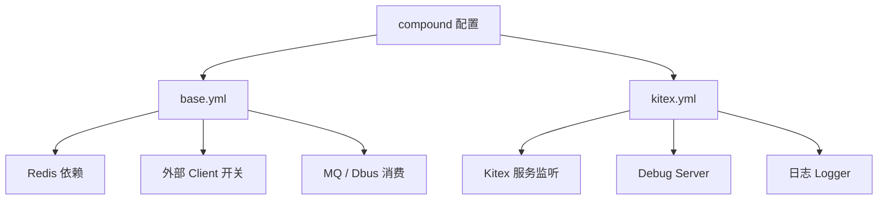

# Other — compound

## compound 配置模块

`conf/compound` 是 compound 服务的运行时配置目录。本模块不包含业务代码、函数、类或执行流程；它通过 YAML 文件为服务启动、外部依赖开关、消息消费和日志行为提供默认配置。

当前模块包含两个配置文件：

- `conf/compound/base.yml`：业务依赖与消息通道配置。
- `conf/compound/kitex.yml`：Kitex 服务监听、debug server 和日志配置。

调用图中没有检测到内部调用、外部调用或入站调用，说明这里是纯配置模块，运行时由代码库中的配置加载机制读取，而不是通过函数调用链直接执行。

## 配置结构



## `base.yml`

`base.yml` 定义 compound 服务依赖的外部组件默认配置。所有外部依赖默认都是关闭状态，适合作为基础配置或本地开发的安全默认值。

### `RawVideoInfoRedis`

```yaml
RawVideoInfoRedis:
    Enable: false
    Cluster: ""
    DialTimeout: "100ms"
    ReadTimeout: "10ms"
    WriteTimeout: "100ms"
    PoolSize: 200
    KeyPrefix: "raw_video_info:"
```

用于配置原始视频信息相关 Redis 访问。

关键字段：

- `Enable`：是否启用该 Redis 依赖。默认 `false`。
- `Cluster`：Redis 集群名，默认空字符串。
- `DialTimeout`：建立连接超时时间，默认 `100ms`。
- `ReadTimeout`：读超时时间，默认 `10ms`。
- `WriteTimeout`：写超时时间，默认 `100ms`。
- `PoolSize`：连接池大小，默认 `200`。
- `KeyPrefix`：Redis key 前缀，默认 `raw_video_info:`。

贡献代码时需要注意：如果业务代码依赖该 Redis，必须处理 `Enable: false` 的场景，不能假设 Redis client 一定存在。

### `ObjectDuplicationRedis`

```yaml
ObjectDuplicationRedis:
    Enable: false
    Cluster: ""
    DialTimeout: "100ms"
    ReadTimeout: "10ms"
    WriteTimeout: "100ms"
    PoolSize: 200
    KeyPrefix: "object_duplication:"
```

用于配置对象去重相关 Redis 访问。

字段语义与 `RawVideoInfoRedis` 基本一致，区别是默认 key 前缀为 `object_duplication:`。这两个 Redis 配置应被视为不同业务域的存储配置，不应混用 key 前缀。

### `VDAClient`

```yaml
VDAClient:
    Enable: false
```

控制 VDA client 是否启用。当前配置只提供启停开关，没有服务地址、超时或重试等细节字段。

### `ODMClient`

```yaml
ODMClient:
    Enable: false
```

控制 ODM client 是否启用。与 `VDAClient` 一样，当前模块只声明开关。

### `VDARMQ`

```yaml
VDARMQ:
    Enable: false
    Cluster: ""
    Topic: ""
    ConsumerGroup: ""
    WorkNum: 10
    Orderly: true
```

配置 VDA 相关 RMQ 消费。

关键字段：

- `Enable`：是否启用消费。
- `Cluster`：消息队列集群。
- `Topic`：消费 topic。
- `ConsumerGroup`：消费组。
- `WorkNum`：worker 数量，默认 `10`。
- `Orderly`：是否顺序消费，默认 `true`。

如果后续代码启用该消费链路，需要确保 `Cluster`、`Topic`、`ConsumerGroup` 在对应环境配置中被覆盖；基础配置中的空字符串不能直接用于生产消费。

### `ODADbus`

```yaml
ODADbus:
    Enable: false
    Cluster: ""
    Topic: ""
    ConsumerGroup: ""
    WorkNum: 10
    Orderly: true
```

配置 ODA 相关 Dbus 消费。字段结构与 `VDARMQ` 一致。

`VDARMQ` 和 `ODADbus` 都默认关闭，并且都采用顺序消费。修改 `Orderly` 会影响消息处理并发模型，提交前需要确认对应业务处理是否依赖消息顺序。

## `kitex.yml`

`kitex.yml` 定义 compound 服务的 Kitex 运行配置。

```yaml
Address: ":8888"
EnableDebugServer: true
DebugServerPort: "18888"
```

服务默认监听 `:8888`。Debug server 默认开启，端口为 `18888`。

开发者需要注意：

- `Address` 是服务对外监听地址。
- `EnableDebugServer` 控制 debug server 是否启动。
- `DebugServerPort` 是字符串类型端口配置。

## 日志配置

`kitex.yml` 中的 `Log` 节点定义日志目录和 logger。

```yaml
Log:
  Dir: log
  Loggers:
    - Name: default
      Level: info
      Outputs:
        - File
        - Agent
    - Name: rpcAccess
      Level: trace
      Outputs:
        - File
        - Agent
    - Name: rpcCall
      Level: trace
      Outputs:
        - File
        - Agent
```

### `default`

默认业务日志 logger：

- `Name: default`
- `Level: info`
- 输出到 `File` 和 `Agent`

本地开发如需更细日志，可以将级别改为 `debug`，但生产环境不建议随意开启更低级别日志。

### `rpcAccess` 和 `rpcCall`

RPC 访问与调用链相关 logger：

- `rpcAccess`
- `rpcCall`

二者默认都是 `trace` 级别，并输出到 `File` 和 `Agent`。配置注释明确说明不建议修改，否则可能影响调用链构建和 tracing。

## 配置覆盖与环境差异

`kitex.yml` 中 `Log.Dir` 的注释说明：环境变量 `KITEX_LOG_DIR` 的优先级高于 YAML 中的 `Dir`。

因此实际日志目录的优先级应按运行环境判断：

1. 如果设置了 `KITEX_LOG_DIR`，使用环境变量值。
2. 否则使用 `kitex.yml` 中的 `Log.Dir: log`。

`base.yml` 中大量字段为空或关闭，说明它更像基础默认配置。不同环境通常需要通过环境配置、配置中心或部署系统覆盖以下字段：

- Redis 的 `Enable`、`Cluster`
- MQ/Dbus 的 `Enable`、`Cluster`、`Topic`、`ConsumerGroup`
- 外部 client 的 `Enable`

## 贡献注意事项

新增外部依赖配置时，建议保持本模块现有模式：

```yaml
SomeDependency:
    Enable: false
```

如果依赖需要连接池、超时、集群或 key 前缀，应显式声明默认值，避免业务代码依赖隐式默认行为。

修改现有配置时重点检查：

- 默认是否应该保持关闭。
- 空字符串是否会被运行时代码正确拦截。
- 超时时间是否符合调用链预算。
- logger 名称是否被框架或 tracing 逻辑依赖。
- `rpcAccess` 和 `rpcCall` 的级别是否会影响链路追踪。

本模块本身没有可执行逻辑，因此测试重点不在单元测试，而在配置加载、环境覆盖和服务启动验证。