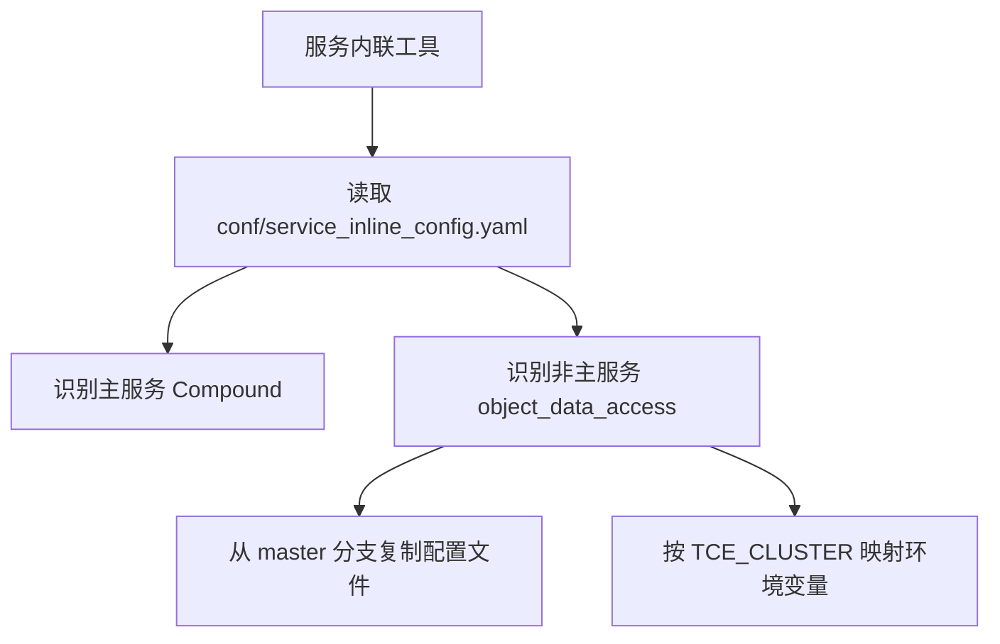

# Other — conf

## 模块概览

`conf/service_inline_config.yaml` 是服务内联工具的配置文件，用于声明当前仓库服务与外部依赖服务之间的内联关系。该模块不包含 Go/TypeScript/Python 等可执行代码，也不定义函数或类；它的行为由外部 Service Inline Tool 读取 YAML 后驱动。

当前配置将主服务 `bytedance.videoarch.compound` 与非主服务 `bytedance.videoarch.object_data_access` 关联起来，使内联工具可以在处理 Compound 服务时同步拉取并应用 `object_data_access` 的配置。

## 配置入口

文件顶部的 `tool_version` 指定服务内联工具版本：

```yaml
tool_version: 1.0.0.1428
```

`services` 是核心配置列表，包含一个主服务和一个非主服务：

```yaml
services:
  - is_main: true
    namespace: "bytedance_videoarch_compound"
    psm: "bytedance.videoarch.compound"
    name: "code.byted.org/videoarch/compound"

  - is_main: false
    namespace: "bytedance_videoarch_object_data_access"
    psm: "bytedance.videoarch.object_data_access"
    name: "code.byted.org/videoarch/object_data_access"
```

## 主服务配置

主服务由 `is_main: true` 标识：

| 字段 | 当前值 | 作用 |
|---|---|---|
| `is_main` | `true` | 标识这是当前仓库对应的主服务 |
| `namespace` | `bytedance_videoarch_compound` | 服务命名空间，当前按 `psm` 中的 `.` 替换为 `_` |
| `psm` | `bytedance.videoarch.compound` | Compound 服务的 PSM |
| `name` | `code.byted.org/videoarch/compound` | 当前服务对应的代码仓库路径 |

主服务不配置 `repo_branch`、`config_files` 或治理开关，表示这些内容由当前仓库自身管理。

## 非主服务配置

非主服务由 `is_main: false` 标识，当前只有 `bytedance.videoarch.object_data_access`：

| 字段 | 当前值 | 作用 |
|---|---|---|
| `namespace` | `bytedance_videoarch_object_data_access` | 被内联服务的命名空间 |
| `psm` | `bytedance.videoarch.object_data_access` | 被内联服务的 PSM |
| `name` | `code.byted.org/videoarch/object_data_access` | 被内联服务的代码仓库路径 |
| `repo_branch` | `master` | 拉取该服务配置时使用的分支 |
| `config_files` | `["*"]` | 复制该服务下的全部配置文件 |
| `disable_service_govern_suite` | `false` | 不禁用服务治理套件 |
| `disable_span_metrics` | `false` | 不禁用 span metrics |
| `disable_trace` | `false` | 不禁用 trace |

这里的 `config_files: ["*"]` 表示内联工具需要复制非主服务中的全部配置文件，而不是只复制特定文件。

## 环境变量映射

非主服务下配置了 `env`，用于根据当前环境中的 `TCE_CLUSTER` 生成对应的环境变量值。

当前定义了两个环境变量：

```yaml
env:
  SERVICE_CLUSTER:
    - rules:
        TCE_CLUSTER: fuxi
      value: fuxi
  TCE_CLUSTER:
    - rules:
        TCE_CLUSTER: fuxi
      value: fuxi
```

`SERVICE_CLUSTER` 和 `TCE_CLUSTER` 的规则列表完全一致，都是按当前 `TCE_CLUSTER` 做一对一透传映射。支持的集群值包括：

- `fuxi`
- `vod_china`
- `vod_global`
- `live_global`
- `video_arch`
- `vod_tob`
- `vod_tob_bp`
- `mdap`

例如，当外部环境中的 `TCE_CLUSTER` 为 `vod_global` 时，内联工具会为非主服务设置：

```yaml
SERVICE_CLUSTER: vod_global
TCE_CLUSTER: vod_global
```

## 执行关系

该模块本身没有内部调用、外部调用或被代码调用的函数入口。实际执行流程发生在外部服务内联工具中：



## 与代码库的连接方式

`conf/service_inline_config.yaml` 通过配置而不是代码调用连接到仓库其他部分。它的主要影响面是部署、构建或服务内联流程：

- 声明当前仓库服务是 `bytedance.videoarch.compound`。
- 声明 Compound 依赖 `bytedance.videoarch.object_data_access` 的配置。
- 控制非主服务配置文件的复制范围。
- 控制非主服务在不同 `TCE_CLUSTER` 下的 `SERVICE_CLUSTER` 和 `TCE_CLUSTER` 值。
- 保持 trace、span metrics 和服务治理能力默认启用。

修改该文件时应重点检查 `psm`、`namespace`、`repo_branch`、`config_files` 和 `env` 映射是否与实际服务部署环境一致。