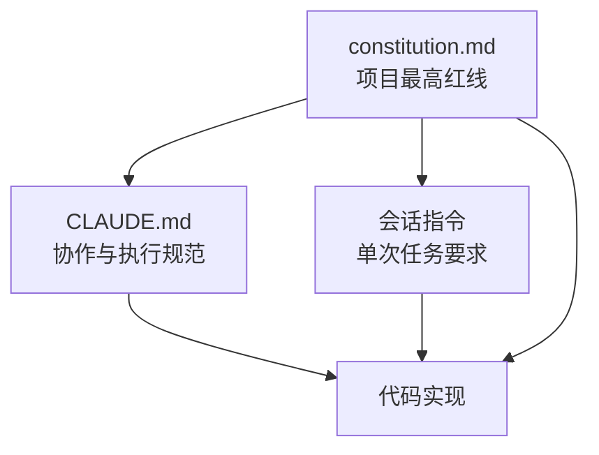

# Other — constitution.md

## 模块定位

`constitution.md` 是项目级开发宪法，定义 AI Agent 在本仓库内进行技术规划、代码实现、测试与文档协作时必须遵守的最高优先级原则。它不是可执行代码模块，没有函数、类、调用边或运行时执行流；它通过仓库协作规范生效，约束后续代码变更的设计边界。

该文件当前声明版本为 `1.0`，标题行包含 `Ratified: $(date +%Y-%m-%d)`。这在 Markdown 中是普通文本，不会自动执行 shell 命令或替换为日期。

## 生效范围与优先级

本模块的治理条款明确规定：`constitution.md` 的效力高于任何 `CLAUDE.md` 或单次会话中的指令。也就是说，当项目内协作规则、会话要求或实现偏好与本文件冲突时，应以本文件为准。



这类约束不会通过程序调用链自动执行，而是由开发者和 AI Agent 在需求拆解、实现方案、测试设计、代码审查时主动应用。

## 核心原则

### 第一条：简单性原则

简单性原则要求实现始终遵循 Go 的“少即是多”哲学。它主要约束新增功能、重构和依赖选择。

具体含义包括：

- 只实现 `spec.md` 中明确要求的功能。
- 优先使用 Go 标准库，例如 Web 服务优先使用 `net/http`。
- 避免不必要的抽象层、复杂接口体系和非必要依赖。
- 简单函数和直接的数据结构优先于过度设计。

对贡献者而言，这意味着提交方案时需要能说明“为什么现在需要这个抽象或依赖”。如果理由只是为了未来可能的扩展，通常不符合 `1.1 (YAGNI)`。

### 第二条：测试先行铁律

测试先行是不可协商条款。所有新功能和 Bug 修复都必须从一个或多个失败测试开始，然后再进行实现。

本文件要求严格遵循：

1. 先写失败测试，也就是 Red 阶段。
2. 写最小实现让测试通过，也就是 Green 阶段。
3. 在测试保护下整理代码，也就是 Refactor 阶段。

测试风格上，单元测试优先采用 Go 常见的表格驱动测试模式。对于涉及依赖的逻辑，应优先编写集成测试并使用真实依赖，而不是默认引入 Mock。

典型测试结构应接近以下模式：

```go
func TestExample(t *testing.T) {
	tests := []struct {
		name string
		input string
		want string
	}{
		{
			name: "处理有效输入",
			input: "example",
			want: "example",
		},
	}

	for _, tt := range tests {
		t.Run(tt.name, func(t *testing.T) {
			got := Example(tt.input)
			if got != tt.want {
				t.Fatalf("Example() = %q, want %q", got, tt.want)
			}
		})
	}
}
```

这里的 `Example` 只是表格驱动测试结构示意，不代表本模块中存在该函数。

### 第三条：明确性原则

明确性原则要求代码优先服务于人类理解，尤其强调错误处理和依赖传递。

错误处理是不可协商要求：

```go
if err != nil {
	return fmt.Errorf("执行某操作失败: %w", err)
}
```

所有错误都必须显式处理。向上层传递错误时，必须使用 `fmt.Errorf("...: %w", err)` 包装原始错误，保留错误链，便于调用方使用 `errors.Is`、`errors.As` 或日志定位根因。

本文件同时禁止使用全局变量传递状态。依赖必须通过函数参数或结构体成员显式注入。例如，优先使用：

```go
type Service struct {
	store Store
}

func NewService(store Store) *Service {
	return &Service{store: store}
}
```

而不是通过包级变量隐藏依赖关系。这样可以让调用路径、测试边界和并发行为更清晰。

## 与代码库其他部分的关系

`constitution.md` 由仓库入口规范引用，属于项目级红线文档。它与 `CLAUDE.md`、`docs/AGENTS.md` 共同构成本仓库的协作规则体系，其中本文件负责定义不可突破的开发原则，`CLAUDE.md` 负责更具体的协作、测试、提交和专项约束。

它还直接引用 `spec.md` 作为功能范围边界：实现新功能时，应以 `spec.md` 中明确要求为准，不主动扩展范围。

由于本模块没有运行时代码，Call Graph 中不存在 internal calls、outgoing calls 或 incoming calls。这一点很重要：它不是通过编译器或运行时执行来发挥作用，而是通过开发流程、代码审查和 Agent 行为约束影响整个仓库。

## 贡献时的使用方式

在修改代码前，贡献者应先用本文件检查方案是否满足以下问题：

- 是否只实现了 `spec.md` 明确要求的功能？
- 是否优先使用了 Go 标准库？
- 是否先补充了失败测试？
- 测试是否优先采用表格驱动形式？
- 是否避免了不必要的 Mock？
- 每个错误是否都被显式处理并用 `%w` 包装？
- 状态和依赖是否通过参数或结构体成员显式传递？

如果某个实现需要偏离这些原则，应先调整设计，而不是在代码中绕过约束。