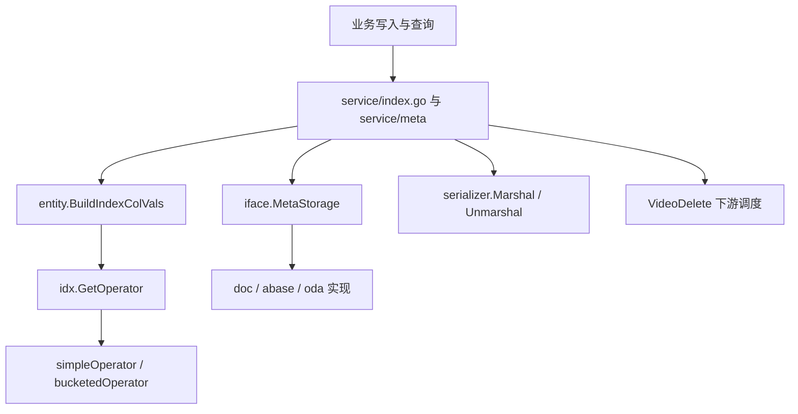

# Other — core

## 模块定位

`Other — core` 覆盖 `fuxi/core` 下的核心公共层：运行配置、实体常量、GSI 索引值编码、桶模型、统一存储接口、KV 序列化，以及少量服务级辅助逻辑。它不是一个单独的业务服务，而是 `service/index.go`、`service/meta`、`service/idx`、`client/doc|abase|oda` 等模块共享的基础设施层。



## 运行配置

`fuxi/core/conf/kitex.yml` 定义 core 服务的 Kitex 默认配置：

- `Address: ":8888"`：服务监听地址。
- `EnableDebugServer: true` 与 `DebugServerPort: "18888"`：启用 debug server。
- `Log.Loggers`：
  - `default`：默认 `info`，输出到 `File` 和 `Agent`。
  - `rpcAccess` / `rpcCall`：默认 `trace`，注释明确不建议修改，否则可能影响 tracing 调用链构造。
  - `Console` 输出被注释，注释提示仅本地开发使用，不应在生产启用。

## entity：核心数据模型与 GSI 基础结构

`fuxi/core/consts/entity` 是本模块最重要的公共包，提供 GSI、MetaStorage 和索引查询共用的数据结构。

### 类型化属性值

`ConvertAttrValue(raw string, typ compound.AttrType) (any, error)` 将业务原始字符串转换为原生 BSON 值：

| AttrType | BSON 值 | 失败行为 |
|---|---|---|
| `AttrType_INT` | `int64` | `strconv.ParseInt` 失败返回 error，包括溢出 |
| `AttrType_NUMBER` | `float64` | `strconv.ParseFloat` 失败返回 error |
| `AttrType_BOOL` | `bool` | 只接受字面量 `"true"` / `"false"` |
| `AttrType_BLOB` / `AttrType_FILE` / 默认 | `string` | 恒等返回，无 error |

这里的行为是“可感知失败”的严格转换，供写入路径拒绝脏类型。注释中说明 `doc.convertValue` 基于它做 best-effort 封装，失败时回退原字符串。

### GSI 索引列值

`IndexColVal` 是 GSI `colN` 的 typed value 载体：

```go
type IndexColVal struct {
    Typ compound.AttrType
    Val any
    Raw string
}
```

关键入口：

- `NewIndexColVal(raw, typ)`：构造时完成类型转换。
- `BSONValue()`：返回已转换的原生 BSON 值。
- `StringCols(raws...)`：按 BLOB/string 恒等构造，主要用于存量 string 调用方和测试。
- `RawCols(cols)`：取原始字符串，分桶模式复用历史 string 路由时使用。
- `BSONCols(cols)`：取原生 BSON 值。
- `BuildIndexColVals(vals, cols, attrMap, strict)`：写入、查询、Count、reconcile 共享的统一构造入口。

`strict=true` 用于写入路径，转换失败直接返回 error；`strict=false` 用于查询路径，转换失败回退为 string，使 typed posting 行不匹配，语义上等价于“无此值”。不要在调用点手写 `col1`、`col2` 的值转换，否则 Remove filter 可能无法匹配 Add 写入的行。

### 索引配置

`IdxCfg` 描述 GSI 配置：

- `Name` / `Space` / `Schema` / `Columns`：索引身份和列定义。
- `IsUniq`：唯一索引标记。
- `BucketEnabled`：选择分桶模式或 simple 行级模式。
- `Collection`：自定义 posting collection；为空时由上层生成。
- `TxnSupported`：历史字段，注释标记为 deprecated。当前 admin 入口硬编码事务路径，CAS 实现已归档到 `fuxi/core/service/idx/archive/`。

`HasWildcardColumn()` 通过 `strings.Contains(col, "*")` 判断索引列是否包含通配符，覆盖 `[*]` 和普通 `*`。

## Bucket 与版本路由

`Bucket` 是 bucketed GSI posting list 的持久化结构。核心字段包括 `Idx`、`Space`、`Schema`、`Cols`、`IdxVer`、`Cnt`、`MinVer`、`MaxVer` 和 `Entries`。

版本边界使用哨兵值而不是历史 null 语义：

- `VerBoundaryMin`：负无穷，所有合法业务版本都大于它。
- `VerBoundaryMax`：正无穷，同时表示活跃桶。
- `IsActive()` 判断 `MaxVer == VerBoundaryMax`。
- `IsSealed()` 判断 `MaxVer != VerBoundaryMax`。
- `NeedsSplit()`：封口桶且 `Cnt >= BucketSoftMax`。
- `CanSoftAppend()`：封口桶且 `Cnt < BucketSoftMax`。
- `NeedsMerge()`：封口桶且 `Cnt < BucketMergeThreshold`。

重要阈值：

| 常量 | 值 | 含义 |
|---|---:|---|
| `BucketSize` | 1000 | 活跃桶目标上限 |
| `BucketSoftMax` | 1200 | 封口桶迟到追加软上限 |
| `BucketMergeThreshold` | 250 | 删除后触发合并的低水位 |
| `MaxBucketsPerQuery` | 10000 | 单次索引查询桶数安全上限 |
| `MaxIdxQueryResults` | 10000 | meta 层索引返回 id 上限 |

`ToBson()` 将 `Cols` 展开为 `col1`、`col2`、`col3`。`BucketFromBson()` 支持从 `bson.M` 恢复桶，`entries` 可处理 `bson.A` 中的 `bson.M` 或 `bson.D`；缺失 `min_ver` / `max_ver` 时分别按 `VerBoundaryMin` / `VerBoundaryMax` 兼容。

## BSON filter 构造

entity 包集中维护 GSI 查询 filter，避免调用方分散拼接：

- `ColKey(i)`：返回 `col{i+1}`。
- `ColsFilter(cols []string)`：分桶模式 string colN。
- `ColsFilterTyped(cols []IndexColVal)`：simple 模式 typed colN。
- `BaseFilter(idx, space, schema, cols)`：分桶基础 filter。
- `BaseFilterTyped(idx, space, schema, cols)`：simple 写入、查询、Count 的基础 filter。
- `BaseFilterCrossSpace` / `BaseFilterCrossSpaceTyped`：跨 space 查询时省略 `space`。
- `ShardClause(idx, cols)`：构造 `{idx, col1...}` 分片键等值 clause。
- `VersionRouteFilter(idx, space, schema, cols, ver)`：构造 V3 版本路由 filter。

`VersionRouteFilter` 的形态很关键：`idx + colN` 必须放在 `$and` 的独立 clause 中，`space` / `schema` 放顶层，`min_ver <= ver` 与 `max_ver > ver` 使用哨兵值直接表达。测试明确验证 `idx` 和 `col1` 不应出现在顶层。

## RetryLimiter

`RetryLimiter` 是 GSI CAS/事务重试比例的进程级保护器，单例为 `GlobalRetryLimiter`。

- `RecordCall()`：记录一次首次调用。
- `AllowRetry()`：判断是否允许本次重试；允许时累加 retry 计数。
- 使用 `cur + prev` 双窗口加权滑动统计。
- 样本数低于 `retryMinSample=100` 时直接放行。
- `(retriesW+1)/callsW >= MaxRetryRatio` 时拒绝；边界值 10% 会被拒绝。

测试覆盖了样本不足、正常比例、10% 边界拒绝、窗口轮转和双窗口过期清零。

## iface：统一 MetaStorage 契约

`fuxi/core/iface/iface.go` 定义多存储后端统一接口：

```go
type MetaStorage interface {
    QueryAttr(ctx, metaSpace, queryFilter, orderBy, limit, offset)
    Count(ctx, metaSpace, queryFilter)
    UpdateAttr(ctx, metaSpace, queryFilter, update, version)
    DelID(ctx, namespace, queryFilter, version, cnt)
}
```

实际签名使用 `QueryFilter`、`UpdateWrapper`、`SetParams` 和 `vers.Ver` 封装参数。`QueryFilter` 支持 ids、表达式和 attrMap；`UpdateWrapper` 同时表达 set 与 delete；`SetParams` 持有原始属性和类型映射。

公共错误包括 `ErrObjNotFound`、`WrongVersion`、`InvalidParam`、`CntNotMatch`、`ErrTxnConflict`、`ErrConsistentTxnFailed`。其中 `ErrConsistentTxnFailed` 专用于 BulkWrite 事务的预期结果不匹配，调用方通常需要重新读取最新快照后重试。

`iface/test_iface/meta_storage_test.go` 对 `doc.Impl`、`abase.Impl`、`oda.Impl` 进行统一 CRUD 行为验证，并覆盖嵌套键更新：更新 `a.b.c` 不应覆盖同级的 `a.b.d`、`a.x` 或顶层 `y`。删除不存在对象时，`vers.NotSet()` 期望 `ErrObjNotFound`，显式版本期望 `WrongVersion`。

## serializer：map[string]string 的兼容序列化

`fuxi/core/serializer/kv.go` 提供 `Marshal` / `Unmarshal`：

- `Marshal(m)` 输出 JSON 字符串。
- 对 `strs.MayContainsBinary(v)` 判断为可能含二进制的值，写入 key `_b.` + 原 key，value 为 base64。
- 新格式总是写入 `_v: "1"`。
- `Unmarshal(str)` 若 `_v != "1"`，按旧格式直接返回 JSON map。
- 新格式会跳过 `_v`，并将 `_b.` 前缀 key 解码回原 key。

这让历史“直接 JSON map”格式继续可读，同时支持二进制字符串值。测试覆盖随机 map、大段二进制 payload 和旧版本兼容。

## VideoDelete 下游调度

`fuxi/core/service/checker.go` 的 `VideoDelete(ctx, space, schema, extra)` 根据 `extra` 调用视频删除服务，并返回 `(base.BaseResp, executed, error)`。

识别的参数：

- `video_delete_type`
- `video_delete_param`

支持的类型：

| 类型值 | 请求类型 | 下游调用 |
|---|---|---|
| `video_delete` | `vd.DelOrgVideoRequest` | `video_delete.DeleteVideo` |
| `transcode_delete` | `vd.DelTranscodeVideoRequest` | `video_delete.DeleteTranscodeVideo` |
| `dup_delete` | `vd.DelVideoDupV2Request` | `video_delete.DelVideoDup` |
| `recover_video` | `vd.CancelDelOrgVideoRequest` | `video_delete.CancelDelOrgVideo` |
| `recover_transcode` | `vd.CancelDelEncodedVideoRequest` | `video_delete.CancelDelEncodedVideo` |

`extra == nil` 或缺少 `video_delete_type` 时不会触发下游，`executed=false`。未知类型或空 `video_delete_param` 返回 error。`VideoDelete` 会在下游 `StatusCode != 0` 时加上 `99000000` 做错误码映射。当前实现没有检查 `json.Unmarshal` 的 error，调用方应保证 `video_delete_param` 是对应请求结构的合法 JSON。

## 与 GSI idx 子系统的连接

`service/index.go` 是写路径汇聚点：`idxAdd`、`idxRemove`、`idxUpdateWithShardingKeys` 会先调用 `vers.NormalizeForIdx`，再通过 `buildIdxColVals` 使用 `entity.BuildIndexColVals(..., strict=true)` 构造 typed 列值，最后调用 `idx.GetOperator(cfg)` 分流到 simple 或 bucketed 实现。

`service/meta` 是读路径汇聚点：`queryIdByIdx`、`queryIdByIdxOrdered` 和 Count 命中索引逻辑使用 `BuildIndexColVals(..., strict=false)` 或严格转换构造 filter。simple 模式依赖 `BaseFilterTyped` 的原生 BSON 值，支持数值范围 Count；bucketed 模式在内部通过 `RawCols` 退回 string 路由。

贡献 GSI 相关代码时要保持三条约束：

- 写入、删除、查询、reconcile 必须共享 `BuildIndexColVals` 的构造语义。
- simple 模式使用 typed BSON；bucketed 模式当前仍使用 raw string cols。
- 分桶路由 filter 使用 `VersionRouteFilter` / `ShardClause` 的 V3 结构，不要把分片键 clause 随意改回顶层。