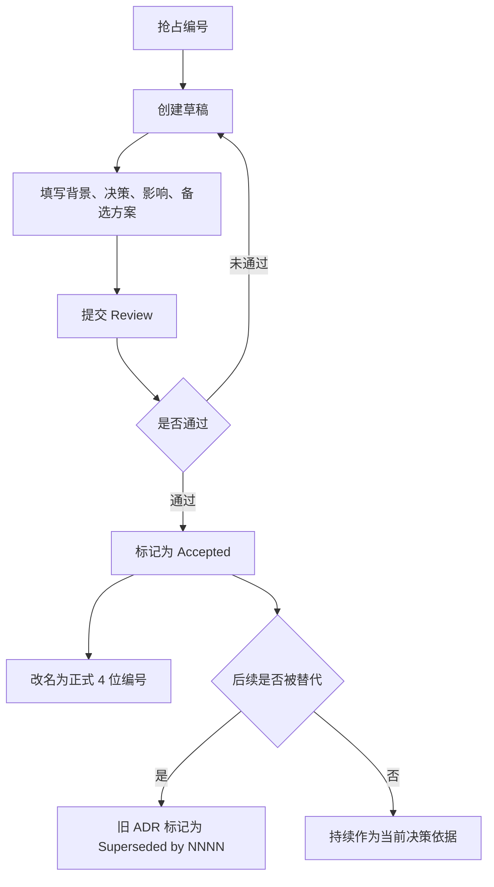
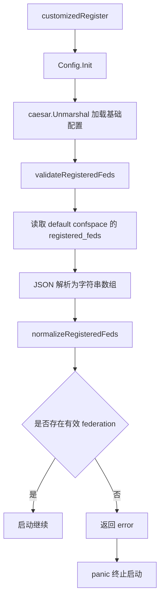

# Other — decisions

## 决策记录模块

`docs/decisions/` 用来沉淀 Compound 项目的架构决策记录（ADR）。它不是运行时代码模块，没有内部函数调用、外部调用或执行流；它的职责是维护项目级决策的索引、编号规则、状态语义，以及已经独立成文的决策记录。

当前目录包含两类文档：

- `README.md`：ADR 索引与流程入口，定义编号、状态和创建规则。
- `registered-feds-startup-validation.md`：一条具体决策记录，描述 Fuxi Admin 启动期对 `registered_feds` 配置做强校验的方案。

## 模块职责

该模块承担三个职责：

1. 作为 ADR 总入口  
   `docs/decisions/README.md` 维护“编号锁定表”“决策清单”“状态枚举”“流程”和“关联资源”，开发者创建或查找架构决策时应先从这里进入。

2. 约束 ADR 生命周期  
   新 ADR 需要先在编号锁定表中抢占编号，草稿期使用 `9XXX-DRAFT-<topic>.md`，Review 通过后再改为正式 4 位编号。状态使用 `Proposed`、`Accepted`、`Superseded by NNNN`、`Deprecated`。

3. 连接散落的关键设计  
   当前项目尚无正式编号的 Accepted ADR。`README.md` 明确列出仍散落在其他文档中的关键决策位置，例如多步事务方案、GSI 异步链路单消费者、ODA Kitex Gen 升级、VOD 删除早退等。

## 目录结构与关键文件

### `docs/decisions/README.md`

这是 ADR 的目录索引和流程说明。

关键内容包括：

- “编号锁定表”：用于多人并发创建 ADR 时抢占编号，要求 4 位编号严格递增，不跳号、不复用。
- “决策清单”：列出当前尚未独立落地为 ADR 的关键设计，并指向现有文档。
- “状态枚举”：统一 ADR 状态含义。
- “流程”：说明从草稿、Review、Accepted 到 Superseded 的生命周期。
- “关联资源”：连接架构总览、进行中变更和项目治理文档。

当前编号锁定表中没有 Accepted ADR：

```markdown
| 编号 | 状态 | 主题 | Owner | 日期 |
|---|---|---|---|---|
| — | — | （暂无 Accepted ADR） | — | — |
```

### `docs/decisions/registered-feds-startup-validation.md`

这是一条已成文但尚未纳入 `README.md` 正式编号表的决策记录，主题是 Fuxi Admin 启动期对 `registered_feds` 做强校验。

它记录的核心判断是：`registered_feds` 是控制面的基础注册表配置，缺失、为空或无法解析时应在启动阶段 fail-fast，而不是让进程进入运行时后再暴露问题。

该文档关联的实际代码组件包括：

- `fuxi/fuxi_admin/configs/config.go`
  - `Config.Init()`
  - `validateRegisteredFeds`
  - `normalizeRegisteredFeds`
  - `RegisteredFedsTCCKey = "registered_feds"`
  - `RegisteredFedsConfspace`
- `fuxi/fuxi_admin/configs/config_test.go`
- `fuxi/fuxi_admin/configs/tcc.go`
- `fuxi/fuxi_admin/router.go`
  - `customizedRegister`

## ADR 生命周期



## `registered_feds` 决策说明

`registered-feds-startup-validation.md` 记录的是一个配置初始化决策，而不是通用配置读取说明。

启动流程中的关键关系是：



### 校验时机

`Config.Init()` 在 `caesar.Unmarshal` 成功加载基础配置后调用 `validateRegisteredFeds`。因此，`registered_feds` 校验属于配置初始化的一部分，不是请求处理阶段的动态检查。

### 失败语义

以下情况都被视为启动失败：

- TCC 读取 `registered_feds` 失败。
- `registered_feds` 不是合法 JSON 字符串数组。
- 配置值是空数组。
- 归一化后没有任何非空 federation。

其中，TCC 值为 `null` 会反序列化为 nil slice，按空清单处理。

### 归一化规则

`normalizeRegisteredFeds` 对配置项执行三类处理：

- 去除首尾空白。
- 丢弃空串。
- 去重。

这意味着 `[" fed-a ", "", "fed-a"]` 这类输入最终只保留一个有效 federation：`fed-a`。

### fail-fast 路径

校验失败不引入新的退出机制，而是复用既有启动失败路径：`customizedRegister` 调用 `Config.Init()`，如果返回 error，则执行 `panic(err)`。这样进程不会在 `registered_feds` 无效时继续提供服务。

### TCC confspace 选择

该决策明确区分两类配置来源：

- cluster 级基础配置：按 `env.Cluster()` 选择 confspace。
- `registered_feds`：固定从 default confspace 读取。

这样设计是因为 `registered_feds` 表达的是全局 federation 注册表语义，不应跟随单个业务联邦目录变化。

## 与其他文档的关系

`docs/decisions/README.md` 是决策记录入口，但不是所有设计事实的唯一来源。当前仍有部分关键决策保留在其他文档中：

- 多步事务方案：`docs/architecture/modules/version-conflict.md`
- GSI 异步链路单消费者：`docs/architecture/architecture-detailed.md`
- ODA Kitex Gen 升级：`docs/archive/2026-03-15-upgrade-oda-kitex-gen/`
- VOD 删除早退：`docs/architecture/modules/video-delete-early-exit.md`

当这些内容需要形成稳定、可引用的长期决策依据时，应按 `README.md` 的流程提取为独立 ADR。

## 维护注意事项

新增或修改 `docs/decisions/` 下文档时，需要遵守项目文档规则：`docs/` 目录下的写动作必须由 `doc-init` skill 主导，具体入口见 `docs/AGENTS.md`。

新增 ADR 时应保持以下一致性：

- 文件名、编号锁定表和决策清单要同步。
- 状态值必须使用 `README.md` 中定义的枚举。
- 决策内容应引用真实代码符号，例如 `Config.Init()`、`validateRegisteredFeds`、`customizedRegister`，避免抽象描述脱离实现。
- 如果决策替代旧方案，旧 ADR 状态应改为 `Superseded by NNNN`，新 ADR 的 Context 段应引用旧 ADR。