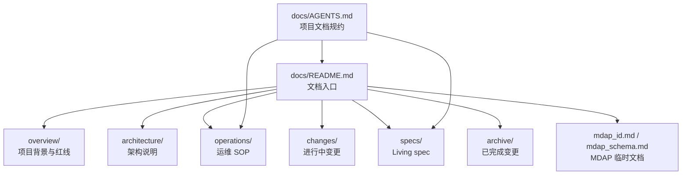

# Other — docs

## 模块概览

`docs/` 模块是 Compound 项目的文档入口与文档治理层，不包含可执行代码，也没有内部调用、外部调用或运行时执行流。它的作用是把项目级文档组织方式、写作约束、运维 SOP、Living spec、ADR、变更流程以及 MDAP 相关临时文档集中到一个可导航的位置。

该模块主要由四类内容组成：

- `docs/README.md`：项目文档总入口，提供文档地图和角色入门路径。
- `docs/AGENTS.md`：面向 AI agent 和开发者的项目级文档规约扩展。
- `docs/mdap_id.md`：MDAP ID 与 `AssetGroupID` 的编码设计说明。
- `docs/mdap_schema.md`：`AssetGroup`、`Artifact`、`Source` 的 JSON Schema 文档。

## 文档体系结构



`docs/README.md` 是读者入口，`docs/AGENTS.md` 是写作者入口。开发者阅读项目时通常从 `README.md` 进入；修改、创建或迁移文档时必须先遵守 `AGENTS.md` 中的项目特有规则，并叠加 doc-init skill 的通用硬规则。

## `docs/README.md`

`docs/README.md` 定义 Compound 文档地图。它不承载具体业务规则，而是把不同文档区域按职责组织起来：

| 区域 | 职责 |
|---|---|
| `overview/` | 项目背景、技术栈、宪法、术语 |
| `architecture/` | 架构总览、存储分层、GSI、HLC 编码、TOS 序列化、版本冲突等 |
| `api/` | RPC / HTTP / Event 接口契约 |
| `operations/` | 运维 SOP 索引和通用恢复指南 |
| `decisions/` | ADR，使用 `NNNN-<topic>.md` 四位编号 |
| `changes/` | proposal、design、tasks、spec-delta |
| `specs/` | capability 的 source of truth |
| `archive/` | 已完成 change 和状态快照 |
| `research/` | 横向技术调研与源码分析 |
| `mdap_id.md` / `mdap_schema.md` | MDAP 模块当前阶段的 ID 与 Schema 文档 |

该文件还记录了 `QueryArtifacts` 的当前查询约束：请求必须提供 `Space`、`SourceBizIDs`、`Name`、单个 `Types`，且当前不支持 `DeriveType` 与 `DeriveIDs`。相关实现位置明确指向 `mdap/service/mdap_validator.go` 和 `mdap/service/mdap.go`。

## `docs/AGENTS.md`

`docs/AGENTS.md` 是 Compound 项目对 doc-init 通用文档规约的项目级扩展。它只写本项目特有规则，不复述 doc-init skill 的完整 14 章节规则。

关键约束包括：

- 文档写作必须由 `doc-init` skill 主导。
- 新增 capability 或新功能必须走 `changes/<slug>/` 流程。
- 架构决策必须写入 `decisions/NNNN-<topic>.md`。
- 修改 living spec 必须经过一个 change 的 archive。
- idx 包逻辑变更必须叠加项目根 `CLAUDE.md` 的 idx 包专项约束。

### 扩展制品

当前项目已落地两个扩展文档区域：

| 扩展制品 | 路径 | 用途 |
|---|---|---|
| 运维 SOP 索引 + 通用恢复 | `docs/operations/` | 服务 idx 包高风险复合操作的 SOP 索引和恢复指南 |
| Research 调研沉淀 | `docs/research/` | 横向技术调研、源码分析和长期沉淀 |

尚未触发的扩展制品包括 `testing/`、`security/`、`observability/`、`performance/`、`release/`、`data-governance/` 等。它们不应提前空建，应由对应需求触发。

### idx 包文档约束

idx 包是该项目的高风险区域。涉及 idx 包逻辑变更时，不能只走普通文档流程，还必须满足项目根 `CLAUDE.md` 中的三段强制规则：

1. 先核对 README、compound-ops、reconcile-compound-ops、godoc 四处文档。
2. 产出包级别功能影响面分析和漏洞与风险分析，落到 `.claude/idx-change-<topic>.md`。
3. 通过用户显式 Review 放行后再编码。

`docs/AGENTS.md` 同时维护 idx 包 SOP 的就近留存清单，例如：

- `fuxi/core/service/idx/README.md`
- `fuxi/core/service/idx/reconcile/README.md`
- `fuxi/core/service/idx/reconcile/offline/README.md`
- `fuxi/core/service/idx/archive/docs/compound-ops/*.md`
- `fuxi/core/service/idx/archive/docs/reconcile-compound-ops/*.md`
- `fuxi/core/service/idx/docopstest/README.md`

这些文档通过 `docs/operations/README.md` 建立索引。

### capability 命名规则

项目采用“领域前缀 + 主题”的 capability 命名方式，例如：

- `gsi-index-runtime`
- `gsi-service-meta-orchestration`
- `gsi-reconcile-framework`
- `abase-storage-db-table`
- `binding-index-config`
- `table-prefix-config`
- `table-prefix-plugin`
- `setattr-timing-instrumentation`
- `offline-snapshot-reader`
- `documentation-system`

新 capability 必须在 `docs/specs/README.md` 登记 Owner 和最后归档合并日期。

## `docs/mdap_id.md`

`docs/mdap_id.md` 描述 MDAP ID 的 40 字符 Base32 编码方案。该文档覆盖两套 ID：

- `Asset`、`Source`、`Artifact`：使用 `mdap/id` 的 200-bit、40 字符 Base32 ID。
- `AssetGroup`：使用独立的 40 字符 Base32 ID 方案。

MDAP ID 固定为 40 个字符，底层为 200 bits，即 25 bytes。字符集为小写 Crockford 变种 Base32，剔除了 `i`、`l`、`o`、`u`，用于降低人工排障时的混淆风险。

核心位域包括：

| 字段 | 含义 |
|---|---|
| `T` | 实体类型码，区分 Asset、Source、Artifact、AssetGroup |
| `TEN6` | TenantID 编码 |
| `SUB4` | AccountID 编码 |
| `KV1` | KeyVersion，选择混淆密钥 |
| `SET11` | 父 `AssetGroup` 的 55-bit `GroupKey` |
| `DC2` | 机房 / 集群码 |
| `MT` | MIME 顶层类型 |
| `TS7` | 35-bit 百毫秒时间戳 |
| `X1` | 扩展字段，新布局标记 |
| `RAND6` | 随机 / 序列字段 |

`Generate` 和 `Parse` 当前仍会调用 account 服务补齐 `space` 或校验账号。解析时如果账号查询失败，会直接返回错误，不再静默降级为空 `space`。

`AssetGroupID` 使用独立格式：

```text
g + ACC4 + GK11 + DC2 + PAD22
```

其中 `GK11` 是 55-bit 随机 `GroupKey`，子实体 ID 可通过 `SET11` 携带该值，从而在不额外存储父组 ID 的情况下反推父 `AssetGroupID`。

## `docs/mdap_schema.md`

`docs/mdap_schema.md` 维护 MDAP 三类核心对象的 JSON Schema：

- `AssetGroup`
- `Artifact`
- `Source`

这些 schema 用于描述元数据结构，而不是 Go 代码中的运行时校验实现。

### `AssetGroup`

`AssetGroup` 表示一组 Source 及其派生产物的管理单元。主要字段包括：

- `space`
- `name`
- `media_types`
- `source_count`
- `size`
- `status`
- `creator`
- `create_time`
- `update_time`
- `description`
- `source_configs`
- `artifact_config`

其内部定义了 `store_location`、`source_config`、`job_execution`、`artifact_config` 等结构，用于描述存储位置、Source 拉取配置和 Artifact 生产任务。

### `Artifact`

`Artifact` 表示从 Source 或另一个 Artifact 派生出的产物。主要字段包括：

- `derive_type`
- `derive_id`
- `name`
- `size`
- `contents`
- `created_time`
- `updated_time`
- `asset_group_id`

`contents` 引用 `artifact_content`，其中的 `blobs` 是当前内容块内部的二进制对象表。payload 内的 `BlobRef` 使用 `$<index><suffix>` 引用 `blobs` 中的对象。

### `Source`

`Source` 表示一个具体媒体文件及其存储位置和元信息。主要字段包括：

- `biz_id`
- `asset_group_id`
- `asset_id`
- `name`
- `media_type`
- `format`
- `config`
- `meta`
- `tags`
- `created_time`
- `updated_time`

`config` 引用 `source_config`，其中包含源类型、是否需要 fetch、fetch 状态、存储位置列表和类型相关二进制配置。

## 与代码库的连接方式

该模块本身没有函数、类或运行时调用链，但它通过路径和规则约束连接到代码库：

- `QueryArtifacts` 的参数约束对应 `mdap/service/mdap_validator.go` 和 `mdap/service/mdap.go`。
- MDAP ID 的生成与解析对应 `mdap/id` 中的 `Generate` 和 `Parse`。
- idx 包 SOP 文档与 `fuxi/core/service/idx/` 下的实现、godoc 和测试材料保持同步。
- capability 文档通过 `docs/specs/` 作为行为契约的 source of truth。
- 变更流程通过 `docs/changes/`、`docs/archive/` 和 `docs/specs/` 串联 proposal、design、tasks、spec-delta 和归档。

## 维护注意事项

修改 `docs/` 下文档时，优先判断变更类型：

| 变更类型 | 应进入的位置 |
|---|---|
| 文档导航或入口调整 | `docs/README.md` |
| 项目级文档规约调整 | `docs/AGENTS.md` |
| 架构决策 | `docs/decisions/NNNN-<topic>.md` |
| 新功能或 capability 变更 | `docs/changes/<slug>/` |
| living spec 修改 | 先走 change，再归档到 `docs/specs/` |
| 运维恢复步骤 | `docs/operations/` 或 idx 包就近 SOP |
| MDAP ID 规则 | `docs/mdap_id.md`，后续应迁入 MDAP living spec |
| MDAP 元数据结构 | `docs/mdap_schema.md`，后续应迁入 MDAP schema / api 文档 |

文档自检命令为：

```bash
bash script/doc-init-check.sh
```

该脚本检查 EARS keyword、Owner 字段、TBD 占位、散落约束和历史 marker README 清理进度。