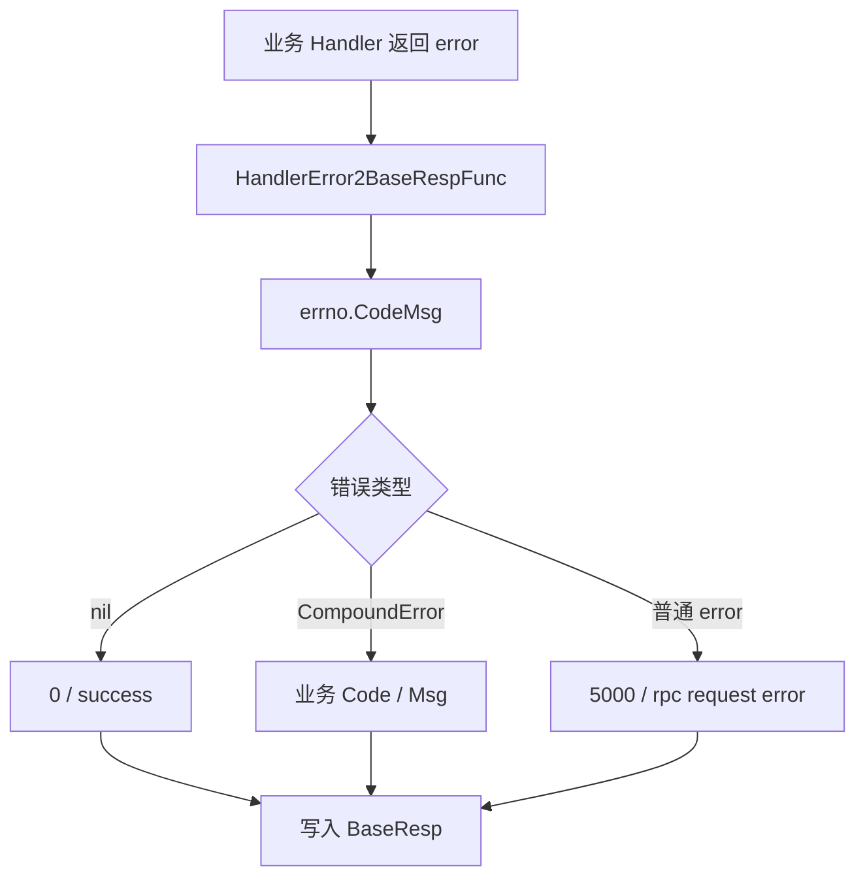

# Other — errno

## 模块概览

`errno` 模块定义 Compound 服务的轻量错误码模型，并提供业务错误到 `(code, msg)` 的转换函数。它主要服务于 Kitex/Byted 的业务错误响应链路：handler 返回 `error` 后，`util.HandlerError2BaseRespFunc` 调用 `errno.CodeMsg`，再由 `byted.WithBizHandlerError2BizCodeMsgFunc` 写入响应的业务码和消息。

模块源码位于 `errno/code.go`，当前没有复杂的内部依赖，核心是 `CompoundError`、`ParamEmpty`、`RPCErr` 和 `CodeMsg` 四个公开符号。

## 核心类型

```go
type CompoundError struct {
    Code int32
    Msg  string
}
```

`CompoundError` 是模块内的业务错误载体：

- `Code` 表示业务错误码。
- `Msg` 表示对外返回的错误信息。
- `CompoundError` 实现了 Go 标准 `error` 接口。

```go
func (e *CompoundError) Error() string {
    return fmt.Sprintf("CompoundError: code: %d, msg: %s", e.Code, e.Msg)
}
```

`Error()` 只负责生成调试友好的字符串，例如：

```text
CompoundError: code: 4000, msg: msg
```

注意：对外返回给客户端的业务消息不直接使用 `Error()` 的完整字符串。`CodeMsg` 识别到 `*CompoundError` 后，会返回其中的 `Code` 和 `Msg` 字段。

## 错误构造函数

### `ParamEmpty`

```go
func ParamEmpty(param string) *CompoundError
```

`ParamEmpty` 用于生成参数缺失或空值错误：

```go
return &CompoundError{
    Code: 4000,
    Msg:  param + " is missing or the value is empty",
}
```

示例：

```go
if req.UserID == "" {
    return errno.ParamEmpty("UserID")
}
```

最终通过 `CodeMsg` 转换后会得到：

```text
code = 4000
msg  = "UserID is missing or the value is empty"
```

当前模块中 `4000` 表示参数类业务错误，但代码里没有集中定义常量。如果后续错误码增多，建议先补充命名常量，避免散落魔法数字。

### `RPCErr`

```go
func RPCErr(err error) error
```

`RPCErr` 用于规范下游 RPC 调用错误：

- 如果传入的 `err == nil`，返回 `errors.New("rpc request error")`。
- 如果传入的 `err != nil`，原样返回该错误。

```go
func RPCErr(err error) error {
    if err == nil {
        return errors.New("rpc request error")
    }
    return err
}
```

这个函数适合在调用方只知道“RPC 请求失败”，但没有拿到具体错误对象时补一个通用错误。若已有下游错误，应保留原错误，避免丢失上下文。

## 错误转换函数

### `CodeMsg`

```go
func CodeMsg(err error) (int32, string)
```

`CodeMsg` 是本模块最关键的出口函数，负责把 Go `error` 转成服务响应所需的业务码和消息。

转换规则如下：

| 输入错误 | 返回 code | 返回 msg |
|---|---:|---|
| `nil` | `0` | `"success"` |
| 可通过 `errors.As` 匹配到 `*CompoundError` | `CompoundError.Code` | `CompoundError.Msg` |
| 其他普通错误 | `5000` | `"rpc request error: " + err.Error()` |

实现要点：

```go
func CodeMsg(err error) (int32, string) {
    if err == nil {
        return 0, "success"
    }

    var e *CompoundError
    if errors.As(err, &e) {
        return e.Code, e.Msg
    }

    return 5000, fmt.Sprintf("rpc request error: %s", err.Error())
}
```

这里使用 `errors.As`，因此即使 `*CompoundError` 被 `fmt.Errorf("...: %w", err)` 包装过，也可以被识别为业务错误。

示例：

```go
err := fmt.Errorf("校验失败: %w", errno.ParamEmpty("Name"))

code, msg := errno.CodeMsg(err)
// code == 4000
// msg  == "Name is missing or the value is empty"
```

普通错误会被归类为通用 RPC 错误：

```go
code, msg := errno.CodeMsg(fmt.Errorf("timeout"))
// code == 5000
// msg  == "rpc request error: timeout"
```

## 服务接入链路

`errno` 本身不直接依赖 Kitex。它通过 `util/biz_handler_err.go` 接入服务框架：

```go
var HandlerError2BaseRespFunc = func(
    ctx context.Context,
    bizHandlerErr error,
) (writeBase bool, code int32, msg string, extra map[string]string) {
    code, message := errno.CodeMsg(bizHandlerErr)
    return true, code, message, nil
}
```

`main.go` 中将该函数注册到服务：

```go
svr := compoundservice.NewServer(new(handler.CompoundServiceImpl),
    byted.WithBizHandlerError2BizCodeMsgFunc(util.HandlerError2BaseRespFunc),
    server.WithMiddleware(middleware.LogMidware[*base.BaseResp]("cpd")),
    server.WithMiddleware(middleware.DownstreamRateLimitMiddleware),
)
```

整体链路可以理解为：



因此，业务 handler 只需要返回合适的 `error`：

- 成功时返回 `nil`。
- 参数错误等可预期业务失败返回 `*errno.CompoundError`。
- 未分类错误返回普通 `error`，由 `CodeMsg` 统一映射为 `5000`。

## 测试覆盖

`errno/code_test.go` 覆盖了当前模块的主要行为：

- `TestRPCErr` 验证 `RPCErr(nil)` 返回通用 RPC 错误，`RPCErr(err)` 保留原错误。
- `TestParamEmpty` 验证参数空错误的 `Code` 和 `Msg`。
- `TestCodeMsg` 验证 `nil`、普通错误、`*CompoundError` 三类输入的转换结果。
- `TestCompoundError_Error` 验证 `CompoundError.Error()` 的格式。

测试使用 `mockey.PatchConvey` 和 `goconvey` 断言。当前测试没有覆盖 `errors.As` 识别被包装的 `*CompoundError` 的场景；如果后续代码大量使用 `%w` 包装业务错误，建议补充对应用例。