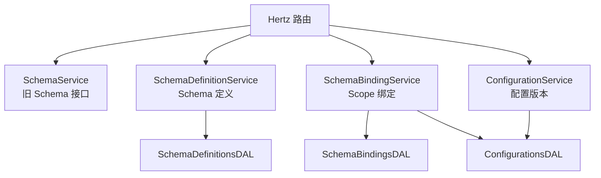

# Other — fuxi_admin

## fuxi_admin 模块

`fuxi/fuxi_admin` 是 Fuxi 的管理面服务，基于 Hertz 暴露 Schema 管理、Scope 绑定和配置版本管理接口。模块里并存两套入口：

- 旧 Schema 管理接口：围绕 `schema.Manager`、`AttrSchema`、`ProviderSetting`，路径如 `/schemas/:name`。
- 新 Scope 中心接口：围绕 `schema_definitions`、`schema_bindings`、`configurations`，路径统一在 `/admin/api/v1/*` 下。

## 启动与路由

服务入口在 `main.go`：

- `byted.Init()` 初始化运行时。
- `byted.Default()` 创建 Hertz 服务。
- 注册 `LogMiddleware()` 和 `FederationProxyMiddleware()`。
- `register(r)` 调用生成路由和 `customizedRegister(r)`。

`customizedRegister` 会初始化配置和数据库：

1. `configs.New(GetConfDir()).Init()` 读取配置。
2. `dal.NewDal(cfg).Init()` 初始化 GORM、gorm/gen 查询对象和可选表前缀。
3. `schema.NewDefaultManager(dal)` 创建旧接口使用的 `schema.Manager`。
4. 注册旧接口和新 `/admin/api/v1/*` 接口。

新接口路由：

| 路径 | Handler |
|---|---|
| `POST /admin/api/v1/create_one_schema_definition` | `SchemaDefinitionService.CreateSchemaDefinition` |
| `GET /admin/api/v1/get_one_schema_definition` | `SchemaDefinitionService.GetSchemaDefinitionByVersion` |
| `GET /admin/api/v1/list_schema_definitions` | `SchemaDefinitionService.ListSchemaDefinitions` |
| `POST /admin/api/v1/create_one_schema_binding` | `SchemaBindingService.CreateSchemaBinding` |
| `GET /admin/api/v1/get_one_schema_binding` | `SchemaBindingService.GetSchemaBindingByGroup` |
| `GET /admin/api/v1/list_schema_bindings` | `SchemaBindingService.ListSchemaBindings` |
| `POST /admin/api/v1/update_binding_configuration` | `ConfigurationService.UpdateBindingConfiguration` |
| `GET /admin/api/v1/get_one_configuration_history` | `ConfigurationService.GetConfigurationHistory` |

## API 响应模型

新 `/admin/api/v1/*` 接口统一返回 HTTP `200`，业务结果放在 `adminapi.BaseResponse` 或 `adminapi.DataResponse`：

- 成功：`StatusCodeSuccess = 0`，`StatusMessage = "OK"`。
- 参数错误：`StatusCodeInvalidRequest = 40001`。
- 内部错误：`StatusCodeInternalError = 50001`。
- 数据库错误：`StatusCodeDatabaseError = 50002`。

`adminapi.ErrorResponse(err)` 负责把 `errs.Err` 映射为业务状态码。普通 `error` 会被归类为内部错误。实现了 `adminapi.ErrorDetailsProvider` 的错误会把结构化详情透传到 `BaseResponse.Details`，例如 GSI 名称冲突会返回 `field_path`、`conflicting_name`、`conflicting_binding_id` 等字段。

旧 `SchemaService` 使用 `c.IndentedJSON(errs.StatusCode(err), errs.ToBaseResp(err))`，HTTP 状态码会随错误类型变化，和新接口不同。

## 核心数据类型

`adminapi.Configurations` 是配置管理的核心结构：

- `StoragePolicy`：支持 `tos`、`abase`、`oda`、`Bytedoc`。
- `BytedocConfig`：包含 `route_table_id`、`shard_key`、`indexes` 等。
- `AbaseConfig`：包含 `route_table_id`、`db_name`、`table_name`。
- `TosConfig`：包含 `storage.bucket` 以及缓存、锁、限额配置。
- `TTLConfig`：声明 TTL 字段、范围和秒级 TTL。
- `CDCEvent`：通过 `CDCEventPolicy.MainSource` 选择 `APPL_CDC` 或 `BYTEDOC_OPLOG`。
- `GSIIndexes`：声明全局二级索引，字段包括 `Name`、`Columns`、`IsUniq`、`BucketEnabled`、`Collection`。

`GroupType` 表示绑定作用域，支持 `space`、`account`、`@all`。当 `GroupTypeAll` 被使用时，handler 会把 `group_name` 规范化为 `"all"`。

## Schema 定义流程

`SchemaDefinitionService.CreateSchemaDefinition` 创建新 Schema 定义：

1. 读取 body 并反序列化为 `CreateSchemaDefinitionRequest`。
2. 从 `x-vpaas-operator-name` header 覆盖 `Author`。
3. 校验 `schema_name` 和 `schema_value` 非空。
4. 校验 `schema_value` 字符串首尾是 JSON 对象形式 `{...}`。
5. 用 `uuid.NewUUID()` 生成版本号。
6. 调用 `dal.SchemaDefinitions.Create` 写入 `schema_definitions`。

`GetSchemaDefinitionByVersion` 的查询优先级是：

1. 如果提供 `id`，调用 `SchemaDefinitionsDAL.GetByID`。
2. 否则如果提供 `schema_name` 且无 `version`，调用 `GetLatestByName`。
3. 否则使用 `schema_name + version` 调用 `GetByNameVersion`。

`ListSchemaDefinitions` 支持：

- `schema_name` 非空：走 `SearchByName`，使用 `LIKE "%keyword%"`。
- `schema_name` 为空：走 `List`。
- `only_latest=true`：调用 `filterLatestVersions`，按每个 `schema_name` 的最新 `CreatedAt` 保留一条，并按 `schema_name` 升序返回。

## Schema 绑定流程

`SchemaBindingService.CreateSchemaBinding` 同时创建绑定和初始配置：

1. 反序列化 `CreateSchemaBindingRequest`。
2. 从 `x-vpaas-operator-name` header 读取作者。
3. `validateCreateRequest` 校验 `group_type`、`group_name`、`schema_name`、`schema_version`、`configurations`。
4. 调用 `config.ValidateConfigurations` 校验配置内容。
5. 调用 `ensureConfiguredCollectionsUnique` 校验 GSI 全局约束。
6. 构造 `dalModel.SchemaBindings`。
7. 调用 `SchemaBindingsDAL.CreateWithConfig`，在事务内写入 `schema_bindings` 和首版 `configurations`。

查询绑定时，`GetSchemaBindingByGroup` 要求 `group_type`、`group_name`、`schema_name` 三个参数都存在。`ListSchemaBindings` 会根据过滤器选择不同 DAL 方法：

- 三个过滤器都有：`GetByGroup`。
- 只有 `schema_name`：`ListBySchema`。
- `group_type + group_name`：`ListByGroup`。
- 只有 `group_type`：`ListByGroupType`。
- 全空：`List`。

返回绑定响应时会调用 `getLatestConfigurationsForResponse`。如果 `ConfigurationsDAL.GetLatestByBinding` 返回 `dal.ConfigurationNotFoundError`，响应中的 `Configurations` 会降级为 `nil`，不会把整个查询视为失败。

## 配置版本流程

`ConfigurationService.UpdateBindingConfiguration` 更新已有 binding 的配置：

1. 读取并解析 `UpdateBindingConfigurationRequest`。
2. 从 `x-vpaas-operator-name` header 读取作者。
3. 校验 `ID`、`Configurations` 和 `Author`。
4. 调用 `config.ValidateConfigurations`。
5. 调用 `ensureConfiguredCollectionsUniqueForUpdate` 校验 GSI 约束。
6. 调用 `ConfigurationsDAL.UpdateWithCAS` 创建新版本记录。

`UpdateWithCAS` 当前实现是追加式版本管理：先读取最新版本，再插入 `Version = current.Version + 1` 的新记录。它不会覆盖旧配置，也没有显式更新已有行。

`GetConfigurationHistory` 通过 `id` 查询配置历史，调用 `ConfigurationsDAL.GetHistory`，按版本倒序返回 `ConfigurationHistoryItem` 列表。历史记录中如果某条 JSON 反序列化失败，DAL 会记录 warn 并跳过该条。

## 配置校验规则

`config.ValidateConfigurations` 是配置写入前的基础校验入口：

- `StoragePolicy` 必填且必须是已支持枚举。
- `Bytedoc` 必须提供 `BytedocConfig.RouteTableID` 和非空 `ShardKey`。
- `BytedocConfig.Indexes` 中唯一索引的 `Fields` 必须以 `ShardKey` 为前缀。
- `abase` 必须提供 `RouteTableID`、`DbName`、`TableName`。
- `tos` 必须提供 `TosConfig.Storage.Bucket`。
- `GSIIndexes` 中 `Name`、`Columns`、`Collection` 都不能为空。
- 单个 GSI 的 `Columns` 不允许空白或重复。
- `IsUniq` 和 `BucketEnabled` 互斥。
- 每个 GSI 最多允许一个包含 `*` 的通配列。
- 默认不允许唯一索引包含通配列，除非 TCC 开关 `AllowUniqueWildcardGSIKey` 被解析为 `true`。
- `TTLConfig` 中 `CreatedTimeAttr`、`TTLRange`、`TTLTime` 都必须有效。
- `CDCEvent.Policy.MainSource` 只能是 `APPL_CDC` 或 `BYTEDOC_OPLOG`。

## GSI 全局约束

GSI 的跨 binding 约束集中在 `collection_uniqueness.go`，这是配置写入路径中最重要的保护逻辑。

`ensurePendingGSINameSelfUnique` 保证同一个 pending 配置内 `GSIIndexConfig.Name` 去除首尾空白后不重复。

`ensurePendingGSINamesUniqueWithLoader` 会跳过当前 binding，再批量加载其他 binding 的最新配置，检查 pending GSI name 是否与已有 binding 冲突。冲突错误使用 `gsiNameConflictError`，并通过 `ErrorDetails()` 输出结构化详情。

`Collection` 允许共享，但必须保持 shape 一致：

- simple GSI：`BucketEnabled=false`。
- bucketed GSI：`BucketEnabled=true`。
- 同一个 `Collection` 不能同时被 simple 和 bucketed GSI 引用。
- 这个规则同时适用于同一个 pending 配置内部和跨 binding 场景。

更新配置时，`ensureConfiguredCollectionsUniqueWithBindings` 会先加载当前 binding 的最新配置，并通过 `isRawGSIIndexesModified` 比较 `GSIIndexes`。如果 GSI 列表未变化，就跳过跨 binding 唯一性校验，避免无关配置更新被已有历史状态阻塞。

## DAL 分层

`dal.Init` 使用 `bytedgorm.MySQL` 初始化数据库连接，并通过 `setupTablePrefix` 支持表前缀：

- 如果 `cfg.FuxiDB.TablePrefix` 非空，注册 `TablePrefixPlugin`。
- 再调用 `query.Use(db)` 创建 gorm/gen 查询对象。
- 最后调用 `q.ApplyTablePrefix(tablePrefix)` 让生成的 Query 元数据也带前缀。

新接口使用的 DAL：

- `SchemaDefinitionsDAL`：操作 `schema_definitions`，提供 `Create`、`GetByID`、`GetLatestByName`、`GetByNameVersion`、`SearchByName`、`List`。
- `SchemaBindingsDAL`：操作 `schema_bindings`，提供 `CreateWithConfig` 和按 scope/schema 的查询方法。
- `ConfigurationsDAL`：操作 `configurations`，把 `adminapi.Configurations` 序列化为 JSON 字符串保存，提供首版创建、最新配置、批量最新配置、历史版本和追加新版本。

旧接口使用 `Dal` 上的方法操作 `AttrSchema` 和 `ProviderSetting`，例如 `Create`、`QuerySchemaByName`、`EnableSchema`、`QueryAllSettings`。

## 旧 SchemaService

`SchemaService` 是基于 `schema.Manager` 的老接口封装：

- `CreateSchema`：读取路径参数 `name` 和请求体，调用 `manager.Create`。
- `QuerySchema`：按 `name` 和可选 `version` 调用 `manager.Query`。
- `EnableSchema` / `DisableSchema`：维护 provider 到 schema 的启用关系。
- `QuerySchemaByProvider`、`QueryAllSettings`、`QueryAllSchemas`：读取 provider setting 和 schema 列表。
- `GenerateCode`：调用 `manager.GenerateCodeFromSchema`，最终通过 `utils.ConvertJsonSchema2Struct` 生成 Go 结构体代码。
- `Validate`：把 body 解析为 `map[string]interface{}` 后调用 `manager.ValidateProperty`；`DefaultManager.ValidateProperty` 当前直接返回“不支持”的 `ErrInvalidRequest`。

`DefaultManager.Create` 会对 `schema.Schema` 执行 `Expand`、`SelfValidate`、`GenVersion`，再写入 `AttrSchema`。当前 `Expand` 只是把 `NativeSchema` 原样赋给 `FullSchema`，`SelfValidate` 会检查 JSON 合法性并反序列化为 `fuxi-schema-validator` 的 `Schema`。

## 维护注意事项

新接口的错误响应不要直接使用 HTTP 4xx/5xx；现有模式是 `c.JSON(errs.StatusCodeOK, adminapi.ErrorResponse(err))`。

配置写入必须同时保留两层校验：`config.ValidateConfigurations` 负责单个配置对象合法性，`ensureConfiguredCollectionsUnique*` 负责跨 binding 的 GSI 全局约束。

修改 GSI 规则时需要同时关注结构化错误详情。前端依赖 `BaseResponse.Details` 中的 `field_path` 和冲突信息定位表单字段。

修改配置历史逻辑时要保持追加式版本语义。`configurations` 表是版本记录表，`UpdateWithCAS` 创建新行而不是更新旧行。

涉及表名或环境隔离时优先走 `FuxiDB.TablePrefix`，不要在业务 SQL 中手写表前缀；现有机制在 `setupTablePrefix` 和 `query.ApplyTablePrefix` 中统一处理。