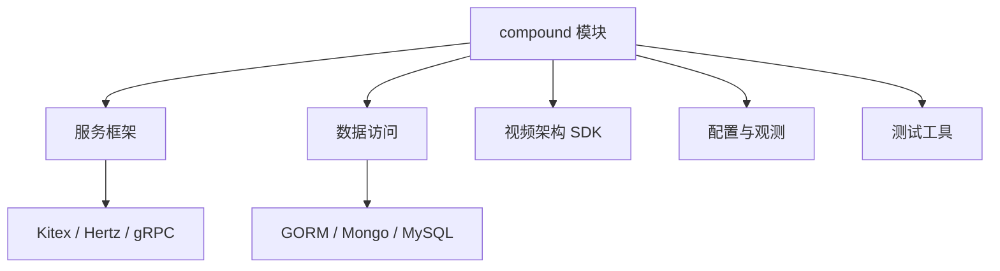

# Other — go.mod

## go.mod 模块说明

`go.mod` 定义了当前仓库的 Go 模块边界、语言版本、依赖版本和替换规则。它不是可执行代码模块，因此没有函数、类、内部调用或执行流；它的作用是在编译、测试、代码生成和依赖解析阶段为整个仓库提供统一的依赖图。

当前模块路径为：

```go
module code.byted.org/videoarch/compound
```

这意味着仓库内包会以 `code.byted.org/videoarch/compound/...` 的形式被其他包引用。

## Go 版本

```go
go 1.23.2
```

该版本会影响：

- 标准库 API 可用范围
- `go` 命令的模块解析行为
- `go test`、`go build`、`go mod tidy` 的兼容性
- 依赖模块的最低工具链预期

修改 Go 版本前，需要确认 CI、构建镜像、本地开发环境和代码生成工具链都已支持目标版本。

## 替换规则

本文件包含两个 `replace` 指令，用于覆盖默认依赖解析结果。

```go
replace github.com/apache/thrift => github.com/apache/thrift v0.13.0
```

虽然间接依赖中出现了 `github.com/apache/thrift v0.21.0`，实际解析时会被强制替换为 `v0.13.0`。这通常用于规避 Thrift 版本兼容问题，尤其是 Kitex、Overpass、IDL 生成代码或历史 RPC 依赖仍绑定旧版 Thrift 行为时。

```go
replace code.byted.org/videoarch/compound-go-sdk v0.0.0-20250526082633-932321153b5d => code.byted.org/videoarch/compound-go-sdk v1.0.1
```

该规则将指定伪版本的 `compound-go-sdk` 替换为正式版本 `v1.0.1`。如果代码生成结果或下游 SDK 仍引用旧伪版本，Go 模块解析会统一落到 `v1.0.1`。

维护这些替换规则时要谨慎：删除或升级 `replace` 可能改变整个依赖图，尤其是 RPC 编解码、生成代码兼容性和 SDK 类型定义。

## 依赖结构

`go.mod` 使用多个 `require` 块组织依赖。Go 对块的顺序没有语义要求，但当前文件可以大致看作三类：



### 服务框架依赖

核心服务框架包括：

- `code.byted.org/kite/kitex v1.19.3`
- `github.com/cloudwego/kitex v0.13.1`
- `code.byted.org/middleware/hertz v1.14.1`
- `github.com/cloudwego/hertz v0.10.2`
- `google.golang.org/grpc v1.66.2`

这些依赖说明仓库同时涉及 Kitex RPC、Hertz HTTP 服务以及 gRPC 相关能力。新增服务入口、RPC client/server、HTTP handler 或协议适配代码时，优先沿用仓库中已有框架版本，不要局部引入不兼容的大版本。

### 数据访问依赖

主要数据访问依赖包括：

- `code.byted.org/bytedoc/mongo-go-driver v1.1.6`
- `code.byted.org/gorm/bytedgorm v0.9.19`
- `gorm.io/gorm v1.25.11`
- `gorm.io/gen v0.3.26`
- `gorm.io/driver/mysql v1.5.1`
- `gorm.io/plugin/dbresolver v1.5.0`
- `vitess.io/vitess v0.21.0`

这部分支撑 MongoDB、MySQL、GORM ORM、读写分离和可能的 SQL 解析或分库分表相关逻辑。涉及模型、DAO、事务或数据库连接配置时，需要关注这些库的版本约束，尤其是 `gorm.io/gorm` 与 `gorm.io/gen`、`code.byted.org/gorm/bytedgorm` 之间的兼容性。

### 视频架构内部 SDK

直接依赖中包含多组 `code.byted.org/videoarch/...` 模块，例如：

- `code.byted.org/videoarch/account-sdk`
- `code.byted.org/videoarch/azeroth/v2`
- `code.byted.org/videoarch/caesar_config/v4`
- `code.byted.org/videoarch/fuxi-admin-sdk`
- `code.byted.org/videoarch/fuxi-schema-generator`
- `code.byted.org/videoarch/fuxi-schema-validator`
- `code.byted.org/videoarch/harden-sdk`
- `code.byted.org/videoarch/iamsdk`
- `code.byted.org/videoarch/prodia-sdk-go`
- `code.byted.org/videoarch/storagegw-go`
- `code.byted.org/videoarch/terminator-sdk-go`
- `code.byted.org/videoarch/vvid`

这些模块构成 Compound 与视频架构平台能力之间的主要连接点，覆盖账号、鉴权、配置、Schema、存储、数据处理、任务治理等方向。升级这类依赖时，除了编译通过，还需要重点检查生成代码、请求/响应结构体、枚举值、错误码和配置项是否发生行为变化。

### 配置、日志、监控与链路追踪

相关依赖包括：

- `code.byted.org/gopkg/env`
- `code.byted.org/videoarch/env`
- `code.byted.org/gopkg/tccclient`
- `code.byted.org/gopkg/logs`
- `code.byted.org/gopkg/logs/v2`
- `code.byted.org/gopkg/metainfo`
- `code.byted.org/gopkg/metrics/v3`
- `code.byted.org/gopkg/metrics/v4`
- `code.byted.org/bytedtrace/...`
- `code.byted.org/lidar/profiler/...`

这类依赖通常贯穿服务启动、请求上下文、日志字段、运行环境识别、TCC 配置读取、指标上报和链路追踪。修改它们可能影响所有入口流量的观测能力，应避免只在局部代码中升级版本而不验证全局行为。

### 消息、存储和外部系统

重要依赖包括：

- `code.byted.org/rocketmq/rocketmq-go-proxy`
- `code.byted.org/gopkg/tos`
- `github.com/volcengine/ve-tos-golang-sdk/v2`
- `code.byted.org/ti/bytecdn_sdk`
- `code.byted.org/videoarch/bktmeta-sdk-go`
- `code.byted.org/videoarch/thalassa-sdk-golang`
- `code.byted.org/videoarch/vfastcache`
- `code.byted.org/videoarch/ttlcache`

这些依赖说明仓库会连接消息队列、对象存储、CDN、缓存和内部元数据服务。相关调用通常会出现在异步任务、资源处理、上传下载、数据同步或缓存加速路径中。

### 测试依赖

测试相关依赖包括：

- `github.com/agiledragon/gomonkey/v2`
- `github.com/bytedance/mockey`
- `github.com/smartystreets/goconvey`
- `github.com/stretchr/testify`
- `github.com/facebookgo/ensure`
- `code.byted.org/gopkg/mockito`

这些库支持 monkey patch、mock、断言和 BDD 风格测试。新增测试时应优先沿用同目录已有风格，避免在同一包中混用过多断言体系。

## 直接依赖与间接依赖

没有 `// indirect` 标记的依赖通常被当前模块源码直接 import，或者被显式保留用于工具、生成代码或运行时约束。

带 `// indirect` 的依赖由直接依赖传递引入，或由 Go 模块解析保留。它们不一定能安全删除，因为：

- 某些生成代码会隐式依赖特定版本
- `replace` 可能依赖间接模块参与版本选择
- Kitex、Hertz、GORM、追踪和安全 SDK 会引入大量传递依赖
- `go mod tidy` 的结果取决于当前源码、测试文件和构建标签

清理依赖前应运行完整的 `go mod tidy`、编译和测试流程，并检查 `go.mod` 与 `go.sum` 的差异是否符合预期。

## 与代码库其他部分的关系

`go.mod` 是整个仓库的依赖入口，所有包的 import 解析都会受到它影响。它连接的主要代码区域通常包括：

- 服务入口：依赖 Kitex、Hertz、环境识别、日志和监控库
- RPC client/server：依赖 Kitex、Overpass、Thrift、生成代码和链路追踪
- DAO 和模型层：依赖 GORM、Mongo driver、MySQL driver、Vitess 相关能力
- 配置层：依赖 TCC、环境 SDK、视频架构配置 SDK
- 任务和异步处理：依赖 RocketMQ、缓存、重试和对象存储
- 单元测试：依赖 mock、patch 和断言框架

由于 `go.mod` 位于模块根目录，任何依赖变更都可能影响全仓构建结果。升级共享底座类依赖时，优先选择小步升级，并结合编译、测试和关键路径回归验证。

## 维护建议

修改依赖时遵循以下原则：

1. 只升级当前变更真正需要的模块，避免顺手大范围刷新依赖图。
2. 对 `replace` 指令保持显式说明意识，尤其是 `github.com/apache/thrift` 和 `compound-go-sdk`。
3. 对 Kitex、Hertz、GORM、gRPC、Thrift、Protobuf 这类基础依赖，升级后检查生成代码兼容性。
4. 对视频架构内部 SDK，升级后检查结构体字段、枚举、错误码和默认行为变化。
5. 提交前确认 `go.mod` 与 `go.sum` 一起保持一致，不提交无法解释的依赖漂移。

常用检查命令：

```bash
go mod tidy
go test ./...
go mod graph
go list -m all
```

如果只是查看某个依赖为何存在，可以使用：

```bash
go mod why <module-path>
```

例如：

```bash
go mod why github.com/apache/thrift
```

这有助于判断依赖是源码直接使用、测试引入，还是由框架或生成代码传递引入。