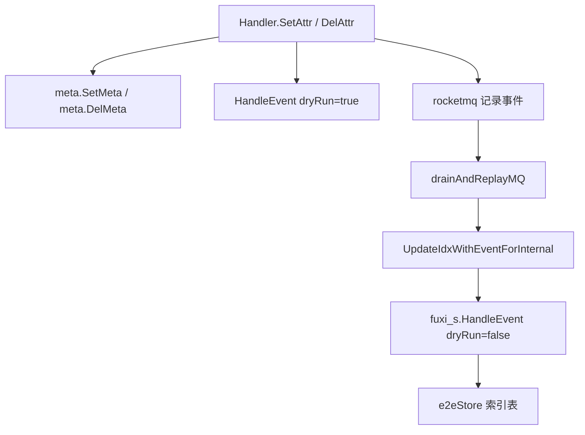

# Other — handler

## 模块定位

`handler` 模块是 `CompoundServiceImpl` 的 RPC 入口层，负责把 Kitex 请求转换为 service 层调用，并统一返回 `BaseResp`。本组代码主要覆盖索引相关入口、修复入口，以及从 `SetAttr`/`DelAttr`/`Del` 到主表与索引表的端到端行为。

核心入口包括：

- `UpdateIdxWithEventForInternal`
- `RefreshIdxForInternal`
- `RepairIdxEntryForInternal`
- `RepairIdxBucketForInternal`
- `SetAttr`
- `DelAttr`
- `Del`
- `Query`

## 索引事件入口

`UpdateIdxWithEventForInternal` 接收 `compound.UpdateIdxWithEventReq`，从 `TrimmedEvent` 取出 `compound.Event`，再调用：

```go
fuxi_s.HandleEvent(ctx, event, false)
```

这里的 `dryRun=false` 表示真实写入索引。测试确认了几个行为：

- `TrimmedEvent == nil` 返回 `InvalidParam`，状态码 `1001001`
- `fuxi_s.HandleEvent` 返回错误时，handler 不返回 Go error，而是在 `BaseResp` 中返回 `InternalError`，状态码 `1001002`
- 成功时状态码为 `0`
- 空事件也会继续调用 `HandleEvent`
- `nil req` 会 panic，因为 Kitex getter 对 nil request 不是 nil-safe

该入口是 GSI 消费者回放事件时使用的主要入口。非唯一索引在 `SetAttr`/`DelAttr` 写路径中通常先做 `dryRun=true` 校验，真正写入由 MQ 事件回放到 `UpdateIdxWithEventForInternal` 完成。

## 索引刷新入口

`RefreshIdxForInternal` 接收 `compound.RefreshIdxReq`，校验 `Space`、`Schema`、`ID` 后调用：

```go
fuxi_s.Refresh(ctx, space, schema, id)
```

行为约定：

- `Space`、`Schema`、`ID` 任一为空，返回 `InvalidParam`，状态码 `1002001`
- `fuxi_s.Refresh` 失败时返回 `InternalError`，状态码 `1002002`
- 成功时状态码为 `0`
- 参数会原样透传到 `fuxi_s.Refresh`
- `nil req` 会 panic

E2E 中 `RefreshIdxForInternal` 会通过 mock 的 `fuxi_s.Query` 回源主表，再重建索引。重复刷新应保持幂等：simple 行级索引模型下不会产生重复文档，`val._id` 仍指向同一个对象 ID。

## 修复入口

`RepairIdxEntryForInternal` 和 `RepairIdxBucketForInternal` 是索引修复能力的 handler 包装层。它们只做参数校验、调用 service、透传计数和结果，不在 handler 层重复 service 内部决策。

`RepairIdxEntryForInternal` 调用：

```go
fuxi_s.RepairIdxEntry(ctx, req)
```

校验规则：

- `Space` 不能为空
- `Schema` 不能为空
- `Items` 不能为空
- `len(Items) <= 100`
- 参数非法返回 `1003001`

返回字段会透传 service 的结果：

- `Results`
- `Added`
- `Removed`
- `Skipped`
- `Failed`

`RepairIdxBucketForInternal` 调用：

```go
fuxi_s.RepairIdxBucket(ctx, req)
```

校验规则：

- `Space` 不能为空
- `Collection` 不能为空
- `BucketIDs` 不能为空
- `len(BucketIDs) <= 200`
- 参数非法返回 `1004001`

返回字段会透传：

- `Results`
- `Deleted`
- `Skipped`
- `Failed`

两个入口的 `nil req` 都会 panic，原因同样是 Kitex getter 不是 nil-safe。

## Handler E2E 测试基础设施

测试使用两套内存存储模拟真实链路：

- `e2eStore`：索引表内存 mock，来自 `docopstest.New()`
- `mainStore`：主表内存 mock，由 `mainE2EStore` 实现

`setupE2E` 会重置 `e2eStore`，并用 `gomonkey` patch `doc` 包访问：

```go
doc.RawUpdate
doc.TryInsert
doc.FindOne
doc.FindWithLimit
doc.DeleteMany
doc.BulkWrite
doc.FindOneAndUpdate
```

同时会执行：

```go
idx.SetGoTryMerge(idx.SyncMergeHook)
entity.GlobalRetryLimiter = &entity.RetryLimiter{}
```

这两个设置很关键：

- `idx.SyncMergeHook` 让删除后触发的 bucket merge 同步执行，测试可以稳定观察合并结果
- 重置 `GlobalRetryLimiter` 避免测试之间相互污染

`setupSetAttrE2E` 在此基础上继续模拟主表、注册属性、存储配置和 MQ：

- `admin.GetRegAttrMap`
- `admin.GetAdminAttrIndex`
- `admin.GetStorage`
- `admin.GetDelFile`
- `rocketmq.Mock`
- `fuxi_s.QueryWithFuxiAttr`
- `meta.SetMeta`
- `meta.DelMeta`
- `meta.DelID`

`newSetAttrE2EFixture` 是 SetAttr E2E 的统一入口，它会安装 mock、注入 `admin.GetIdxCfg`，并返回带 `cctx.WithContainer` 的 context。这个 context 必须保留同一个 container 指针，否则 `service.SetAttr` 回填的 `Space`/`Schema` 无法被后续 MQ 事件看到。

## 主表与索引表执行链路

非唯一索引的完整链路是异步事件模型，测试中通过 `drainAndReplayMQ` 显式回放：



唯一索引不同，`service.SetAttr`、`DelAttr`、`Del` 会同步调用：

- `fuxi_s.HandleUniqIdx`
- `fuxi_s.HandleUniqIdxForDel`
- `fuxi_s.HandleIdxCleanupForDel`

因此唯一索引在 handler 调用返回前已经完成占位、冲突检测或清理。

## 覆盖的关键行为

索引事件入口覆盖：

- Created 事件写入索引
- Updated 事件清理旧 key 并写入新 key
- Deleted 事件清理索引
- Create → Update → Delete 生命周期
- 多对象同 key 查询
- 复合索引部分列更新时通过 `fuxi_s.Query` 补查缺失列
- bucketed 模式的 Create → Update → Delete
- `Query` 不传 `Space` 时走跨 space 索引查询

SetAttr/DelAttr/Del E2E 覆盖：

- 非唯一索引 create/update/delete 属性/delete 对象
- 唯一索引 create、改键、冲突、删除属性、删除对象
- 唯一索引和非唯一索引混合配置
- `Where.Filter` 乐观锁
- 分片键禁止修改和禁止删除
- `Del`/`DelAttr` 携带分片键 filter 的精确路由
- `WriteMode_InsertOnly` 成功插入、已存在返回 `AlreadyExists`、默认 Upsert 回归

## 分桶模式注意事项

bucketed 索引对版本值有严格要求：版本必须满足桶区间路由条件。测试使用 `testVer` 构造合法 V1 HLC 值，避免普通小整数落在 `VerBoundaryMin` 之外导致查桶失败。

分桶结构级测试 `TestE2E_SetAttr_BucketMode_TriggerSplit` 会写入 `entity.BucketSize + 50` 条记录，触发真实 `splitActiveBucket` 路径，并直接读取 `e2eStore.Collections` 验证：

- 恰好一个活跃桶
- 封口桶和活跃桶版本区间连续
- `Cnt` 与 distinct oid 数量守恒
- 所有 oid 都可通过 `QueryByIndex` 查回

辅助函数 `readBucketsByKey` 会把底层 BSON 文档反序列化为 `entity.Bucket`，`assertBucketChainInvariants` 负责校验桶链不变式。

## 查询相关行为

`e2eQueryOidsAt` 使用：

```go
idx.GetOperator(entity.IdxCfg{BucketEnabled: bk}).QueryByIndex(...)
```

用于指定 `space` 的索引查询。

`e2eQueryOidsCrossSpace` 使用：

```go
idx.GetOperator(entity.IdxCfg{BucketEnabled: bk}).QueryEntriesCrossSpace(...)
```

用于不指定 `space` 的跨 space 查询。

`TestE2E_Handler_Query_CrossSpace_NoSpaceFilter` 验证了 handler `Query` 在不传 `Space` 时，可以通过跨 space 索引查出多个 space 的对象，再通过 mock 的 `metasvc.GetMetaByIdsFromIdx` 回表拼装响应。

如果 filter 无法命中任何索引，`Query` 应返回非 0 状态码，并在错误信息中包含 `no matching index`。

## 维护建议

新增 handler 层索引逻辑时，应根据链路选择测试层级：

- 只验证参数校验和返回码：mock service 层函数即可
- 验证事件到索引表：使用 `setupE2E`
- 验证 `SetAttr`/`DelAttr`/`Del` 到主表和索引表：使用 `newSetAttrE2EFixture`
- 验证非唯一索引写入：记得调用 `drainAndReplayMQ`
- 验证 bucketed 行为：使用 `testVer` 构造版本，并将查询辅助函数的 `bucketed` 参数设为 `true`

对 `nil req` 的行为不要误改为返回错误；当前测试明确约束这些入口会 panic。