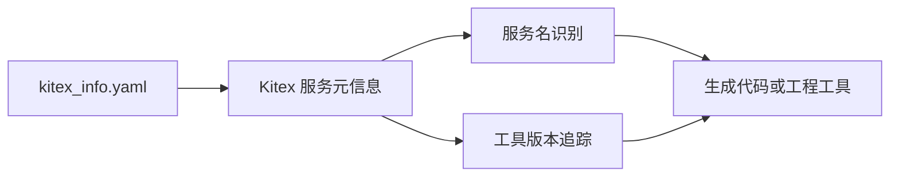

# Other — kitex_info.yaml

## 模块概览

`kitex_info.yaml` 是 Kitex 服务元信息文件，用于记录当前仓库对应的 Kitex 服务名称和生成工具版本。它不包含业务逻辑，也不会在运行时形成函数调用关系；它的价值在于为代码生成、服务识别和工程工具链提供稳定的元数据。

```yaml
kitexinfo:
  ServiceName: 'bytedance.videoarch.compound'
  ToolVersion: 'v1.13.3'
```

## 配置结构

### `kitexinfo`

顶层配置节点，承载 Kitex 相关元信息。

### `ServiceName`

```yaml
ServiceName: 'bytedance.videoarch.compound'
```

表示该模块所属的 Kitex 服务名。当前值为 `bytedance.videoarch.compound`。

开发者在排查服务注册、生成代码归属、IDL 生成产物或内部工具识别问题时，可以把这个字段作为当前仓库的服务身份来源之一。

### `ToolVersion`

```yaml
ToolVersion: 'v1.13.3'
```

表示生成或维护当前 Kitex 相关代码时使用的 Kitex 工具版本。当前值为 `v1.13.3`。

该字段通常用于判断生成产物和 Kitex 工具链版本是否一致。升级 Kitex 工具或重新生成代码时，需要关注该值是否随工具版本变化而更新。

## 执行行为

该文件没有可执行代码：

- 没有函数、类或方法定义
- 没有内部调用
- 没有外部调用
- 没有被调用关系
- 没有检测到执行流

因此，修改 `kitex_info.yaml` 不会直接改变运行时业务逻辑。但它可能影响依赖 Kitex 元信息的生成流程、服务识别流程或工程检查流程。

## 与代码库的关系

`kitex_info.yaml` 是代码库中的配置型模块，主要服务于 Kitex 工具链，而不是服务运行时路径。它与业务代码之间通常是“元数据支撑”关系：



这张图表达的是配置角色，而不是函数调用关系。根据当前调用图，该模块本身没有代码级调用边。

## 修改注意事项

修改 `ServiceName` 前需要确认服务身份是否确实发生变化。该字段通常应与仓库、IDL、服务注册配置和内部平台上的服务名保持一致。

修改 `ToolVersion` 前需要确认是否真的完成了 Kitex 工具升级或重新生成流程。单独改版本号不会升级生成代码，也不能保证生成产物兼容新版本工具。

如果只是修改业务逻辑，通常不需要改动该文件。只有在服务名迁移、Kitex 生成工具升级、重新生成 Kitex 相关产物，或修复工程元信息不一致时，才应考虑更新。