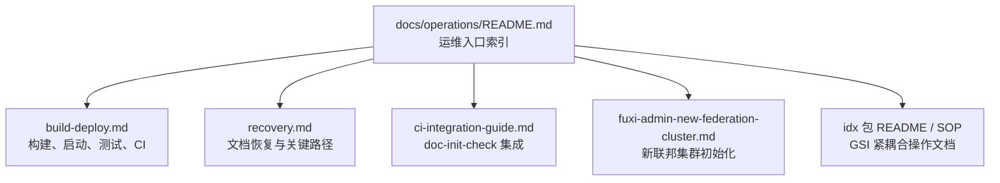

# Other — operations

## 运维模块

`docs/operations/` 是 Compound 的运维知识入口，面向构建、部署、恢复、CI 文档检查、包级 SOP 索引和新联邦集群初始化。该目录本身不包含运行时代码，因此没有内部调用图、外部调用或执行流；它通过引用真实脚本、配置文件和紧耦合代码路径，把“如何构建、启动、验证、恢复和初始化环境”的操作事实固定下来。



## 目录职责

`docs/operations/README.md` 是总入口，负责把长期有效的 SOP 和恢复材料索引到一个稳定位置。它明确区分两类内容：

- `idx` 包内的紧耦合 SOP：保留在代码包附近，例如 `fuxi/core/service/idx/README.md`、`fuxi/core/service/idx/archive/docs/compound-ops/`、`fuxi/core/service/idx/reconcile/README.md`。
- 项目级运维文档：保留在 `docs/operations/`，例如构建部署、恢复指南、CI 集成、新联邦集群初始化。

`idx` 包文档被单独列为高优先级运维入口，因为它们满足“就近留存判据”：被 godoc 注释引用、包含代码内部不变式，或提供与实现强绑定的可执行示例。涉及 `idx` 包变更时，还需要遵守 `CLAUDE.md` 中的专项约束：文档代码一致、影响面分析、显式 review 放行。

## 构建与部署

`build-deploy.md` 描述 Compound 从源码到运行实例的交付链路，核心入口是 `build.sh`、`script/bootstrap.sh`、`.codebase/pipelines/ci.yaml`、`.codebase/apps.yaml` 和 `script/run_remote_ut.sh`。

`build.sh` 负责生成 `output/` 目录，并根据环境变量选择构建方式：

```bash
if [ "$SCM_SOURCE" != "" ]; then
    svc_inline merge -c service_inline_config.yaml
    svc_inline build -o output/bin/bytedance.videoarch.compound
elif [ "$IS_SYSTEM_TEST_ENV" = "1" ]; then
    go test -c -covermode=count -coverpkg=./... \
        -o output/bin/bytedance.videoarch.compound
else
    go build -o output/bin/bytedance.videoarch.compound .
fi
```

产物布局固定为：

```text
output/
├── bin/bytedance.videoarch.compound
├── conf/
├── bootstrap.sh
└── run_remote_ut.sh
```

`script/bootstrap.sh` 是运行入口。它设置 `KITEX_RUNTIME_ROOT`、`KITEX_CONF_DIR`、`KITEX_LOG_DIR` 和 `PSM`，创建 `log/app`、`log/rpc` 后执行：

```bash
exec $RUNTIME_ROOT/bin/bytedance.videoarch.compound
```

Kitex 代码生成使用 `idl/compound.thrift`，服务名为 `bytedance.videoarch.compound`，模块名为 `code.byted.org/videoarch/compound`。生成产物位于 `kitex_gen/`，其中包括 RPC client、server、invoker 和 Thrift 数据结构。

CI 配置由 `.codebase/pipelines/ci.yaml` 驱动，覆盖率门禁由 `.codebase/apps.yaml` 约束：项目覆盖率降幅最多 1%，增量代码覆盖率最低 70%。文档中特别强调，本项目测试口径以远程 UT 和 CI 为准，本地 `go test ./...` 不是最终通过标准。

## 文档检查与 CI 集成

`ci-integration-guide.md` 描述 `script/doc-init-check.sh` 的接入方式。当前默认路径是本地 pre-commit hook：

```bash
bash script/install-doc-init-hook.sh
```

该命令会配置 `.githooks/pre-commit`，提交前自动运行：

```bash
bash script/doc-init-check.sh
```

`doc-init-check.sh` 的退出码语义如下：

| 退出码 | 含义 | 建议行为 |
|---|---|---|
| `0` | 全部通过 | 继续 |
| `1` | 仅有 WARN | 提示但不阻塞 |
| `2` | 存在 ERR | 阻塞提交或 CI |

CI 集成文档给出三种方案：沿用 pre-commit、把检查注入构建或测试脚本、单独创建 lint pipeline。由于 `.codebase/pipelines/ci.yaml` 使用模板化 `template: go`，文档建议由 SRE / 平台组按实际模板能力选择接入点，避免破坏现有流水线兼容性。

## 包 README 清理规则

`cleanup-package-readmes.md` 记录历史模板 README 的清理策略。历史脚本 `script/gen_dir_docs.py` 曾批量生成带有 `<!-- compound-dir-doc -->` 标记的包级 README，其中大部分没有外部使用方，也不包含紧耦合不变式。

保留 README 的条件只有三类：

- 被 godoc 注释通过相对路径引用。
- 描述代码内部不变式，代码变更必须同步更新。
- 包含与代码强绑定的可执行示例，例如命令参数或配置 key。

明确保留的 README 包括 `fuxi/core/service/idx/README.md`、`fuxi/core/service/idx/reconcile/README.md`、`fuxi/core/service/idx/reconcile/offline/README.md` 以及 `idx/archive/docs/` 下的复合操作 SOP 索引。其他模板 README 应在自然 PR 中逐步删除。

## 新联邦集群初始化 SOP

`fuxi-admin-new-federation-cluster.md` 是面向线上 Fuxi 新联邦集群的初始化手册，覆盖 `fuxi_admin`、`object_data_access` 和 `compound` 的创建顺序、TCC 配置、RDS DDL、TCE 依赖和常见失败模式。

关键顺序是：

```text
确认集群名和区域
→ 创建 TCC 目录
→ 发布 Admin / ODA / Compound 初始化配置
→ 准备 Admin RDS 表
→ 预留 TCE quota
→ 部署 Admin
→ 部署 ODA
→ 部署 Compound
→ 验证启动状态
```

该 SOP 强调 `registered_feds` 是联邦集群清单的权威来源，位于 `fuxi_admin` 的 TCC `/default/registered_feds`。不要通过 ODA 或 Compound 的 confspace 目录反推集群列表。

Compound 初始化依赖以下关键配置：

| 配置 | 作用 |
|---|---|
| `federal` | 当前 federation 标识，例如 `video_arch` |
| `storage_cfg` | 存储路由，默认通常为 `oda` |
| `shield_info` | Shield 规则，空规则可用 `{}` |
| `terminator_ak` / `terminator_sk` | Terminator 存储路径凭证 |
| `event` | RocketMQ event producer 配置 |

`event` 是高风险配置。只要 TCC 中存在该 key，`compound/rocketmq/event.go` 就会在包初始化阶段初始化 RocketMQ producer；错误配置可能导致服务监听端口前 panic。初始化阶段如果 MQ 和 TOS 资源没有验证，应避免创建该 key。

## 恢复与关键路径

`recovery.md` 是文档工作和代码理解的恢复入口。它记录旧版 `docs/comprehensive/` 到当前分类目录的迁移映射，并提供关键路径速查。

核心运行时代码入口包括：

| 功能 | 路径 |
|---|---|
| RPC 入口 | `main.go` |
| Handler 层 | `handler/handler.go` |
| 核心 CRUD | `fuxi/core/service/service.go` |
| TTL 处理 | `fuxi/core/service/ttl.go` |
| VideoDelete 检查 | `fuxi/core/service/checker.go` |
| MetaStorage 接口 | `fuxi/core/iface/iface.go` |
| 元数据封装 | `fuxi/core/service/meta/meta.go` |
| 事件发布 | `rocketmq/event.go` |
| 动态配置 key | `fuxi/core/config/keys.go` |

Admin 相关入口包括 `fuxi/fuxi_admin/main.go`、`router.go`、`biz/handler/*Handler.go` 和 `dal/*_dal.go`。外部客户端入口包括 `fuxi/client/admin/admin.go`、`fuxi/client/oda/oda.go`、`fuxi/client/vda/video_data_access.go` 等。

这份恢复文档不是运行时规范，而是维护者在会话中断、目录迁移、代码变更或新成员接手时的定位工具。新增 API、存储逻辑、业务流程、Schema 管理、配置、构建流程或 GSI 行为时，应按文档中的维护表同步更新对应文档。

## 与代码库的连接方式

运维模块通过路径引用连接代码和平台配置，不参与编译，也不导出函数或类。它的准确性依赖以下事实源：

- 构建事实来自 `build.sh`、`script/bootstrap.sh`、`kitex_info.yaml`。
- CI 和覆盖率事实来自 `.codebase/pipelines/ci.yaml`、`.codebase/apps.yaml`。
- 远程 UT 策略来自 `script/run_remote_ut.sh` 和项目级协作规则。
- 文档检查事实来自 `script/doc-init-check.sh`、`.githooks/pre-commit`、`script/install-doc-init-hook.sh`。
- 新联邦初始化事实来自 `fuxi_admin`、ODA、Compound 的 TCC key、RDS 表结构和 TCE 部署依赖。
- GSI 运维事实来自 `fuxi/core/service/idx/` 下的 README、复合操作 SOP、不变式文档和 reconcile 文档。

因此，修改构建脚本、启动参数、CI 模板、TCC key、Admin 表结构、ODA 集群映射、Compound event 初始化或 `idx` 包复合操作时，都需要检查 `docs/operations/` 是否仍然准确。