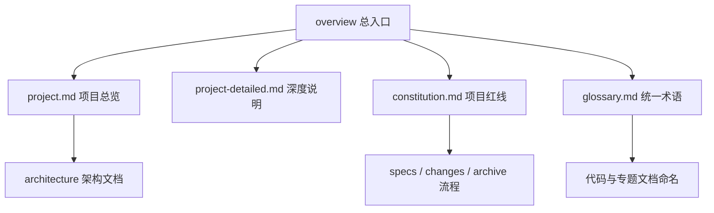

# Other — overview

## Other — overview 模块

`docs/overview/` 是 Compound 文档体系的项目级入口层，用来回答“这个仓库是什么、有哪些边界、哪些规则不能破、术语如何统一”。它不是运行时代码模块，因此没有内部调用、外部调用或执行流；它的作用是约束和导航代码贡献，而不是参与服务请求处理。

该模块由四类文档组成：

| 文件 | 职责 |
|---|---|
| `project.md` | 项目总览：Compound 定位、双服务组成、技术栈、模块清单、关键不变式 |
| `project-detailed.md` | 深度项目说明：服务入口、目录结构、核心概念、外部依赖 |
| `constitution.md` | 项目宪法：治理原则、红线、审批规则、扩展制品 |
| `glossary.md` | 术语表：业务术语、GSI 术语、技术术语、错误码、外部服务、缩略语 |

## 模块定位

`docs/overview/` 位于文档体系的最上层，负责建立全仓库共享上下文。开发者进入 Compound 时，应先通过这里理解：

1. Compound 是 VideoArch 的通用元数据管理服务。
2. 仓库由 RPC 主服务和 Admin HTTP 服务组成。
3. 元数据读写围绕 `MetaStorage` 抽象、Schema 绑定、版本冲突、事件发布和文件生命周期展开。
4. `fuxi/core/service/idx/` 是高风险 GSI 索引包，修改前有显式 Review 和文档同步要求。
5. Living spec、archive、ADR、远程 UT 等流程有项目级约束。

## 文档之间的关系

`project.md` 给出快速入口，适合贡献前建立全局视图；`project-detailed.md` 适合第一次深入阅读仓库结构；`constitution.md` 是修改代码和文档时必须遵守的项目规则；`glossary.md` 保证文档、代码注释、评审讨论使用同一套词汇。

## 与代码库的连接

`project.md` 和 `project-detailed.md` 将文档入口映射到实际代码路径：

- RPC 主服务入口是 `main.go`，服务名为 `bytedance.videoarch.compound`，使用 Kitex 和 Thrift。
- Admin HTTP 服务入口是 `fuxi/fuxi_admin/main.go`，服务名为 `bytedance.videoarch.fuxi_admin`，使用 Hertz。
- RPC 请求处理层在 `handler/`，核心实现由 `CompoundServiceImpl` 承接。
- 业务编排层在 `fuxi/core/service/`，覆盖 CRUD、TTL、索引更新等流程。
- 元数据存储抽象在 `fuxi/core/iface/`，核心接口是 `MetaStorage`。
- 存储语义层在 `fuxi/core/service/meta/`。
- GSI 索引引擎在 `fuxi/core/service/idx/`，受 `constitution.md` 的 idx 专项红线约束。
- 文件操作在 `fuxi/core/storage/`，对接 Terminator 和 StorageGW。
- 事件发布在 `rocketmq/`，超大事件使用 TOS spillover 模式。
- 外部依赖客户端集中在 `fuxi/client/`，包括 `admin`、`oda`、`vda`、`abase`、`postpone`、`video_delete` 等。

这些路径不是单纯目录说明，而是开发者判断影响面的入口。例如修改 `MetaStorage` 语义时，需要同时检查 `UpdateWrapper`、`QueryFilter`、版本冲突文档以及各存储实现；修改 `idx` 复合操作时，还必须同步对应 `archive/docs/compound-ops/<op>.md`。

## 项目级不变式

`constitution.md` 定义了贡献时必须维护的不变式：

- Living spec 是行为契约真理来源，路径为 `docs/specs/<capability>/spec.md`。
- Requirement 必须使用 EARS 句式，Scenario 必须挂覆盖测试路径。
- 涉及 `fuxi/core/service/idx/` 的逻辑变更必须先文档后代码。
- `docs/archive/` 归档后不可修改，只能通过新增补丁文件补充。
- 业务逻辑变更必须优先跑远程 UT：`bash script/run_remote_ut.sh` 或其子集。
- ADR 编号必须严格递增，不跳号、不复用。
- `docs/` 顶层不允许散落普通 `.md`，README 和 AGENTS 除外。

其中最容易影响日常开发的是 idx 包红线：修改 `fuxi/core/service/idx/` 下任何 `.go` 文件前，需要向用户呈现变更摘要、影响面、风险、文档清单和实现路径，并获得明确放行。纯测试改写、函数签名不变的 import 调整、typo 修复，以及用户明确授权跳过时才可豁免。

## 术语约定

`glossary.md` 是跨代码和文档的命名基准。贡献文档或注释时，应优先使用其中已有术语：

- 业务对象使用 `Space`、`Account`、`Object`、`OID`、`VID`。
- Schema 相关内容使用 `Schema`、TTL 属性、FILE 属性。
- GSI 相关内容使用 `Idx`、`Idx Snapshot`、`Bucket`、`Active Bucket`、`Sealed Bucket`、`Compound Op`、`Reconcile Task`。
- 存储抽象使用 `MetaStorage`、`UpdateWrapper`、`QueryFilter`。
- 并发错误使用 `iface.WrongVersion`、`iface.ErrTxnConflict`、`iface.ErrConsistentTxnFailed`。
- 删除链路中的早退标志使用 `executed`。

如果引入新概念，应先在 `glossary.md` 注册，再在专题文档或代码注释中展开，避免同一概念出现多个命名。

## 阅读路径

新开发者建议按以下顺序阅读：

1. `docs/overview/project.md`：建立项目定位、服务组成和模块清单。
2. `docs/overview/glossary.md`：熟悉核心术语，尤其是 Object、Schema、MetaStorage、Idx、Bucket。
3. `docs/overview/constitution.md`：理解红线和审批规则。
4. `docs/architecture/README.md`：进入架构专题。
5. `docs/specs/`：查看具体 capability 的 living spec。
6. 涉及 idx 包时，再阅读 `docs/architecture/modules/gsi.md` 和 `fuxi/core/service/idx/archive/docs/compound-ops/` 下对应操作文档。

## 维护要求

更新 `docs/overview/` 时，应保证它仍然只承担“入口、约束、术语”职责。详细设计应放到 `docs/architecture/`，行为契约应放到 `docs/specs/`，进行中变更应放到 `docs/changes/`，归档历史应放到 `docs/archive/`。

当代码入口、服务端口、技术栈、模块职责、错误码或关键不变式变化时，需要同步检查 `project.md`、`project-detailed.md`、`constitution.md` 和 `glossary.md`。对于 idx 包相关变更，还要额外检查对应 compound-op 文档，确保代码、专题说明和项目红线保持一致。