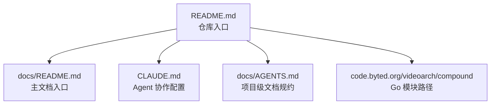

# Other — README.md

## 模块概览

`README.md` 是 Compound 仓库的根入口说明文件，用于快速说明项目身份、技术栈和主要文档入口。它不包含 Go 代码、函数、类、运行逻辑或构建脚本，因此没有内部调用、外部调用或执行流。

该文件的核心作用是让首次进入仓库的开发者快速确认：

- 项目名称：`Compound`
- 项目定位：视频架构元数据管理服务
- 主要技术栈：Go 1.23、Kitex、Hertz
- Go 模块路径：`code.byted.org/videoarch/compound`
- 后续应阅读的权威文档入口

## 文件内容结构

`README.md` 当前由一个标题、一句项目描述和一组项目元信息组成：

```md
# Compound

视频架构元数据管理服务。
```

这部分定义了仓库的最小项目身份。它没有展开业务模型、服务边界或部署方式，只承担“根目录识别牌”的职责。

随后列出项目开发中最常用的入口：

```md
- 语言：Go 1.23
- RPC：Kitex；HTTP：Hertz
- 模块路径：`code.byted.org/videoarch/compound`
- 主文档入口：[`docs/README.md`](./docs/README.md)
- AI 协议入口：[`CLAUDE.md`](./CLAUDE.md)
- 项目级文档规约：[`docs/AGENTS.md`](./docs/AGENTS.md)
```

这些条目把根 README 与更详细的项目文档、Agent 协作规范和文档写作规范连接起来。

## 与代码库的关系

`README.md` 本身不参与编译、测试、运行或依赖解析。它与代码库的连接主要是文档导航关系：



开发者通常从 `README.md` 开始，再根据任务类型跳转：

- 理解项目整体文档：阅读 `docs/README.md`
- 查看 AI Agent 协作、提交、测试、专项约束：阅读 `CLAUDE.md`
- 修改或新增 `docs/` 下文档：阅读 `docs/AGENTS.md`

## 维护原则

修改 `README.md` 时应保持它的入口性质，避免把详细设计、接口说明或运行手册直接堆入根 README。更合适的做法是：

- 根 README 保持简短，只放稳定的项目元信息和权威入口。
- 详细文档放入 `docs/`，并从 `docs/README.md` 组织导航。
- Agent、测试、提交、专项开发规则继续由 `CLAUDE.md` 维护。
- 文档写作规范继续由 `docs/AGENTS.md` 维护。

由于该文件是开发者进入仓库后最先看到的页面，新增内容应优先回答“这个仓库是什么、用什么技术、下一步去哪看”，而不是替代下游文档。