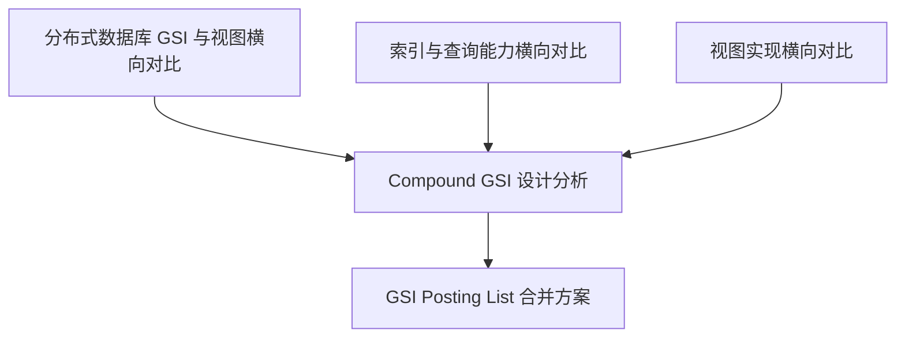

# Other — research

## 模块定位

`docs/research` 是 Compound 的技术调研与方案推导模块，内容以 Markdown 研究文档为主，不包含可执行函数、类或运行时调用链。它的作用是把外部数据库实现经验转化为 Compound 内部 GSI、索引查询、视图、物化视图与 Posting List 存储设计的事实依据。

该模块回答的不是“代码如何运行”，而是“为什么后续方案应该这样设计”。因此它的执行流表现为文档之间的推导关系：横向调研先建立事实底座，综合分析再收敛到 Compound 约束，专项方案最后进入工程细化。

## 文档结构

## 核心文档

### `distributed-db-gsi-comparison.md`

该文档是 GSI 与视图能力的总览型横向对比，覆盖 CockroachDB、YugabyteDB、TiDB、OceanBase、PolarDB-X、DuckDB 与 PostgreSQL。

它围绕以下问题组织调研：

- 索引存储在哪里：嵌入式 KV、索引即表、独立文件索引或进程内 ART。
- Online DDL 如何生效：例如 CockroachDB 的 `BACKFILLING → DELETE_ONLY → MERGING → WRITE_ONLY → PUBLIC`，TiDB 的 `None → DeleteOnly → WriteOnly → WriteReorg → Public`。
- DML 如何维护索引：主表与索引是否同事务提交，唯一索引如何冲突检测。
- 查询如何使用索引：覆盖索引、回表、分片裁剪、CBO 选路。
- 逻辑视图和物化视图如何落地：SQL 文本、查询树、普通表复用、全量刷新或增量刷新。

这篇文档提供全局能力版图，是后续设计判断的主要事实来源。

### `distributed-db-index-query-capabilities.md`

该文档专门分析“索引最终能支持哪些查询能力”。它从存储结构、索引类型、复合索引、范围查询、编码有序性、覆盖索引、优化器与多索引合并等角度比较多个系统。

关键结论包括：

- 保序编码是范围查询、排序优化和复合索引能力的基础。
- PostgreSQL 的 Index AM、Bitmap Index Scan、BRIN、Partial Index、Expression Index 是重要参考。
- TiDB 全局索引不支持覆盖列，是能力边界示例。
- DuckDB 的 ART 索引主要服务点查和约束校验，OLAP 主路径仍是向量化扫描。
- NoSQL 索引能力明显弱于 SQL 数据库，尤其在复合索引、排序优化和 CBO 方面。

该文档是 `gsi-design-analysis-for-compound.md` 中“索引提供什么能力”章节的上游依据。

### `distributed-db-view-comparison.md`

该文档聚焦视图实现，覆盖逻辑视图、物化视图、刷新策略、依赖追踪、权限模型、嵌套视图、循环检测和可更新视图。

它比较了几类典型路线：

- PostgreSQL / YugabyteDB：基于 `pg_rewrite` 和 `pg_depend` 的 rewrite-rule 体系。
- CockroachDB / TiDB：存储标准化 SQL 字符串，查询时重新展开。
- PolarDB-X：`DrdsViewExpander` 支持虚拟视图、预编译计划、独立优化、联合优化四条路径。
- OceanBase：物化视图能力最完整，支持 MLOG、增量刷新、Fast LSM MV、依赖拓扑排序。
- ScyllaDB：二级索引与物化视图共享写路径，体现“索引即视图”的设计。

这篇文档为 Compound 是否复用视图能力实现部分索引、物化视图和派生数据结构提供参考。

### `gsi-design-analysis-for-compound.md`

该文档是研究模块中最接近 Compound 方案决策的综合分析文档。它不再按数据库逐个比较，而是围绕 Compound 的设计问题组织结论：

- 索引存储介质及与原存储的关系。
- 常态写入、Online DDL、Backfill 与故障恢复的一致性保障。
- 索引应支持的查询能力。
- 索引 key/value 的组织形式。
- 部分索引与视图能力是否可以复用。

文档给出的核心建议包括：

- 采用“索引即表”模型，为索引建立独立 Bytedoc Collection 或独立 Abase 命名空间。
- 索引元数据存储在 Admin MySQL，例如 `index_definitions`。
- 主表与索引写入应尽量保持强一致。
- 非唯一索引 key 追加主键或 object_id，保证索引条目唯一。
- 范围查询要求保序编码。
- 部分索引可以复用 Compound 现有 Expression / Filter 体系。
- Online DDL 至少需要类似 `DeleteOnly → WriteOnly → WriteReorg → Public` 的状态机。

这是后续 GSI 工程实现最重要的设计入口。

### `gsi-value-merge-design.md`

该文档是 GSI 工程细化后的专项方案，讨论低基数索引键下是否应把多个 `object_id` 合并成 Posting List / Bucket。

它先解释为什么主流 OLTP GSI 通常不做 value 合并：

- 单行写入会从 O(1) 变成 read-modify-write。
- 热点索引键会导致锁竞争。
- 大 value 会放大 B-Tree / LSM-Tree 页分裂和 compaction 成本。
- MVCC 下每次修改大数组会产生巨大版本链。

然后结合 Compound 的特点重新评估：

- Compound 更偏读多写少。
- Bytedoc 是 MongoDB 兼容存储，支持数组原子操作。
- 低基数字段如 `status`、`type` 可能产生海量重复索引键。
- RPC 访问存储时，减少网络操作次数比单机数据库内部 I/O 优化更关键。

文档推荐的近期方案是 MongoDB 分桶模式：

- 每个桶文档存储同一 `idx + key` 下的一批 `oids`。
- 使用 `min_ver` / `max_ver` 形成连续版本区间。
- 新写入优先落到尾部活跃桶。
- 桶满后在事务中封旧桶并创建新桶。
- 唯一索引不参与分桶，继续使用一对一文档。
- 覆盖列通过 `cov` 字段按 `oid` 存储。

该文档承接 `gsi-design-analysis-for-compound.md`，把“索引即表”进一步细化为低基数场景下的存储优化方案。

## 推导方式

该模块的文档遵循一致的研究路径：

1. 冻结外部数据库版本或源码提交，避免混用不同版本行为。
2. 从存储模型、DDL 状态、DML 路径、查询路径、回填、事务、视图或物化视图等维度拆解事实。
3. 用横向表格归纳不同系统的共同模式和特例。
4. 抽取对 Compound 真正有约束力的结论。
5. 在综合设计文档中转化为推荐方案、状态机、元数据结构或数据模型。

由于该模块没有运行时代码，`Internal calls`、`Outgoing calls`、`Incoming calls` 均为空；文档之间的引用关系就是主要“调用图”。

## 与代码库其他部分的关系

`docs/research` 不直接被业务代码调用，但它约束和解释后续实现方向：

- GSI 元数据设计应参考 `gsi-design-analysis-for-compound.md` 中的 `index_definitions` 结构。
- 索引写路径需要对齐该文档提出的主表写入、索引维护、状态感知 DML、回填幂等策略。
- 低基数索引优化应参考 `gsi-value-merge-design.md` 的 `merge_mode`、bucket 文档结构和版本区间路由。
- 视图、物化视图或部分索引能力设计应回看 `distributed-db-view-comparison.md` 和 `distributed-db-gsi-comparison.md`。
- 查询优化、覆盖索引、范围查询和复合索引能力边界应回看 `distributed-db-index-query-capabilities.md`。

## 维护注意事项

新增研究文档应保持可追溯性：明确调研范围、版本或 commit、结论来源、验证方式和变更历史。已有文档使用“概述 / 架构设计 / 实现细节 / 测试验证 / 相关 Commit / 变更历史”的统一模板，新增文档应延续这一结构。

修改结论型文档时，需要同时检查上游横向调研是否支持该结论。例如修改 `gsi-design-analysis-for-compound.md` 中的 GSI 存储建议时，应同步核对 `distributed-db-gsi-comparison.md` 和 `distributed-db-index-query-capabilities.md`；修改分桶或 Posting List 方案时，应确认它仍兼容 GSI 状态机、回填和唯一索引约束。