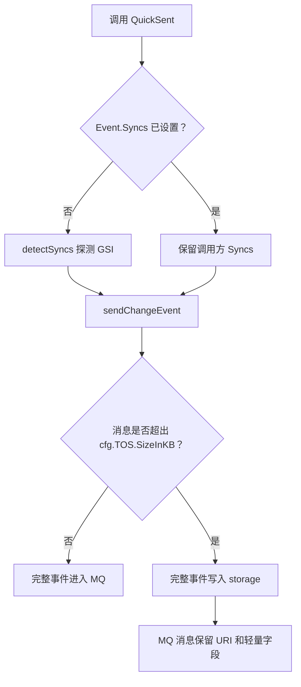

# Other — rocketmq

## 模块职责

`rocketmq` 模块负责把 `compound.Event` 变更事件发送到 RocketMQ，并在发送前完成两类关键处理：

1. **大消息分级卸载到 TOS**：当事件序列化后超过 `cfg.TOS.SizeInKB` 阈值时，`sendChangeEvent` 会把完整事件写入 `storage`，MQ 消息只保留必要元信息和 `URI`。
2. **同步目标探测**：`QuickSent` 在调用方未显式设置 `Event.Syncs` 时，会通过 `detectSyncs` 判断本次变更是否影响 GSI，并填充 `compound.SyncTarget_GSI`。

核心输入类型是 `kitex_gen/bytedance/videoarch/compound.Event`。事件中的 `Created`、`Updated`、`Deleted` 表示对象属性级别的新增、更新、删除变更；`IdxSnapshot` 保存索引相关字段快照；`Syncs` 表示下游同步目标。

## 发送流程



`QuickSent(context.Context, compound.Event)` 是发送入口。它不会覆盖调用方已经设置的字段：

- 如果 `Event.Syncs` 已有值，`QuickSent` 直接保留，不调用 `admin.GetIdxCfg` 做探测。
- 如果 `Event.IdxSnapshot` 已有值，`QuickSent` 不会修改该快照。
- 如果 `Event.Syncs` 为空，`QuickSent` 调用 `detectSyncs` 根据变更路径和索引配置推导同步目标。

底层发送由 `sendChangeEvent(context.Context, compound.Event)` 完成。测试中通过 `Mock(t)`、`Demock(t)` 和 `PopRecords()` 验证发送结果，说明模块支持测试态拦截 RocketMQ 发送记录。

## TOS 分级卸载

`sendChangeEvent` 会根据序列化后的事件大小决定是否直接发送 MQ，阈值来自 `cfg.TOS.SizeInKB`。

小消息路径：

- `Event.URI` 为空。
- `Created`、`Updated`、`Deleted` 原样保留在 MQ 消息中。
- `IdxSnapshot` 原样保留。

大消息路径：

- 完整事件写入 `storage`，MQ 消息中的 `URI` 指向该对象。
- MQ 消息中的 `Created`、`Updated`、`Deleted` 会被清空，避免 RocketMQ 消息过大。
- 消费方可通过 `storage.Get(comm.Ctx(), *event.URI)` 读取完整事件并反序列化。

`IdxSnapshot` 在 TOS 路径中有额外的保留策略：

- 如果去掉 `Created`、`Updated`、`Deleted` 后，MQ 消息已经足够小，则 `IdxSnapshot` 继续保留在 MQ 消息里。
- 如果 `IdxSnapshot` 本身也很大，导致轻量 MQ 消息仍超过阈值，则 MQ 消息中的 `IdxSnapshot` 会被移除。
- 无论 MQ 消息是否保留 `IdxSnapshot`，写入 TOS 的完整事件都会包含原始 `IdxSnapshot`。

这使下游在常见场景下可以直接从 MQ 消息拿到索引快照，同时仍能通过 `URI` 获取完整事件。

## 二进制内容编码

`sendChangeEvent` 在序列化前会处理变更值中的非安全字符串内容。测试通过 `mockBeforeSerialize = true` 触发该路径，并在收到消息后根据 `IsBase64` 还原：

- `compound.Created` 使用 `Created.Val` 和 `Created.IsBase64`。
- `compound.Updated` 使用 `Updated.Before`、`Updated.After` 和 `Updated.IsBase64`。
- `compound.Deleted` 使用 `Deleted.Val` 和 `Deleted.IsBase64`。

测试辅助函数 `decode(t, input)` 使用 `base64.StdEncoding.DecodeString` 还原内容。还原后，事件应与发送前的 `compound.Event` 完全一致。

## 同步目标探测

`detectSyncs(context.Context, *compound.Event)` 根据事件变更路径判断是否需要同步 GSI。它依赖 `admin.GetIdxCfg(ctx, space, schema)` 获取当前 `Space` 和 `Schema` 的索引配置，配置类型为 `entity.IdxCfg`。

探测规则：

- `event == nil` 时返回 `nil`。
- `Space` 或 `Schema` 为空时返回 `nil`，且不会调用 `admin.GetIdxCfg`。
- 没有索引配置时返回 `nil`。
- 没有任何有效变更路径时返回空结果。
- 任意 `Created.Path`、`Updated.Path`、`Deleted.Path` 命中任一索引列时，返回 `[]compound.SyncTarget{compound.SyncTarget_GSI}`。
- 唯一索引 `IdxCfg.IsUniq == true` 也按 GSI 命中处理。
- 复合索引只要命中其中一列，就视为需要同步 GSI。
- `Created`、`Updated`、`Deleted` 切片中允许出现 `nil` entry，探测时会跳过，不应 panic。

典型索引配置形态：

```go
entity.IdxCfg{
    Name:    "country_idx",
    Space:   "default",
    Schema:  "schema_test",
    Columns: []string{"$.UserCountry", "$.IsPrivate"},
}
```

当事件变更 `$.UserCountry` 或 `$.IsPrivate` 时，`detectSyncs` 会返回 `compound.SyncTarget_GSI`。

## 通配数组索引匹配

`detectSyncs` 支持索引列中的数组通配路径。测试覆盖的模式是：

```go
entity.IdxCfg{
    Name:    "tag_idx",
    Space:   "default",
    Schema:  "schema_test",
    Columns: []string{"$.tags[*]"},
}
```

以下变更路径都会命中 `$.tags[*]`：

- `$.tags[0]`
- `$.tags[1]`
- `$.tags[2]`

非匹配路径，例如 `$.title`，不会命中该通配索引。

复合通配索引中的普通列也会独立命中。例如索引列为 `[]string{"$.tags[*]", "$.status"}` 时，单独更新 `$.status` 也会触发 `compound.SyncTarget_GSI`。

## 与其他模块的关系

`rocketmq` 模块处在事件生产链路的边界位置，连接变更事件、索引配置、对象存储和 MQ 发送：

- `compound.Event` 来自 `kitex_gen/bytedance/videoarch/compound`，是模块处理和发送的核心数据结构。
- `admin.GetIdxCfg` 来自 `fuxi/client/admin`，用于读取 schema 的 GSI/唯一索引配置。
- `entity.IdxCfg` 来自 `fuxi/core/consts/entity`，描述索引名称、空间、schema、索引列和唯一索引标记。
- `storage.Get` 来自 `fuxi/core/storage`，用于读取 TOS 分级卸载后的完整事件。
- `comm.Ctx()` 提供读取 storage 时使用的上下文。
- 测试断言使用 `utils/ast` 和 `testify/require`，mock 使用 `mockey`。

## 开发注意事项

修改 `sendChangeEvent` 时，需要同时保证三件事：

- 小消息不能丢失 `Created`、`Updated`、`Deleted`、`IdxSnapshot`。
- 大消息写入 TOS 的完整事件必须可通过 `URI` 还原。
- TOS 路径下 MQ 消息应尽可能保留轻量但有价值的 `IdxSnapshot`，只有在它本身过大时才移除。

修改 `detectSyncs` 时，需要重点保护这些边界行为：

- 空 `Space` 或空 `Schema` 不应查询 `admin.GetIdxCfg`。
- `Created`、`Updated`、`Deleted` 中的 `nil` entry 必须安全跳过。
- 复合索引的任意列命中都应触发 GSI 同步。
- `$.tags[*]` 这类通配列需要匹配具体数组下标路径。
- 调用方已经设置 `Event.Syncs` 时，`QuickSent` 不应重新探测或覆盖。