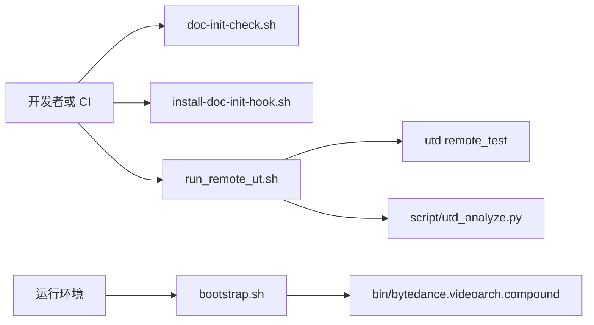

# Other — script

## script 模块

`script/` 目录放置仓库级辅助脚本，主要覆盖三类场景：服务启动、文档规约检查、远程单测执行。该模块没有被代码内其它模块直接调用；脚本都是面向开发、CI、部署或本地 Git 工作流的独立入口。



## bootstrap.sh

`script/bootstrap.sh` 是服务运行时启动入口，用于准备 Kitex 运行环境并启动主二进制。

执行流程：

1. 设置默认服务标识：
   ```bash
   export PSM=${PSM:-bytedance.videoarch.compound}
   ```

2. 计算脚本所在目录：
   ```bash
   CURDIR=$(cd $(dirname $0); pwd)
   ```

3. 解析运行根目录：
   - 如果传入第一个参数，则使用该参数作为 `RUNTIME_ROOT`
   - 否则使用 `script/` 目录本身作为 `RUNTIME_ROOT`

4. 导出 Kitex 相关环境变量：
   - `KITEX_RUNTIME_ROOT=$RUNTIME_ROOT`
   - `KITEX_CONF_DIR="$CURDIR/conf"`
   - `KITEX_LOG_DIR="${RUNTIME_LOGDIR:-${RUNTIME_ROOT}/log}"`

5. 确保日志目录存在：
   - `$KITEX_LOG_DIR/app`
   - `$KITEX_LOG_DIR/rpc`

6. 使用 `exec` 启动服务二进制：
   ```bash
   exec "$CURDIR/bin/bytedance.videoarch.compound"
   ```

`exec` 会用服务进程替换当前 shell 进程，因此后续信号会直接传递给 `bin/bytedance.videoarch.compound`。这适合容器、部署平台或进程管理器启动服务时使用。

常见调用方式：

```bash
# 使用 script/ 作为运行根目录
bash script/bootstrap.sh

# 指定运行根目录
bash script/bootstrap.sh /opt/tiger/app

# 覆盖日志目录
RUNTIME_LOGDIR=/var/log/compound bash script/bootstrap.sh /opt/tiger/app
```

需要注意的是，`bootstrap.sh` 假定以下路径存在：

```text
script/conf/
script/bin/bytedance.videoarch.compound
```

如果二进制不在 `script/bin/` 下，脚本不会自动查找其它位置。

## doc-init-check.sh

`script/doc-init-check.sh` 是纯 shell 实现的文档规约检查脚本，用于检查 `doc-init` 体系下的 living spec 和项目级文档入口是否满足约束。它不依赖外部工具，只使用 `grep`、`awk`、`sed`、`wc` 等常见命令。

脚本启用：

```bash
set -uo pipefail
```

它没有启用 `set -e`，因为脚本需要在多个检查项之间累积 warning 和 error，再统一给出退出码。

### 计数函数

脚本内部定义了三个输出和计数函数：

```bash
note_warn() { echo "[WARN] $1"; WARN=$((WARN+1)); }
note_err() { echo "[ERR ] $1"; ERR=$((ERR+1)); }
note_ok() { echo "[OK  ] $1"; }
```

其中：

- `note_warn` 增加 `WARN`
- `note_err` 增加 `ERR`
- `note_ok` 只输出通过信息

### 检查 living spec 的 EARS keyword

脚本扫描：

```bash
docs/specs/*/spec.md
```

每个 living spec 中以如下标题识别需求段：

```markdown
### Requirement
```

每条 Requirement 后续内容需要出现至少一个 EARS keyword：

```text
SHALL
MUST
WHEN
WHILE
IF
WHERE
```

实现上使用 `awk` 在 Requirement 段内查找关键字。如果某条 Requirement 到下一个 Requirement 或二级标题前都没有命中关键字，则输出 warning。

该检查用于降低需求描述过于散文化的风险，让 living spec 更接近可验证的规格文本。

### 检查 Owner 字段

每个 living spec 需要包含：

```markdown
> **Owner**:
```

缺失时记录 warning：

```bash
grep -q '^> \*\*Owner\*\*:'
```

这对应 `docs/AGENTS.md` 中对 living spec 责任人的要求。

### 检查 living spec 中的 TBD 占位

脚本会统计 `TBD(`：

```bash
grep -c 'TBD(' "$f"
```

在 living spec 中出现 `TBD(` 会产生 warning。脚本注释中说明：`spec-delta` 阶段允许 TBD，但归档为 living spec 后应替换为真实测试路径或确定内容。

### 检查散落约束关键字

脚本检查 `CLAUDE.md` 和 `docs/AGENTS.md` 中是否残留以下关键字：

```text
doc-conventions
spec-driven-docs
gen_dir_docs
compound-dir-doc
```

命中内容会排除：

```text
doc-init
.plan-progress
doc-init-check.sh
```

如果仍有残留，则调用 `note_err`，最终退出码会变成阻塞型错误。

这一项用于保证文档规约入口已经收敛到 `doc-init`，避免旧规则散落在多个入口中。

### 检查 legacy README 清理进度

脚本还会扫描带有如下标记的 README：

```html
<!-- compound-dir-doc -->
```

它排除 `.worktrees/`，并单独统计 `fuxi/core/service/idx/` 下允许保留的 README 数量。该检查只输出 `[INFO]` 或 `[OK]`，不计入 `WARN` 或 `ERR`。

### 退出码语义

`doc-init-check.sh` 的退出码用于本地 hook 或 CI 判断：

| 退出码 | 含义 |
|---|---|
| `0` | 全部通过 |
| `1` | 存在 warning，但没有 error |
| `2` | 存在 error，或 `--strict` 下存在 warning |

普通模式：

```bash
bash script/doc-init-check.sh
```

严格模式：

```bash
bash script/doc-init-check.sh --strict
```

在 `--strict` 模式下，只要 `WARN > 0` 就会返回 `2`。

## install-doc-init-hook.sh

`script/install-doc-init-hook.sh` 用于一键启用仓库内的 `doc-init` pre-commit 钩子。

脚本启用严格模式：

```bash
set -euo pipefail
```

执行流程：

1. 通过 Git 获取仓库根目录：
   ```bash
   ROOT="$(git rev-parse --show-toplevel)"
   ```

2. 检查 `.githooks/` 是否存在。不存在时退出 `1`。

3. 给 hook 和检查脚本增加可执行权限：
   ```bash
   chmod +x .githooks/pre-commit script/doc-init-check.sh
   ```

4. 设置当前仓库的 Git hooks 路径：
   ```bash
   git config core.hooksPath .githooks
   ```

启用后，Git 会从 `.githooks/` 查找 hooks。脚本输出中也给出了撤销方式：

```bash
git config --unset core.hooksPath
```

该脚本只修改当前仓库的 Git 配置，不会修改全局 Git 配置。

## run_remote_ut.sh

`script/run_remote_ut.sh` 是远程单测执行入口，封装了 `utd remote_test` 的参数组装、结果目录创建，以及后续报告分析。

脚本启用：

```bash
set -euo pipefail
```

因此任何未处理错误都会直接中止执行。

### utd 二进制查找

脚本优先使用环境变量 `UTD_BIN`，默认路径为：

```bash
$HOME/.bits-ut/utd
```

如果该路径不可执行，则回退到：

```bash
/data00/home/$(whoami)/.bits-ut/utd
```

两个路径都不可用时，脚本输出错误并退出 `1`：

```text
utd not found, set UTD_BIN or install to ~/.bits-ut/utd
```

### 远程测试参数

脚本通过环境变量配置测试行为。主要变量如下：

| 变量 | 默认值 | 作用 |
|---|---|---|
| `PIPELINE_FILE` | `.codebase/pipelines/ci.yaml` | 远程测试使用的流水线文件 |
| `JOB_ID` | `build` | 流水线 job |
| `WORKING_DIRECTORY` | `.` | 测试工作目录 |
| `TEST_KIND` | `pipeline` | 测试类型 |
| `TEST_DIRECTORY` | 空 | `TEST_KIND=directory` 时的目录 |
| `TEST_PACKAGE_PATH` | 空 | `TEST_KIND=package` 时的包路径 |
| `TEST_FILES` | 空 | `TEST_KIND=file` 时的文件列表 |
| `PATTERN` | 空 | 测试过滤模式 |
| `ENABLE_COVERAGE` | `true` | 是否开启覆盖率 |
| `SAVE_TEST_LOG_MODE` | `1` | 测试日志保存模式 |
| `PREPARE_ONLY` | `false` | 是否只准备流水线 |
| `NOT_REUSE` | `false` | 是否禁止复用 |
| `PRINT_TREE` | `true` | 是否打印分析后的树形报告 |
| `RESULT_ROOT` | `.utd` | 结果根目录 |

每次运行会生成基于时间戳的运行目录：

```bash
RUN_ID=$(date +%Y%m%d_%H%M%S)
RESULT_DIR=${RESULT_DIR:-"$RESULT_ROOT/runs/$RUN_ID"}
```

结果文件包括：

```text
status.json
exception.json
utd.log
report.json
report.txt
```

### TEST_KIND 分支

`TEST_KIND` 控制传给 `utd remote_test` 的范围参数。

当 `TEST_KIND=directory` 时，必须提供 `TEST_DIRECTORY`：

```bash
TEST_KIND=directory TEST_DIRECTORY=./fuxi/core/service bash script/run_remote_ut.sh
```

脚本会追加：

```bash
--directory="$TEST_DIRECTORY"
```

当 `TEST_KIND=package` 时，必须提供 `TEST_PACKAGE_PATH`：

```bash
TEST_KIND=package TEST_PACKAGE_PATH=./fuxi/core/service/idx bash script/run_remote_ut.sh
```

脚本会追加：

```bash
--package_path="$TEST_PACKAGE_PATH"
```

当 `TEST_KIND=file` 时，必须提供 `TEST_FILES`：

```bash
TEST_KIND=file TEST_FILES=./path/to/foo_test.go bash script/run_remote_ut.sh
```

脚本会追加：

```bash
--files="$TEST_FILES"
```

如果对应变量为空，脚本会退出 `2`。

### 覆盖率、准备模式和复用控制

默认开启覆盖率：

```bash
ENABLE_COVERAGE=true
```

此时会追加：

```bash
--enable_coverage
```

只准备远程流水线：

```bash
PREPARE_ONLY=true bash script/run_remote_ut.sh
```

禁止复用：

```bash
NOT_REUSE=true bash script/run_remote_ut.sh
```

### 结果分析

`utd remote_test` 执行完成后，如果本机存在 `python3`，脚本会调用：

```bash
python3 script/utd_analyze.py
```

并传入本次运行的 `status.json`、`utd.log`、`RESULT_DIR`、流水线参数和测试范围参数。

分析输出：

```text
$RESULT_DIR/report.json
$RESULT_DIR/report.txt
```

如果 `PRINT_TREE=true`，还会传入：

```bash
--print-tree
```

如果没有 `python3`，脚本不会失败，只输出：

```text
python3 not found, status_file=... utd_log=...
```

最后统一打印：

```text
result_dir=...
```

调用方可以据此定位远程测试产物。

## 与仓库其它部分的关系

`script/bootstrap.sh` 连接运行时目录、Kitex 配置目录、日志目录和服务二进制，是部署或本地启动链路中的入口脚本。

`script/doc-init-check.sh` 和 `script/install-doc-init-hook.sh` 连接文档规约体系与 Git 工作流。前者负责实际检查，后者负责把 `.githooks/pre-commit` 接入当前仓库。它们共同服务于 `CLAUDE.md`、`docs/AGENTS.md`、`docs/specs/*/spec.md` 等文档入口的质量约束。

`script/run_remote_ut.sh` 连接仓库代码、`.codebase/pipelines/ci.yaml`、Bits 远程单测工具 `utd` 和本地分析脚本 `script/utd_analyze.py`。它适合作为本地开发时触发远程 CI 风格测试的统一入口。

## 维护建议

新增脚本时，优先保持当前目录已有模式：

- 使用 `ROOT_DIR=$(cd "$(dirname "$0")/.." && pwd)` 或 `git rev-parse --show-toplevel` 定位仓库根。
- 对开发或 CI 入口使用 `set -euo pipefail`，但像 `doc-init-check.sh` 这种需要累计检查结果的脚本可以只使用 `set -uo pipefail`。
- 对可配置项使用环境变量覆盖，并提供明确默认值。
- 对缺失的必填参数返回非零退出码，并把错误信息输出到 `stderr`。
- 将生成产物放到固定目录，如 `.utd/runs/<RUN_ID>/`，避免污染源码目录。
- 修改 `doc-init-check.sh` 时同步考虑 `.githooks/pre-commit` 的调用方式，避免本地 hook 和手动执行行为不一致。