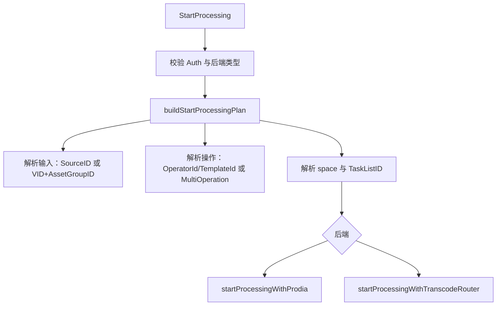

# Other — service

## 模块定位

`mdap/service` 承载 MDAP 的核心业务服务逻辑，负责资产组、来源、产物元数据的 CRUD，以及媒体摘要处理任务的启动。模块本身不直接实现存储，而是把 `mdap_model`、`mdap` 请求对象转换成 Fuxi Core 可读写的 `compound.SetAttrReq`、`compound.QueryReq`、`compound.CountReq`、`compound.DelReq`。

主要文件分工：

- `mdap.go`：资产组、Source、Artifact 的读写、查询、解析和摘要产物转换。
- `mdap_validator.go`：请求参数校验和 payload 结构校验。
- `parser.go`：Fuxi 查询结果解析、基础类型转换、索引数组辅助函数。
- `start_processing.go`：`StartProcessing` 的输入归一化、操作归一化和执行计划构建。
- `start_processing_prodia.go`：Prodia 工作流请求构建、回调参数封装、客户端缓存。
- `start_processing_transcode_router.go`：TranscodeRouter HTTP 请求构建和调用。
- `start_processing_auth.go`：启动处理任务的 MDAP 权限校验。

## 核心依赖

模块依赖三类外部能力：

- Fuxi Core 服务：`fuxi_s.SetAttr`、`fuxi_s.Query`、`fuxi_s.Count`、`fuxi_s.Del`、`fuxi_s.GetFileURL`、`fuxi_s.AuthorizeGetFileURLAccess`。
- MDAP ID 编解码：`mdapid.GenerateAssetGroupID`、`mdapid.ParseAssetGroupID`、`mdapid.Generate`、`mdapid.Parse`。
- 处理后端：`startTranscodeRouterExecution` 调用 TranscodeRouter，`startProdiaWorkflow` 调用 Prodia。

配置通过 `getMDAPConfig()` 懒加载并缓存 `config.MDAPConfig`。默认 schema 为：

- `GetAssetGroupSchema()`：`mdap_asset_group`
- `GetSourceSchema()`：`mdap_source`
- `GetArtifactSchema()`：`mdap_artifact`

`ArtifactTypes` 是 digest schema 的桥接配置，key 是 `mdap_model.ArtifactType.String()`，value 包含 `Schema` 和 `DigestType`。`QueryArtifacts` 和 `MGetArtifacts` 查询历史 digest 产物时依赖这个映射。

## 数据持久化约定

Fuxi 属性统一使用 JSONPath 风格的字符串路径，例如 `$.space`、`$.source_configs[0].type`、`$.contents[0].blobs[0].location.path`。所有 `compound.AttrVal.Val` 都是字符串：

- 数字通过 `strconv.FormatInt` 写入，解析失败时默认为 `0`。
- 布尔值通过 `strconv.FormatBool` 写入，解析失败时默认为 `false`。
- Source 的 `Meta`、`SourceConfig.Config`、`JobExecution.Params` 以原始字节转字符串保存。
- Artifact 的 `ArtifactContent.Contents` 会先做 `base64.StdEncoding.EncodeToString`，读取时再解码。

数组字段依赖连续索引恢复顺序。新增数组属性时，应保持 `xxx[0]`、`xxx[1]` 这种从 0 开始的连续路径，否则解析函数可能跳过不连续的数据。

`parseOrderedQueryResults` 会保留 Fuxi 返回的行顺序，分页查询接口依赖这一点保持排序结果。`parseQueryResults` 会转成 `map[id]attrs`，只适合 `MGet` 这类不要求顺序的场景。

## AssetGroup 流程

`CreateAssetGroup` 的主路径：

1. `ValidateCreateAssetGroupRequest` 校验 `Space`、`Name`、`SourceConfigs`、`MediaTypes`、`Creator`。
2. `generateAssetGroupID` 生成包含 space 信息的资产组 ID。
3. 构造 `mdap_model.AssetGroup`，设置 `CreateTime`、`UpdateTime`。
4. `buildAssetGroupAttrs` 展开为 Fuxi 属性路径。
5. 调用 `fuxi_s.SetAttr` 写入 `cfg.GetAssetGroupSchema()`。

`MGetAssetGroups` 根据第一个 ID 解析 space，通过 `buildAssetGroupWhereClause` 同时设置 `Ids` 和 `$.space` 过滤，防止跨 space 误读。读取结果由 `parseAssetGroupFromQuery` 还原为 `mdap_model.AssetGroup`。

`QueryAssetGroups` 支持按 `Space`、`Name`、`MediaTypes` 组合过滤，排序固定为 `$.create_time` 降序，并额外调用 `fuxi_s.Count` 返回 total。

`UpdateAssetGroup` 只写请求中显式设置的字段，并总是追加 `$.update_time`。`DeleteAssetGroup` 使用 `compound.DelReq`，同样带 ID 与 space where 条件。

## Source 流程

`CreateSource` 要求 `AssetGroupID`、`BizID`、`MediaType`、`Format`、`Config`、`Meta`。它先用 `mdapid.ParseAssetGroupID` 取出 space 和 group key，再通过 `generateSourceID` 生成 Source ID。`generateSourceID` 会把 `MediaType` 转为 MIME 顶层类型字符，不支持的类型会返回错误。

`buildSourceAttrs` 会持久化关键归属字段：

- `$.biz_id`
- `$.asset_group_id`
- `$.asset_id`
- `$.config.*`
- `$.meta`
- `$.tags[i]`
- `$.created_time`
- `$.updated_time`

`parseSourceFromQuery` 会额外校验 Source ID 与持久化的 `$.asset_group_id` 是否属于同一 `AccountID` 和 `GroupKey`。这里不要求 VDC 一致，因此迁移或跨 VDC 持久化场景可以读取，但账号和资产组身份不能错配。

`QuerySources` 必须带 `AssetGroupID`，可选 `BizID`。当只按资产组查询时会调用 `Count` 并返回 `total`；当带 `BizID` 时认为是精确过滤，不返回 total。排序字段是 `$.created_time` 降序。

## Artifact 流程

`CreateArtifact` 持久化 MDAP 自建产物，数据落在 `cfg.GetArtifactSchema()`：

1. `ValidateCreateArtifactRequest` 校验 `DeriveID`、`Name`、`AssetGroupID`、`DeriveType` 和 `Contents`。
2. `validateArtifactDeriveID` 校验派生对象类型，`DeriveType_Source` 必须派生自 Source，`DeriveType_Artifact` 必须派生自 Artifact。
3. 校验 `DeriveID` 与 `AssetGroupID` 的 `AccountID`、`GroupKey` 一致。
4. `generateArtifactID` 根据内容类型生成 Artifact ID。
5. `calculateArtifactSize` 优先累加 `Blobs` 的 size；没有 blob 时从 payload 的 meta 中计算。
6. `buildArtifactAttrs` 将 payload base64 后写入 Fuxi。

`MGetArtifacts` 支持两种 ID：

- MDAP Artifact ID：通过 `parseSpaceFromArtifactID` 路由到 `cfg.GetArtifactSchema()`。
- 查询型 digest ID：格式为 `{biz_id}/{DigestType}/{DigestName}`，由 `parseQueryArtifactID` 识别，必须额外传 `Space`，再通过 `artifactTypeConfigByDigestType` 找到对应 digest schema。

`QueryArtifacts` 也有两种请求形态：

- `AssetGroupID` 查询：读 `mdap_artifact`，where 为 `$.asset_group_id == AssetGroupID`，按 `$.created_time` 降序，并返回 total。
- `Space + SourceBizIDs + Types + Name` 查询：根据 `ArtifactTypes` 拼出 `{biz_id}/{DigestType}/{Name}`，读配置的 digest schema，按 `$.created_at` 降序，不返回 total。

digest schema 查询结果先由 `parseMediaDigestFromQuery` 转成 `dto.MediaDigest`，再由 `convertMediaDigestToArtifact` 转成统一的 `mdap_model.Artifact`。当前 `convertDigestInfoToContent` 支持 `SnapshotDigest` 和 `AudioTrackDigest`，分别映射到 `ArtifactType_Snapshots` 和 `ArtifactType_Audio`。

## 签名 URL

`MGetArtifacts` 和 `QueryArtifacts` 在 `WithSignedURLs` 为 true 时会先调用 `fuxi_s.AuthorizeGetFileURLAccess` 做 provider 级授权。provider 是本次查询的 space。

授权通过后，`populateArtifactDownloadURLs` 会遍历：

- `ArtifactContent.Blobs[*].Location`
- `ArtifactSnapshots.Snapshots[*].Location`
- `ArtifactSnapshots.Sprites[*].Location`
- `ArtifactAudio.Location`
- `ArtifactImage.Location`

每个 location 通过 `fuxi_s.GetFileURL` 生成下载地址，并写回 `StoreLocation.DownloadURL`。payload 类型内容会先反序列化、填充 URL、再重新序列化回 `ArtifactContent.Contents[i]`。

## StartProcessing 执行流

`StartProcessing` 是启动媒体摘要处理任务的入口，支持 `transcode_router` 和 `prodia` 两种后端。默认后端来自 `config.MDAPConfig.GetProcessingBackendType()`，未配置时为 `transcode_router`。

输入归一化由 `normalizeStartProcessingInputs` 和 `resolveStartProcessingInput` 完成：

- `Input` 和 `MultiInput` 必须二选一。
- `SourceID` 模式会调用 `MGetSources` 得到 `BizID` 和 `AssetGroupID`。
- `AssetID` 当前不支持。
- `VID + AssetGroupID` 模式会先调用 `CreateSource` 自动创建 VDA Source。
- `MultiInput` 中所有输入必须属于同一个 `AssetGroupID`。

操作归一化由 `normalizeStartProcessingOperations` 完成：

- 单操作使用顶层 `OperatorId`、`TemplateId`、`UserData`。
- 多操作使用 `MultiOperation`，不能再混用顶层操作字段。
- `validateStartProcessingOperatorID` 要求 `OperatorId` 匹配 `MDAPConfig.ArtifactTypes[*].DigestType`。
- `TemplateId` 通过 `GetDigestTaskParamsByTemplateID` 映射到下游 `DigestTaskParams`。

`getTaskListIDForTranscodeRouter` 会读取资产组的 `ArtifactConfig.JobExecution`，优先选择 `Type == operatorID` 的 job ID，否则选择第一个非空 job ID。没有可用 job 时使用 `GetTranscodeRouterFallbackTaskListID()`。

## Prodia 后端

Prodia 后端支持 `MultiInput` 和 `MultiOperation`。执行前会调用 `authorizeStartProcessing`，通过 MDAP Auth 校验 `mdap.tenant.start_task` 权限，provider 为 space。

`startProcessingWithProdia` 会构造：

- `buildRunMedigestTaskRequest`：生成 `medigest.RunMedigestTaskRequest`，单操作写 `Operation.CVD`，多操作写 `Operation.MultiCVD`；单输入写 `Input`，多输入写 `MultiInput`。
- `buildProdiaCallbackURI`：从 `ProdiaConfig.CallbackType/Cluster/Topic` 生成回调地址。
- `buildProdiaCallbackArgs`：封装 space、task list、每个 digest 操作的参数，以及用户透传的 `CallbackUri`、`CallbackArgs_`。
- `startProdiaWorkflow`：将 `RunMedigestTaskRequest` protobuf 序列化为 Prodia payload，并调用 `StartWorkflowExecution`。

Prodia client 按 `idc + cluster + secret` 缓存在 `prodiaWorkflowClientCache` 中。

## TranscodeRouter 后端

`transcode_router` 后端只支持单输入、单操作；如果计划中有多个 input 或多个 CVD operation，`StartProcessing` 会返回 `InvalidParam`。

`startProcessingWithTranscodeRouter` 构造 `transcodeRouterStartReq`：

- `Input.Type = "Vid"`，`Input.Vid` 来自解析后的 Source/BizID。
- `Upload.Type = "Mdap"`，`Upload.Mdap.Space` 为资产组 space。
- `Control.TaskListId` 使用计划中的 task list。
- `Operation.Task.CVD` 包含 digest type、template、params、user data 和 force。

`getTranscodeRouterTtEnv` 按优先级读取环境：

1. `req.Params.Env["X-Tt-Env"]`
2. `req.Params.Env["x-tt-env"]`
3. `req.Base.TrafficEnv` 中开启的 env

`startTranscodeRouterExecution` 使用 Hertz client 发送 POST，请求头包含 `Content-Type: application/json`，有值时追加 `X-Tt-Env` 和 `X-Jwt-Token`。如果 `WithSD` 开启，还会设置服务发现相关 option。

## 校验策略

`mdap_validator.go` 将校验集中在服务入口之前：

- AssetGroup：要求基础字段、至少一个 `SourceConfig`、至少一个 `MediaTypes`，并校验 artifact store location 类型不重复。
- Source：校验 `SourceConfig`，并按 `MediaType` 反序列化 `Meta`。
- Artifact：校验 payload 能按 `ArtifactType` 反序列化为 `ArtifactSnapshots`、`ArtifactAudio` 或 `ArtifactImage`，并校验 blob location、path、size。
- QueryArtifacts：显式区分 digest 查询和 asset group 查询，禁止混用两种查询字段。
- 签名 URL：统一调用 `fuxi_s.ValidateSignedURLRequest` 校验 `URLParam` 和 `Auth`。

新增字段时应同时更新三处：对应的 `build*Attrs`、`parse*FromQuery`、validator。否则会出现写入成功但读取丢字段，或读取可用但写入入口不接受的情况。

## 测试关注点

`mdap_test.go` 和 `start_processing_test.go` 主要通过 `gomonkey` patch 外部依赖，验证服务层自身行为：

- 请求校验返回正确的 `mdap_resp`。
- Fuxi 请求的 schema、space、where、sort、offset、limit 正确。
- `parseOrderedQueryResults` 保留查询顺序。
- Source 与 AssetGroup 的身份一致性校验。
- Artifact payload、blob、digest schema 转换、签名 URL 填充。
- `StartProcessing` 在 SourceID、VID+AssetGroupID、MultiInput、MultiOperation 下构造正确执行计划。
- Prodia 与 TranscodeRouter 的后端分支、鉴权、回调参数和请求 payload。