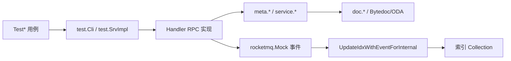

# Other — test_handler

## `test_handler` 测试模块

`handler/test_handler` 是 Compound Handler 层的集成与回归测试包。它不提供生产 API，入口全部是 `go test` 发现的 `Test*` 函数，主要通过 `test.Cli` 或 `test.SrvImpl` 调用真实 RPC 实现，再向 `meta`、`doc`、`idx`、MQ mock、文件存储和视频删除 mock 验证副作用。



## 文件分工

`handler_test.go` 覆盖 Handler 主接口：`SetAttr`、`DelAttr`、`Del`、`CopyAttr`、`Query`、`Count`、RangeSearch、数组完整性、文件属性、视频删除、指标上报、版本冲突与多存储重试。

`ttl_test.go` 覆盖 TTL 调度与执行，包括普通 schema 和带分片键的 `test.RangeSchema`。

`handler_gsi_test.go` 覆盖 GSI 端到端路径：Handler 写入、MQ 事件、`UpdateIdxWithEventForInternal` 回放、索引 collection 直探、Query filter 命中。

`handler_gsi_direct_test.go` 验证 `schema_test_index` 新文档格式：`space/schema + col1/col2/...`，并确认不再依赖历史 `key` 字段。

`handler_bytedoc_dollar_and_test.go` 是 Bytedoc 分片键提取探针，专门验证 `$and`、`$or`、`$elemMatch` 等 filter 形态是否会触发 `doc.ErrShardingKeyNotSet`。

`mocka_prepare_test.go` 提供 Mocka 生成/patch 需要的占位实现：`ICompoundServiceServiceE261f24e98fc4edeMockaImpl` 和 `ServerServer4a67d7f9ef24f3d1MockaImpl`，不是业务断言主体。

## 通用 Handler 测试骨架

`TestSetAndDelAndCopy` 是主链路回归入口。它遍历 `entity.StorageTypeList` 和 `withFuxiAttr` 两种开关，通过 `getSchemaByStorageType` 把 `entity.Tos`、`entity.Abase2`、`entity.Oda`、`entity.Bytedoc` 映射到对应测试 schema，然后进入 `testSetAndDelAndCopy`。

`testSetAndDelAndCopy` 按顺序验证创建、查询、复制、覆盖、删除属性、删除对象等行为。它同时检查：

- `rocketmq.Mock` 捕获的事件类型、`Created`、`Updated`、`Deleted`、`Extras`
- 文件属性覆盖和删除后的真实文件状态
- `WithFuxiAttr=true` 时的 `$._created_at`、`$._updated_at`
- `CopyAttr` 对文件属性和 map 通配属性的展开结果
- TOS/Abase 等最终一致读写路径的等待逻辑

查询断言集中在 `astQueryEqual` 和 `astQueryEqualMulti`。`astQueryEqualMulti` 会把 `AttrMetas` 按字段名归一化，并跳过动态字段 `entity.VersionColumn`、`entity.CreatedAtColumn`、`entity.UpdatedAtColumn` 的精确值比较。

最终一致性辅助函数包括 `queryDeletedObjectWithRetry`、`queryAttrAbsentWithRetry`、`assertAttrDeletedEventually`、`assertQueryEmptyEventually` 和 `waitUntilQueryEmpty`。新增依赖异步写入的用例时，应优先复用这些 helper，而不是添加固定长时间 `Sleep`。

## GSI 测试支撑层

`gsiSetup` 使用 `gomonkey.ApplyFunc` patch `admin.GetIdxCfg`，只对 `gsiSchema == test.RangeSchema` 返回 `gsiTestIdxCfgs`。测试索引矩阵由 `gsiTestIdxCfgs` 统一维护：

- `idx_struct_tag_region_range`：非唯一 simple 索引，列为 `$.Idx.TagMap.*.TagCode`、`$.Idx.Region`
- `idx_struct_region_visible_range`：非唯一 bucketed 索引，列为 `$.Idx.Region`、`$.Idx.IsVisible`
- `idx_struct_unique_asset_file_range`：唯一 simple 索引，列为 `$.Idx.AssetFile`
- `idx_struct_unique_tokens_range`：唯一 simple 数组通配索引，列为 `$.Idx.UniqueTokens[*]`

`gsiSetAttr` 是 GSI 用例的核心写入 helper。它会 mock RocketMQ，自动补齐 Bytedoc 分片键，调用 `test.Cli.SetAttr`，断言事件包含 `compound.SyncTarget_GSI`，然后用 `gsiReplayUpdateFromEvents` 直接调用 `UpdateIdxWithEventForInternal` 回放索引更新。

`gsiProbeIndexEntry` 和 `gsiWaitIndexDoc` 直接查询索引 collection。它们通过 `isSimpleModeIdx` 区分 simple 和 bucketed 文档格式：simple 模式查 `val._id`，bucketed 模式查 `entries.oid`。远程 Bytedoc 偶发返回 `doc.ErrShardingKeyNotSet` 时，helper 会把它当作“暂未可见”并等待最终收敛。

GSI 用例分为三类：诊断用例 `TestGSI_Diagnostic_*` 定位事件、VDA-Sync/回放和通配索引问题；功能用例 `TestGSI_Idx*` 覆盖通配 map、复合 bucketed、唯一文件、数组通配唯一索引；格式用例 `TestGSI_DirectWrite_NewFormat` 检查新索引文档字段。

## Bytedoc `$and` 分片键探针

`handler_bytedoc_dollar_and_test.go` 关注 `schema_test_index` 上的分片键提取边界。`prepareBucketViaAddToIndex` 先通过 `idx.GetOperator(...).AddToIndex` 创建真实 bucket，再返回随机 `cols`、`probeOid` 和清理函数。`noopUpdate` 使用 `doc.RawUpdate` 执行 `$inc idx_ver`，只关心 matched 数和错误。`classify` 将结果归类为 402、成功、未命中或其他错误。

探针的核心结论是：只要 filter 顶层出现 `$and`，Bytedoc 可能不再从顶层 `idx/col1/col2` 提取分片键。`TestBytedoc_ShardKey_V1_TopLevelAndBlock` 固化了这个已知失败形态。`v3Filter` 构造更安全的形态：把 `{idx, col1, col2}` 放在 `$and` 的一个独立扁平 clause 中，版本路由、容量守护、`entries.oid` 去重或 `$elemMatch` 放入后续 clause。`TestBytedoc_ShardKey_V3_*`、`V4_AddFastPathFilter`、`V5_RemoveFastPathFilter` 用 Update、Find、Delete 和真实 Add/Remove 快路径 filter 验证这一约定。

## TTL 与 RangeSearch

`TestTTLTrigger` patch `postpone.TtlTasks`，验证 `SetAttr` 根据 TTL 配置提交正确时间点，并在异步任务触发后删除目标范围。`TestTTL` 使用 `clock.Mock` 和 `clock.UpdateOffSet` 验证未过期、部分过期、全部 TTL 字段过期、根目录过期删除整对象等路径。

`TestTTLTriggerWithRangeSearch` 和 `TestTTLWithRangeSearch` 覆盖带分片键的 TTL 请求。它们用 `$.session_id` 构造 `Where.Filter`，确保 TTL 调度和执行阶段都能携带路由条件。维护这两个用例时要以实际断言为准；源码中部分中文注释与 `gmap.Contains` 断言表达不完全一致，修改前应先确认产品预期。

`TestRangeSearch` 是范围查询综合回归。它在 `test.RangeSchema` 下写入多条带 `$.session_id`、`$.scene`、`$.serial_no.start`、`$.serial_no.end` 的记录，覆盖 Query、Count、Sort、Limit/Offset、表达式更新、表达式删除，以及同时传 `ID` 和 `where` 中 `$._id` 时的双前缀回归场景。

## 错误、重试与外部副作用

`TestAbaseAndTosRetry` patch `meta.SetMeta`、`meta.DelMeta`、`meta.DelID` 返回 `iface.WrongVersion`，验证 SetAttr、DelAttr、Del 对 TOS/Abase 的一次重试和全部失败映射。

`TestBytedocVersionConflict` patch ODA client 的 `BytedocInsertMany`、`BytedocUpdateMany`、`BytedocDeleteMany`，模拟重复插入、并发更新和并发删除。它验证版本冲突最终映射到 `set_meta_resp.ConcurrentUpdate`、`del_attr_resp.InternalError` 或 `del_resp.NotFound` 等响应。

`TestDelVideo`、`TestDelTranscode`、`TestVideoDup`、`TestVD` 和 `TestVDResp` 通过 `video_delete.Mock()` 或 `toutiao_videoarch_video_delete.SetMock` 验证 `Extra` 中的 `video_delete_type`、`video_delete_param` 会触发正确下游删除 RPC，并正确透传失败状态码。

`TestSetAttr`、`TestDelAttr`、`TestQuery`、`TestCopyAttr`、`TestDel` 使用 `metrics.Mock` 和 `metrics.PopRecords` 验证 API 状态指标的 caller、method、status、space、schema 和计数。

## 运行与扩展建议

远程 UT 是本包的首选运行方式：

```bash
TEST_KIND=file TEST_FILES=./handler/test_handler/handler_gsi_test.go PATTERN="TestGSI" bash script/run_remote_ut.sh
TEST_KIND=file TEST_FILES=./handler/test_handler/handler_bytedoc_dollar_and_test.go PATTERN="TestBytedoc_ShardKey" bash script/run_remote_ut.sh
```

新增测试时优先复用现有 helper：GSI 写入走 `gsiSetAttr`，索引直探走 `gsiAssertIndexContains` 或 `gsiWaitIndexDoc`，普通查询比较走 `astQueryEqualMulti`，最终一致删除走 retry helper。涉及 Bytedoc sharded collection 的 filter 应避免把分片键散落在复杂 `$and` 顶层混合结构中，优先采用 `v3Filter` 的“独立扁平分片键 clause”模式。