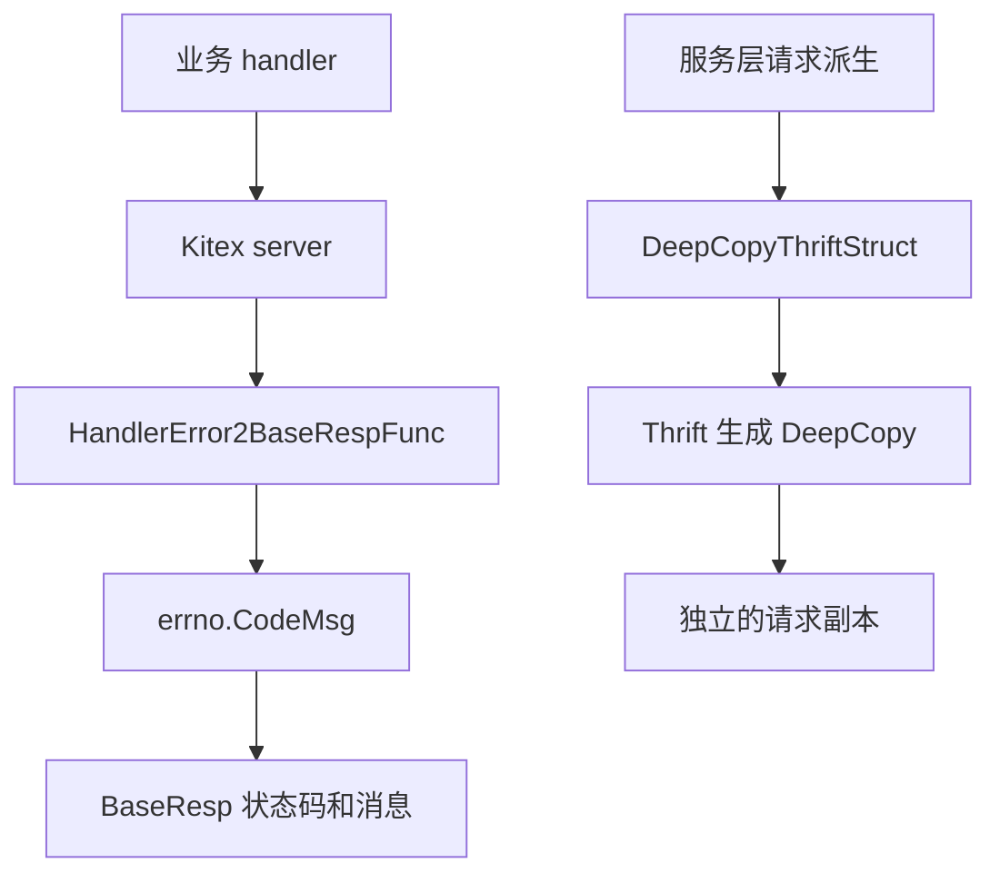

# Other — util

## util 模块

`util` 包提供仓库内跨业务模块复用的轻量工具。目前主要包含两类能力：

- `DeepCopyThriftStruct`：对 Kitex/Thrift 生成结构体做类型安全的深拷贝。
- `HandlerError2BaseRespFunc`：把业务 handler 返回的 `error` 转换为 Kitex 需要写入 `BaseResp` 的业务码和消息。

这两个工具都不承载业务规则本身，而是服务于请求对象隔离和统一错误响应这类横切逻辑。

## 深拷贝工具

核心实现位于 `util/deepcopy.go`。

```go
type thriftDeepCopier interface {
	DeepCopy(s interface{}) error
}

func DeepCopyThriftStruct[T any, P interface {
	*T
	thriftDeepCopier
}](obj P) P
```

`DeepCopyThriftStruct` 专门面向 Thrift 生成结构体使用。Kitex 生成代码会为结构体生成 `DeepCopy(s interface{}) error` 方法，例如 `base.BaseResp`、`base.Base`、`compound.QueryReq`、`compound.WhereClause`、`compound.SetAttrReq` 等。该工具通过 Go 泛型约束要求入参必须同时满足：

- 是某个结构体 `T` 的指针，即 `*T`
- 实现 `DeepCopy(s interface{}) error`

因此调用方可以直接传入具体 Thrift 结构体指针，返回值仍保持同样的静态类型，不需要类型断言。

### 执行逻辑

`DeepCopyThriftStruct` 的逻辑很短：

1. 如果 `obj == nil`，直接返回 `nil`。
2. 使用 `new(T)` 创建同类型的新对象。
3. 调用新对象的 `DeepCopy(obj)`，把原对象内容复制到新对象。
4. 返回新对象。

```go
func DeepCopyThriftStruct[T any, P interface {
	*T
	thriftDeepCopier
}](obj P) P {
	if obj == nil {
		return nil
	}

	var newObj P = new(T)
	_ = newObj.DeepCopy(obj)

	return newObj
}
```

这里忽略 `DeepCopy` 的错误，因为泛型约束已经保证源对象和目标对象属于同一 Thrift 结构体类型；在正常生成代码路径下不会出现类型不匹配。

### 使用场景

这个工具主要用于“基于请求对象派生新条件，但不能修改原始请求”的场景。服务层经常需要在原始 `WhereClause` 上追加 `Ids`、注入分片键或构造内部查询条件，如果直接修改 `req.Where`，会污染调用方传入的请求对象，并可能影响后续重试、回滚、日志或其他分支逻辑。

典型用法来自 `fuxi/core/service/service.go`：

```go
where := generic.InitIfNil(util.DeepCopyThriftStruct(req.Where), compound.NewWhereClause)
where.Ids = sli.AppendIfAbsentStr(where.Ids, id)
where = injectShardingKeysIntoWhere(where, resolvedSK)
```

这里的意图是：

- 先复制 `req.Where`
- 如果原请求没有 `Where`，用 `compound.NewWhereClause` 初始化
- 在副本上追加 ID 和分片键
- 保证 `req.Where` 本身不被修改

类似模式也出现在 `Del`、`SetAttr`、`DelAttr`、`TTL`、`queryWithFilter` 等路径中。它们都把 `DeepCopyThriftStruct` 当作“请求派生前的隔离层”。

### 被测试覆盖的行为

`util/deepcopy_test.go` 覆盖了以下情况：

- 基础结构体字段复制，例如 `compound.Version`
- 嵌套结构体复制，例如 `base.Base.TrafficEnv`
- map 字段复制，例如 `base.Base.Extra`
- slice 字段复制，例如 `compound.SetAttrReq.Values`、`compound.QueryReq.Select`
- nil 指针输入返回 nil
- 修改拷贝对象不会影响原对象

这些测试确认了该函数依赖的是 Thrift 生成代码的深拷贝语义，而不是浅拷贝。

## 业务错误响应转换

核心实现位于 `util/biz_handler_err.go`。

```go
var HandlerError2BaseRespFunc = func(
	ctx context.Context,
	bizHandlerErr error,
) (writeBase bool, code int32, msg string, extra map[string]string) {
	code, message := errno.CodeMsg(bizHandlerErr)
	return true, code, message, nil
}
```

`HandlerError2BaseRespFunc` 是传给 Kitex server 的业务错误转换函数。它在 `main.go` 中注册：

```go
svr := compoundservice.NewServer(new(handler.CompoundServiceImpl),
	byted.WithBizHandlerError2BizCodeMsgFunc(util.HandlerError2BaseRespFunc),
	server.WithMiddleware(middleware.LogMidware[*base.BaseResp]("cpd")),
	server.WithMiddleware(middleware.DownstreamRateLimitMiddleware),
)
```

注册后，当业务 handler 返回 error 时，Kitex 会调用该函数决定是否写入 `BaseResp`，以及写入什么业务码和消息。

### 错误码来源

该函数本身不判断错误类型，而是委托给 `errno.CodeMsg`：

```go
func CodeMsg(err error) (int32, string) {
	if err == nil {
		return 0, "success"
	}
	var e *CompoundError
	if errors.As(err, &e) {
		return e.Code, e.Msg
	}
	return 5000, fmt.Sprintf("rpc request error: %s", err.Error())
}
```

因此当前映射规则是：

| 输入错误 | `code` | `msg` |
|---|---:|---|
| `nil` | `0` | `"success"` |
| `*errno.CompoundError` | `CompoundError.Code` | `CompoundError.Msg` |
| 其他 `error` | `5000` | `"rpc request error: <err.Error()>"` |

`HandlerError2BaseRespFunc` 固定返回 `writeBase = true`，表示无论错误内容如何，都让框架把转换后的业务码和消息写入响应的 `BaseResp`。`extra` 当前固定为 `nil`。

## 模块关系



`util` 位于业务服务和基础设施之间：

- 对服务层，`DeepCopyThriftStruct` 提供请求对象隔离，避免内部查询、CAS 写入、TTL 查询等逻辑修改原始请求。
- 对 RPC 框架，`HandlerError2BaseRespFunc` 提供统一的 error 到 `BaseResp` 转换入口。
- 对生成代码，`DeepCopyThriftStruct` 直接依赖 Thrift 结构体自带的 `DeepCopy` 方法，不重新实现字段级复制逻辑。

## 贡献注意事项

新增使用 `DeepCopyThriftStruct` 的代码时，应只传入 Kitex/Thrift 生成结构体指针。普通 Go struct 如果没有实现 `DeepCopy(s interface{}) error`，无法通过泛型约束编译。

当代码需要修改请求中的 `Where`、`Filter`、`Ids`、`Values`、`Base` 或其他引用字段时，优先复制后再修改：

```go
where := generic.InitIfNil(util.DeepCopyThriftStruct(req.Where), compound.NewWhereClause)
where.Ids = append(where.Ids, req.ID)
```

不要用简单赋值替代：

```go
where := req.Where // 这会共享底层指针，后续修改会影响原请求
```

调整 `HandlerError2BaseRespFunc` 时，需要同步确认 `errno.CodeMsg` 的语义和 Kitex 的 `byted.WithBizHandlerError2BizCodeMsgFunc` 调用约定。特别是 `writeBase`、`extra` 和非 `CompoundError` 的兜底错误码，都会直接影响客户端看到的 `BaseResp`。