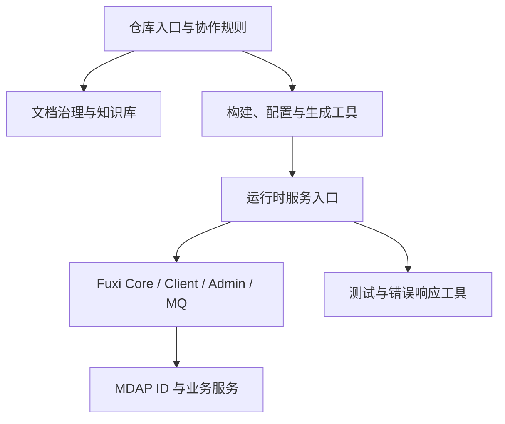

# Other

## 模块概览

`Other` 汇总仓库根入口、文档治理、构建配置、RPC 接入层、Fuxi 基础能力、MDAP 能力和辅助工具。它不是单一运行时模块，而是一组支撑 Compound 服务开发、构建、文档化和运行的外围与横切模块。

整体上可以分为四层：

## 子模块协作方式

仓库入口由 [README.md](readme-md.md)、[AGENTS.md](agents-md.md)、[CLAUDE.md](claude-md.md) 和 [constitution.md](constitution-md.md) 共同定义：`README.md` 给出项目身份，`AGENTS.md` 路由 agent 规则，`CLAUDE.md` 约束开发、测试、提交和文档写作，`constitution.md` 提供最高优先级红线。

文档体系集中在 [docs](docs.md)，并继续拆分为 [overview](overview.md)、[architecture](architecture.md)、[api](api.md)、[operations](operations.md)、[changes](changes.md)、[archive](archive.md)、[specs](specs.md)、[decisions](decisions.md) 和 [research](research.md)。这些模块共同形成从项目背景、架构说明、接口契约、运维 SOP、进行中变更、归档记录到 living spec 的闭环。

构建和工程元数据由 [build.sh](build-sh.md)、[script](script.md)、[conf](conf.md)、[compound](compound.md)、[go.mod](go-mod.md)、[idl](idl.md)、[kitex_info.yaml](kitex-info-yaml.md) 和 [pipeline_meta.json](pipeline-meta-json.md) 承接。它们分别负责产物打包、服务启动与远程单测、服务内联配置、运行时 YAML、依赖解析、Kitex 代码生成、服务元信息和 CI 作业索引。

运行时能力围绕 [handler](handler.md)、[core](core.md)、[client](client.md)、[rocketmq](rocketmq.md)、[fuxi_admin](fuxi-admin.md)、[comm](comm.md)、[errno](errno.md) 和 [util](util.md) 展开。`handler` 接收 Kitex RPC，请求下沉到 `core` 的服务层和存储抽象；`client` 适配 Bytedoc、ODA、Abase 等外部系统；`rocketmq` 发布变更事件并触发 GSI 同步；`fuxi_admin` 提供管理面；`comm`、`errno`、`util` 提供中间件、错误码和通用工具。

MDAP 相关能力由 [id](id.md) 和 [service](service.md) 组成：`mdap/id` 负责资源 ID 的生成、解析和校验，`mdap/service` 将资产组、Source、Artifact 等业务对象转换为 Compound/Fuxi Core 的读写请求。

测试覆盖集中在 [test_handler](test-handler.md)，它通过真实 Handler、Meta、Doc、IDX、MQ mock 和文件存储验证端到端行为，补足 RPC 层、GSI 链路、TTL、版本冲突和多存储路径的回归保障。

## 关键跨模块流程

RPC 数据面从 `idl` 生成的契约进入 `handler`，再调用 `core` 服务层；服务层通过 `client` 的 `MetaStorage` 实现访问 Bytedoc、ODA 或 Abase，并通过 `rocketmq` 发布变更事件。错误由 `errno` 和 `util` 统一转换为 `BaseResp`。

GSI 相关流程横跨 `handler`、`core`、`rocketmq`、`client` 和文档体系：写入产生事件，`rocketmq` 判断同步目标并处理大消息卸载，索引服务消费事件维护索引；相关约束和演进记录由 `architecture`、`specs`、`changes`、`archive` 和 `operations` 共同维护。

文档与变更流程从 `AGENTS.md`、`CLAUDE.md` 和 `docs/AGENTS.md` 进入，进行中设计写入 `changes`，验收后归档到 `archive`，当前行为契约沉淀到 `specs`，重要架构选择进入 `decisions`，背景和术语则回到 `overview`。

构建发布流程由 `build.sh` 汇总：复制 `script` 和 `conf`，根据环境选择普通二进制、覆盖率二进制或 SCM 内联路径；`pipeline_meta.json` 指向 CI 单测作业，`script/run_remote_ut.sh` 则承接远程测试执行。