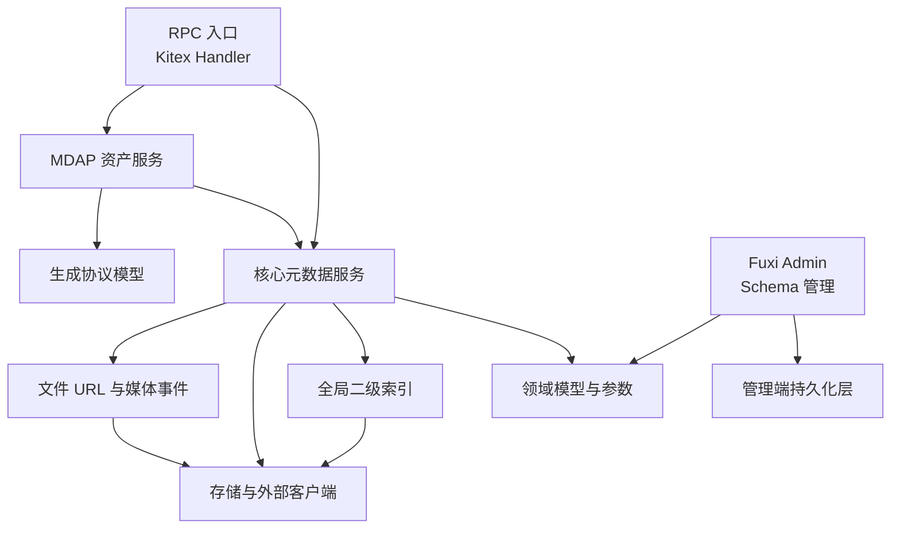

# compound — Wiki

# Compound

Compound 是视频架构的元数据管理服务，负责承接上游 RPC/HTTP 请求，完成对象元数据读写、查询、索引维护、文件 URL 签名、MDAP 资产管理，以及 Fuxi Admin 的 Schema 与配置管理。代码库以 Go 1.23 构建，服务侧主要使用 Kitex 作为 RPC 框架，Hertz 用于 Admin HTTP 服务。

新开发者可以先把 Compound 理解成三条主线：运行时请求从 [RPC Entry Points](rpc-entry-points.md) 进入，核心元数据能力由 [Core Metadata Service](core-metadata-service.md) 编排，底层索引、存储、协议模型和通用工具分别由 [Global Secondary Indexing](global-secondary-indexing.md)、[Storage and External Clients](storage-and-external-clients.md)、[Generated RPC and Protocol Models](generated-rpc-and-protocol-models.md) 与 [Common Utilities](common-utilities.md) 支撑。MDAP 相关资产生命周期则集中在 [MDAP Assets and Processing](mdap-assets-and-processing.md)。



## 代码库如何分层

Compound 的服务入口层很薄。[RPC Entry Points](rpc-entry-points.md) 中的 `main.go` 负责启动 Kitex server，`handler/handler.go` 中的 `CompoundServiceImpl` 把 IDL 生成的方法转发到内部服务。handler 会做必要的参数校验和响应组装，但核心业务逻辑不会停留在入口层。

核心业务集中在 [Core Metadata Service](core-metadata-service.md)。这里负责 `Query`、`SetAttr`、`Del`、`DelAttr`、`Count`、`CopyAttr` 等元数据操作的流程编排：解析 space/schema/id，校验属性与请求参数，选择元数据存储，触发索引查询或写入，并在需要时投递变更事件。业务错误统一通过 `errno` 转成稳定的返回码和消息。

查询性能和索引一致性由 [Global Secondary Indexing](global-secondary-indexing.md) 支撑。主表属性会映射到 posting collection，查询时可以先通过索引命中 `oid`，再由核心服务回表读取完整元数据。索引维护逻辑主要在 `fuxi/core/service/index.go`，posting 存储能力通过 `fuxi/core/service/idx/*` 的 `idx.Operator` 暴露。

[Storage and External Clients](storage-and-external-clients.md) 是业务代码访问外部系统的边界。`client` 侧封装 Bytedoc、Abase、ODA KV、账号、桶元数据、VDA、视频删除等元数据和业务系统；`core/storage` 侧封装对象上传、读取、探测、删除和复制。上层通常通过 `iface.MetaStorage` 或包级 helper 调用这些能力，而不是直接依赖底层 SDK。

[Domain Models and Parameters](domain-models-and-parameters.md) 提供跨模块共享的数据结构和边界转换能力，包括配置 key、系统字段、索引 typed value、scope、请求参数解析、HLC 版本封装、属性校验和查询包装器。它是 `core`、`idx`、`mdap`、`admin` 等模块共同依赖的基础模型层。

[Generated RPC and Protocol Models](generated-rpc-and-protocol-models.md) 位于 `kitex_gen/` 和 `proto_gen/`，承载 Thrift/Protobuf 生成的请求、响应、枚举、服务接口和 codec 代码。协议字段和方法签名的权威来源是 `idl/*.thrift` 与 `.proto` 文件；需要调整接口时，应修改上游协议定义后重新生成。

## 关键端到端流程

一次普通元数据查询通常从 Kitex handler 开始：`handler/handler.go` 接收请求后调用 `core/service`，核心服务通过 `params` 和 `wrapper` 解析请求上下文与属性约束。如果请求可以走索引，流程会进入 [Global Secondary Indexing](global-secondary-indexing.md) 查 posting collection，再回到主存储读取元数据；否则直接通过 [Storage and External Clients](storage-and-external-clients.md) 访问对应后端。过程中 [Common Utilities](common-utilities.md) 会参与日志、指标、响应封装、时间统计和上下文处理。

一次元数据写入或删除会由 [Core Metadata Service](core-metadata-service.md) 编排主表变更、索引维护和事件副作用。核心服务写入存储后，会根据 schema 与索引配置同步维护唯一索引或非唯一索引；涉及媒体或文件变更时，还会通过 [File URL and Media Operations](file-url-and-media-operations.md) 中的 RocketMQ 事件路径通知订阅方。较大的事件内容会先上传到对象存储，再在 MQ 消息中保留引用指针。

MDAP 资产流程从 RPC handler 进入 [MDAP Assets and Processing](mdap-assets-and-processing.md)。`mdap/service` 负责 AssetGroup、Source、Artifact 的校验、ID 生成或解析、摘要兼容转换和处理任务启动；实际元数据读写仍复用 [Core Metadata Service](core-metadata-service.md)。例如批量查询 AssetGroup 时，handler 会进入 `mdap/service`，再调用核心 `Query` 流程，并通过通用 timing 工具记录执行耗时。

Admin 侧是另一条独立入口。[Admin API and Schema Management](admin-api-and-schema-management.md) 使用 Hertz 启动 Fuxi Admin HTTP 服务，注册日志与联邦代理中间件，然后初始化 DAL 和业务 handler。Schema、binding、configuration 等管理数据最终落到 [Admin Persistence Layer](admin-persistence-layer.md)，该层基于 GORM 与 `gorm.io/gen` 生成的强类型 Query API 屏蔽表前缀、事务和 JSON 序列化细节。

## 本地开发入口

仓库模块路径是：

```text
code.byted.org/videoarch/compound
```

Go 版本要求为：

```text
go 1.23.2
```

首次进入代码库时，建议先阅读 `README.md`、`CLAUDE.md` 和 `docs/README.md`，确认本仓库的开发、测试、提交和文档约束。接口契约集中在 [Interface Definitions and Tooling](interface-definitions-and-tooling.md)；响应码常量可从 [Response Fixtures](response-fixtures.md) 开始查；横切工具和中间件可参考 [Common Utilities](common-utilities.md)。

常见启动与排查路径是：先从 [RPC Entry Points](rpc-entry-points.md) 找到对外方法，再跳到对应的 [Core Metadata Service](core-metadata-service.md) 或 [MDAP Assets and Processing](mdap-assets-and-processing.md) 服务实现；如果问题涉及查询性能或索引一致性，继续进入 [Global Secondary Indexing](global-secondary-indexing.md)；如果问题涉及后端存储、账号、桶、VDA 或对象操作，则进入 [Storage and External Clients](storage-and-external-clients.md)。