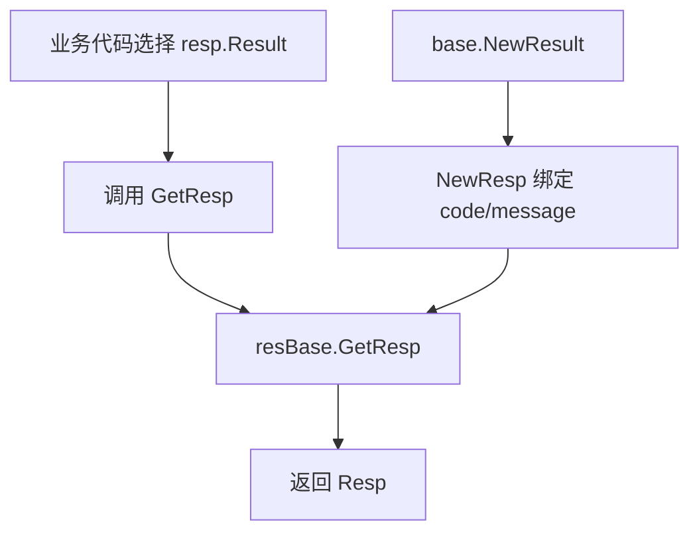

# Response Fixtures

# Response Fixtures

`Response Fixtures` 是一组位于 `fuxi/core/consts/*_resp` 下的响应码定义包，用于把业务场景中的抽象结果映射成 Kitex `BaseResp` 可用的标准响应结构。

这些包不处理业务逻辑，只负责声明：

- 可复用的 `resp.Result` 标识；
- 每个标识对应的错误码与错误信息；
- 通过 `GetResp` 将 `resp.Result` 转成 `*resp.Resp[*gen_base.BaseResp]`。

## 核心设计

每个响应包通常分成两层：

1. `base` 子包：只创建结果标识。
2. 顶层响应包：把结果标识绑定到具体响应码和文案。

典型结构如下：

```go
// base/base.go
var InvalidParam = resp.NewResult()
var InternalError = resp.NewResult()
```

```go
// query.go / set_meta.go / mdap.go 等
var resBase = resp.NewResultBase[*gen_base.BaseResp]()

var InvalidParam = resBase.NewResp(base.InvalidParam, 4001, "Invalid Param")
var InternalError = resBase.NewResp(base.InternalError, 4002, "Internal Error")

func GetResp(ctx context.Context, res resp.Result) *resp.Resp[*gen_base.BaseResp] {
	return resBase.GetResp(res)
}
```

这里的关键点是：`base.InvalidParam` 这类变量提供稳定的 `resp.Result` 身份，顶层包通过 `resBase.NewResp` 给它绑定具体的 code/message。业务代码只需要传入对应的 `resp.Result`，再由 `GetResp` 取回统一响应。



## 与 `resp` 工具包的关系

本模块依赖 `fuxi/comm/utils/resp` 提供的三类能力：

- `resp.NewResult()`：创建一个结果标识。
- `resp.NewResultBase[*gen_base.BaseResp]()`：创建面向 `kitex_gen/base.BaseResp` 的响应注册器。
- `resBase.NewResp(result, code, msg)`：注册某个 `resp.Result` 对应的响应码和信息。
- `resBase.GetResp(result)`：按 `resp.Result` 取回响应对象。

所有响应包都以 `gen_base.BaseResp` 作为底层响应结构，因此这些 fixtures 主要服务于 Kitex RPC 返回值中的基础响应字段。

## 包与错误码段

### `set_meta_resp`

用于 SetMeta / SetAttr 类写入场景。

定义在：

- `fuxi/core/consts/set_meta_resp/base/base.go`
- `fuxi/core/consts/set_meta_resp/set_meta.go`

响应项：

| 变量 | code | message |
|---|---:|---|
| `Success` | `resp.SuccessCode` | `resp.SuccessMsg` |
| `InvalidParam` | `1001` | `Invalid Param` |
| `InternalError` | `1002` | `Internal Error` |
| `ArrayIncompleteSet` | `1003` | `Incomplete Array Set` |
| `ConcurrentUpdate` | `1004` | `Concurrent Update` |
| `AlreadyExists` | `1005` | `Already Exists` |
| `BandwidthLimitExceeded` | `8001` | `Bandwidth Limit Exceeded` |

`AlreadyExists` 专门用于 `SetAttr` 在 `WriteMode=InsertOnly` 下发现对象已存在的场景，注释中建议 HTTP 映射为 `409 Conflict`。

### `copy_resp`

用于复制类接口响应。

定义在：

- `fuxi/core/consts/copy_resp/base/base.go`
- `fuxi/core/consts/copy_resp/copy.go`

响应项：

| 变量 | code | message |
|---|---:|---|
| `Success` | `resp.SuccessCode` | `resp.SuccessMsg` |
| `InvalidParam` | `2001` | `Invalid Param` |
| `InternalError` | `2002` | `Internal Error` |
| `NotFound` | `2003` | `Source ID Record Not Found` |

`GetResp(ctx context.Context, res resp.Result)` 接收 `context.Context`，但当前实现未使用 `ctx`。

### `del_attr_resp`

用于删除属性场景。

定义在：

- `fuxi/core/consts/del_attr_resp/base/base.go`
- `fuxi/core/consts/del_attr_resp/del_attr.go`

响应项：

| 变量 | code | message |
|---|---:|---|
| `Success` | `resp.SuccessCode` | `resp.SuccessMsg` |
| `InvalidParam` | `3001` | `Invalid Param` |
| `InternalError` | `3002` | `Internal Error` |
| `NotFound` | `3003` | `Not Found` |
| `ArrayIncompleteDelete` | `3004` | `Incomplete Array Delete` |

该包的 `GetResp(res resp.Result)` 不接收 `context.Context`。

### `query_resp`

用于查询类接口响应。

定义在：

- `fuxi/core/consts/query_resp/base/base.go`
- `fuxi/core/consts/query_resp/query.go`

响应项：

| 变量 | code | message |
|---|---:|---|
| `Success` | `resp.SuccessCode` | `resp.SuccessMsg` |
| `InvalidParam` | `4001` | `Invalid Param` |
| `InternalError` | `4002` | `Internal Error` |

### `del_resp`

用于删除对象或记录场景。

定义在：

- `fuxi/core/consts/del_resp/base/base.go`
- `fuxi/core/consts/del_resp/del.go`

响应项：

| 变量 | code | message |
|---|---:|---|
| `Success` | `resp.SuccessCode` | `resp.SuccessMsg` |
| `InvalidParam` | `5001` | `Invalid Param` |
| `InternalError` | `5002` | `Internal Error` |
| `NotFound` | `5003` | `Not Found` |

### `count_resp`

用于计数查询场景。

定义在：

- `fuxi/core/consts/count_resp/base/base.go`
- `fuxi/core/consts/count_resp/query.go`

响应项：

| 变量 | code | message |
|---|---:|---|
| `Success` | `resp.SuccessCode` | `resp.SuccessMsg` |
| `InvalidParam` | `6001` | `Invalid Param` |
| `InternalError` | `6002` | `Internal Error` |

### `pack_url_resp`

用于 URI 打包、bucket/domain 解析相关场景。

定义在：

- `fuxi/core/consts/pack_url_resp/base/base.go`
- `fuxi/core/consts/pack_url_resp/pack_url.go`

响应项：

| 变量 | code | message |
|---|---:|---|
| `Success` | `resp.SuccessCode` | `resp.SuccessMsg` |
| `InvalidParam` | `7001` | `Invalid Param` |
| `BucketNotFound` | `7002` | `Bucket Not Found For Uri` |
| `DomainNotFound` | `7003` | `Domain Not Found For Uri` |
| `ErrUnsupportedDomainType` | `7004` | `Unsupported Domain Type` |
| `InternalErr` | `7005` | `Internal Error` |
| `PermissionDenied` | `7006` | `Permission Denied` |

注意：该包当前没有定义 `GetResp` 函数。如果业务侧需要和其他响应包保持一致，需要直接使用已注册的响应变量，或补充同样形式的 `GetResp(res resp.Result)` 封装。

### `ttl_resp`

用于 TTL 清理、过期判断、状态校验相关场景。

定义在：

- `fuxi/core/consts/ttl_resp/base/base.go`
- `fuxi/core/consts/ttl_resp/ttl.go`

响应项：

| 变量 | code | message |
|---|---:|---|
| `Success` | `resp.SuccessCode` | `resp.SuccessMsg` |
| `InvalidParam` | `1000001` | `Invalid Param` |
| `InternalError` | `1000002` | `Internal Error` |
| `NotFound` | `1000003` | `Not Found` |
| `NoTTLCfg` | `1000004` | `No TTL Config` |
| `NotExpired` | `1000005` | `Not Expired` |
| `InvalidState` | `1000006` | `Invalid Data State` |

### `idx_update_resp`

用于索引更新场景。

定义在：

- `fuxi/core/consts/idx_update_resp/base/base.go`
- `fuxi/core/consts/idx_update_resp/update_idx.go`

响应项：

| 变量 | code | message |
|---|---:|---|
| `Success` | `resp.SuccessCode` | `resp.SuccessMsg` |
| `InvalidParam` | `1001001` | `Invalid Param` |
| `InternalError` | `1001002` | `Internal Error` |

实现细节需要注意：`update_idx.go` 当前导入的是 `fuxi/core/consts/copy_resp/base`，而不是同目录下的 `idx_update_resp/base`。因此 `idx_update_resp.Success`、`InvalidParam`、`InternalError` 实际绑定的是 `copy_resp/base` 中创建的 `resp.Result` 标识。与此同时，`idx_update_resp/base/base.go` 中的 `NotFound` 等标识当前未被顶层响应包使用。

### `idx_refresh_resp`

用于索引刷新场景。

定义在：

- `fuxi/core/consts/idx_refresh_resp/base/base.go`
- `fuxi/core/consts/idx_refresh_resp/query.go`

响应项：

| 变量 | code | message |
|---|---:|---|
| `Success` | `resp.SuccessCode` | `resp.SuccessMsg` |
| `InvalidParam` | `1002001` | `Invalid Param` |
| `InternalError` | `1002002` | `Internal Error` |

`base` 中声明了 `NotFound`，但顶层包当前没有注册对应响应。

### `idx_repair_entry_resp`

用于 `RepairIdxEntryForInternal` RPC。

定义在：

- `fuxi/core/consts/idx_repair_entry_resp/base/base.go`
- `fuxi/core/consts/idx_repair_entry_resp/query.go`

响应项：

| 变量 | code | message |
|---|---:|---|
| `Success` | `resp.SuccessCode` | `resp.SuccessMsg` |
| `InvalidParam` | `1003001` | `Invalid Param` |
| `InternalError` | `1003002` | `Internal Error` |

包注释明确该错误码段为 `1003xxx`，与 `idx_update_resp` 的 `1001xxx`、`idx_refresh_resp` 的 `1002xxx` 相邻。

### `idx_repair_bucket_resp`

用于 `RepairIdxBucketForInternal` RPC。

定义在：

- `fuxi/core/consts/idx_repair_bucket_resp/base/base.go`
- `fuxi/core/consts/idx_repair_bucket_resp/query.go`

响应项：

| 变量 | code | message |
|---|---:|---|
| `Success` | `resp.SuccessCode` | `resp.SuccessMsg` |
| `InvalidParam` | `1004001` | `Invalid Param` |
| `InternalError` | `1004002` | `Internal Error` |

包注释明确该错误码段为 `1004xxx`，与 `idx_repair_entry_resp` 的 `1003xxx` 相邻。

### `mdap_resp`

用于 MDAP 相关接口，覆盖通用错误、AssetGroup、Processing、Source、Artifact 等子域。

定义在：

- `fuxi/core/consts/mdap_resp/base/base.go`
- `fuxi/core/consts/mdap_resp/mdap.go`

通用响应项：

| 变量 | code | message |
|---|---:|---|
| `Success` | `resp.SuccessCode` | `resp.SuccessMsg` |
| `InvalidParam` | `2001001` | `Invalid Param` |
| `InternalError` | `2001002` | `Internal Error` |
| `NotFound` | `2001003` | `Not Found` |
| `AlreadyExists` | `2001004` | `Already Exists` |
| `PermissionDenied` | `2001005` | `Permission Denied` |

`PermissionDenied` 使用 `base.InvalidParam` 作为底层 `resp.Result` 标识注册，这意味着它和 `InvalidParam` 共享同一个基础结果身份。维护时需要确认这是有意复用，还是应该在 `base` 中新增独立的 `PermissionDenied` 标识。

AssetGroup 响应项：

| 变量 | code | message |
|---|---:|---|
| `CreateAssetGroupFailed` | `2002001` | `Create AssetGroup Failed` |
| `MGetAssetGroupsFailed` | `2002002` | `MGet AssetGroups Failed` |
| `QueryAssetGroupsFailed` | `2002003` | `Query AssetGroups Failed` |
| `UpdateAssetGroupFailed` | `2002004` | `Update AssetGroup Failed` |
| `DeleteAssetGroupFailed` | `2002005` | `Delete AssetGroup Failed` |

Source 响应项：

| 变量 | code | message |
|---|---:|---|
| `CreateSourceFailed` | `2003001` | `Create Source Failed` |
| `MGetSourcesFailed` | `2003002` | `MGet Sources Failed` |
| `QuerySourcesFailed` | `2003003` | `Query Sources Failed` |
| `UpdateSourceFailed` | `2003004` | `Update Source Failed` |

Artifact 响应项：

| 变量 | code | message |
|---|---:|---|
| `CreateArtifactFailed` | `2004001` | `Create Artifact Failed` |
| `MGetArtifactsFailed` | `2004002` | `MGet Artifacts Failed` |
| `QueryArtifactsFailed` | `2004003` | `Query Artifacts Failed` |

Processing 响应项：

| 变量 | code | message |
|---|---:|---|
| `StartProcessingAssetGroupNotFound` | `2005001` | `StartProcessing AssetGroup Not Found` |

## 使用方式

业务代码通常不直接构造 `BaseResp`，而是引用对应场景包中的结果变量：

```go
import (
	"context"

	"code.byted.org/videoarch/compound/fuxi/core/consts/query_resp"
)

func buildBaseResp(ctx context.Context, invalid bool) any {
	if invalid {
		return query_resp.GetResp(ctx, query_resp.InvalidParam)
	}

	return query_resp.GetResp(ctx, query_resp.Success)
}
```

对于没有 `context.Context` 参数的包，例如 `set_meta_resp`、`del_attr_resp`、`mdap_resp`：

```go
import "code.byted.org/videoarch/compound/fuxi/core/consts/set_meta_resp"

func buildSetMetaResp(conflict bool) any {
	if conflict {
		return set_meta_resp.GetResp(set_meta_resp.AlreadyExists)
	}

	return set_meta_resp.GetResp(set_meta_resp.Success)
}
```

## 扩展新响应码

新增响应码时，保持现有两层结构：

1. 在对应 `base/base.go` 中声明新的 `resp.Result`。
2. 在顶层包中使用 `resBase.NewResp` 绑定 code/message。
3. 如该包已有 `GetResp`，无需改动调用方式。
4. 选择错误码时遵循已有段位，避免跨业务域复用。

示例：

```go
// base/base.go
var PermissionDenied = resp.NewResult()
```

```go
// xxx.go
var PermissionDenied = resBase.NewResp(base.PermissionDenied, 9001, "Permission Denied")
```

如果新增的是全新业务域，建议沿用目录结构：

```text
fuxi/core/consts/<domain>_resp/
  base/base.go
  <domain>.go
```

## 维护注意事项

`GetResp` 的签名目前不完全统一：多数包使用 `GetResp(ctx context.Context, res resp.Result)`，但 `set_meta_resp`、`del_attr_resp`、`mdap_resp` 使用 `GetResp(res resp.Result)`，`pack_url_resp` 没有 `GetResp`。调用侧需要按具体包的实际签名使用。

部分 `base` 标识声明后没有被顶层包注册，例如 `idx_refresh_resp/base.NotFound`、`idx_update_resp/base.NotFound`。这类声明不会自动变成可返回响应，只有经过 `resBase.NewResp` 注册后才参与映射。

响应变量应避免共享错误的 `base` 标识。`idx_update_resp` 当前导入 `copy_resp/base`，`mdap_resp.PermissionDenied` 当前复用 `base.InvalidParam`，这些实现会影响 `resp.Result` 到响应对象的映射关系。修改或新增响应码时，应优先确认 `base` 标识是否来自当前业务域。