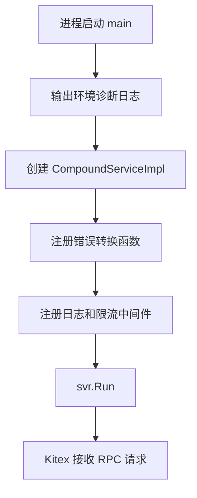

# RPC Entry Points

## 模块职责

RPC Entry Points 是 Compound 服务的 Kitex 入口层，负责启动 RPC Server，并把 IDL 生成的 RPC 方法接入到内部业务服务。入口层本身不承载核心业务逻辑，主要完成四类工作：

1. 服务启动与中间件装配：`main.go` 创建 `compoundservice.NewServer`，注册业务实现和通用中间件。
2. RPC 请求参数的轻量校验：例如索引刷新、TTL、索引修复接口会在 handler 层拒绝明显非法请求。
3. 调用内部服务：Fuxi 相关能力转发到 `fuxi/core/service`，MDAP 相关能力转发到 `mdap/service`。
4. 组装 RPC 响应：将内部 `resp` 类型转换为 `base.BaseResp`，并填充业务返回字段。

核心实现位于：

- `main.go`：服务进程入口。
- `handler/handler.go`：`CompoundServiceImpl`，实现 IDL 生成的 Compound Service 接口。
- `harden/init.go`：初始化全局 `HardenClient`。

## 启动流程

`main()` 会先输出启动诊断日志，记录当前运行环境信息：

```go
log.V2.Info().Str("compound: startup diagnostic").KVs(
    "env_cluster", env.Cluster(),
    "env_idc", env.IDC(),
    "env_psm", env.PSM(),
    "tce_cluster", os.Getenv("TCE_CLUSTER"),
    "service_cluster", os.Getenv("SERVICE_CLUSTER"),
    "tce_psm", os.Getenv("TCE_PSM"),
).Emit()
```

随后通过 `compoundservice.NewServer` 创建 Kitex Server：

```go
svr := compoundservice.NewServer(new(handler.CompoundServiceImpl),
    byted.WithBizHandlerError2BizCodeMsgFunc(util.HandlerError2BaseRespFunc),
    server.WithMiddleware(middleware.LogMidware[*base.BaseResp]("cpd")),
    server.WithMiddleware(middleware.DownstreamRateLimitMiddleware),
)
```

这里注册了三个关键扩展点：

- `new(handler.CompoundServiceImpl)`：RPC 方法的实际实现。
- `util.HandlerError2BaseRespFunc`：将业务 handler 返回的错误转换为 BizCode/BizMsg。
- `middleware.LogMidware[*base.BaseResp]("cpd")`：统一日志中间件。
- `middleware.DownstreamRateLimitMiddleware`：下游限流中间件。

服务退出前通过 `defer` 调用 `log.V2.Flush()` 和 `log.V2.Close()`，确保日志被刷出。



## `CompoundServiceImpl` 的定位

`CompoundServiceImpl` 是 IDL 生成服务接口的实现类型：

```go
type CompoundServiceImpl struct{}
```

它的方法基本遵循同一种结构：

```go
func (s *CompoundServiceImpl) SomeRPC(ctx context.Context, req *SomeReq) (*SomeResp, error) {
    res, data := service.SomeOperation(ctx, req)
    return &SomeResp{
        BaseResp: res.ToBaseResp(ctx),
        Data:     data,
    }, nil
}
```

入口层通常返回 `nil` error，并通过 `BaseResp` 表达业务成功或失败。只有服务启动失败时，`main()` 会记录错误并 `panic(err)`。

## Fuxi 数据接口

Fuxi 相关 RPC 主要转发到 `code.byted.org/videoarch/compound/fuxi/core/service`，在 handler 中使用别名 `fuxi_s`。

### `Count`

`Count(ctx, req)` 调用 `fuxi_s.Count(ctx, req)`，返回 `BaseResp` 和计数值：

```go
resp, count := fuxi_s.Count(ctx, req)
return &compound.CountResp{
    BaseResp: resp.ToBaseResp(ctx),
    Count:    count,
}, nil
```

### `TTL`

`TTL(ctx, req)` 在入口层校验 `space`、`schema`、`id` 是否为空。任一为空时返回 `ttl_resp.InvalidParam`。

校验通过后调用：

```go
resp := fuxi_s.TTL(ctx, req)
```

并将结果写入 `compound.TTLResp.BaseResp`。

### `SetAttr`

`SetAttr(ctx, req)` 调用 `fuxi_s.SetAttr(ctx, req)`，并将变更字段通过 `ChangedAttrs` 返回：

```go
res, attrs := fuxi_s.SetAttr(ctx, req)
return &compound.SetAttrResp{
    BaseResp:     res.ToBaseResp(ctx),
    ChangedAttrs: gslice.PtrOf(attrs),
}, nil
```

### `CopyAttr`

`CopyAttr(ctx, req)` 调用 `fuxi_s.CopyAttr(ctx, req)`，返回复制成功的 key 映射：

```go
res, copiedMapping := fuxi_s.CopyAttr(ctx, req)
return &compound.CopyAttrResp{
    BaseResp:   res.ToBaseResp(ctx),
    CopiedKeys: copiedMapping,
}, nil
```

### `DelAttr`

`DelAttr(ctx, req)` 调用 `fuxi_s.DelAttr(ctx, req)`，返回删除字段：

```go
res, deletedKeys := fuxi_s.DelAttr(ctx, req)
return &compound.DelAttrResp{
    BaseResp:     res.ToBaseResp(ctx),
    DeletedAttrs: deletedKeys,
}, nil
```

### `Query`

`Query(ctx, req)` 调用 `fuxi_s.Query(ctx, req)`，内部服务直接返回完整的 `compound.QueryResp`，handler 只负责补齐 `BaseResp`：

```go
res, resp := fuxi_s.Query(ctx, req)
resp.SetBaseResp(res.ToBaseResp(ctx))
return resp, nil
```

从执行流看，部分 MDAP 查询最终也会走到 Fuxi 的 `Query` / `QueryWithFuxiAttr`，并通过 `utils/timing` 记录耗时，通过 `utils/cctx` 获取上下文容器。

### `Del`

`Del(ctx, req)` 调用 `fuxi_s.Del(ctx, req)`，只返回 `BaseResp`。

### `GetFileURLs`

`GetFileURLs(ctx, req)` 调用 `fuxi_s.GetFileURLs(ctx, req)`。内部服务返回响应对象，handler 将 `BaseResp` 写回后直接返回：

```go
res, response := fuxi_s.GetFileURLs(ctx, req)
response.BaseResp = res.ToBaseResp(ctx)
return response, nil
```

## 索引维护接口

索引维护接口是该入口层中参数校验最明确的一组接口，主要面向内部调用。

### `RefreshIdxForInternal`

`RefreshIdxForInternal(ctx, req)` 用于刷新指定对象的索引。入口层要求以下字段都非空：

- `req.GetSpace()`
- `req.GetSchema()`
- `req.GetID()`

参数非法时返回：

```go
idx_refresh_resp.InvalidParam.ToBaseResp(ctx)
```

校验通过后调用：

```go
err = fuxi_s.Refresh(ctx, req.GetSpace(), req.GetSchema(), req.GetID())
```

如果 `fuxi_s.Refresh` 返回错误，RPC 响应为 `idx_refresh_resp.InternalError`；否则返回 `idx_refresh_resp.Success`。

### `UpdateIdxWithEventForInternal`

`UpdateIdxWithEventForInternal(ctx, req)` 用于根据事件更新索引。入口层会打印裁剪后的事件：

```go
log.Print(ctx, "UpdateIdxWithEventForInternal %#v", req.TrimmedEvent)
```

当 `req.TrimmedEvent == nil` 时返回 `idx_update_resp.InvalidParam`。校验通过后调用：

```go
err = fuxi_s.HandleEvent(ctx, *req.TrimmedEvent, false)
```

第三个参数固定为 `false`，表示该入口按当前内部事件处理路径执行，不在 handler 层暴露额外模式开关。

需要注意：当前代码直接访问 `req.TrimmedEvent`，没有在方法内处理 `req == nil`。测试中存在 `TestUpdateIdxWithEventForInternal_NilReqPanics`，说明 nil 请求会触发 panic 是当前已知行为，而不是被转换为 `InvalidParam`。

## 索引修复接口

索引修复接口包含入口层限流式参数保护，避免单次 RPC 请求承载过大的修复批次。

```go
const (
    repairIdxEntryItemsLimit = 100
    repairIdxBucketIDsLimit  = 200
)
```

### `RepairIdxEntryForInternal`

`RepairIdxEntryForInternal(ctx, req)` 用于修复指定 `(oid, idx, cols, ver)` 列表对应的索引 entry。代码注释说明服务端会基于主表当前快照自行决策补、删或跳过。

入口层校验：

- `space` 不能为空。
- `schema` 不能为空。
- `items` 数量必须大于 `0`。
- `items` 数量不能超过 `repairIdxEntryItemsLimit`，即 `100`。

校验失败时返回 `idx_repair_entry_resp.InvalidParam`。

校验通过后调用：

```go
results, added, removed, skipped, failed := fuxi_s.RepairIdxEntry(ctx, req)
```

响应中会返回逐项结果和汇总计数：

- `Results`
- `Added`
- `Removed`
- `Skipped`
- `Failed`
- `BaseResp`

handler 还会打印修复摘要日志，包含 `space`、`schema`、总数和各类结果计数。

### `RepairIdxBucketForInternal`

`RepairIdxBucketForInternal(ctx, req)` 用于删除指定 collection 下的“空封口桶”。代码注释明确说明活跃桶和非空桶都会被 skipped。

入口层校验：

- `space` 不能为空。
- `schema` 不能为空。
- `collection` 不能为空。
- `bucket_ids` 数量必须大于 `0`。
- `bucket_ids` 数量不能超过 `repairIdxBucketIDsLimit`，即 `200`。

校验失败时返回 `idx_repair_bucket_resp.InvalidParam`。

校验通过后调用：

```go
results, deleted, skipped, failed := fuxi_s.RepairIdxBucket(ctx, req)
```

响应中返回：

- `Results`
- `Deleted`
- `Skipped`
- `Failed`
- `BaseResp`

该方法同样会打印修复摘要日志。

## MDAP 资源接口

MDAP 相关 RPC 转发到 `code.byted.org/videoarch/compound/mdap/service`。这些方法基本不在 handler 层做参数校验，而是依赖 `mdap/service` 返回统一结果对象。

### AssetGroup

`CreateAssetGroup(ctx, req)` 调用 `service.CreateAssetGroup(ctx, req)`，返回 `AssetGroup`。

`MGetAssetGroups(ctx, req)` 调用 `service.MGetAssetGroups(ctx, req)`，返回 `AssetGroups`。

`UpdateAssetGroup(ctx, req)` 调用 `service.UpdateAssetGroup(ctx, req)`，只返回 `BaseResp`。

`QueryAssetGroups(ctx, req)` 调用 `service.QueryAssetGroups(ctx, req)`，返回 `AssetGroups` 和 `Total`。这里使用 `gptr.Of(total)` 将总数转为指针：

```go
Total: gptr.Of(total),
```

`DeleteAssetGroup(ctx, req)` 调用 `service.DeleteAssetGroup(ctx, req)`，只返回 `BaseResp`。

### Source

`CreateSource(ctx, req)` 调用 `service.CreateSource(ctx, req)`，返回 `Source`。

`MGetSources(ctx, req)` 调用 `service.MGetSources(ctx, req)`，返回 `Sources`。

`QuerySources(ctx, req)` 调用 `service.QuerySources(ctx, req)`，返回 `Sources` 和 `Total`。

`UpdateSource(ctx, req)` 调用 `service.UpdateSource(ctx, req)`，只返回 `BaseResp`。

### Artifact

`CreateArtifact(ctx, req)` 调用 `service.CreateArtifact(ctx, req)`，返回 `Artifact`。

`MGetArtifacts(ctx, req)` 调用 `service.MGetArtifacts(ctx, req)`，返回 `Artifacts`。

`QueryArtifacts(ctx, req)` 调用 `service.QueryArtifacts(ctx, req)`，返回 `Artifacts` 和 `Total`。

### Processing

`StartProcessing(ctx, req)` 调用 `service.StartProcessing(ctx, req)`，返回 `RunId`：

```go
res, runID := service.StartProcessing(ctx, req)
return &compound.StartProcessingResponse{
    BaseResp: res.ToBaseResp(ctx),
    RunId:    runID,
}, nil
```

## 响应组装模式

该模块最重要的约定是：内部服务返回的业务结果对象需要转换为 IDL 中的 `BaseResp`。

常见模式如下：

```go
res := service.SomeOperation(ctx, req)
return &SomeResponse{
    BaseResp: res.ToBaseResp(ctx),
}, nil
```

带业务数据时：

```go
res, entity := service.CreateArtifact(ctx, req)
return &mdap.CreateArtifactResponse{
    BaseResp:  res.ToBaseResp(ctx),
    Artifact:  entity,
}, nil
```

内部服务已经返回完整响应对象时：

```go
res, response := fuxi_s.GetFileURLs(ctx, req)
response.BaseResp = res.ToBaseResp(ctx)
return response, nil
```

因此，新增 RPC 方法时应优先保持这个模式：handler 层只做入口校验、服务调用和响应适配，不把核心业务逻辑放进 `CompoundServiceImpl`。

## 错误处理约定

RPC 方法通常返回 `(*Resp, nil)`，并通过 `BaseResp` 表示业务状态。例如：

- 参数错误：返回对应常量包中的 `InvalidParam`。
- 内部执行错误：返回对应常量包中的 `InternalError`。
- 成功：返回对应常量包中的 `Success`。

索引相关接口使用独立响应常量包：

- `idx_refresh_resp`
- `idx_update_resp`
- `idx_repair_entry_resp`
- `idx_repair_bucket_resp`
- `ttl_resp`

服务级 handler error 到 BizCode/BizMsg 的转换由 `main.go` 中的 `util.HandlerError2BaseRespFunc` 注册到 Kitex Server。

## 与代码生成的关系

`main.go` 中包含 `go:generate` 指令：

```go
//go:generate kitex -disable-self-update -thrift gen_deep_equal=true -module code.byted.org/videoarch/compound -service bytedance.videoarch.compound idl/compound.thrift
```

IDL 变更后，需要通过该指令重新生成 Kitex 代码。`handler.CompoundServiceImpl` 必须实现生成后的服务接口，否则编译会失败。

入口层依赖的生成包包括：

- `kitex_gen/bytedance/videoarch/compound`
- `kitex_gen/bytedance/videoarch/compound/mdap`
- `kitex_gen/bytedance/videoarch/compound/compoundservice`
- `kitex_gen/base`

## `harden` 初始化

`harden/init.go` 定义了一个包级全局客户端：

```go
var HardenClient = harden.NewClient(env.PSM())
```

它使用当前服务的 `env.PSM()` 初始化 `videoarch/harden-sdk/client`。该文件没有直接参与 `main.go` 的启动装配，也没有在 `handler/handler.go` 中被调用；它的作用是为依赖 `harden` 包的其他代码提供统一客户端实例。

## 新增或修改 RPC 方法时的注意事项

新增入口方法时，优先遵循现有分层：

1. 在 handler 中实现 IDL 生成的方法签名。
2. 只在 handler 层做必要的空值、批量上限、必填字段校验。
3. 将核心逻辑放到 `fuxi/core/service` 或 `mdap/service` 等业务层。
4. 使用 `res.ToBaseResp(ctx)` 组装 `BaseResp`。
5. 对批量修复、内部更新等高风险接口增加明确的数量上限和摘要日志。
6. 保持返回 `nil` error 的业务响应风格，除非生成接口或框架约定要求返回真实 error。

对于 nil 请求需要特别谨慎。当前部分方法会通过 `req.GetXxx()` 安全读取字段，但也有方法直接访问字段，例如 `UpdateIdxWithEventForInternal` 使用 `req.TrimmedEvent`。如果要改变 nil 请求行为，应同步调整现有测试预期。