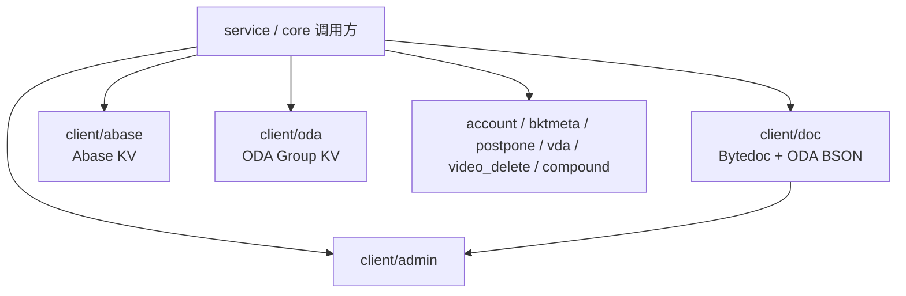

# Storage and External Clients — client

## 模块职责

`fuxi/client` 封装 Compound 对存储系统和外部服务的访问入口。上层业务主要通过 `iface.MetaStorage` 抽象或包级 helper 调用本模块，不直接感知底层是 Bytedoc、Abase、ODA KV，还是账号、配置、视频删除等外部系统。

核心职责包括：

- 提供三类元数据存储实现：`doc.Impl`、`abase.Impl`、`oda.Impl`。
- 从 `admin` 获取 schema、collection、索引、TTL、删除文件等运行时配置。
- 将 Compound 的 `QueryFilter`、`UpdateWrapper`、`compound.Expression` 转换为底层存储可执行的请求。
- 统一翻译底层错误，例如 `iface.WrongVersion`、`iface.ErrObjNotFound`、`iface.NotSupportedInCurrentStorage`。
- 封装账号、桶元数据、延迟任务、VDA、视频删除、Compound 自调用等外部客户端。

## 总体结构

`service/meta`、`core/service`、`idx` 等上层模块根据配置选择后端：`admin.GetStorage` 返回 `entity.Bytedoc`、`entity.Abase2`、`entity.Oda` 或 `entity.Tos`，再落到对应 `iface.MetaStorage` 实现。

## `iface.MetaStorage` 实现

本模块中有三套主要存储实现：

| 包 | 导出实现 | 底层能力 | 查询能力 | 写入并发控制 |
|---|---|---|---|---|
| `client/doc` | `doc.Impl` | ODA Bytedoc / Mongo 风格 BSON | 支持 ID、表达式、排序、分页、Count | Mongo filter + version 字段；ODA 事务错误码 |
| `client/abase` | `abase.Impl` | Abase KV | 仅支持按 ID 查询；无 ID 纯表达式不支持 | Abase `Generation` CAS |
| `client/oda` | `oda.Impl` | ODA Group KV | 仅支持按 ID 批量查询；无 ID 纯表达式不支持 | 底层 BUSY / object missing 错误翻译 |

KV 后端的共同约束是：当 `QueryFilter` 同时包含 ID 和表达式时，当前实现按 ID 读写，表达式会被忽略。只有“无 ID + 仅表达式”的全表表达式查询、更新或删除会返回 `iface.NotSupportedInCurrentStorage`。Bytedoc 后端则会把表达式转换成 Mongo filter，并在底层执行。

## Bytedoc 存储：`client/doc`

`doc.Impl` 是功能最完整的元数据存储实现。它通过 `oda.GetCli()` 获取 `objectdataaccessservice.Client`，调用 ODA 的 Bytedoc RPC：

- `QueryBson` → `cli.BytedocFind`
- `AddBson` / `TryInsertBson` → `cli.BytedocInsertMany`
- `UpdateBson` / `RawUpdateBson` → `cli.BytedocUpdateMany`
- `DelBson` → `cli.BytedocDeleteMany`
- `CountBson` → `cli.BytedocCount`
- `FindOneAndUpdateBson` → `cli.BytedocFindOneAndUpdate`

### 元数据读写流程

`QueryAttr` 会先把业务 ID 转成文档 `_id`：`getDocID(metaSpace, id)`，格式为 `namespace + "::" + id`。然后调用 `BuildMongoFilter` 把 `compound.Expression` 转成 `bson.M`。如果包含表达式，还会注入 `_space` 和 `_schema`，避免 BytedocFind 缺少分片键时报 `ErrShardingKeyNotSet`。

写入路径由 `UpdateAttr` 处理：

- `version.IsNotExists()` 表示新增，使用 `BuildMongoAdd` 生成嵌套 BSON，然后走 `AddAttr`。
- 普通更新使用 `BuildMongoUpdate` 生成点号表示法 BSON，避免 `$set` 覆盖父对象。
- 删除属性通过 `$unset` 构造。
- 有版本要求时，把 `entity.VersionKey` 加入 filter；`UpdateBson` 返回 `MatchedCount`，若为 0 且版本已设置，则返回 `iface.WrongVersion`。

`DelID` 同样用 filter 承载 ID、表达式和版本条件。删除数量为 0 且调用方期望删除数量非 0 时，按版本是否设置区分 `iface.WrongVersion` 与 `iface.ErrObjNotFound`。

### BSON 转换工具

`doc/utils.go` 是 Bytedoc 表达式和 BSON 的转换层：

- `BuildMongoFilter`：递归转换 `compound.Expression`，支持 `AND`、`OR` 和叶子条件。
- `BuildMongoUpdate`：把属性 map 转成点号路径 BSON，例如 `a.b.c`。
- `BuildMongoAdd`：把属性 map 转成嵌套 BSON，适合插入文档。
- `BuildMongoOrder`：把 `compound.OrderByClause` 转成排序条件。
- `BsonToMap`：把 BSON 文档展平成 `map[string]string`。
- `ExprIdHandler`：校验表达式，并把 `_id` 条件值转换为 Bytedoc 文档 ID。
- `ValidateExpression`：严格校验表达式结构，避免叶子和逻辑节点混用。
- `HasConcreteFieldConstraintInAllBranches`：判断表达式在所有 OR 分支中是否都包含指定字段的 EQ / IN 约束。

类型转换通过 `convertValue` 完成，内部委托 `entity.ConvertAttrValue`，失败时保留原始 string，保持 best-effort 行为。

### GSI helper

`doc` 还暴露了一组包级函数供索引层直接使用：

- `RawUpdate`
- `TryInsert`
- `FindOne`
- `FindAll`
- `FindWithLimit`
- `DeleteMany`
- `CountBson`
- `FindOneAndUpdate`
- `BulkWrite`

`BulkWrite` 用于 GSI 多步事务，接受 `[]BulkWriteOp`，转换为 `BytedocBulkWriteRequest`，并强制 `Ordered: true`、`Transaction: MustTransaction`。错误码翻译规则包括：

- `402` → `ErrShardingKeyNotSet`
- `403` / `11000` → `ErrDuplicateKey`
- `511` → `iface.ErrTxnConflict`
- `512` → `iface.ErrConsistentTxnFailed`

## Abase 存储：`client/abase`

`abase.Impl` 使用 `abaseService.Client` 访问 `bytedance.videoarch.object_data_access`。客户端在 `init` 中创建，配置了 RPC 超时、集群和长连接池。

主要路径：

- `QueryAttr`：遍历 `queryFilter.GetIDs()`，逐个调用内部 `query`。
- `query`：调用 `cli.Get`，反序列化 `serializer.Unmarshal`，并根据 `created_at` 调用 `shield.IsShielded` 过滤屏蔽数据。
- `UpdateAttr` / `DelAttr` / `Add`：统一走 `setAttr`。
- `DelID`：直接调用 `cli.Delete`。

`setAttr` 是 Abase 写入的核心。它在需要时先用 `query(..., useMaster=true)` 读取当前值和 `Generation`，校验 `entity.VersionKey`，再调用 `cli.Set` 带上 generation 做 CAS。底层返回 `abase.ErrorCode_INVALID_GENERATION` 时翻译成 `iface.WrongVersion`，由 Service 层负责重试。

`Count` 在 Abase 中不支持，固定返回 `iface.NotSupportedInCurrentStorage`。

## ODA KV 存储：`client/oda`

`oda.Impl` 使用 ODA Group API 存储属性，每个属性作为一个 `GroupItem`，真实值放在 `GroupItem.Attributes["key"]` 中。

主要方法：

- `QueryAttr`：调用 `cli.MQueryGroups` 批量读取 ID 列表，再把 `GroupItems` 映射回 `map[string]string`。
- `SetAttr`：调用 `cli.UpsertGroupItem` 写入一组属性。
- `DelAttr`：逐个调用 `cli.DeleteGroupItem` 删除属性。
- `DelID`：调用 `cli.DeleteGroup` 删除整个对象。
- `Add`：直接委托 `SetAttr(..., vers.NotSet())`。
- `Count`：不支持，返回 `iface.NotSupportedInCurrentStorage`。

ODA KV 的并发冲突通过 `isODABusyConcurrentUpdate` 翻译：状态码 `2` 或错误文案中出现 `busy=2` 时返回 `iface.WrongVersion`。对象缺失状态码 `4002` 会根据版本条件翻译为 `iface.WrongVersion` 或 `iface.ErrObjNotFound`。

## Admin 配置客户端：`client/admin`

`admin` 包是 Compound 读取 fuxi-admin 配置的统一入口，`init` 中调用 `fuxi_admin.Init(utils.Fed)`。

常用函数：

- `GetTTL`：读取 TTL 配置。
- `GetRegAttrMap`：读取注册属性类型，并显式转换成 `compound.AttrType`。
- `GetStorage`：读取 schema 对应存储类型，未命中默认返回 `entity.Bytedoc, false`。
- `GetBytedocCollection` / `GetBytedocIdx`：读取 Bytedoc collection 和索引。
- `GetIdxCfg`：读取指定 `(space, schema)` 的 GSI 配置。
- `GetIdxBucketEnabled`：判断索引是否开启分桶。
- `GetIdxCfgBySchema`：仅从 `@all` 级 binding 读取 schema 通用 GSI，用于跨 space 查询。
- `GetDelFile`：读取删除元数据时是否允许删除文件。

`GetIdxCfg` 和 `GetIdxCfgBySchema` 都硬编码 `TxnSupported: true`，不消费 SDK 下发字段。这意味着当前索引写路径强制走事务实现，非事务 CAS 实现只保留在归档代码中。

### 注册属性索引

`reg_attr_index.go` 提供 `RegAttrIndex`，用于加速注册属性匹配：

- `BuildRegAttrIndex` 把注册属性按 matcher kind 分成 literal、prefix、default 三类。
- `Lookup` 按 `literal > prefix > default` 查找。
- `Len` 返回索引大小。
- `FuxiAttrIndex` 返回系统保留列索引。
- `GetAdminAttrIndex` 从 `fuxi_admin.GetRegAttrMapEntry` 获取原始注册属性，并通过 `entry.GetOrInit` 惰性构建索引。

同一桶内按 pattern 字符串排序，保证重叠 pattern 场景下命中结果确定；但业务上 overlap 仍应视为配置错误。

## 外部服务客户端

### `client/account`

`account` 包封装账号 SDK。`init` 时调用 `loadConfig` 预热缓存，并启动 10 分钟周期刷新。缓存通过 `atomic.Pointer[map[int64]string]` 和 `atomic.Pointer[map[string]string]` 原子替换，避免读路径加锁。

主要接口：

- `GetAccountName`
- `GetTopicAccountBySpace`
- `GetAccountByName`
- `GetAccountByID`
- `GetAccountMDAPDomains`

`ErrAccountNotFound` 是本包统一的账号不存在错误。`DomainDict` 负责把 `mdap.DomainType` 映射到账号 SDK 的 `acc.DomainType`。

### `client/bktmeta`

`bktmeta.GetBucket` 是 `bktmeta-sdk-go` 的薄封装。客户端用 `client.WithCallingPSM(config.PSM)` 初始化，供业务按 bucket 查询 `*meta.Bucket`。

### `client/postpone`

`postpone.TtlTasks` 异步为一组时间戳创建 TTL 延迟任务。它会启动 goroutine，逐个调用内部 `ttlTask`，构造 `compound.CompoundServiceTTLArgs` 并通过 `postpone-go-sdk` 发送请求。

`ttlTask` 根据 `TCE_PSM` 决定 cluster：`TCE_PSM=TRUE` 时使用 `"fuxi"`，否则使用 `env.Cluster()`。发送时间为 `ts + delay`，其中 `delay` 默认为 10 秒。

### `client/compound`

`compound` 包是调用 Compound 自身服务的客户端封装，提供：

- `DelAttr`
- `SetAttr`
- `Del`

每个方法都用 `retry.DoCanAbort` 包裹，并通过 `callopt.WithIDC(idc)` 指定 IDC。当前代码中会创建 `r.DeepCopy(req)`，但实际 RPC 仍传入原始 `req`。

### `client/vda`

`vda.GetQueryResp` 用于从 Video Data Access 补充视频属性，但当前 `ifReadFromVDA` 固定返回 `false`，因此默认不会读取 VDA，直接返回空结果。

启用后，逻辑会对每个 vid 调用 `ctxReadRawVideo`，读取 `VideoUpload`、`VideoInfo`、`VideoExtra`，再组装成 Compound 的 `AttrMeta` 和三维 `AttrVal` 返回结构。`ctxReadRawVideo` 对状态码 `4004` 或空 video 返回 `ErrVIDNotFound`。

### `client/video_delete`

`video_delete` 包封装视频删除服务，初始化 Overpass client 后关闭 `EnableErrHandler`，避免非 0 响应被自动包装成错误。

主要接口：

- `DeleteTranscodeVideo`
- `DeleteVideo`
- `DelVideoDup`
- `CancelDelOrgVideo`
- `CancelDelEncodedVideo`
- `Mock`

这些接口都会用 `retry.DoCanAbort` 重试，并按业务状态码做容错。例如 `WrongRegion`、`VideoNotExists`、`RecordNotFound`、`AlreadyHardDeleted` 在对应场景下会被视为可忽略结果。`DeleteVideo` 会自动写入固定 `token`，删除类请求缺少 `TagID` 时会填充 `from_fuxi_ + comm.ExtractCaller(ctx)`。

## 错误和版本语义

本模块的关键设计是把多种底层错误收敛到 Service 层理解的错误：

- `iface.WrongVersion`：版本冲突或 CAS 失败，通常由上层重试。
- `iface.ErrObjNotFound`：对象不存在。
- `iface.NotSupportedInCurrentStorage`：当前存储后端不支持该操作，例如 KV 后端的表达式全表查询。
- `iface.ErrTxnConflict`：事务写冲突，可退避重试。
- `iface.ErrConsistentTxnFailed`：一致性事务预期校验失败，调用方应读新快照后重试。
- `ErrShardingKeyNotSet`：Bytedoc 请求缺少分片键。
- `ErrDuplicateKey`：唯一键冲突。

Bytedoc 使用 Mongo filter 和 `MatchedCount` 识别版本冲突；Abase 使用 `Generation`；ODA KV 使用状态码和错误文案识别并发冲突。贡献代码时应保持这些错误翻译稳定，因为 Service 层、idx 层和测试都依赖这些语义。