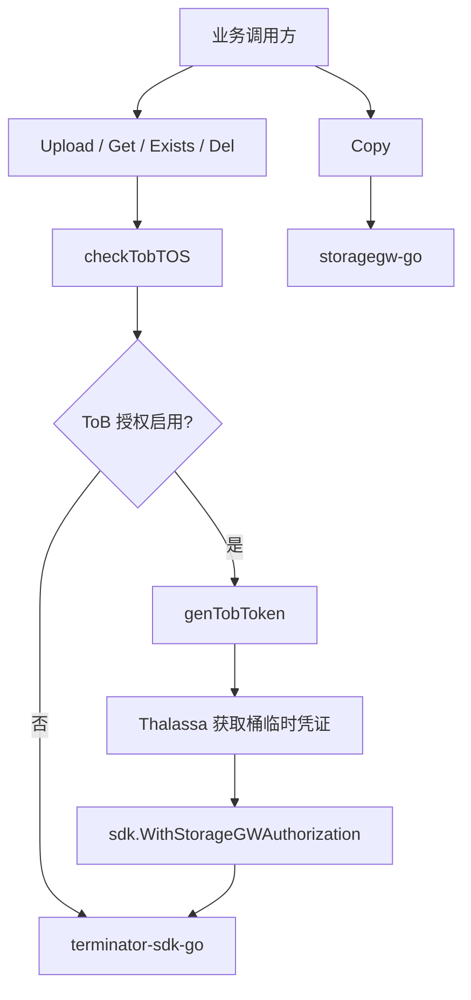

# Storage and External Clients — core

## 模块概览

`fuxi/core/storage` 封装了 Fuxi 对对象存储的核心访问能力，主要覆盖两类客户端：

- `terminator-sdk-go`：用于上传、读取、探测、删除对象。
- `storagegw-go`：用于跨对象复制。

模块对外暴露的是一组包级函数：`Upload`、`Get`、`Exists`、`Del`、`DelIgn404`、`BatchDelIgn404`、`BatchDelIgn404Async`、`Copy`。调用方不直接持有 SDK client，client 在包初始化阶段通过配置创建。

## 初始化与配置

该包有三个 `init()` 分布在不同文件中：

- `terminator.go` 初始化全局 `cli sdk.TerminatorClient`。
- `storagegw.go` 初始化全局 `sgwCli *storagegw.Client`。
- `tob.go` 在配置存在且启用时初始化 ToB TOS 授权所需的 `thalassaClient`。

`terminator.go` 和 `storagegw.go` 都会读取 `config.IAMCluster`。如果配置非空，会调用 `iamsdk.SpecifyCluster(cluster)` 指定 IAM 集群。随后使用 `config.TerminatorAK`、`config.TerminatorSK` 初始化 IAM 凭证。

`terminator.go` 还会读取 `config.TerminatorCf` 到 `terminatorCfg`：

```go
type terminatorCfg struct {
	Cluster string `yaml:"cluster"`
}
```

如果配置里存在 `cluster`，会通过 `sdk.WithCluster(cfgYaml.Cluster)` 传给 `sdk.NewTerminatorClient(config.PSM, opts...)`。

`tob.go` 读取两份配置：

```go
type thalassaCfg struct {
	Enable  bool   `yaml:"enable"`
	Cluster string `yaml:"cluster"`
	Ak      string `yaml:"ak"`
	Sk      string `yaml:"sk"`
}

type thalassaSK struct {
	Sk     string `yaml:"sk"`
	Cipher string `yaml:"cipher"`
}
```

只有 `config.ThalassaCfg` 和 `config.ThalassaSK` 都存在，且 `thalassaCfg.Enable == true` 时，ToB 授权逻辑才会生效。

## 核心调用关系



这张图只展示主路径：Terminator 相关读写删除会统一经过 `checkTobTOS`，而 `Copy` 走独立的 StorageGW client。

## 对象读写接口

### `Upload(ctx, bkt, key string, bs []byte) error`

`Upload` 将内存中的 `[]byte` 写入指定 bucket/key。实现上使用 `bytes.NewReader(bs)` 构造 reader，然后调用：

```go
cli.WriteR(ctx, sdk.UploadReq{
	Bucket: bkt,
	Key:    key,
}, rd, int64(len(bs)), opts...)
```

调用前会执行 `checkTobTOS(ctx, bkt+"/"+key, opts)`。如果 ToB 授权开启，会基于 bucket 生成 StorageGW 授权 token 并追加到 `sdk.ObjectOption`。

典型调用方包括测试工具 `UploadTestFile`，以及 `rocketmq/event.go` 中的 `sendChangeEvent`。

### `Get(ctx, uri string) ([]byte, error)`

`Get` 通过 `cli.ReadL` 下载对象内容，并使用 `io.ReadAll(resp.R)` 一次性读入内存：

```go
resp, err := cli.ReadL(ctx, sdk.DownloadReq{URI: uri}, opts...)
return io.ReadAll(resp.R)
```

因此它适合读取体积受控的对象。对于大文件场景，当前接口没有提供流式读取能力，调用方需要注意内存占用。

### `Exists(ctx, uri string) (bool, error)`

`Exists` 使用 `cli.HeadObjectL` 判断对象是否存在：

- 无错误：返回 `(true, nil)`。
- Terminator 错误码为 `404`：返回 `(false, nil)`。
- 其他错误：返回 `(false, err)`。

错误码识别通过 `getTerminatorErrCode` 完成，它使用 `errors.As` 判断错误是否包含 `errno.Payload`，再读取 `HttpStatus()`。

## 删除接口

### `Del(ctx, uri string) error`

`Del` 是最基础的删除操作，调用 `cli.DeleteL(ctx, sdk.DeleteReq{URI: uri}, opts...)`。它不会忽略 `404`，也不做重试。

### `DelIgn404(ctx, uri string) error`

`DelIgn404` 在 `Del` 之上增加了 404 忽略逻辑：

```go
err := Del(ctx, uri)
if getTerminatorErrCode(err) == 404 {
	return nil
}
return err
```

这适用于删除幂等语义：目标不存在时视为删除成功。

### `BatchDelIgn404(ctx, uris []string, maxConcurrency int) error`

`BatchDelIgn404` 是同步批量删除入口，内部固定使用 `maxRetries = 3`：

```go
return batchDelIgn404WithRetry(ctx, uris, maxConcurrency, 3)
```

内部实现使用 `errgroup.WithContext(ctx)` 和 `g.SetLimit(maxConcurrency)` 控制并发。每个 URI 会调用 `delWithRetry`：

- 最多执行 `maxRetries + 1` 次删除尝试。
- 删除成功立即返回。
- 404 视为成功。
- 非 404 错误会继续重试，最终返回最后一次错误。

需要注意：`batchDelIgn404WithRetry` 中每个 goroutine 都返回 `nil`，单个 URI 的失败会被记录到 `failedURIs`，不会让 `errgroup` 提前取消其他任务。所有删除任务完成后，如果 `failedURIs` 非空，会打印错误日志并返回 `fmt.Errorf("batch delete failed for %d files", len(failedURIs))`。

### `BatchDelIgn404Async(ctx, uris []string, maxConcurrency int)`

`BatchDelIgn404Async` 是 fire-and-forget 异步删除入口，常用于业务主流程不需要等待对象删除完成的场景。它的关键行为是：

- `uris` 为空时直接返回。
- 使用 `context.WithoutCancel(ctx)` 脱离父请求取消信号和 deadline。
- 保留原始 `ctx` 上的 value，例如 logID / trace。
- 在后台 goroutine 内使用独立的 `asyncDeleteTimeout = 5 * time.Minute`。
- 忽略批量删除返回值，只通过日志观测失败。

这个设计避免了请求 handler 返回后父 `ctx` 被取消导致异步删除被误杀，同时保留日志关联能力。当前业务层 `SetAttr`、`DelAttr`、`Del` 会调用该异步删除入口。

## 对象复制

`Copy(ctx, src, dst string) error` 使用 StorageGW client 复制对象。它先通过 `comm.ExtractFromURI` 分别解析源和目标 URI：

```go
srcBkt, srcObj, err := comm.ExtractFromURI(src)
dstBkt, dstObj, err := comm.ExtractFromURI(dst)
```

解析失败时会用 `errs.Wrap` 包装错误并带上原始 URI。复制实际调用：

```go
sgwCli.CopyObject(dstBkt, dstObj, srcBkt, srcObj, storagegw.NewCopyObjectOptions())
```

注意参数顺序是目标 bucket/key 在前，源 bucket/key 在后。`Copy` 当前不经过 `checkTobTOS`，ToB 授权逻辑只覆盖 Terminator SDK 路径。

主要调用方是 `core/service/service.go` 中的 `CopyAttr`。

## ToB TOS 授权路径

ToB 授权由 `checkTobTOS` 统一注入：

```go
func checkTobTOS(ctx context.Context, uri string, opts []sdk.ObjectOption) []sdk.ObjectOption {
	if !enable {
		return opts
	}
	bkt := comm.ExtractBkt(ctx, uri)
	opts = append(opts, sdk.WithStorageGWAuthorization(genTobToken(ctx, bkt)))
	return opts
}
```

当 `enable == false` 时，它是无副作用 passthrough。启用后，它会从 URI 中提取 bucket，并调用 `genTobToken(ctx, bkt)`。

`genTobToken` 通过 `thalassaClient.GetBucketCredential` 获取桶级临时凭证，TTL 使用：

```go
const (
	Ttl10Hours     = 10 * 60 * 60
	TtlBuffer10Min = 600
)
```

成功拿到 `AccessKey` 和 `SecretAccessKey` 后，会组装 `SGWAuthorizationToB`：

```go
type SGWAuthorizationToB struct {
	ExpiredTime     string `json:"expired_time"`
	AccessKeyId     string `json:"access_key_id"`
	SecretAccessKey string `json:"secret_access_key"`
	BucketType      string `json:"bucket_type"`
	SessionToken    string `json:"session_token"`
}
```

随后 JSON 序列化，并使用 `encrypt.AESEncrypt([]byte(cipherKey), authJSON, true)` 加密，作为 `sdk.WithStorageGWAuthorization` 的参数传给 Terminator SDK。

如果 Thalassa 获取凭证失败，函数会打印 `get bucket credential failed` 日志，并继续返回加密后的内容。这里的 `authJSON` 可能为空，调用方不会在本层中断请求，最终错误会由下游 SDK 或服务返回。

## 错误处理与日志

模块里有三类错误处理模式：

- 配置和 client 初始化失败：直接 `panic`，因为包级 client 无法正常工作。
- URI 解析失败：`Copy` 使用 `errs.Wrap` 保留上下文。
- 对象操作失败：大多直接返回 SDK error，只有 `Exists`、`DelIgn404`、批量删除会特殊处理 404。

批量删除会打印入口日志、成功汇总日志和失败汇总日志。失败日志会包含失败 URI 列表：

```go
log.PrintE(ctx, "BatchDelIgn404WithRetry - completed with %d failures out of %d, failed uris: %s", ...)
```

异步删除通过 `context.WithoutCancel` 保留原请求上下文值，所以这些日志仍能和原请求 logID / trace 对齐。

## 与代码库的连接点

该模块位于存储访问边界，业务层不直接调用 Terminator 或 StorageGW SDK：

- `core/service/service.go`
  - `CopyAttr` 调用 `Copy`
  - `SetAttr`、`DelAttr`、`Del` 调用 `BatchDelIgn404Async`
- `rocketmq/event.go`
  - `sendChangeEvent` 调用 `Upload`
- `rocketmq/event_test.go`
  - 多个测试通过 `Get` 校验对象内容
- `core/test/storage.go`
  - `UploadTestFile` 调用 `Upload`
  - `assertFileState` 调用 `Exists`

因此，新增存储行为时通常应优先在本包内扩展封装，而不是让业务层直接依赖外部 SDK。

## 维护注意事项

- `cli`、`sgwCli`、`thalassaClient` 都是包级全局变量，初始化发生在 import 阶段；新增测试时要注意配置依赖和全局状态。
- `Get` 会完整读取对象到内存，不适合无上限的大对象读取。
- `BatchDelIgn404Async` 不向调用方返回结果，失败只能通过日志观测。
- `maxConcurrency` 没有在本层校验，调用方应传入合理值；注释建议范围是 `10-50`。
- ToB 授权只覆盖 `Upload`、`Get`、`Exists`、`Del` 以及基于它们的删除路径，不覆盖 `Copy`。
- `delWithRetry` 没有退避策略，短时间下游抖动时会快速重试。