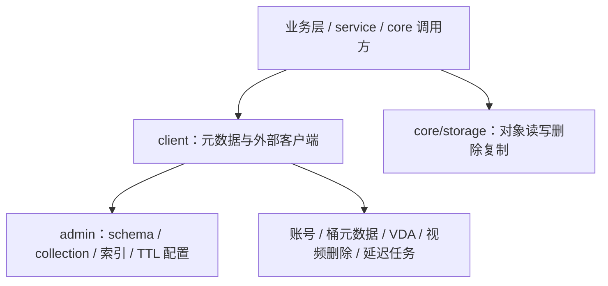

# Storage and External Clients

# Storage and External Clients

## 模块定位

`Storage and External Clients` 是 Compound 的存储访问边界，负责把业务层请求拆成两类能力：

- [client](client.md)：访问元数据存储和外部业务系统，例如 Bytedoc、Abase、ODA KV、账号、桶元数据、VDA、视频删除等。
- [core](core.md)：访问对象存储本体，例如上传、读取、探测、删除对象，以及通过 `storagegw` 执行对象复制。

业务层通常不直接关心底层 SDK 或存储类型，而是通过 `iface.MetaStorage`、包级 helper 或存储函数完成操作。

## 子模块协作方式

`client` 更偏控制面和元数据面：它根据 `admin` 配置选择 collection、构造索引、转换查询表达式，并把 `QueryFilter`、`UpdateWrapper`、`compound.Expression` 翻译成 Bytedoc、Abase 或 ODA 可执行的请求。

`core/storage` 更偏数据面：它封装 `terminator-sdk-go` 和 `storagegw-go`，提供 `Upload`、`Get`、`Exists`、`DelIgn404`、`BatchDelIgn404`、`Copy` 等对象级操作。调用方不需要持有底层 SDK client。

## 关键跨模块流程

### 写入与更新

对象写入通常由业务层协调两部分能力：先通过 [core](core.md) 的 `Upload` 写入对象内容，再通过 [client](client.md) 的 `doc.Impl`、`abase.Impl` 或 `oda.Impl` 写入对象元数据。元数据侧会根据 `admin` 配置决定 schema、collection、索引和 TTL，并在 Bytedoc 路径中使用 `BuildMongoAdd`、`UpdateBson`、`FindOneAndUpdateBson` 等能力完成 BSON 写入或更新。

### 查询与读取

查询从 [client](client.md) 进入，由 `QueryAttr`、`Count` 等方法把 Compound 表达式转换为底层查询条件，例如 Bytedoc 路径会通过 `BuildMongoFilter` 生成 Mongo 查询。查询结果返回对象标识和属性后，业务层再按需调用 [core](core.md) 的 `Get` 或 `Exists` 读取对象内容或确认对象存在。

### 删除与清理

删除流程同时涉及元数据和对象内容。元数据侧可通过 `DelAttr`、`UpdateAttr` 或视频删除客户端处理业务状态；对象侧通过 [core](core.md) 的 `DelIgn404`、`BatchDelIgn404`、`BatchDelIgn404Async` 执行实际对象删除，并把 404 类结果视为可忽略结果，便于幂等清理。

### 错误与兼容处理

两个子模块都承担错误收敛职责。[client](client.md) 会把底层存储错误翻译为 `iface.WrongVersion`、`iface.ErrObjNotFound`、`iface.NotSupportedInCurrentStorage` 等统一语义；[core](core.md) 则通过 `getTerminatorErrCode` 识别对象存储错误码，支撑 `Exists`、`DelIgn404` 等幂等接口。

## 阅读建议

需要理解元数据模型、外部服务封装、Bytedoc/Abase/ODA 差异时，阅读 [client](client.md)。需要理解对象上传、读取、删除、复制和 ToB TOS 授权初始化时，阅读 [core](core.md)。