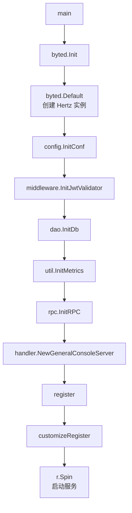

# Application Entry and Routing

## 模块概览

Application Entry and Routing 模块负责服务启动、基础依赖初始化和 HTTP 路由注册。它由三个入口层文件组成：

- `main.go`：进程入口，按顺序初始化 Hertz、配置、鉴权、数据库、指标、RPC 和业务服务实例。
- `router_gen.go`：由 `hertztool` 生成的路由注册入口，`register` 只负责转发到 `customizeRegister`。
- `router.go`：手写扩展路由，集中声明 `general-console/v1`、`bpm`、`script` 和 `mdap/v1` 接口。

本模块不承载具体业务逻辑。所有请求最终都会分发到 `handler.GeneralConsoleServer` 上的方法，例如 `PageGetGeneralAccounts`、`CreateMDAPTenant`、`BPMCreateAccount` 等。

## 启动流程

`main` 是应用唯一进程入口，初始化顺序如下：



关键顺序有实际依赖关系：

- `config.InitConf(local.ConfDir())` 必须早于 `middleware.InitJwtValidator(config.Conf.JwtRegion)` 和 `rpc.InitRPC(config.Conf)`，因为后两者依赖全局配置 `config.Conf`。
- `dao.InitDb()` 必须早于 `handler.NewGeneralConsoleServer(dao.Db)`，因为服务实例通过 `dao.Db` 注入数据库连接。
- `register(r, svr)` 必须在 `r.Spin()` 前完成，否则路由不会在服务启动时生效。

Hertz 实例通过以下代码创建：

```go
r := byted.Default(server.WithMaxRequestBodySize(1024 * 1024 * 1024 * 5))
```

这表示服务允许最大约 5GiB 的请求体，适合包含上传或批量导入场景的接口，例如 `ScriptUploadFile`、`BatchCreateMDAPSource`、`ImportMDAPSourcesFromHive` 等。

## 配置初始化

`main` 调用：

```go
config.InitConf(local.ConfDir())
```

配置初始化从本地配置目录开始，并在内部进入 TCC 配置覆盖流程。根据执行流，`InitConf` 会调用 `applyTCCConfig`，再进入以下逻辑：

- `defaultTCCConfigSource`
- `tccConfigSource`
- `applyTCCConfigFromSource`
- `Fetch`
- `parseTCCConfigOverride`
- `cloneTQSConfig`
- `isCompleteTQSConfig`

因此，入口层只暴露一个 `InitConf` 调用，但实际配置来源包含本地配置和 TCC 动态配置。贡献代码时要注意：如果新增启动期依赖配置的组件，应放在 `config.InitConf` 之后，并使用已经完成覆盖后的 `config.Conf`。

## 服务实例

业务服务通过以下代码创建：

```go
svr := handler.NewGeneralConsoleServer(dao.Db)
```

`GeneralConsoleServer` 是路由层绑定 handler 的核心对象。`router.go` 中所有接口都以方法值形式挂载到这个实例上：

```go
generalConsoleV1.GET("/list", svr.PageGetGeneralAccounts)
mdapV1.POST("/spaces/create", svr.CreateMDAPTenant)
bpmV1.POST("/account/create", svr.BPMCreateAccount)
```

这使路由层保持很薄：路由只描述 HTTP 方法、路径、分组和中间件，业务行为由 `biz/handler` 下的具体方法实现。

## 路由注册入口

`router_gen.go` 定义：

```go
func register(r *server.Hertz, svr *handler.GeneralConsoleServer) {
	//INSERT POINT: DO NOT CHANGE NEXT LINE!
	customizeRegister(r, svr)
}
```

该文件由 `hertztool` 生成，注释中的插入点用于代码生成工具维护。手写路由应放在 `customizeRegister` 中，而不是直接修改 `register` 的结构。

已有测试 `Test_register_routes_contains_mdap` 会调用 `register` 验证路由注册结果，因此新增或调整路由时应保持 `register -> customizeRegister` 这条调用链稳定。

## 全局响应中间件

`customizeRegister` 首先注册：

```go
r.Use(middleware.ResponseMiddleware())
```

`ResponseMiddleware` 是全局响应处理中间件。它在 `general-console/v1`、`mdap/v1` 等路由分组注册之前被挂载，因此这些接口会经过统一响应处理逻辑。

路由层没有直接处理响应包装、错误格式化或通用返回结构，这些横切逻辑应继续放在 middleware 或 handler 内，避免散落在路由声明中。

## General Console 路由

基础控制台接口挂载在：

```go
generalConsoleV1 := r.Group("/general-console/v1")
```

主要接口如下：

| 方法 | 路径 | Handler |
|---|---|---|
| `GET` | `/general-console/v1/list` | `PageGetGeneralAccounts` |
| `GET` | `/general-console/v1/detail` | `GetAccountDetail` |
| `GET` | `/general-console/v1/detail/config/:module` | `GetConfigByModule` |
| `GET` | `/general-console/v1/detail/config/modules` | `GetConfigModuleList` |
| `GET` | `/general-console/v1/detail/domain` | `GetAllDomain` |
| `POST` | `/general-console/v1/authorize` | `AuthorizeAccountUser` |
| `GET` | `/general-console/v1/object` | `GetObject` |
| `GET` | `/general-console/v1/check/authority` | `CheckUserAuthorized` |
| `GET` | `/general-console/v1/detail/auth` | `GetProviderAuthInfo` |
| `GET` | `/general-console/v1/jump/url` | `GetJumpUrl` |
| `GET` | `/general-console/v1/detail/authed_users` | `GetAuthorizedUsers` |

路径参数使用 Hertz 风格的 `:module`，例如：

```go
generalConsoleV1.GET("/detail/config/:module", svr.GetConfigByModule)
```

## BPM 路由

BPM 接口是 `/general-console/v1` 下的子分组：

```go
bpmV1 := generalConsoleV1.Group("/bpm")
```

完整路径都带有 `/general-console/v1/bpm` 前缀。它们主要处理账号创建、域名创建、存储配置、迁移和策略校验：

| 方法 | 路径 | Handler |
|---|---|---|
| `GET` | `/general-console/v1/bpm/check/name` | `BPMCheckAccountName` |
| `POST` | `/general-console/v1/bpm/account/create` | `BPMCreateAccount` |
| `POST` | `/general-console/v1/bpm/account/bucket_create_status` | `BPMCheckBucketCreateStatus` |
| `POST` | `/general-console/v1/bpm/new/domain` | `BPMCreateDomain` |
| `POST` | `/general-console/v1/bpm/new/storage/config` | `BPMCreateStorageConfig` |
| `POST` | `/general-console/v1/bpm/account/create_with_buckets` | `BPMCreateAccountBuckets` |
| `POST` | `/general-console/v1/bpm/account/create_with_buckets_batch` | `BPMCreateAccountBucketsBatch` |
| `POST` | `/general-console/v1/bpm/account/check_user_tree_policy` | `BPMCheckUserTreePolicy` |
| `POST` | `/general-console/v1/bpm/account/config/migrate` | `BPMMigrateAccountConfigs` |
| `POST` | `/general-console/v1/bpm/account/nontt/migrate` | `BPMMigrateNonTTAccount` |
| `POST` | `/general-console/v1/bpm/account/config/nontt_sync_domain` | `BPMNonTTConfigSyncDomain` |

其中 `BPMCreateAccountBuckets` 和 `BPMCreateAccountBucketsBatch` 的代码注释说明它们用于“创建 account（如果不存在）和一组 bucket”，后者是批量版本。

## Script 路由

脚本类接口同样位于 `/general-console/v1` 下：

```go
scriptV1 := generalConsoleV1.Group("/script")
```

当前路由包括：

| 方法 | 路径 | Handler |
|---|---|---|
| `POST` | `/general-console/v1/script/account/tree/correct` | `ScriptCreateAccountTree` |
| `POST` | `/general-console/v1/script/bucket_create_batch` | `ScriptCreateAccountTree` |
| `PUT` | `/general-console/v1/script/upload_file` | `ScriptUploadFile` |

注意 `/account/tree/correct` 和 `/bucket_create_batch` 当前都绑定到 `ScriptCreateAccountTree`。如果后续要拆分批量 bucket 创建逻辑，应先确认这是否是复用设计，避免直接改动导致兼容性问题。

## MDAP 路由

MDAP 接口不挂在 `/general-console/v1` 下，而是独立分组：

```go
mdapV1 := r.Group("/mdap/v1")
```

该分组单独启用鉴权解析中间件：

```go
mdapV1.Use(middleware.ParseMDAPAuthMiddleware())
```

这意味着 MDAP 请求除了经过全局 `ResponseMiddleware`，还会额外经过 `ParseMDAPAuthMiddleware`，用于解析 MDAP 相关鉴权上下文。

### Space 接口

| 方法 | 路径 | Handler |
|---|---|---|
| `POST` | `/mdap/v1/spaces/create` | `CreateMDAPTenant` |
| `GET` | `/mdap/v1/spaces/:space_name/detail` | `GetMDAPSpaceDetail` |
| `GET` | `/mdap/v1/spaces/page` | `PageGetMDAPSpaces` |
| `GET` | `/mdap/v1/spaces/vod_list` | `ListVODSpaces` |
| `PUT` | `/mdap/v1/spaces/update` | `UpdateMDAPSpace` |
| `GET` | `/mdap/v1/spaces/:space_name/auth_check` | `CheckMDAPSpaceAuth` |
| `POST` | `/mdap/v1/spaces/:space_name/grant_role` | `GrantMDAPSpaceRole` |

`auth_check` 用于针对单个空间做权限检查；`grant_role` 用于空间 owner 或 `mdap.admin` 主动为其他主体绑定角色。

### Asset Group、Source、Task 和 Artifact 接口

| 方法 | 路径 | Handler |
|---|---|---|
| `POST` | `/mdap/v1/asset_groups` | `CreateMDAPAssetGroup` |
| `GET` | `/mdap/v1/asset_groups/:id/detail` | `GetMDAPAssetGroup` |
| `POST` | `/mdap/v1/asset_groups/list` | `ListMDAPAssetGroups` |
| `DELETE` | `/mdap/v1/asset_groups/:id` | `DeleteMDAPAssetGroup` |
| `POST` | `/mdap/v1/sources` | `CreateMDAPSource` |
| `POST` | `/mdap/v1/sources/batch` | `BatchCreateMDAPSource` |
| `POST` | `/mdap/v1/sources/import/hive` | `ImportMDAPSourcesFromHive` |
| `POST` | `/mdap/v1/sources/query` | `QueryMDAPSources` |
| `POST` | `/mdap/v1/processing_tasks` | `CreateMDAPProcessingTask` |
| `POST` | `/mdap/v1/artifacts/query` | `QueryArtifacts` |

MDAP 路由中路径参数包括 `:space_name` 和 `:id`，handler 需要从请求上下文中读取这些参数。

## 添加新路由的约定

新增接口时优先修改 `customizeRegister`：

```go
func customizeRegister(r *server.Hertz, svr *handler.GeneralConsoleServer) {
	generalConsoleV1 := r.Group("/general-console/v1")
	{
		generalConsoleV1.GET("/new/path", svr.SomeHandler)
	}
}
```

贡献时应遵守现有模式：

- 不直接修改 `main` 的启动顺序，除非新增组件确实有初始化依赖。
- 不把业务逻辑写进 `router.go`，路由层只做分组、中间件和 handler 绑定。
- 生成文件 `router_gen.go` 保持轻量，避免在 `register` 中加入手写业务路由。
- 新增 MDAP 接口应放在 `mdapV1` 分组下，默认继承 `ParseMDAPAuthMiddleware`。
- 新增 General Console、BPM、Script 接口应复用现有 `/general-console/v1` 前缀和对应子分组。
- 如果路由注册行为影响测试，应同步更新覆盖 `register` 的路由测试。