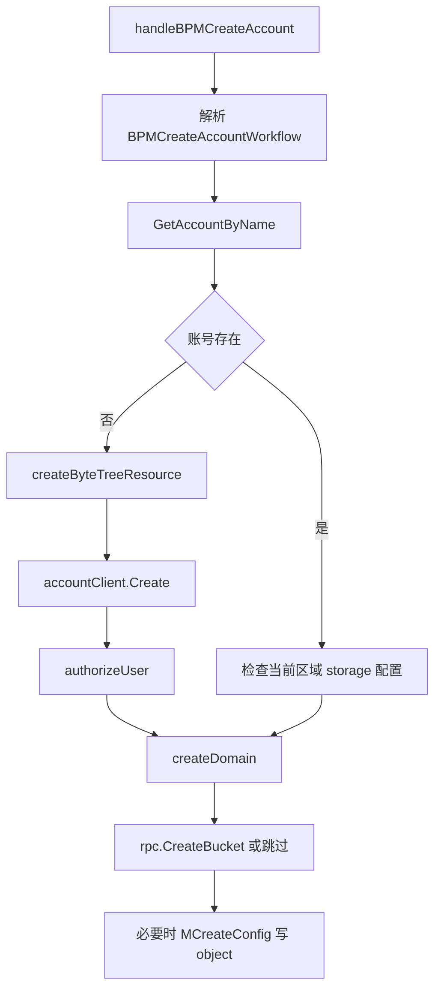

# BPM and Account Provisioning

## 模块概览

该模块负责 BPM 流程驱动的账号开通、存储桶创建、域名配置、账号配置迁移，以及少量脚本化运维入口。核心实现位于 `biz/handler/bpm.go`，辅助脚本入口位于 `biz/handler/script.go`。

BPM 入口统一通过 `middleware.BPMResponse` 包装，脚本入口通过 `middleware.Response` 包装。业务处理函数返回 `errno.Payload`，成功路径使用 `errno.BpmOK`，失败路径按场景返回 `errno.BpmErrorWithCode` 或 `errno.BpmError`。

## 对外入口

BPM 入口方法只做路由语义绑定，实际逻辑在对应的 `handle...` 方法中：

| 入口方法 | BPM 动作名 | 实际处理函数 | 作用 |
|---|---|---|---|
| `BPMCheckAccountName` | `account.checkName.bpm` | `handleCheckAccountName` | 检查账号名是否已存在 |
| `BPMCreateAccount` | `account.create.bpm` | `handleBPMCreateAccount` | 创建通用账号、域名、对象桶配置 |
| `BPMCreateStorageConfig` | `config.create.bpm` | `handleBPMCreateStorageConfig` | 为账号写入 `storage/object` 配置 |
| `BPMCreateDomain` | `domain.create.bpm` | `handleBPMCreateDomain` | 单独补建域名及账号关联 |
| `BPMCheckBucketCreateStatus` | `account.check_bucket_create_status.bpm` | `handleCheckGeneralBucketCreateStatus` | 查询 TOS bucket 创建状态 |
| `BPMCreateAccountBuckets` | `account.buckets.create.bpm` | `handleBPMCreateAccountBuckets` | 创建账号及多个分类 bucket |
| `BPMCreateAccountBucketsBatch` | `account.buckets.create_batch.bpm` | `handleBPMCreateAccountBucketsBatch` | 批量账号执行 bucket 创建 |
| `BPMMigrateAccountConfigs` | `account.config.migrate` | `handleBPMMigrateAccountConfig` | 跨区域复制账号配置 |
| `BPMNonTTConfigSyncDomain` | `account.config.nontt_sync_domain` | `handleBPMConfigNonTTSyncDomain` | 为 Non-TT 账号配置 `sync_domain` |
| `BPMMigrateNonTTAccount` | `account.nontt.migrate` | `handleBPMMigrateNonTTAccount` | Non-TT 账号迁移辅助流程 |
| `BPMCheckUserTreePolicy` | `account.user_tree_policy.bpm` | `handleBPMCheckUserTreePolicy` | 校验用户是否有服务树资源创建权限 |

脚本入口在 `script.go` 中：

| 入口方法 | 动作名 | 实际处理函数 | 作用 |
|---|---|---|---|
| `ScriptCreateAccountTree` | `script.tree.create` | `handleScriptCreateAccountTree` | 为已有账号创建 ByteTree 资源并回写账号 |
| `ScriptBatchCreateBucket` | `script.buckets.create` | 当前绑定到 `handleScriptCreateAccountTree` | 代码中存在绑定异常，实际 bucket 处理函数是 `handleScriptBatchCreateBucket` |
| `ScriptUploadFile` | `script.file.upload.stream` | `handleScriptUploadFile` | 接收表单文件，落临时文件后通过 uploader 上传 |

## 核心数据结构

`BPMCreateAccountWorkflow` 是通用账号开通主请求，继承 `model.BPMWorkflowBasic`，包含账号名、用户、父账号、服务树节点、描述、域名配置 `DomainCreateConfig` 和 bucket 配置 `BucketCreateConfig`。

`DomainCreateConfig` 控制四类域名创建：

- `CreateCDNDomain`：创建调度域名，默认格式为 `lf-{BizAbbreviated}.{CDNSecondLevelDomain}`，如果 `DirectCDNDomain` 非空则直接使用该值。
- `CreateInternalDomain`：创建 `account.InternalDomain`。
- `CreateInternalRDDomain`：创建 `account.InternalRDDomain`。
- `CreateExternalOriginDomain`：创建 `account.OriginalDomain`。

`BPMCreateAccountBucketsWorkflow` 用于更通用的账号加 bucket 开通。其 `Buckets` 字段是 `[]*BucketCreateInfo`，每个 bucket 指定 `Category`、`Qos`、是否写账号配置、是否低频、分段后缀、数据来源和 VFrame 集群编号。

`BPMCreateAccountBucketsResp` 返回账号名、账号 ID，以及按 bucket 名索引的 `BucketCreateResult`。`BucketCreateResult` 同时记录 bucket 创建状态 `BucketCreateStatus` 和账号存储配置写入状态 `StorageConfigWriteStatus`。

## 账号开通流程

`handleBPMCreateAccount` 是传统通用账号创建流程，面向单账号、单对象桶场景。



执行细节：

1. 请求体通过 `json.Unmarshal(c.Request.Body(), createReq)` 解析为 `BPMCreateAccountWorkflow`。
2. 如果账号已存在，复用 `AccessKey`、`SecretKey` 和 ID，但会检查已有配置中是否存在 `account.ModuleStorage`。存在则认为当前区域已配置，返回 `CodeBadRequest`。
3. 如果账号不存在，先调用 `createByteTreeResource` 在服务树父节点下创建资源，再调用 `accountClient.Create` 创建账号。
4. 新账号创建后调用 `authorizeUser` 给 `UserName` 授权 `AdminUser`，授权失败只记录日志，不中断主流程。
5. 调用 `createDomain` 按 `DomainConf` 创建域名及账号关联。
6. 默认调用 `rpc.CreateBucket` 创建 `object` 分类 bucket；如果请求头 `x-bpm-bkt_skip` 存在，则走 BPM 测试或跳过 bucket 创建逻辑。
7. 如果 bucket 不是异步创建，则通过 `accountClient.MCreateConfig` 写入 `account.ModuleStorage` 下的 `object: bucket` 配置。

## 多分类 bucket 创建流程

`handleBPMCreateAccountBuckets` 和 `handleBPMCreateAccountBucketsBatch` 最终都调用 `doCreateBPMAccountBuckets`。该函数是本模块最重要的编排逻辑，覆盖账号复用、bucket 命名、机房和 vRegion 映射、低频存储策略、批量建桶、配置写入和点播空间兼容配置。

关键步骤：

1. 根据 `AccountName` 查询账号。存在则复用 `account.KeyPair`；不存在则用 `accountClient.Create` 创建。
2. 从 `bucketNamePattern[env.IDC()]` 获取当前 IDC 的 bucket 命名模板，不支持的 IDC 直接返回 `CodeBadRequest`。
3. 对每个 `BucketCreateInfo`：
   - 使用 `categoryShortNameMap` 将业务分类映射为短名，例如 `original -> v`、`encoded -> ve`、`object -> o`。
   - 使用 `getSceneTosVRegion(env.IDC(), shortCategory, bucket.VFrameClusterId)` 查找 TOS vRegion。
   - 使用 `shortCategoryServiceTreeNodeIdMap` 获取成本归属服务树节点。
   - 根据 `LowFrequency` 和 `env.Region()` 调整 `StorageClass` 与 vRegion。
   - 用命名模板生成 `GeneratedBucketName`。
   - 组装 `model.ScriptCreateBucketReq`，最终形成 `model.BatchCreateBucketReq`。
4. 调用 `rpc.BatchCreateBucket(ctx, req)` 批量创建 bucket。
5. 将返回的状态写回 `createResp.Buckets[name].BucketCreateStatus`。
6. 读取当前账号当前区域已有 storage 配置：`accountClient.GetConfigWithRegion(ctx, accessKey, account.ModuleStorage, account.Region(env.IDC()))`。
7. 如果 `WriteAccountConfig` 为真且 bucket 创建未失败，则按分类生成 ckey 并调用 `accountClient.MCreateConfig` 写入；已有 key 不覆盖，状态记为 `skip`。
8. 如果账号类型是 `account.TypeSpace`，并且缺少 `storage/bucket` 配置，会尝试用新建或已有的 `original` bucket 补齐 JSON 格式的 `bucket` 配置，方便控制台展示。

## 分类、命名与区域映射

`Category` 定义了模块支持的 bucket 业务分类，包括 `original`、`encoded`、`object`、`poster`、`image`、`tts`、`dash`、多种 `vframe:*`、`medigest.*`，以及新增的 `medigest.image.zip` 和 `vframe:zip`。

映射链路是：

```text
Category -> categoryShortNameMap -> shortCategory -> sceneTosVRegionMap / bucketNamePattern / shortCategoryServiceTreeNodeIdMap
```

示例：

```go
// original 分类在命名中使用短名 v
categoryShortNameMap[Original] == "v"

// 当前 IDC 和短分类组合后查 vRegion
getSceneTosVRegion(env.IDC(), "v", bucket.VFrameClusterId)
```

`getSceneTosVRegion` 会优先查 `{idc}_{shortCategory}{vFrameClusterId}`。如果分类是 `tts` 且没有直接命中，会回退到 `original` 的短名 `v` 查找，这也是 `TestBPMCreateAccountBuckets_TTSCategoryMappings` 关注的行为。

`getIdcFromVRegion` 用于从 vRegion 推导建桶请求中的 IDC。它对特殊值做了显式处理：

- `US-East/useastazure/Infreq/Azure` 返回 `env.DC_MALIVA`
- `ap-southeast-1` 返回 `env.DC_MYA`
- `.../CN-3DC/...` 返回 `"cn"`
- `.../CN6-3DC/...` 返回 `env.DC_ZB`
- 其他标准路径返回第二段，例如 `Singapore-Central/sg1/Default/Gcs` 返回 `sg1`

## 域名创建

`createDomain` 根据 `BPMCreateAccountWorkflow.DomainConf` 创建不同类型的 `account.VDomain`，并通过 `createDomainWithRel` 落库或调用账号服务。每个域名都会带一个 `account.DomainAccountRel`，默认关联：

- `AccountName`: 当前账号
- `Category`: `"object"`
- `Module`: `"general"`
- `DomainType`: 与域名类型一致

CDN 域名使用 `account.ScheduleDomain`；内网域名使用 `account.InternalDomain`；研发内网域名使用 `account.InternalRDDomain`；外部源站域名使用 `account.OriginalDomain`。

`handleBPMCreateDomain` 用于单独补建域名。它会先通过 `accountClient.GetAccountByName` 查询账号，并把账号的 `TopAccountID` 写回请求对象，再调用 `createDomain`。

## 服务树权限与资源创建

`handleBPMCheckUserTreePolicy` 用于 BPM 前置校验。它解析 `BPMCreateAccountWorkflow`，调用 `checkUserByteTreePolicy(ctx, creator, serviceTreeNodeId, "groot.nodes.create_resource")`。

`checkUserByteTreePolicy` 使用 `cloudIAMCli.IAM.IAuthCheckerV3.HasPermissionV3Ctx` 检查指定用户在父服务树节点上是否有权限。`parentNode == 0` 会直接返回错误。

`createByteTreeResource` 使用 `byteTreeCli.CreateResource` 创建资源节点，资源信息由账号名派生：

```go
schema.ResBrief{
    PSM:      fmt.Sprintf("vcloud.general.%s", accountName),
    Provider: "vcloud_general",
    Region:   account.GetRegion(env.IDC()),
    Env:      "prod",
    Rtype:    "vcloud_general",
    RID:      accountName,
}
```

脚本函数 `handleScriptCreateAccountTree` 复用 `createByteTreeResource`，为已有账号补建服务树资源，并通过 `accountClient.UpdateAccount` 回写 `ServiceTreeNodeId`。

## 配置迁移与 Non-TT 迁移

`handleBPMMigrateAccountConfig` 解析 `BPMMigrateAccountConfigWorkflow` 后调用 `doMigrateAccountConfig`。`doMigrateAccountConfig` 会查询账号拿到 `AccessKey`，把请求中的字符串模块转换为 `[]account.Module`，然后调用：

```go
accountClient.MCopyConfig(ctx, &account.CopyConfigParam{
    AccessKey:     cReq.AccessKey,
    Modules:       modules,
    SourceRegion:  cReq.SourceRegion,
    TargetRegions: cReq.TargetRegions,
})
```

`handleBPMMigrateNonTTAccount` 是 Non-TT 迁移编排：

1. 调用 `createNonTTMigrateBuckets` 创建 `original`、`encoded`、`poster`、`image` 四类 bucket，默认 QOS 为 `3000`。
2. 额外写入 storage 配置：`all`、`encoded.row`、`poster.row`、`original.row`。
3. 调用 `doMigrateAccountConfig`，把 `upload`、`transcode`、`play`、`picture`、`media`、`storagegw`、`general` 模块从源区域复制到 `mya`。

`handleBPMConfigNonTTSyncDomain` 和 `doConfigNonTTSyncDomain` 用于写入 Non-TT 多区域的 `global/sync_domain` 配置。默认值为：

- `env.DC_MYA`: `2110`
- `env.DC_SG1`: `2620`
- `env.DC_MALIVA`: `2618`

请求中的 `MyaSyncDomain`、`SgSyncDomain`、`VaSyncDomain` 大于 0 时会覆盖默认值。

## 脚本上传入口

`handleScriptUploadFile` 处理 multipart 表单字段 `file`：

1. 使用 `os.CreateTemp(os.TempDir(), "upload-*.tmp")` 创建临时文件。
2. 通过 `c.FormFile("file")` 获取上传文件并复制到临时文件。
3. 读取 query 参数 `space`、`accountId`、`fileExt`。
4. 调用 `svr.uploadCli.UploadFile(ctx, tmpFile.Name(), consts.OBJECT, space, accountId, uploader.WithFileExt(filepath.Ext(fileExt)))` 上传。
5. 使用 `defer` 关闭并删除临时文件。

## 与其他模块的连接

该模块主要依赖以下外部能力：

- `accountClient`：账号查询、创建、更新、配置创建、配置复制、按区域读取配置。
- `rpc.CreateBucket`、`rpc.BatchCreateBucket`、`rpc.CheckBucketCreateStatus`：TOS bucket 创建和状态查询。
- `byteTreeCli`：创建 ByteTree 资源节点。
- `cloudIAMCli`：校验服务树权限。
- `uploadCli`：脚本文件上传。
- `errno`：统一 BPM 响应结构。
- `middleware.BPMResponse` / `middleware.Response`：统一 handler 包装、动作名记录和错误转换。

## 实现注意点

`doCreateBPMAccountBuckets` 不覆盖已有 storage ckey。发生 key 冲突时返回状态中追加 `skip{ckey};`，而不是调用 `MUpdateConfig`。

低频 bucket 会改变 `StorageClass` 和 vRegion。CN、MALIVA、ALISG、ChinaEast 有专门分支，新增区域或新增分类时需要同时检查 `sceneTosVRegionMap`、`bucketNamePattern`、`shortCategoryServiceTreeNodeIdMap` 和低频逻辑。

`handleBPMCreateDomain` 当前从 `c.Response.Body()` 解析请求，而其他 BPM handler 都读取 `c.Request.Body()`；维护该入口时需要确认这是否符合调用链预期。

`ScriptBatchCreateBucket` 当前把 `script.buckets.create` 绑定到了 `handleScriptCreateAccountTree`，而不是已经实现的 `handleScriptBatchCreateBucket`；如果脚本批量建桶入口不可用，应优先检查该绑定。