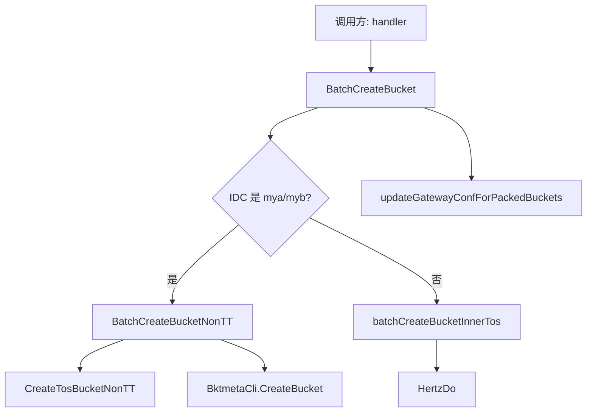

# Bucket and TOS Operations

## 模块概览

Bucket and TOS Operations 负责创建、查询和登记 TOS bucket，并在特定场景下同步更新 bktmeta 的 bucket 网关配置。模块主要分布在：

- `biz/model/bktmeta.go`：BPM、脚本批量建桶和 bktmeta 批量响应模型。
- `biz/model/tos.go`：TOS 建桶接口返回模型与状态判断方法。
- `biz/rpc/bktmeta.go`：bktmeta BPM 建桶、状态查询、批量建桶入口与网关配置更新。
- `biz/rpc/nontt_tos.go`：NonTT IDC 的 TOS 建桶、bktmeta 登记和通用 Hertz HTTP 调用封装。

该模块被 `biz/handler/bpm.go` 和 `biz/handler/script.go` 调用：BPM 流程通过 `CreateBucket`、`CheckBucketCreateStatus` 和 `BatchCreateBucket` 触发建桶；脚本接口通过 `BatchCreateBucket` 执行批量建桶。

## 核心执行路径

`BatchCreateBucket` 是脚本和 BPM 批量建桶的统一入口。它根据请求中第一个 bucket 的 `IDC` 选择不同后端路径：



注意：路由判断只读取 `batchReq[0].IDC`。因此一次批量请求应避免混合 TT 与 NonTT IDC，否则整批都会走同一条建桶路径。

## 数据模型

### BPM 建桶模型

`BPMCreateTOSBucketsRequest` 用于 BPM 创建 TOS bucket：

```go
type BPMCreateTOSBucketsRequest struct {
    BPMWorkflowBasic
    AccountName string
    AccountId   int64
    Categories  []string
    Description string
    Qos         *Qos
}
```

对应 RPC 方法是 `CreateBucket(ctx, bpm)`，它请求 bktmeta API：

```text
POST /gateway/v1/bpm/buckets/tos/create
```

返回值使用 `CreateTosBucketBPMResp`：

```go
type CreateTosBucketBPMResp struct {
    BucketsCategories map[string]string // bucket -> category
    AsyncCreate       bool
}
```

`AsyncCreate` 表示是否异步创建；调用方如果需要跟踪进度，会继续调用 `CheckBucketCreateStatus`。

### 批量脚本建桶模型

`ScriptCreateBucketReq` 是批量建桶的单个 bucket 请求：

```go
type ScriptCreateBucketReq struct {
    BucketName   string
    AccessKey    string
    SecretKey    string
    IDC          string
    Owner        string
    ServiceNode  int
    VRegion      string
    TosCreate    bool
    StorageClass meta.BucketStorageClass
    Category     string
    Public       string
    Qos          Qos
}
```

批量请求和响应分别是：

```go
type BatchCreateBucketReq []ScriptCreateBucketReq
type BatchCreateBucketResp map[BucketCreateStatus][]string
```

`BucketCreateStatus` 的合法状态包括：

- `BatchCreateSuccess`：创建成功。
- `BatchCreateFailed`：创建失败。
- `BatchCreateSkip`：bucket 已存在，跳过创建。
- `BatchCreateWaitApprove`：等待审批，当前代码中仅定义状态，未在本模块内写入。

### TOS 返回模型

`CreateBucketResult` 封装 TOS 建桶接口返回：

```go
func (r *CreateBucketResult) IsOK() bool
func (r *CreateBucketResult) IsDuplicateError() bool
func (r *CreateBucketResult) GetError() error
```

`CreateTosBucketNonTT` 依赖这些方法判断结果：

- `IsOK()`：`Status == 0`，表示创建成功。
- `IsDuplicateError()`：错误信息包含 `"duplicate"`，按可复用结果处理。
- 其他情况返回 `GetError()`。

`BucketInfo.IsAsync()` 用于判断 `SysTicketID` 是否表示异步工单：`SysTicketID != 0 && SysTicketID != -1`。

## bktmeta BPM 操作

### `CreateBucket`

`CreateBucket(ctx, bpm)` 将 `BPMCreateTOSBucketsRequest` 序列化后发送到 bktmeta BPM 创建接口。响应先解到 `errno.DevSREPayload`，当 `Code == 0` 时再把 `Response` 反序列化为 `CreateTosBucketBPMResp`。

错误处理分为三类：

- HTTP 调用失败：返回 `"create tos bucket error"`。
- 响应 JSON 解析失败：返回 `"create tos bucket resp unmarshall failed"`。
- 业务 `Code != 0`：返回远端 `Message`。

### `CheckBucketCreateStatus`

`CheckBucketCreateStatus(ctx, buckets)` 查询 BPM 异步建桶状态，请求体格式为：

```json
{
  "buckets": ["bucket-a", "bucket-b"]
}
```

返回 `CheckBucketCreateStatusResp`：

```go
type CheckBucketCreateStatusResp struct {
    WholeStatus  int8
    BucketStatus map[string]int8
}
```

`WholeStatus` 表示整体状态，`BucketStatus` 表示单个 bucket 状态。状态值含义由 bktmeta API 约定，本模块只透传。

## 批量建桶路径

### TT / 内部 TOS：`batchCreateBucketInnerTos`

非 `mya`、`myb` 的 IDC 会走 `batchCreateBucketInnerTos(ctx, batchReq)`。该函数调用：

```text
POST http://toutiao.videoarch.bktmetaapi/gateway/v1/buckets/batch
```

请求使用 Hertz `protocol.Request`，开启服务发现：

```go
req.SetOptions(
    discovery.WithSD(true),
    discovery.WithDestinationCluster("default"),
    hconfig.WithRequestTimeout(getBktmetaTimeout()),
)
```

超时时间由 `getBktmetaTimeout()` 决定：

- 未设置 `BKTMETA_TIMEOUT`：默认 `30s`。
- 设置为 Go duration，例如 `45s`、`1m`：直接使用。
- 设置为正整数，例如 `60`：按秒处理。
- 非法或非正值：记录 warn 日志并回退默认值。

### NonTT TOS：`BatchCreateBucketNonTT`

`IDC == "mya"` 或 `IDC == "myb"` 时走 NonTT 路径。每个 bucket 按顺序处理：

1. 通过 `BktmetaCli.GetBucket(ctx, req.BucketName)` 检查是否已存在。
2. 已存在则写入 `BatchCreateSkip`。
3. 不存在则构造 `rpc.CreateBucketParam` 并调用 `CreateTosBucketNonTT`。
4. TOS 创建成功后，构造 `meta.Bucket` 和 `meta.S3Bucket`。
5. 调用 `BktmetaCli.CreateBucket(ctx, bktmetaBucket)` 在 bktmeta 登记。
6. 登记成功写入 `BatchCreateSuccess`，失败写入 `BatchCreateFailed`。

NonTT 请求中的 QoS 映射关系是：

```go
ReadQPS   = req.Qos.GetQps
WriteQPS  = req.Qos.PutQps
ReadRate  = req.Qos.GetRate
WriteRate = req.Qos.PutRate
```

bktmeta 登记时会使用 S3 后端：

```go
bktmetaBucket.BackendType = meta.BackendS3
s3Bucket.Region = tosConfig.S3Region
s3Bucket.Endpoint = tosConfig.S3Endpoint
```

## NonTT TOS 创建

`CreateTosBucketNonTT(ctx, param)` 负责调用 NonTT TOS 建桶接口：

```text
POST {tosConfig.Addr}/public/v3/bucketbu
```

它会先通过全局 `jwtGenerator` 和环境变量 `TOS_TOKEN` 生成 JWT，并设置请求头：

```go
req.Header.Add("x-jwt-token", jwtToken)
req.Header.Add("Content-Type", "application/json")
```

服务发现行为由配置控制：

```go
discovery.WithSD(!tosConfig.UseDomain)
discovery.WithDestinationCluster(tosConfig.Cluster)
```

当远端返回成功或 duplicate 错误时，函数都会返回 `result.Data`，并补齐：

```go
result.Data.Name = param.Name
```

这使 duplicate 场景可以继续走后续 bktmeta 登记逻辑。

## 网关配置更新

`BatchCreateBucket` 在建桶路径完成后会调用：

```go
updateGatewayConfForPackedBuckets(ctx, batchReq, resp, updateBucketGatewayConf)
```

该逻辑只对特定 `Category` 生效：

```go
func shouldUpdateGatewayConf(category string) bool {
    return category == "medigest.image.zip" || category == "vframe:zip"
}
```

同时，bucket 必须在响应中处于 `BatchCreateSuccess` 或 `BatchCreateSkip`。满足条件后，`updateBucketGatewayConf` 会读取 bktmeta bucket，设置 `GatewayConf`：

```go
meta.GatewayConfig{
    Pack: meta.GatewayPackConfig{
        Enable:           true,
        Delimiter:        "$TOS$",
        AllowedMethods:   []string{"PUT", "GET", "HEAD"},
        WriteContentType: "tos/zip",
    },
}
```

如果网关配置更新失败，`updateGatewayConfForPackedBuckets` 会记录错误，并调用 `moveBucketStatus` 把该 bucket 从 `BatchCreateSuccess` 移到 `BatchCreateFailed`。如果 bucket 原本是 `BatchCreateSkip`，当前实现不会把它从 `skip` 移到 `failed`，因为 `moveBucketStatus` 的来源状态固定传入 `BatchCreateSuccess`。

每个 bucket 更新后会 `time.Sleep(time.Second)`，避免连续更新过快。

## 初始化与全局依赖

`InitRPC(conf)` 在程序启动时由 `main` 调用，初始化本模块依赖的全局客户端和配置：

- `jwtGenerator`：基于 `conf.TOS.IamAddress` 创建。
- `hertzCli`：通用 Hertz HTTP 客户端。
- `tosToken`：从环境变量 `TOS_TOKEN` 读取。
- `tosConfig`：保存 `conf.TOS`。
- `BktmetaCli`：通过 `bktmeta.NewClient(bktmeta.WithCallingPSM(conf.Meta.PSM))` 创建。

`BatchCreateBucketNonTT`、`CreateTosBucketNonTT`、`updateBucketGatewayConf` 都依赖这些全局变量，因此测试或本地调试前需要确保 `InitRPC` 已执行，或在测试中替换相关依赖。

## HTTP 调用封装

`HertzDo(ctx, req, v)` 是本模块内 Hertz 请求的通用执行函数，被 `CreateTosBucketNonTT` 和 `batchCreateBucketInnerTos` 复用。

它会：

1. 设置 `X-TT-LOGID`：
   ```go
   req.SetHeader("X-TT-LOGID", ctxvalues.LogIDDefault(ctx))
   ```
2. 调用全局 `hertzCli.Do(ctx, req, rsp)`。
3. 非 `http.StatusOK` 时返回响应 body 作为错误。
4. 使用 `sonic.Unmarshal(rsp.Body(), v)` 解析响应。

因此调用方传入的 `v` 必须是可被 JSON 反序列化的指针类型，例如 `*model.CreateBucketResult` 或 `*errno.JanusPayload`。

## 与调用方的连接

主要入口关系如下：

- `handleBPMCreateAccount` 调用 `CreateBucket`，并使用 `BPMCreateTOSBucketsRequest`、`Qos`、`CreateTosBucketBPMResp`。
- `handleCheckGeneralBucketCreateStatus` 调用 `CheckBucketCreateStatus`。
- `handleScriptBatchCreateBucket` 调用 `BatchCreateBucket`。
- `doCreateBPMAccountBuckets` 调用 `BatchCreateBucket`，并构造 `ScriptCreateBucketReq`。
- `createNonTTMigrateBuckets` 使用 `Qos` 构造迁移建桶请求。

贡献代码时应优先保持这些入口的语义稳定：`BatchCreateBucketResp` 的状态分组是 handler 向上游返回结果的核心结构，新增状态或改变状态迁移逻辑会直接影响调用方展示和重试判断。