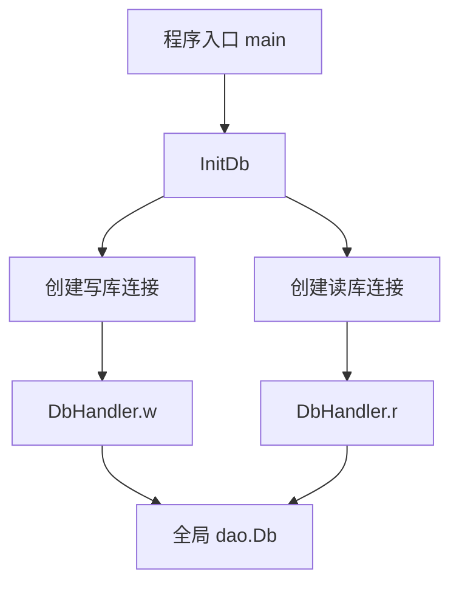

# Database Access

## 模块职责

`biz/dal` 提供数据库访问层，当前代码主要覆盖账号授权关系和管理员用户两类数据的读写。模块将业务侧对数据库的直接操作收敛到 `dao.DbHandler` 方法中，并通过 `dto` 结构体定义表字段映射。

核心约定：

- 写操作使用 `DbHandler.w`，并显式开启事务。
- 读操作使用 `DbHandler.r`。
- 所有 DAO 方法都包在 `retry.Do(...)` 中。
- 所有 DAO 方法都会上报吞吐和延迟指标。
- 写事务失败时统一通过 `RollbackTX` 回滚并合并错误。

## 初始化流程

数据库入口在 `biz/dal/dao/db.go`。

```go
var Db *DbHandler

type DbHandler struct {
	r            *gorm.DB
	w            *gorm.DB
	retryTimes   int
	retryTimeout time.Duration
}
```

`InitDb()` 会完成全局数据库句柄初始化：

1. 调用 `mysql.OpenInterpolation(OpenMysqlPSM)` 开启 MySQL 参数插值。
2. 通过 `config.Conf.WriteDB.NewDB()` 创建写库连接。
3. 通过 `config.Conf.ReadDB.NewDB()` 创建读库连接。
4. 将读写连接和重试配置注入全局变量 `dao.Db`。

```go
func InitDb() {
	mysql.OpenInterpolation(OpenMysqlPSM)

	writeDB, err := config.Conf.WriteDB.NewDB()
	if err != nil {
		logs.Error("new write db error %v", err)
		panic(err)
	}

	readDB, err := config.Conf.ReadDB.NewDB()
	if err != nil {
		logs.Error("new read db error %v", err)
		panic(err)
	}

	Db = &DbHandler{
		r:            readDB,
		w:            writeDB,
		retryTimes:   config.Conf.RetryTimes,
		retryTimeout: 5 * time.Second,
	}
}
```

`InitDb()` 会被 `main` 和多个测试入口调用，因此新增 DAO 能力时通常应挂载到 `DbHandler` 上，而不是绕过全局初始化流程单独创建连接。



## 数据模型

授权相关 DTO 定义在 `biz/dal/dto/authority.go`。

### `AuthorizeInfo`

`AuthorizeInfo` 对应授权关系表 `v_general_user_rel`，用于描述某个用户被授权访问某个账号。

```go
type AuthorizeInfo struct {
	Id                  uint64    `gorm:"id" json:"id"`
	AccountId           int64     `gorm:"column:account_id" json:"account_id"`
	AccountName         string    `gorm:"column:account_name" json:"account_name"`
	ToAuthorizeUserName string    `gorm:"column:user_name" json:"user_name"`
	Operator            string    `gorm:"column:operator" json:"authorize_user"`
	CreatedAt           time.Time `gorm:"column:created_at" json:"created_at"`
}
```

字段映射重点：

- `AccountId` 映射 `account_id`
- `AccountName` 映射 `account_name`
- `ToAuthorizeUserName` 映射 `user_name`
- `Operator` 映射 `operator`
- `CreatedAt` 映射 `created_at`

### `AdminUserInfo`

`AdminUserInfo` 对应管理员表 `v_general_admin`。

```go
type AdminUserInfo struct {
	Id        uint64    `gorm:"column:id" json:"id"`
	UserName  string    `gorm:"column:user_name" json:"user_name"`
	Operator  string    `gorm:"column:operator" json:"operator"`
	CreatedAt time.Time `gorm:"column:created_at" json:"created_at"`
}
```

## 表名常量

授权 DAO 使用两个表名常量：

```go
const (
	TableAccountUser  = "v_general_user_rel"
	TableAccountAdmin = "v_general_admin"
)
```

所有查询都通过 `db.r.Table(...)` 或 `db.w.Table(...)` 显式指定表名，因此 DTO 本身没有依赖 GORM 的 `TableName()` 方法。

## 通用执行模式

`biz/dal/dao/authority.go` 中的每个 DAO 方法都遵循同一套执行模式：

```go
retryInfo := "CreateAuthorizeInfo"

util.EmitThroughput(util.CommandThroughput, metrics.T{
	Name:  util.TagCommand,
	Value: retryInfo,
})

defer util.EmitLatency(util.CommandLatency, time.Now(), metrics.T{
	Name:  util.TagCommand,
	Value: retryInfo,
})

return retry.Do(retryInfo, db.retryTimes, db.retryTimeout, func() error {
	// 实际数据库操作
})
```

这个模式提供三类能力：

- 指标：`EmitThroughput` 记录命令调用次数，`EmitLatency` 记录命令耗时。
- 重试：`retry.Do` 按 `DbHandler.retryTimes` 和 `DbHandler.retryTimeout` 包裹数据库操作。
- 命令标识：`retryInfo` 同时作为重试名称和指标标签值，便于按 DAO 方法观测。

新增 DAO 方法时应保持同样结构，避免监控口径不一致。

## 授权关系 DAO

授权关系方法操作 `v_general_user_rel` 表。

### `CreateAuthorizeInfo`

```go
func (db *DbHandler) CreateAuthorizeInfo(ctx context.Context, info *dto.AuthorizeInfo) error
```

创建一条授权关系。方法使用写库事务：

1. `db.w.Begin().Context(ctx)` 开启事务并绑定请求上下文。
2. `tx.Table(TableAccountUser)` 指定 `v_general_user_rel`。
3. `Create(info)` 插入授权记录。
4. 插入失败时调用 `RollbackTX(tx, res.Error)`。
5. 成功后提交事务。

调用方需要传入完整的 `dto.AuthorizeInfo`，包括 `AccountId`、`AccountName`、`ToAuthorizeUserName` 和 `Operator` 等业务字段。

### `CheckAuthorizeInfo`

```go
func (db *DbHandler) CheckAuthorizeInfo(ctx context.Context, accountId int64, userName string) error
```

检查某个用户是否拥有某个账号的授权。方法只返回 `error`，不返回记录本身。

查询条件：

```sql
account_id = ? AND user_name = ?
```

实现上使用：

```go
conn.Where(" account_id = ? AND user_name = ? ", accountId, userName).First(info)
```

如果记录不存在，`First` 返回的错误会直接传给调用方。业务层可以根据错误类型判断是无授权、数据库错误还是其他异常。

### `DeleteAuthorizeInfo`

```go
func (db *DbHandler) DeleteAuthorizeInfo(ctx context.Context, accountId int64, userName string) error
```

删除某个账号和用户之间的授权关系。删除前会先查询记录：

1. 在写库事务中查询 `account_id` 与 `user_name` 匹配的记录。
2. 如果查询失败，回滚并返回错误。
3. 使用相同条件执行 `Delete(dto.AuthorizeInfo{})`。
4. 删除失败时回滚。
5. 成功后提交事务。

这个方法的语义是“存在才删除”。如果记录不存在，前置 `First` 会返回错误，删除不会继续执行。

### `GetAuthorizedAccountIdsOfUser`

```go
func (db *DbHandler) GetAuthorizedAccountIdsOfUser(ctx context.Context, userName string) (ids []int64, err error)
```

查询某个用户被授权的所有账号 ID。

查询条件：

```sql
user_name = ?
```

返回值来自：

```go
Pluck("account_id", &ids)
```

该方法只读取 `account_id` 列，不加载完整 `AuthorizeInfo`，适合权限判断、账号列表过滤等场景。

### `GetAuthorizedUsersOfAccountName`

```go
func (db *DbHandler) GetAuthorizedUsersOfAccountName(ctx context.Context, accountName string) (users []string, err error)
```

查询某个账号名称下被授权的所有用户名。

查询条件：

```sql
account_name = ?
```

返回值来自：

```go
Pluck("user_name", &users)
```

该方法按 `account_name` 查询，而不是 `account_id`。调用方需要确保传入的是账号名称。

## 管理员 DAO

管理员方法操作 `v_general_admin` 表。

### `CreateAdminUserInfo`

```go
func (db *DbHandler) CreateAdminUserInfo(ctx context.Context, userName string, operator string) error
```

创建管理员用户记录。方法内部构造 `dto.AdminUserInfo`：

```go
adminUser := dto.AdminUserInfo{
	UserName: userName,
	Operator: operator,
}
```

然后在写库事务中插入到 `v_general_admin`。`CreatedAt` 没有在代码中显式赋值，通常依赖数据库默认值或 GORM 行为。

### `CheckAdminUserInfo`

```go
func (db *DbHandler) CheckAdminUserInfo(ctx context.Context, userName string) error
```

检查用户是否是管理员。查询条件：

```sql
user_name = ?
```

方法只返回 `error`。如果没有匹配记录，`First(adminUser).Error` 会返回错误，由调用方决定如何解释。

### `DeleteAdminUserInfo`

```go
func (db *DbHandler) DeleteAdminUserInfo(ctx context.Context, userName string) error
```

删除管理员记录。流程与授权删除类似：

1. 在写库事务中按 `user_name` 查询管理员记录。
2. 查询失败则回滚。
3. 调用 `txAdmin.Delete(adminUser)` 删除查询到的实体。
4. 删除失败则回滚。
5. 成功后提交事务。

## 事务回滚与错误合并

`RollbackTX` 定义在 `biz/dal/dao/utils.go`，用于统一处理事务回滚。

```go
func RollbackTX(tx *gorm.DB, err error) error {
	tx.Rollback()

	if tx.Error == nil {
		return err
	} else if err == nil {
		return tx.Error
	} else if errs, ok := err.(gorm.Errors); ok {
		return errs.Add(tx.Error)
	} else {
		return gorm.Errors([]error{err, tx.Error})
	}
}
```

它处理三种情况：

- 原始错误存在、回滚无错误：返回原始错误。
- 原始错误为空、回滚失败：返回事务错误。
- 原始错误和事务错误都存在：合并为 `gorm.Errors`。

写 DAO 中只要事务内任意步骤失败，都应使用 `RollbackTX(tx, err)` 返回，避免丢失回滚错误。

## 与业务层的连接

数据库访问模块主要被业务处理层和测试代码使用：

- `main` 调用 `InitDb()` 初始化全局数据库连接。
- handler 侧会构造 `dto.AuthorizeInfo`，再调用授权 DAO 写入授权关系。
- 权限判断逻辑可以通过 `CheckAuthorizeInfo`、`CheckAdminUserInfo` 判断用户权限。
- 列表类逻辑可以通过 `GetAuthorizedAccountIdsOfUser` 或 `GetAuthorizedUsersOfAccountName` 获取过滤条件。
- 单元测试通过 `TestMain` 初始化数据库，并覆盖 `RollbackTX`、授权 DAO 和管理员 DAO。

典型调用形态如下：

```go
info := &dto.AuthorizeInfo{
	AccountId:           accountId,
	AccountName:         accountName,
	ToAuthorizeUserName: userName,
	Operator:            operator,
}

err := dao.Db.CreateAuthorizeInfo(ctx, info)
```

## 扩展建议

新增数据库访问方法时，建议遵循当前模块的既有约定：

- 将方法定义为 `func (db *DbHandler) ...`，复用 `dao.Db` 的初始化结果。
- 读操作使用 `db.r.Table(...).Context(ctx)`。
- 写操作使用 `db.w.Begin().Context(ctx)`，并在失败时调用 `RollbackTX`。
- 使用表名常量，不在多个方法中重复写裸字符串。
- 使用 `retry.Do` 包裹实际数据库操作。
- 使用 `EmitThroughput` 和 `EmitLatency` 上报统一指标。
- 返回明确的 `error`，不要在 DAO 层吞掉 `First`、`Create`、`Delete` 等 GORM 错误。