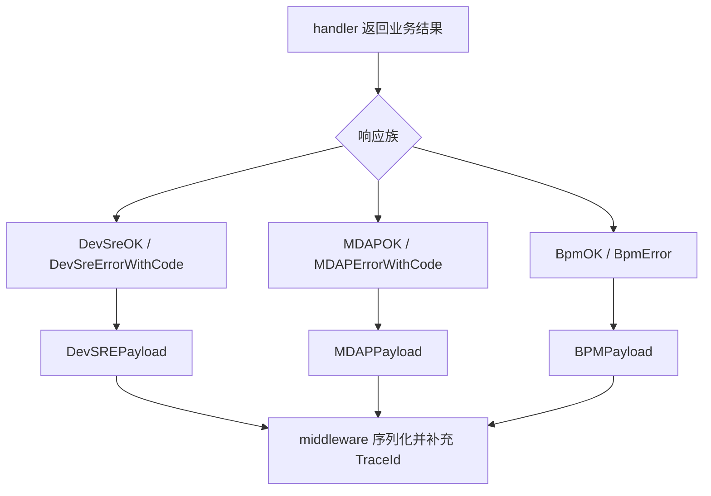

# Error and Response Contracts

## 模块职责

`biz/errno` 定义项目内统一的业务错误码和响应包裹结构。它不负责写 HTTP 状态码，也不调用外部依赖；它只提供：

- 业务码常量，例如 `CodeOKZero`、`CodeBadRequest`、`CodeForbidden`、`CodeInternalErr`
- 多套响应结构，例如 `DevSREPayload`、`MDAPPayload`、`BPMPayload`
- 构造成功或失败响应的便捷函数，例如 `DevSreOK`、`MDAPErrorWithCode`、`BpmError`
- 供调用方统一读取响应结果的 `Payload` 接口

该模块主要被 handler 和 middleware 使用。handler 负责业务逻辑并返回 payload；middleware 负责把 payload 序列化、补充 `TraceId` 或转换成 HTTP 响应。

## 错误码

错误码定义在 `biz/errno/error.go`。

| 常量 | 值 | 语义 |
|---|---:|---|
| `CodeOKZero` | `0` | 成功。当前响应构造函数普遍使用这个成功码 |
| `CodeWarn` | `2` | 警告类结果 |
| `CodeOK` | `2000` | 成功类业务码 |
| `CodeCreated` | `2001` | 创建成功 |
| `CodePartialContent` | `2006` | 部分内容 |
| `CodeBadRequest` | `4000` | 请求参数或格式错误 |
| `CodeUnauthorized` | `4001` | 未认证 |
| `CodeForbidden` | `4003` | 无权限 |
| `CodeNotFound` | `4004` | 资源不存在 |
| `CodeTooManyRequests` | `4029` | 请求过多 |
| `CodeInternalErr` | `5000` | 内部错误 |
| `CodeServiceUnavailable` | `5003` | 服务不可用 |
| `CodeVsreErr` | `5004` | VSRE 相关错误 |
| `CodeGetDataErr` | `5012` | 获取数据失败 |
| `CodeParseDataErr` | `5013` | 解析数据失败 |
| `CodeDbErr` | `5014` | 数据库错误 |

需要注意：`CodeOKZero` 和 `CodeOK` 都表示成功类语义，但当前 `DevSreOK`、`MDAPOK`、`BpmOK` 都使用 `CodeOKZero`。如果新增接口需要兼容现有响应契约，应优先确认调用方期望的是 `0` 还是 `2000`。

## 响应契约

### `Payload` 接口

```go
type Payload interface {
	GetCode() int
	GetMessage() string
}
```

`Payload` 是最小响应读取接口，用于只关心业务码和错误信息的流程。例如 `runHiveImportBackground` 会通过 `GetCode()` 和 `GetMessage()` 判断异步导入结果，而不需要知道具体响应结构是 `DevSREPayload`、`MDAPPayload` 还是 `BPMPayload`。

当前实现了 `Payload` 的类型包括：

- `DevSREPayload`
- `MDAPPayload`
- `BPMPayload`

`JanusPayload` 没有实现 `GetCode()` / `GetMessage()`，因此不是 `Payload` 实现。

### `DevSREPayload`

```go
type DevSREPayload struct {
	Code     int         `json:"code"`
	Message  string      `json:"message"`
	Response interface{} `json:"response"`
 TraceId  string      `json:"trace_id"`
}
```

`DevSREPayload` 是通用 DevSRE 风格响应结构，JSON 字段使用小写和下划线命名。它被普通 handler 和 BPM middleware 广泛使用，例如：

- `getConfigByModule`
- `handleGetJumpUrl`
- `handleGetObject`
- `getAuthorizedUsers`
- `handleGetAccountDetail`
- `BPMCheckBucketCreateStatus`
- `BPMMigrateNonTTAccount`

成功响应通过 `DevSreOK(data)` 构造：

```go
func DevSreOK(data interface{}) DevSREPayload {
	return DevSREPayload{
		Code:     CodeOKZero,
		Message:  "ok",
		Response: data,
	}
}
```

错误响应有两种常见构造方式：

```go
func DevSreError(err error) DevSREPayload
func DevSreErrorWithCode(code int, err error) DevSREPayload
```

`DevSreError(nil)` 会降级为 `DevSreOK(nil)`。但 `DevSreErrorWithCode(code, err)` 会直接调用 `err.Error()`，调用方必须保证 `err != nil`。

### `MDAPPayload`

```go
type MDAPPayload struct {
	Code     int         `json:"Code"`
	Message  string      `json:"Message"`
	Response interface{} `json:"Response"`
	TraceId  string      `json:"TraceId"`
}
```

`MDAPPayload` 专用于 `/mdap/v1` 路由下的接口。它和 `DevSREPayload` 的字段含义接近，但 JSON 字段名采用大写开头的驼峰命名：

- `Code`
- `Message`
- `Response`
- `TraceId`

这个结构是为了避免修改 DevSRE 通用响应格式时影响其他路由。相关测试如 `TestMDAPResponse_marshal_error`、`TestMDAPResponse_fill_trace_id`、`TestMDAPResponse_keep_existing_trace_id` 覆盖了 MDAP 响应的序列化和 trace id 行为。

常用构造函数：

```go
func MDAPOK(data interface{}) MDAPPayload
func MDAPError(err error) MDAPPayload
func MDAPErrorWithCode(code int, err error) MDAPPayload
func MDAPErrorWithResponse(code int, err error, response interface{}) MDAPPayload
func MDAPAuthErrorWithApplyURL(applyURL string) MDAPPayload
```

`MDAPError(nil)` 会返回 `MDAPOK(nil)`。`MDAPErrorWithCode` 和 `MDAPErrorWithResponse` 会直接调用 `err.Error()`，调用方必须传入非空错误。

`MDAPAuthErrorWithApplyURL(applyURL)` 使用 `CodeForbidden`，并把申请链接拼进 `Message`：

```go
Message: "permission denied, applyURL: " + applyURL
```

### `BPMPayload`

```go
type BPMPayload struct {
	Code    int         `json:"code"`
	Message string      `json:"message"`
	Data    interface{} `json:"data"`
	TraceId string      `json:"trace_id"`
}
```

`BPMPayload` 用于 BPM 场景，和 `DevSREPayload` 的主要差异是业务数据字段叫 `data`，不是 `response`。

常用构造函数：

```go
func BpmOK(data interface{}) BPMPayload
func BpmError(err error) BPMPayload
func BpmErrorWithCode(code int, err error) BPMPayload
```

`BpmError(nil)` 会返回 `BpmOK(nil)`。`BpmErrorWithCode(code, err)` 会直接调用 `err.Error()`，调用方必须保证 `err != nil`。

### `JanusPayload`

```go
type JanusPayload struct {
	Code     int         `json:"code"`
	Message  string      `json:"message"`
	TraceId  string      `json:"trace_id"`
	Response interface{} `json:"response"`
}
```

`JanusPayload` 定义了 Janus 风格响应结构，但当前模块没有提供构造函数，也没有实现 `Payload` 接口。新增使用点时需要显式决定是否补充 `GetCode()`、`GetMessage()` 或构造函数。

### `DevSREPageGetPayloadResp`

```go
type DevSREPageGetPayloadResp struct {
	Data          interface{} `json:"data"`
	Total         int64       `json:"total"`
	Current       int         `json:"current"`
	PageSize      int         `json:"pageSize"`
	SortField     string      `json:"sortField"`
	SortDirection string      `json:"sortDirection"`
}
```

`DevSREPageGetPayloadResp` 是分页数据结构，通常作为 `DevSREPayload.Response` 的内容使用。调用点包括：

- `getConfigByModule`
- `handlePageGetGeneralAccounts`
- `handlerGetAllDomain`

它不是完整响应包裹结构，不包含 `Code`、`Message` 或 `TraceId`。

## 构造函数行为



构造函数整体保持简单：根据输入数据或错误创建结构体，不做日志、序列化、HTTP 状态转换或 trace id 生成。

成功响应：

```go
DevSreOK(data) // Code: 0, Message: "ok", Response: data
MDAPOK(data)   // Code: 0, Message: "ok", Response: data
BpmOK(data)    // Code: 0, Message: "ok", Data: data
```

普通错误响应：

```go
DevSreError(err) // err 非空时 Code: 600, Message: err.Error()
MDAPError(err)   // err 非空时 Code: 600, Message: err.Error()
BpmError(err)    // err 非空时 Code: 600, Message: err.Error()
```

带指定错误码的响应：

```go
DevSreErrorWithCode(code, err)
MDAPErrorWithCode(code, err)
BpmErrorWithCode(code, err)
```

其中 `DevSreErrorWithCode` 和 `MDAPErrorWithCode` 会把空 map 放入响应体：

```go
Response: map[string]string{}
```

这可以避免部分前端或调用方在错误场景下拿到缺失的 `response` 字段。

## 与代码库其他部分的连接

该模块位于响应链路的末端，典型调用路径如下：

1. handler 执行业务逻辑。
2. handler 根据成功或失败调用 `DevSreOK`、`MDAPOK`、`BpmError` 等函数。
3. middleware 识别返回的 payload，完成响应序列化。
4. middleware 或测试逻辑补充、保留或验证 `TraceId`。

几个典型执行流：

- `handleBatchCreateMDAPSource` 在批量创建 MDAP Source 失败时，经由 `batchCreateMDAPSourcesWithGroupOptions` 调用 `MDAPErrorWithCode`，最终返回 `MDAPPayload`。
- `GrantMDAPSpaceRole` 通过 `MDAPResponse` middleware 使用 `MDAPErrorWithCode` 返回 MDAP 格式错误。
- `createNonTTMigrateBuckets` 在 BPM 创建桶流程中调用 `BpmError`，当错误为空时会回退到 `BpmOK(nil)`。
- `BPMCheckBucketCreateStatus` 和 `BPMMigrateNonTTAccount` 通过 `BPMResponse` middleware 使用 `DevSreErrorWithCode` 返回 `DevSREPayload`。
- `runHiveImportBackground` 不依赖具体结构体，而是通过 `Payload.GetCode()` 和 `Payload.GetMessage()` 读取执行结果。

## 使用建议

新增普通 DevSRE 风格接口时，优先使用：

```go
return errno.DevSreOK(data)
```

错误场景如果需要指定业务码：

```go
return errno.DevSreErrorWithCode(errno.CodeBadRequest, err)
```

新增 `/mdap/v1` 接口时，应使用 MDAP 响应族，确保 JSON 字段名保持大写开头：

```go
return errno.MDAPOK(data)
```

MDAP 权限失败且需要返回申请链接时，使用：

```go
return errno.MDAPAuthErrorWithApplyURL(applyURL)
```

新增 BPM `data` 风格响应时，使用：

```go
return errno.BpmOK(data)
```

如果只是消费响应状态，不需要关心具体响应结构，应依赖 `Payload` 接口：

```go
func handleResult(payload errno.Payload) error {
	if payload.GetCode() != errno.CodeOKZero {
		return fmt.Errorf(payload.GetMessage())
	}
	return nil
}
```

调用 `DevSreErrorWithCode`、`MDAPErrorWithCode`、`MDAPErrorWithResponse`、`BpmErrorWithCode` 前必须保证 `err` 非空，否则会因为 `err.Error()` 触发 panic。