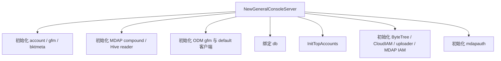

# General Console Handlers

## 模块概览

`biz/handler` 中的 General Console Handlers 负责承接 Hertz HTTP 请求，并把控制台页面操作转换为对账号 SDK、权限表、对象元数据服务、GFM、ByteTree、Guardian、Jingle 等后端能力的调用。

核心类型是 `GeneralConsoleServer`。它保存所有 handler 需要复用的客户端和状态：

- `accountClient`：查询账号、配置、域名关系。
- `db`：查询授权用户、管理员、账号授权关系。
- `topAccounts`：顶级账号 ID 到业务线名称的缓存，由 `InitTopAccounts` 初始化。
- `odmClient` / `odmDefaultClient`：查询对象元数据，优先 `gfm` 集群，失败后查 `default` 集群。
- `gfmClient`：生成对象下载 URL。
- `byteTreeCli`：补齐服务树节点路径。
- `mdap*`、`bktmetaClient`、`uploadCli`、`cloudIAMCli`：供同包其他 handler 使用。

所有公开 HTTP 入口都遵循同一模式：

```go
func (svr *GeneralConsoleServer) SomeAPI(ctx context.Context, c *app.RequestContext) {
    middleware.Response(ctx, c, "event.name", svr.someAPI)
}
```

实际业务逻辑放在未导出的 `svr.someAPI` 方法中，并返回 `errno.Payload`。成功响应通常使用 `errno.DevSreOK`，失败响应使用 `errno.DevSreErrorWithCode`。

## 初始化流程

`NewGeneralConsoleServer(db *dao.DbHandler)` 构造服务实例并初始化依赖。它由 `main.go` 和测试直接调用。



需要注意的初始化行为：

- `gfm.NewClient`、`mdap compound client`、`mdapauth.NewDefaultClient` 初始化失败会 `logs.Fatal`。
- `odmClient` 和 `odmDefaultClient` 使用 `objectduplicationmanager.MustNewClient`，配置了长连接、TTHeaderFramed、3 秒连接和 RPC 超时。
- `InitTopAccounts` 会分页请求 Guardian `/v1/folders`，用 `folder.Name` 中的 ID 建立 `topAccounts[folderId] = folder.DisplayName`。
- `VCloudControlConfig` 和 `MDAP.IAM` 缺失时会跳过部分认证客户端初始化，而不是直接失败；`MDAP.IAM` 字段不完整时也会跳过。

## 响应与分页约定

分页类 handler 统一读取这些查询参数：

- `current`：当前页，解析失败时通常置为 `0`。
- `pageSize`：每页大小，解析失败时返回 `CodeBadRequest`。
- `selector`：账号列表的名称筛选。
- `accountId` / `accountName`：账号详情、配置、域名、对象查询的定位参数。
- `module`：配置模块路径参数。

分页响应使用 `errno.DevSREPageGetPayloadResp`：

```go
&errno.DevSREPageGetPayloadResp{
    Data:     data,
    Total:    total,
    Current:  current,
    PageSize: pageSize,
}
```

## 账号查询

`PageGetGeneralAccounts` 包装 `handlePageGetGeneralAccounts`，用于分页查询通用账号列表。

执行流程：

1. 解析 `current` 和 `pageSize`。
2. 构造 `account.PageGetParam`，固定 `param.MGetParam.Type = "general"`。
3. 通过 `util.DevSreGetOperatorName(c)` 获取当前操作者。
4. 如果 `action != "all"`，调用 `db.GetAuthorizedAccountIdsOfUser` 限制账号范围。
5. 如果传入 `selector`，设置 `param.MGetParam.QueryName`。
6. 调用 `accountClient.PageGetAccount`。
7. 将 `account.AccountInfo` 转为 `AccountInfoWithBizName`，补齐 `BizName`。
8. 清空 `AccessKey` 和 `SecretKey`，避免列表接口泄露 AK/SK。
9. 返回分页数据。

`GetAccountDetail` 包装 `handleGetAccountDetail`，用于按 `accountId` 查询账号详情。它会先调用 `accountClient.GetAccountByID`，再通过 `isUserAuthorized` 判断当前用户是否有权限。无权限时不会拒绝整个请求，而是把 `AccessKey` 和 `SecretKey` 设置为常量 `"NoPermission"`。返回结构同样使用 `AccountInfoWithBizName`，并额外通过 `byteTreeCli.GetNodeByID` 补齐 `ServiceTreeNodeName`。

## 权限模型

权限判断集中在 `isUserAuthorized`：

```go
func (svr *GeneralConsoleServer) isUserAuthorized(ctx context.Context, accountInfo *account.AccountInfo, currentUserName string) bool
```

判定顺序是：

1. `accountInfo.Username == currentUserName`：账号 owner 直接授权。
2. `isUserAdmin(ctx, currentUserName)`：管理员直接授权。
3. `db.CheckAuthorizeInfo(ctx, accountInfo.ID, currentUserName)`：显式授权关系存在则授权。

`isUserAdmin` 使用 `db.CheckAdminUserInfo` 查询管理员表。查询失败会记录 warn 并返回 `false`。

授权写入由 `AuthorizeAccountUser` 和 `authorizeAccountUser` 处理。请求体映射到 `AuthorizeAccountUserReq`：

```go
type AuthorizeAccountUserReq struct {
    AccountName           string `json:"account_name"`
    ToAuthorizeUserName   string `json:"user_name"`
    AuthorizedUser        string `json:"authorize_user"`
}
```

`authorizeAccountUser` 会先按 `AccountName` 查询账号，再验证 `AuthorizedUser` 对该账号已有权限，最后调用 `authorizeUser` 写入授权关系。`authorizeUser` 会先用 `db.CheckAuthorizeInfo` 检查重复授权；如果已经存在，会返回错误 `"user: ... has been authorized to provider: ..."`。

其他权限相关接口：

- `CheckUserAuthorized` / `checkUserAuthorized`：按 `accountId` 判断当前登录用户是否有账号权限。
- `GetAuthorizedUsers` / `getAuthorizedUsers`：按 `accountName` 查询已授权用户列表。
- `GetProviderAuthInfo` / `getProviderAuthInfo`：查询 Jingle provider 权限前，也会调用 `isUserAuthorized` 校验当前用户。

## 配置查询

`GetConfigModuleList` 返回固定的 `allModuleName` 列表，模块值来自 `account.ModuleGlobal`、`account.ModuleUpload`、`account.ModuleTranscode`、`account.ModulePlay`、`account.ModulePicture`、`account.ModuleTasks`、`account.ModuleStorage`、`account.ModuleOpenAPI`。

`GetConfigByModule` 包装 `getConfigByModule`，按账号和模块读取配置：

1. 从路径参数读取 `module`。
2. 从 query 读取 `accountName`、`current`、`pageSize`。
3. 查询账号并调用 `isUserAuthorized` 校验权限。
4. 调用 `accountClient.GetConfigByName(ctx, accountName, module)`。
5. 把返回的 `map[string]string` 转成 `[]*AccountModuleConfigEntry`。
6. 当模块是 `account.ModuleStorage` 时，跳过 `bucket_selection_strategy`。
7. 使用 `ConfigEntrySlice` 按 `EntryName` 升序排序。
8. 返回分页结构。

配置项返回结构：

```go
type AccountModuleConfigEntry struct {
    EntryName   string `json:"entry_name"`
    EntryConfig string `json:"entry_config"`
}
```

## 域名关系

`GetAllDomain` 包装 `handlerGetAllDomain`，用于查询账号关联域名。

流程与配置查询相似：解析分页参数，按 `accountName` 查询账号，调用 `isUserAuthorized` 校验权限，然后构造 `account.ListDomainAccountRelRequest` 并调用 `accountClient.ListDomainAccountRel`。

`createDomainWithRel` 是同文件中的辅助方法，用于创建域名和账号关系：

- 先调用 `accountClient.CreateDomain`。
- 如果错误包含 `"Duplicate"`，认为域名已存在，转而遍历 `domain.AccountRels` 调用 `CreateDomainAccountRel`。
- 创建关系时同样忽略 `"Duplicate"` 错误。
- 其他错误直接返回。

## 对象查询与下载 URL

`GetObject` 包装 `handleGetObject`，用于按 `accountId` 和 `oid` 查询对象元信息，并尝试生成下载地址。

返回结构是 `ConsoleObject`，它嵌入 `object_duplication_manager.Object`，并增加控制台字段：

```go
type ConsoleObject struct {
    object_duplication_manager.Object
    AccountId       int64             `json:"account_id"`
    QueryResult     string            `json:"query_result"`
    Permission      bool              `json:"permission"`
    CreateTimeStamp string            `json:"create_time_stamp"`
    DownloadUrls    map[string]string `json:"download_urls"`
}
```

主要流程：

1. 解析 `accountId`，失败时返回 `ConsoleObject{QueryResult: "account id is invalid", Permission: false}`。
2. 查询账号并调用 `isUserAuthorized`；无权限时返回 `CodeWarn`。
3. 如果 `oid` 为空，返回 `object_duplication_manager.NewObject()`。
4. 调用 `getObjectMetaData` 查询 ODM 对象。
5. 将 ODM object 序列化再反序列化到 `ConsoleObject`。
6. 如果对象不存在，返回 `QueryResult = "Not Found in ODM"`。
7. 如果对象存在，设置 `QueryResult = "Got It in ODM"`、`Permission = true`，并格式化 `ObjectCreateTime` 到 `CreateTimeStamp`。
8. 使用账号 AK/SK 初始化 GFM client，分别尝试生成 `internal_dev` 和 `internal_all` 两类下载 URL。

`getObjectMetaData` 会用 `util.IAMSignRpcRequest("QueryObject", accountInfo.AccessKey, accountInfo.SecretKey)` 构造 RPC 鉴权信息，然后先查 `svr.odmClient`。如果返回错误、对象为空或 `ObjectID` 为空，会再查 `svr.odmDefaultClient`。

`getObjectStorageUrl` 使用 `gfm.GetFileURLs`，并启用：

```go
Options: gfm.GetFileURLsOptions{
    ReadPrimary:        true,
    SetFileStatusIfVL3: gfm.FileStatusVL1,
}
```

它优先返回 `fileInfo.MainURL`，为空时返回 `fileInfo.BackupURL`。如果响应中没有对应 `oid`，或 `fileInfo.Status != errno.CodeOKZero`，会返回错误。

## Provider 权限查询

`GetProviderAuthInfo` 包装 `getProviderAuthInfo`，用于从 Jingle 查询 provider 级权限信息。

接口要求 query 中存在 `accountName`。处理流程：

1. 解析分页参数。
2. 按 `accountName` 查询账号。
3. 使用 `isUserAuthorized` 校验当前用户。
4. 请求 `https://{config.Conf.JingleAPI.Host}/v1/biz/project/auth?provider={accountName}`。
5. 使用 `config.Conf.JingleAPI.UserName` 和 `Password` 设置 BasicAuth。
6. 解码到 `JingleRespPayload`。
7. 当 `result.Code == 2000` 时返回分页成功响应，否则直接返回 `errno.DevSREPayload`，保留 Jingle 的 code、message 和 data。

相关数据结构：

```go
type JingleRespPayload struct {
    Code    int                      `json:"code"`
    Message string                   `json:"message"`
    Data    []*AccessKeyProviderAuth `json:"data,omitempty"`
}
```

## 通用配置接口

`GetJumpUrl` 包装 `handleGetJumpUrl`，直接返回 `config.Conf.JumpUrl`。它不做权限校验，也不访问外部服务。

## 与其他模块的连接

- `biz/middleware.Response`：统一包装 handler 执行、事件名和响应写入。
- `biz/errno`：定义统一 payload、错误码和分页响应结构。
- `biz/util`：提供 `DevSreGetOperatorName`、`IAMSignRpcRequest`、`IAMSignHttpRequest`。
- `biz/dal/dao.DbHandler`：提供授权关系、管理员、授权用户列表等持久化查询。
- `account-sdk/client`：账号、配置、域名关系的主数据来源。
- `object_duplication_manager` 与 `general_file_manager_go`：支撑对象元数据查询和下载 URL 生成。
- `bytetree_go_sdk`：账号详情中服务树节点名的补充信息来源。
- `biz/config`：所有外部服务地址、鉴权信息和开关配置的来源。

## 贡献注意事项

新增 handler 时建议保持现有分层：导出方法只调用 `middleware.Response`，业务逻辑放在未导出方法并返回 `errno.Payload`。需要账号级数据时，应复用 `isUserAuthorized`，避免每个接口重新实现权限判断。

处理 AK/SK 时要区分列表和详情场景。账号列表中 `handlePageGetGeneralAccounts` 会直接清空 `AccessKey`、`SecretKey`；账号详情中 `handleGetAccountDetail` 对无权限用户返回 `"NoPermission"`；对象查询必须在权限校验通过后才使用账号 AK/SK 访问 ODM 和 GFM。

分页接口当前多数只透传 `current`、`pageSize` 到响应，部分后端调用并没有真正按页裁剪本地结果。修改这类接口时，需要确认前端依赖的是后端分页、前端分页，还是仅依赖统一分页响应结构。