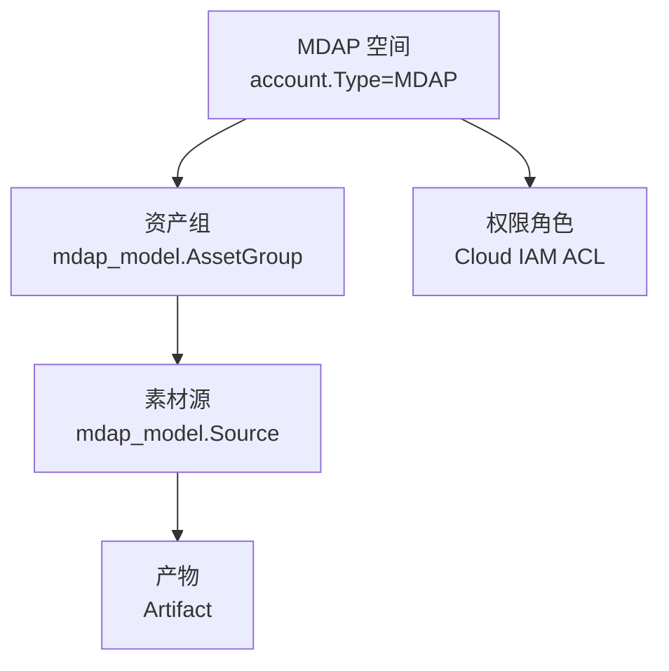
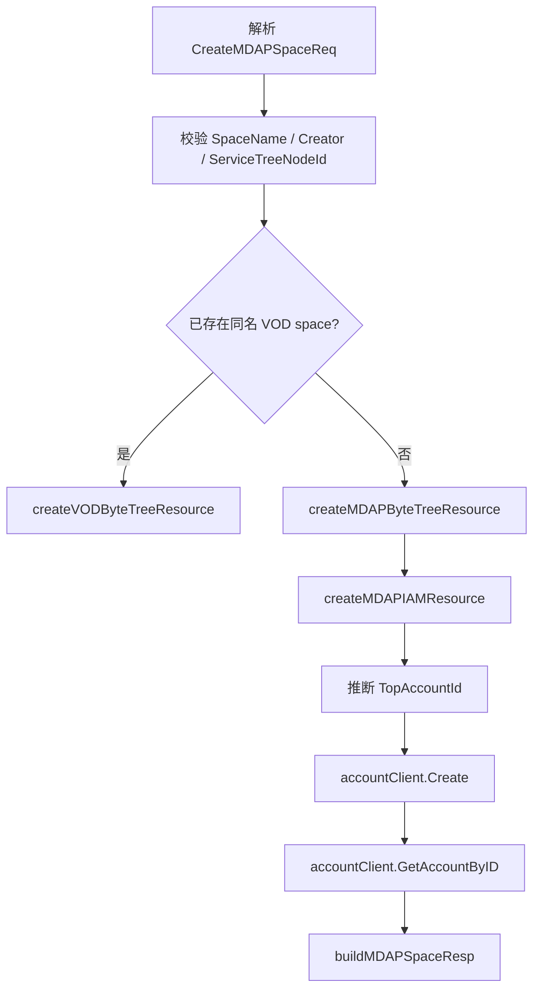
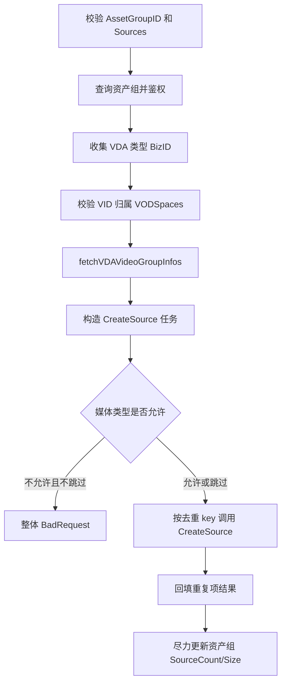
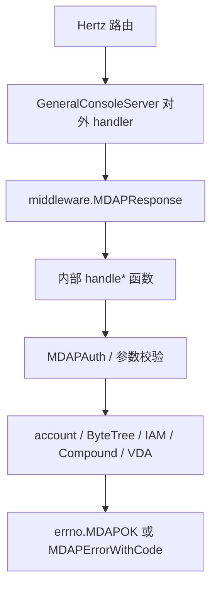

# MDAP Core APIs

## 模块概览

MDAP Core APIs 位于 `biz/handler/mdap*.go`，负责 General Console 对 MDAP 租户、资产组、素材源、产物和空间权限的 HTTP 接入层。模块不直接实现 MDAP 业务存储，而是把 Hertz 请求转换为内部 SDK / Kitex 调用，并统一走 `middleware.MDAPResponse`、`errno.MDAPOK`、`errno.MDAPErrorWithCode` 返回 MDAP 格式响应。

核心资源层级是：



模块的主要外部依赖：

- `accountClient`：创建、查询、更新 MDAP 空间账户，也用于校验 VOD 空间和 VID 归属。
- `byteTreeCli`：创建 MDAP 租户的服务树资源。
- `mdapIAMClient`：在 IAM 侧注册 MDAP 租户资源。
- `mdapauthClient`：提取调用方 principal，并校验 MDAP action 权限。
- `mdapCompoundClient`：调用 MDAP Compound Kitex 服务，处理资产组、素材源、产物。
- `cloudIAMCli`：查询和修改服务树节点 ACL。
- `passportclient`：根据服务树一级节点推断 `TopAccountId`。
- `video_data_access` 和 `vvid`：批量创建 VDA 类型素材源时校验 VID、媒体格式和大小。

## 请求包装与错误模型

对外 handler 方法通常只做一件事：调用 `middleware.MDAPResponse`，传入 action 名称和内部 `handle*` 函数。例如：

```go
func (svr *GeneralConsoleServer) CreateMDAPSource(ctx context.Context, c *app.RequestContext) {
	middleware.MDAPResponse(ctx, c, "mdap.source.create", svr.handleCreateMDAPSource)
}
```

内部 `handle*` 函数返回 `errno.Payload`：

- 成功使用 `errno.MDAPOK(data)`。
- 参数错误使用 `errno.MDAPErrorWithCode(errno.CodeBadRequest, err)`。
- 解析失败使用 `errno.CodeParseDataErr`。
- 下游查询失败常用 `errno.CodeGetDataErr` 或 `errno.CodeInternalErr`。
- 资源不存在使用 `errno.CodeNotFound`。
- 权限失败使用 `errno.CodeForbidden` 或 `errno.MDAPAuthErrorWithApplyURL(applyURL)`。

需要新增 API 时，建议保持这个分层：外层 handler 只注册 action 和响应包装，内层 `handle*` 完成绑定参数、鉴权、调用下游和构造响应。

## 权限模型

通用权限校验由 `MDAPAuth` 实现：

```go
func (svr *GeneralConsoleServer) MDAPAuth(ctx context.Context, c *app.RequestContext, action, space string) (denied bool, payload errno.Payload)
```

执行顺序：

1. 从 `c.GetString(middleware.MDAPAuth)` 提取 principal：`mdapauthClient.ExtractPrincipal`。
2. 调用 `mdapauthClient.CheckPermission(ctx, principal, action, space)`。
3. 提取或校验失败时返回 `CodeForbidden`。
4. 无权限但可申请权限时返回 `errno.MDAPAuthErrorWithApplyURL(applyURL)`。
5. 有权限时返回 `(false, nil)`。

不同 API 使用不同 action：

- 查询资产组：`mdap.tenant.query_asset_group`
- 创建资产组：`mdap.tenant.create_asset_group`
- 查询素材源：`mdap.tenant.query_source`
- 查询产物：`mdap.tenant.query_artifact`
- 空间列表可见性检查：`mdap.tenant.view_detail`

注意：`handleDeleteMDAPAssetGroup` 删除资产组前使用的是 `mdap.tenant.create_asset_group`，代码注释明确说明这是按请求保留的行为。

## 空间 API

### 创建空间

入口：

- `CreateMDAPTenant`
- `handleCreateMDAPSpace`

请求结构是 `CreateMDAPSpaceReq`：

```go
type CreateMDAPSpaceReq struct {
	SpaceName         string
	Description       string
	Creator           string
	ServiceTreeNodeId uint64
	TopAccountId      int64
}
```

必填字段：

- `SpaceName`
- `Creator`
- `ServiceTreeNodeId`

创建流程：



如果 `accountClient.GetAccountByName(ctx, SpaceName)` 找到已存在账户，且 `acct.Type == account.TypeSpace`，会走兼容路径：调用 `createVODByteTreeResource` 为既有 VOD space 创建 MDAP 服务树资源，然后直接返回成功。

新建 MDAP 空间时会依次：

1. `createMDAPByteTreeResource` 在 `ServiceTreeNodeId` 下创建服务树资源，资源 `PSM` 为 `videoarch.mdap.<SpaceName>`，`Rtype` 为 `mdap_tenant`，`RID` 为空间名。
2. `createMDAPIAMResource` 在 IAM 侧创建 `brn:cn:mdap::prod:tenant:<SpaceName>` 资源。
3. 如果未传 `TopAccountId`，通过 `byteTreeCli.GetIndexNodeAllParent` 查找一级节点，再用 `queryPassportTopAccountID` 查询 Passport 顶层账户。
4. 调用 `accountClient.Create` 创建 `Type: "MDAP"` 的账户。
5. 尝试用 `GetAccountByID` 读回账户并通过 `buildMDAPSpaceResp` 返回；读回失败时返回基于请求字段构造的兜底响应。

### 查询空间详情

入口：

- `GetMDAPSpaceDetail`
- `handleGetMDAPSpaceDetail`

路径参数：

- `space_name`

流程：

1. 校验 `space_name` 非空。
2. `accountClient.GetAccountByName` 查询空间账户。
3. 要求 `strings.ToUpper(acct.Type) == "MDAP"`。
4. 使用 `buildMDAPSpaceResp(acct, true)` 构造基础信息。
5. 调用 `getMDAPRolePrincipalsByNodeID(ctx, acct.ServiceTreeNodeId)` 查询角色成员，填充 `RolePrincipals`。

`RolePrincipal` 会把 Cloud IAM ACL 中的角色成员拆成：

- `UserAccounts`
- `ServiceAccounts`
- `Organizations`
- `CustomGroups`

### 分页查询空间列表

入口：

- `PageGetMDAPSpaces`
- `handlePageGetMDAPSpaces`

当前实现不暴露分页参数，默认返回所有 MDAP 空间：

1. 通过 `mdapauthClient.ExtractPrincipal` 提取 principal；失败不会中断请求，只会让所有空间 `Viewable=false`。
2. 调用 `accountClient.MGetAccount(ctx, &account.MGetParam{Type: "MDAP", NoCache: true})`。
3. 对每个空间调用 `mdapauthClient.CheckPermission(ctx, principal, "mdap.tenant.view_detail", info.AccountName)`，决定 `Viewable`。
4. 返回 `PageGetMDAPSpacesResp{Total, Spaces}`。

### 更新空间

入口：

- `UpdateMDAPSpace`
- `handleUpdateMDAPSpace`

请求结构是 `UpdateMDAPSpaceReq`：

```go
type UpdateMDAPSpaceReq struct {
	SpaceName   string
	Description string
	Status      string
}
```

`SpaceName` 必填。`Description` 和 `Status` 非空时才会覆盖账户字段，然后调用 `accountClient.UpdateAccount(ctx, acct)`。返回值同样由 `buildMDAPSpaceResp` 构造。

当前更新接口没有调用 `MDAPAuth` 做 MDAP action 校验；如果新增敏感字段或调整权限策略，需要显式补上鉴权。

### 检查空间权限

入口：

- `CheckMDAPSpaceAuth`
- `handleCheckMDAPSpaceAuth`

路径参数：

- `space_name`

固定检查 action：`mdap.tenant.query_source`。通过 `MDAPAuth` 后返回 `MDAPOK(nil)`。

### 查询 VOD 空间列表

入口：

- `ListVODSpaces`
- `handleListVODSpaces`

查询参数：

- `offset`，默认 `0`
- `limit`，默认 `15`
- `query_name`

实现会调用 `accountClient.SearchAccounts`，实际查询 `Limit` 为 `2 * limit`，然后筛选：

```go
(info.Type == "space" || info.Type == "") && info.TopAccountID < 2_000_000_000
```

最后截断到 `limit` 条，返回 `ListVODSpacesResp{Total, SpaceNames}`。

## 资产组 API

资产组相关请求主要转发到 `mdapCompoundClient.KitexClient()`。

### 创建资产组

入口：

- `CreateMDAPAssetGroup`
- `handleCreateMDAPAssetGroup`

请求结构：

```go
type CreateAssetGroupRequest struct {
	mdap.CreateAssetGroupRequest `json:",inline"`
}
```

流程：

1. `c.Bind(&req)` 绑定请求。
2. 使用 `req.Space` 调用 `MDAPAuth(ctx, c, "mdap.tenant.create_asset_group", req.Space)`。
3. 调用 `CreateAssetGroup(ctx, &req.CreateAssetGroupRequest)`。
4. 检查 `group.BaseResp.StatusCode`。
5. 返回 `CreateAssetGroupResponse{AssetGroup: group.AssetGroup}`。

### 查询资产组列表

入口：

- `ListMDAPAssetGroups`
- `handleListMDAPAssetGroups`

请求结构：

```go
type ListAssetGroupsRequest struct {
	mdap.QueryAssetGroupsRequest `json:",inline"`
}
```

`Space` 不能为空。通过 `mdap.tenant.query_asset_group` 权限后调用 `QueryAssetGroups`，返回 `ListAssetGroupsResponse{AssetGroups, Total}`。

### 查询单个资产组

入口：

- `GetMDAPAssetGroup`
- `handleGetMDAPAssetGroup`

路径参数：

- `id`

流程：

1. 校验 `id`。
2. 调用 `mdapCompoundClient.MGetAssetGroups(ctx, []string{id})`。
3. 如果 `group.AssetGroups` 为空，返回 `CodeNotFound`。
4. 使用查到的 `group.AssetGroups[id].Space` 做 `mdap.tenant.query_asset_group` 鉴权。
5. 返回对应 `mdap_model.AssetGroup`。

注意：当前代码只判断 `len(group.AssetGroups) == 0`，随后直接访问 `group.AssetGroups[id].Space`。删除接口额外判断了 `group.AssetGroups[id] == nil`，如果维护查询接口时可以考虑补齐一致性检查。

### 删除资产组

入口：

- `DeleteMDAPAssetGroup`
- `handleDeleteMDAPAssetGroup`

路径参数：

- `id`

删除前会先通过 `MGetAssetGroups` 查询资产组，以便拿到 `Space` 做权限校验。权限 action 是 `mdap.tenant.create_asset_group`。真正删除时构造：

```go
req := mdap.NewDeleteAssetGroupRequest()
req.ID = id
req.Base = &base.Base{}
```

然后调用 `DeleteAssetGroup`，成功后返回：

```go
DeleteAssetGroupResponse{
	Deleted: true,
	ID:      id,
}
```

## 素材源 API

素材源 API 位于 `mdap_source.go`，包含单个创建、批量创建和查询。批量创建逻辑最多，是本模块维护时需要重点理解的部分。

### 查询素材源

入口：

- `QueryMDAPSources`
- `handleQueryMDAPSources`

请求结构：

```go
type QueryMDAPSourcesRequest struct {
	AssetGroupID string
	Offset       *int32
	Limit        *int32
}
```

流程：

1. 校验 `AssetGroupID`。
2. 用 `MGetAssetGroups` 查询资产组。
3. 根据资产组 `Space` 校验 `mdap.tenant.query_source`。
4. 构造 `mdap.NewQuerySourcesRequest()`。
5. 调用 `QuerySources`，附带 `callopt.WithRPCTimeout(5*time.Second)`。
6. 返回 `QueryMDAPSourcesResponse{Sources, Total}`。

### 创建单个素材源

入口：

- `CreateMDAPSource`
- `handleCreateMDAPSource`

请求结构：

```go
type CreateMDAPSourceRequest struct {
	AssetGroupID string
	BizID        string
	Name         string
	MediaType   string
	Format      string
	SourceConfig *mdap_model.SourceConfig
	Tags        []string
	Meta        []byte
}
```

必填字段：

- `AssetGroupID`
- `BizID`

`Name` 为空时默认使用 `BizID`。`SourceConfig` 为空时，会尝试使用资产组的第一个 `group.SourceConfigs[0]`；如果资产组也没有配置，返回 `sourceConfig is empty`。

权限校验使用资产组所属空间和 action `mdap.tenant.create_asset_group`。通过后构造 `mdap.NewCreateSourceRequest()` 并调用 `CreateSource`。

### 批量创建素材源

入口：

- `BatchCreateMDAPSource`
- `handleBatchCreateMDAPSource`
- `batchCreateMDAPSources`
- `prepareMDAPSourceBatchCreate`
- `batchCreateMDAPSourcesWithGroup`
- `batchCreateMDAPSourcesWithGroupOptions`

请求结构：

```go
type BatchCreateMDAPSourceRequest struct {
	AssetGroupID       string
	VODSpaces          []string
	Sources            []BatchCreateMDAPSourceItem
	SkipCheckMediaType bool
}
```

每个素材项是 `BatchCreateMDAPSourceItem`：

```go
type BatchCreateMDAPSourceItem struct {
	BizID        string
	Name         string
	MediaType    string
	Format       string
	SourceConfig *mdap_model.SourceConfig
	Tags         []string
	Meta         []byte
}
```

批量创建的主流程：



#### VDA 来源校验

批量逻辑会先收集 `SourceConfig.Type == mdap_model.SourceType_VDA` 的素材项，并把它们的 `BizID` 作为 VID 处理。

VDA 素材需要满足：

1. `VODSpaces` 不能为空。
2. `vvid.Parse(id)` 能解析 VID。
3. VID 中的 `AccountID()` 能通过 `accountClient.GetAccountByID` 查到账户。
4. 账户名必须在请求的 `VODSpaces` 中。

任何 VID 不满足以上条件，整个请求返回 `CodeBadRequest`，错误信息形如：

```text
vid format error or not belongs to vod space[spaceA,spaceB]: vid1,vid2
```

之后调用 `fetchVDAVideoGroupInfos(ctx, vids)` 查询 VDA 原视频信息。该函数会：

- 去重并去掉空 VID。
- 按最多 30 个 VID 一批调用 `vda.MGetVideoInfo(ctx, batch, "")`。
- 缺失 `VideoGroupInfo`、`OriginalVideoInfo` 或 `MetaInfo` 时加入 `notFoundVIDs`。
- 原始格式为空时加入 `illegalFormats`，原因是 `empty`。
- 原始格式属于 `imageFormatEnums` 时加入 `illegalFormats`，原因是 `image_format`。
- 合法视频写入 `infoByVID`。

VDA 类型素材会忽略调用方传入的 `Format`，改用 VDA 原视频的 `OriginalVideoInfo.MetaInfo.Format`。成功创建后，资产组大小增量来自 VDA 原视频 `MetaInfo.Size`。

#### 媒体类型推断与校验

模块使用两个枚举集合：

- `audioEnums`：用于识别音频格式。
- `imageFormatEnums`：用于拒绝 VDA 原视频中的图片格式。

`checkMediaTypeIsAudio(format)` 的规则很简单：

```go
if _, ok := audioEnums[strings.ToUpper(format)]; ok {
	return "audio", true
}
return "video", false
```

也就是说，未命中 `audioEnums` 的格式都会被视为 `video`。如果调用方未传 `MediaType` 但有 `Format`，批量创建会自动推断并填充 `createReq.MediaType`。

资产组如果配置了 `group.MediaTypes`，批量创建会检查每个素材由格式推断出的 `sourceMediaType` 是否在允许列表里：

- `SkipCheckMediaType == false`：收集所有违规项，并用 `errno.MDAPErrorWithResponse(errno.CodeBadRequest, err, badRequestResp)` 整体拒绝。
- `SkipCheckMediaType == true`：违规项不创建，但会在该 item 的 `BatchCreateMDAPSourceResult.Error` 中返回错误；其他合法项继续创建。

违规项结构是 `BatchCreateMDAPSourceBadRequestItem`：

```go
type BatchCreateMDAPSourceBadRequestItem struct {
	BizID    string
	Expected string
	Actual   string
}
```

#### 去重策略

批量创建默认开启 `dedupeIdenticalSources`。去重 key 由 `sourceDedupKey(bizID, sc)` 生成：

```go
return bizID + "\n" + sourceConfigDedupKey(sc)
```

`sourceConfigDedupKey` 使用 `SourceConfig` 的内容构造确定性 key，包括：

- `Type`
- `NeedFetch`
- base64 编码后的 `Config`
- 每个 `Location` 的 `Type` 和 `Path`

这意味着只有 `BizID + SourceConfig` 完全相同时才复用创建结果。重复项不会再次调用 `CreateSource`，而是在首次创建完成后复制 `Source` 或 `Error` 到重复项结果中。

Hive 导入相关代码会直接复用批量创建能力：`buildHiveImportBatchRequest` 构造 `BatchCreateMDAPSourceRequest`，`runMDAPSourceBatchCreator` 使用 `batchCreateMDAPSourceOptions` 调整内部行为。

#### 资产组统计更新

批量创建结束后，如果 `successCreated > 0 || successSize > 0`，会尽力调用 `UpdateAssetGroup` 更新：

- `SourceCount = group.SourceCount + successCreated`
- `Size = group.Size + successSize`

这一步失败只记录 `logs.CtxWarn`，不会让整个批量创建失败。

## 产物查询 API

入口：

- `QueryArtifacts`
- `handleQueryArtifacts`

请求结构：

```go
type QueryArtifactsRequest struct {
	mdap.QueryArtifactsRequest `json:",inline"`
}
```

`Space` 不能为空。通过 `MDAPAuth(ctx, c, "mdap.tenant.query_artifact", space)` 后，调用：

```go
svr.mdapCompoundClient.KitexClient().QueryArtifacts(ctx, &req.QueryArtifactsRequest)
```

返回结构是本模块重新包装过的 `QueryArtifactsResponse`，其中 `Artifact` 和 `ArtifactContent` 保留了 thrift 字段语义，同时把下游的 binary content 转成 `[]json.RawMessage`：

```go
type ArtifactContent struct {
	Type     mdap_model.ArtifactType
	Contents []json.RawMessage
}
```

`Artifact.DeriveType` 和 `Artifact.DeriveID` 表示产物来源：

- `DeriveType=Source` 时，`DeriveID` 是 `SourceID`。
- `DeriveType=Artifact` 时，`DeriveID` 是另一个 `ArtifactID`。

## 空间角色授权 API

入口：

- `GrantMDAPSpaceRole`
- `handleGrantMDAPSpaceRole`

路径参数：

- `space_name`

请求结构：

```go
type GrantMDAPSpaceRoleRequest struct {
	RoleName        string
	UserAccounts    []string
	ServiceAccounts []string
}
```

响应结构：

```go
type GrantMDAPSpaceRoleResponse struct {
	SpaceName       string
	RoleName        string
	UserCount       int
	ServiceAccCount int
}
```

授权接口允许已有空间 owner 或 `mdap.admin` 给其他 principal 授权。权限判断不走 `MDAPAuth`，而是直接读取空间服务树节点上的 ACL：

1. 根据 `space_name` 查询 account。
2. 要求账户类型为 `MDAP`。
3. 从 MDAP auth 上下文中提取 principal。
4. `parseMDAPPrincipal` 从 principal 字符串中解析类型和名称，例如：
   - `brn::iam:::user_account:test` → `("user_account", "test")`
   - 包含 `service_account` → `("service_account", lastSegment)`
5. 调用 `getMDAPRolePrincipalsByNodeID(ctx, acct.ServiceTreeNodeId)`。
6. 只有调用方出现在 `owner` 或 `mdap.admin` 角色中时，才允许继续。
7. 校验 `RoleName` 非空，并且 `UserAccounts` 与 `ServiceAccounts` 至少有一个非空。
8. 构造 `schema.UsersOfRoleArray`，调用 `cloudIAMCli.BatchAddUsersOfRole`。

授权目标节点通过 PSM 选择：

```go
selector := cloud.NewNodeSelectorByPSM("videoarch.mdap." + spaceName)
```

`buildCloudIAMCallerHeaders` 会把 HTTP 请求中的调用方凭证透传给 Cloud IAM：

- `X-Jwt-Token` → `X-User-Jwt-Token`
- `Authorization` → `Authorization`

## 服务树、IAM 和 Passport 辅助函数

### `createMDAPByteTreeResource`

用于新建 MDAP 空间时创建服务树资源。要求 `parentNode != 0`，否则返回 `service_tree_node_id cannot be 0`。

默认配置：

- `provider = "videoarch_mdap"`
- `envValue = "prod"`
- `region = env.GetCurrentVRegion()`
- `psm = "videoarch.mdap." + accountName`
- `Rtype = "mdap_tenant"`
- `RID = accountName`

如果 `config.Conf.MDAP.ByteTreeProvider` 或 `ByteTreeEnv` 非空，会覆盖默认值。

### `createVODByteTreeResource`

用于兼容已有 VOD space。和 `createMDAPByteTreeResource` 类似，但父节点默认是 `18171368`，可由 `config.Conf.MDAP.ByteTreeDefaultParentNode` 覆盖。

该函数还会在 `schema.ResBrief.Authorization` 中给原 VOD space 创建者配置 `owner`：

```go
Authorization: []schema.IAMAuth{{
	RoleName: "owner",
	UserList: []schema2.UserInfoListV2{
		{
			UserType: schema2.TypePersonAccount,
			User:     []string{acct.Username},
		},
	},
}}
```

### `createMDAPIAMResource`

用于在 IAM 侧注册 MDAP 租户资源。`mdapIAMClient` 为空时直接报错。

资源关键字段：

- `Brn`: `brn:cn:mdap::prod:tenant:<accountName>`
- `Name`: `MDAP租户: <accountName>`
- `Creator`: `brn::iam:::user_account:<userName>`
- `Provider`: `MDAP`
- `ResourceType`: `tenant`
- `ResourceId`: `<accountName>`
- `NodeId`: 服务树节点 ID
- `ResourceLink`: 空间名

### `queryPassportTopAccountID`

用于从服务树一级节点推断 account 系统需要的 `TopAccountId`。

查询参数：

- `Site=inner`
- `Limit=1`
- `Offset=0`
- `Tags[service_tree_node_id]=<level1NodeID>`

函数会调用 `passportclient.DefaultInstance.ListAccount`，取第一条结果的 `ID`，并检查是否能安全转换为 `int64`。

## 数据结构与响应构造

空间响应统一由 `buildMDAPSpaceResp` 构造：

```go
func buildMDAPSpaceResp(acct *account.AccountInfo, viewable bool) *MDAPSpaceResp
```

当 `acct == nil` 时只返回 `Viewable`；否则映射：

- `AccountName` → `SpaceName`
- `Description` → `Description`
- `Status` → `Status`
- `Username` → `Creator`
- `CreatedAt` → `CreatedAt`
- `UpdatedAt` → `UpdatedAt`

`mgetAccounts` 只是 `accountClient.MGetAccount` 的薄包装，注释说明它主要是为了单元测试可以 patch 方法，而不依赖 account-sdk 的内部 variadic option 类型。

## 与其他模块的连接点

本模块是 HTTP handler 层，向上连接路由和中间件，向下连接多个服务客户端。

典型调用链：



Hive 导入模块也复用了这里的批量创建能力：

- `buildHiveImportBatchRequest` 构造 `BatchCreateMDAPSourceRequest` 和 `BatchCreateMDAPSourceItem`。
- `runMDAPSourceBatchCreator` 使用 `batchCreateMDAPSourceOptions`。
- 相关测试直接断言 `BatchCreateMDAPSourceResponse`。

因此修改批量创建字段、去重策略、错误响应形状时，需要同时关注 Hive 导入路径和 `mdap_source_hive_test.go` 中的预期。

## 维护建议

新增 MDAP API 时，优先复用现有模式：

```go
func (svr *GeneralConsoleServer) SomeAPI(ctx context.Context, c *app.RequestContext) {
	middleware.MDAPResponse(ctx, c, "mdap.some.action", svr.handleSomeAPI)
}

func (svr *GeneralConsoleServer) handleSomeAPI(ctx context.Context, c *app.RequestContext) errno.Payload {
	// 绑定请求、校验参数、MDAPAuth、调用下游、返回 errno.Payload
}
```

涉及空间权限时，先明确 action 字符串和 space 来源。资产组、素材源、产物通常需要先查上游资源拿到 `Space`，再调用 `MDAPAuth`。

涉及 VDA 素材时，不要绕过 `fetchVDAVideoGroupInfos` 和 VID 归属校验。当前批量创建依赖 VDA 原始格式决定 `Format`、`MediaType` 和资产组大小统计。

涉及空间创建时，需要同时考虑三套资源状态：服务树资源、IAM 资源、account 账户。当前创建流程不是事务式的，任一步失败都会返回错误，但已经创建成功的上游资源不会自动回滚。