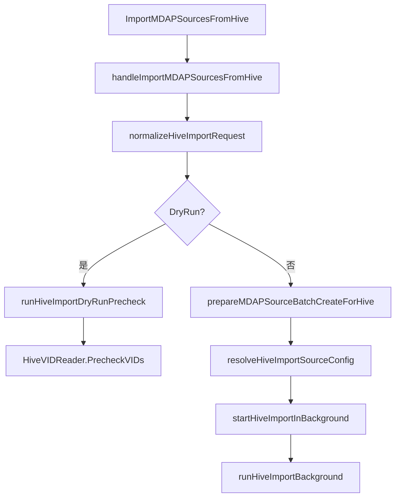

# MDAP Hive Source Import

## 模块概览

MDAP Hive Source Import 模块负责从 Hive 表读取 `vid` 列，并将这些 VID 批量导入为 MDAP Source。它由两部分组成：

- [biz/handler/mdap_source_hive.go](/Users/bytedance/videoarch/general_console/biz/handler/mdap_source_hive.go)：HTTP 入口、请求校验、异步导入编排、Hive 行结果到批量创建请求的转换。
- [biz/handler/mdap_source_hive_tqs.go](/Users/bytedance/videoarch/general_console/biz/handler/mdap_source_hive_tqs.go)：基于 TQS 的 `HiveVIDReader` 实现，负责构造 Hive SQL、提交 TQS 查询、轮询状态、解析结果。

模块的输入是 `ImportMDAPSourcesFromHiveRequest`，核心字段包括 `AssetGroupID`、`VODSpaces`、`HiveTable`、可选 `SourceConfig`、`Tags` 和 `Options`。Hive 表必须包含名为 `vid` 的列，列名由常量 `hiveImportVIDColumn` 固定为 `"vid"`。

## 入口与执行流程

HTTP handler 是 `GeneralConsoleServer.ImportMDAPSourcesFromHive`，它通过 `middleware.MDAPResponse` 统一包装响应，并把实际逻辑交给 `handleImportMDAPSourcesFromHive`。



`handleImportMDAPSourcesFromHive` 的行为分为两条路径：

1. `Options.DryRun == true`  
   只校验 Hive 查询是否可分析执行，不读取完整数据，也不创建 Source。成功后返回空 `Summary` 和空 `Results`。

2. `Options.DryRun == false`  
   校验资产组、VOD 空间、SourceConfig 后，启动后台导入任务，并立即返回成功响应。实际 Hive 读取和批量创建在 `runHiveImportBackground` 中执行。

注意：非 DryRun 的返回响应不包含最终导入结果。后台任务只通过日志记录读取、创建、失败和汇总信息。

## 请求归一化与校验

`normalizeHiveImportRequest` 负责把外部请求转换为内部使用的 `normalizedHiveImportRequest`。

主要校验规则：

- 非 DryRun 必须提供非空 `AssetGroupID`。
- 非 DryRun 必须提供至少一个非空 `VODSpaces`。
- `HiveTable.Cluster`、`HiveTable.Database`、`HiveTable.Table` 必须非空。
- 非 DryRun 时 `HiveTable.Partitions` 必须非空。
- DryRun 允许 `Partitions` 为空。
- 非 DryRun 如果显式传入 `SourceConfig`，其 `Type` 必须是 `mdap_model.SourceType_VDA`。
- `Options.SkipCheckMediaType` 默认值为 `true`。

归一化工具函数包括：

- `normalizeNonEmptyStrings`：去除字符串数组中的空白项。
- `normalizeStringMap`：裁剪 map 的 key/value，过滤空 key 或空 value，最终为空时返回 `nil`。
- `normalizeHiveTableConfig`：归一化 Hive 表配置并执行必填校验。
- `normalizeHiveImportOptions`：生成 `hiveImportEffectiveOptions`。

## SourceConfig 解析

非 DryRun 导入需要一个 VDA 类型的 `SourceConfig`。解析逻辑在 `resolveHiveImportSourceConfig` 中：

- 如果请求传入了 `SourceConfig`，直接使用它。
- 如果请求未传入，则从 `group.SourceConfigs[0]` 取默认配置。
- 最终配置的 `Type` 必须是 `mdap_model.SourceType_VDA`。
- 如果资产组没有可用 SourceConfig，会返回 `sourceConfig is empty` 的 BadRequest。

资产组准备由 `prepareMDAPSourceBatchCreateForHive` 完成。默认调用已有的 `prepareMDAPSourceBatchCreate`，测试或特殊场景可通过 `svr.mdapSourceBatchPreparer` 注入替代实现。

## 后台导入流程

`startHiveImportInBackground` 会启动后台任务：

- 如果配置了 `svr.hiveImportAsyncRunner`，使用该 runner 执行。
- 否则直接 `go run()`。
- 后台任务使用 `context.Background()`，不会继承 HTTP 请求上下文取消。

实际导入逻辑在 `runHiveImportBackground` 中：

1. 调用 `svr.getHiveVIDReader().ReadVIDs` 读取 Hive VID。
2. 使用 `buildHiveImportResults` 将 Hive 行转换为导入结果和候选项。
3. 如果没有有效候选 VID，记录日志并结束。
4. 使用 `buildHiveImportBatchRequest` 构造 `BatchCreateMDAPSourceRequest`。
5. 调用 `runMDAPSourceBatchCreator` 批量创建 MDAP Source。
6. 使用 `extractBatchCreateMDAPSourceResponse` 解析批量创建响应。
7. 使用 `mergeHiveImportBatchResults` 合并每条 VID 的创建结果并更新汇总。

默认批量创建路径会调用：

```go
svr.batchCreateMDAPSourcesWithGroupOptions(
    ctx,
    req,
    group,
    batchCreateMDAPSourceOptions{dedupeIdenticalSources: false},
)
```

这里显式关闭 `dedupeIdenticalSources`。因此 Hive 中重复 VID 不会在本模块内去重，也不会在批量创建入口被合并。

## Hive 行分类规则

`buildHiveImportResults` 负责把 `[]HiveVIDRow` 转换为：

- `[]*HiveImportResult`
- `[]hiveImportCandidate`
- `HiveImportSummary`

每行都会生成一个 `HiveImportResult`。字段含义：

- `Index`：当前行在读取结果中的 0 基下标。
- `RowNumber`：优先使用 `HiveVIDRow.RowNumber`；如果小于等于 0，则使用 `i + 1`。
- `VID`：裁剪空白后的 VID。
- `Status`：后续根据结果设置为 `invalid`、`created`、`skipped` 或 `failed`。
- `Reason`：失败、跳过或非法原因。
- `Source`：创建成功后填充批量创建返回的 `mdap_model.Source`。

分类规则：

- 空 VID：`Status = "invalid"`，`Reason = "empty_vid"`，计入 `EmptyVIDRows`，不会提交创建。
- 非空 VID：都会加入候选列表，即使是重复 VID。
- 重复 VID：计入 `DuplicateVIDRows`，但仍然提交创建。
- `UniqueVIDs` 只统计首次出现的非空 VID 数量。
- `TotalRows` 等于 Hive 返回行数。

## 批量创建请求构造

`buildHiveImportBatchRequest` 会把每个 `hiveImportCandidate` 转成一个 `BatchCreateMDAPSourceItem`：

```go
BatchCreateMDAPSourceItem{
    BizID:        candidate.vid,
    Name:         candidate.vid,
    SourceConfig: req.sourceConfig,
    Tags:         req.tags,
}
```

最终生成的 `BatchCreateMDAPSourceRequest` 包含：

- `AssetGroupID`
- `VODSpaces`
- `Sources`
- `SkipCheckMediaType`

`SkipCheckMediaType` 默认是 `true`，除非请求里通过 `Options.SkipCheckMediaType` 显式覆盖。

## 批量创建结果合并

`mergeHiveImportBatchResults` 使用批量创建响应中的 `Index` 字段，将 `BatchCreateMDAPSourceResult` 映射回候选 VID。

合并规则：

- 找不到对应 batch result：标记为 `failed`，`Reason = "missing_batch_result"`。
- `batchResult.Source != nil`：标记为 `created`，并写入 `Name` 和 `Source`。
- `batchResult.Source == nil`：
  - 如果 `batchResult.Error` 包含 `"sourceMediaType"`，`isHiveImportSkippedBatchError` 会将其判定为 `skipped`。
  - 其他错误标记为 `failed`。
- `SubmittedVIDs` 等于候选 VID 数量，不包含空 VID 行。

## HiveVIDReader 抽象

模块通过接口 `HiveVIDReader` 解耦 Hive 读取实现：

```go
type HiveVIDReader interface {
    PrecheckVIDs(ctx context.Context, req HiveVIDReadRequest) error
    ReadVIDs(ctx context.Context, req HiveVIDReadRequest) (*HiveVIDReadResult, error)
}
```

`getHiveVIDReader` 会返回：

- `svr.hiveVIDReader`，如果服务上已经配置；
- 否则返回 `notConfiguredHiveVIDReader`。

`notConfiguredHiveVIDReader` 的 `PrecheckVIDs` 和 `ReadVIDs` 都会返回 `"hive vid reader is not configured"`，用于避免空指针并明确暴露配置缺失。

## TQS 读取实现

`TQSHiveVIDReader` 是当前模块提供的 TQS 实现。它通过 `NewTQSHiveVIDReaderFromConfig` 从 `config.TQSConfig` 创建：

```go
reader := NewTQSHiveVIDReaderFromConfig(cfg, servicePSM...)
```

配置归一化由 `normalizeTQSHiveVIDReaderConfig` 完成。必填字段包括：

- `AppID`
- `AppKey`
- `UserName`
- `Cluster`
- `Timeout`

如果 `PollInterval` 小于等于 0，会使用 `defaultTQSPollInterval`，即 3 秒。

`servicePSM` 通过 `normalizeTQSServicePSM` 解析，未传时使用默认值：

```go
defaultTQSServicePSM = "toutiao.videoarch.general_console"
```

### TQS 查询准备

`prepareTQSQueryJob` 是 `ReadVIDs` 和 `PrecheckVIDs` 的共同准备路径：

1. 调用 `buildTQSHiveVIDSQL` 构造 SQL。
2. 调用 `validateQueueConfig` 校验离线队列配置。
3. 调用 `r.newClient` 创建 TQS client。
4. 调用 `r.getToken` 获取 InfSec token。
5. 调用 `buildQueryJobConf` 构造 TQS job conf。

离线队列配置要求 `YarnClusterName` 和 `MapReduceJobQueueName` 必须同时配置或同时为空。只配置其中一个会返回错误：

```text
invalid tqs queue config: YarnClusterName and MapReduceJobQueueName must be configured together
```

`buildQueryJobConf` 总是注入 `tqs.inf.sec.token`。如果配置了完整离线队列，还会注入：

- `yarn.cluster.name`
- `mapreduce.job.queuename`

## SQL 构造规则

`buildTQSHiveVIDSQL` 生成形如：

```sql
SELECT `vid` FROM `database`.`table` WHERE `date` = '2026-07-15' AND `region` = 'cn' LIMIT 1
```

构造规则：

- 只查询 `vid` 列。
- `Database`、`Table`、过滤字段名都通过 `quoteTQSIdentifier` 处理。
- `Partitions` 和 `ExtraFilters` 都转换为等值谓词。
- 谓词 key 会排序，保证 SQL 输出稳定。
- 字符串值通过 `quoteTQSStringLiteral` 转义单引号。
- `Limit > 0` 时追加 `LIMIT`。
- `Limit < 0` 会返回错误。

`quoteTQSIdentifier` 只允许匹配正则 `^[A-Za-z_][A-Za-z0-9_]*$` 的标识符，并使用反引号包裹。这意味着不支持带点号、连字符、空格或表达式的字段名。这个限制用于避免把外部输入拼接成任意 SQL 片段。

## DryRun 预检查

DryRun 路径调用 `runHiveImportDryRunPrecheck`，内部执行：

```go
svr.getHiveVIDReader().PrecheckVIDs(ctx, HiveVIDReadRequest{
    Cluster:      normalized.hiveTable.Cluster,
    Database:     normalized.hiveTable.Database,
    Table:        normalized.hiveTable.Table,
    Partitions:   normalized.hiveTable.Partitions,
    ExtraFilters: normalized.hiveTable.ExtraFilters,
    Limit:        1,
})
```

`TQSHiveVIDReader.PrecheckVIDs` 会使用 `CreateQueryJob(ctx, query, true, false, conf)` 创建 dry-run TQS job，然后调用 `waitForTQSAnalyze` 等待分析完成。

`waitForTQSAnalyze` 的超时时间最多为 `defaultTQSPrecheckTimeout`，即 10 秒。即使 reader 配置了更长的 `Timeout`，预检查也会被限制在 10 秒内。

## TQS 正式读取

`TQSHiveVIDReader.ReadVIDs` 的流程是：

1. `prepareTQSQueryJob` 构造 SQL、client 和 conf。
2. `CreateQueryJob(ctx, query, false, false, conf)` 创建正式查询。
3. `waitForTQSJob` 轮询 job 状态。
4. `FetchQueryResults` 拉取结果。
5. `buildHiveVIDReadResultFromTQSRows` 解析 VID 行。

`waitForTQSJob` 使用 `r.conf.timeout` 作为整体等待超时。轮询过程中：

- `STATUS_COMPLETE`：成功返回。
- `STATUS_ANALYSIS_FAIL`、`STATUS_CANCEL`、`STATUS_FAIL`：转换为 `tqsReadError`。
- 等待被取消或超时：调用 `CancelJob(context.Background(), jobID)` 尝试取消 TQS job。

## TQS 结果解析

`buildHiveVIDReadResultFromTQSRows` 将 TQS 返回的 `[][]string` 转成 `HiveVIDReadResult`。

解析规则：

- 空结果返回空 `Rows`。
- 如果第一行包含大小写不敏感的 `vid` 表头，则跳过表头，并按表头位置读取 VID。
- 如果第一行没有 `vid` 表头且列数大于 1，返回 `tqs query results missing vid column`。
- 如果第一行没有表头且只有一列，则按单列 VID 数据处理。
- 空行会生成只有 `RowNumber` 的 `HiveVIDRow`，后续会在 `buildHiveImportResults` 中变成 `empty_vid`。
- `RowNumber` 使用 TQS 结果中的 1 基行号，包括表头行占位。

## 错误处理与敏感信息清理

TQS 读取错误统一用 `tqsReadError` 表达。它携带：

- `stage`
- `jobID`
- `status`
- `detail`
- `cause`

`Error()` 输出会经过 `sanitizeTQSErrorDetail` 清理，避免日志或 API 错误里泄漏敏感信息。清理规则包括：

- 替换 JWT 形态的字符串为 `[REDACTED_JWT]`。
- 替换 `SEC_TOKEN_STRING`、`tqs.inf.sec.token`、`AppKey` 等敏感关键字。
- 替换形如 `app_key=...`、`sec_token_string:...`、`tqs.inf.sec.token=...` 的赋值片段。
- 错误详情最多保留 `maxTQSReadErrorDetailSize` 个 rune，超出后追加 `...(truncated)`。

TQS job 失败时，`buildTQSJobFailedError` 会从 `JobStatus.Progress` 中提取错误详情。`extractTQSJobErrorDetail` 支持以下 JSON 字段：

- `extraInfo`
- `message`
- `error`
- `detail`
- `reason`

## 与服务初始化的关系

调用图显示 `NewGeneralConsoleServer` 会调用 `NewTQSHiveVIDReaderFromConfig`。因此该模块的生产可用性依赖服务初始化时是否提供了有效的 `config.TQSConfig`。

如果配置不完整，`NewTQSHiveVIDReaderFromConfig` 返回 `nil`，后续 `getHiveVIDReader` 会退回到 `notConfiguredHiveVIDReader`，导入或 DryRun 会失败并提示 reader 未配置。

## 可测试性与注入点

模块为测试和替换实现保留了多个注入点：

- `svr.hiveVIDReader`：替换 Hive 读取实现。
- `svr.hiveImportAsyncRunner`：控制后台任务执行方式，测试中可同步执行。
- `svr.mdapSourceBatchPreparer`：替换资产组准备逻辑。
- `svr.mdapSourceBatchCreator`：替换批量创建逻辑。
- `TQSHiveVIDReader.newClient`：替换 TQS client 创建。
- `TQSHiveVIDReader.getToken`：替换 InfSec token 获取。
- `TQSHiveVIDReader.sleep`：替换轮询 sleep，避免测试真实等待。

相关测试覆盖了请求校验、DryRun、后台上下文、Hive 行分类、不去重行为、SQL 构造、TQS token 注入、队列配置校验、TQS 失败详情提取和结果解析等场景。

## 开发注意事项

修改该模块时需要特别注意以下行为契约：

- Hive 导入读取的列名固定为 `vid`。
- 非 DryRun 要求 `AssetGroupID`、`VODSpaces` 和 `HiveTable.Partitions` 非空。
- DryRun 只做 TQS 分析预检查，不返回样例 VID。
- 后台导入使用独立 `context.Background()`，不会因 HTTP 请求结束而取消。
- 重复 VID 会计入 `DuplicateVIDRows`，但仍会提交给批量创建。
- 空 VID 行不会提交创建，状态为 `invalid`。
- 默认 `SkipCheckMediaType` 为 `true`。
- 默认批量创建时 `dedupeIdenticalSources` 为 `false`。
- TQS SQL 标识符只支持简单安全标识符，不能传表达式或复杂字段路径。
- TQS 错误信息必须继续经过 `sanitizeTQSErrorDetail`，避免泄漏 token、AppKey 或 JWT。