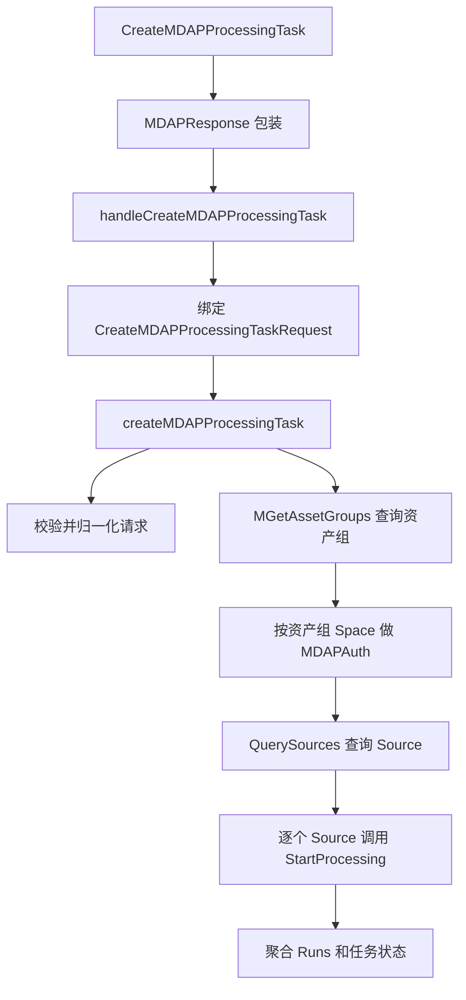

# MDAP Processing Tasks

## 模块概览

`biz/handler/mdap_processing_task.go` 实现 MDAP Processing Task 的创建流程：接收一个资产组级别的处理任务请求，查询该资产组下的 Source 列表，并对每个 Source 发起一次 `StartProcessing`。当前实现只支持 `snapshot` 模板任务，底层通过 `bytedance_videoarch_compound` RPC 调用 MDAP/Compound 服务。

该模块的核心入口是：

- `GeneralConsoleServer.CreateMDAPProcessingTask`
- `GeneralConsoleServer.handleCreateMDAPProcessingTask`
- `createMDAPProcessingTask`

`createMDAPProcessingTask` 是主要业务函数，测试也直接覆盖它，以便绕开 Hertz 请求上下文和真实 RPC 客户端。

## 执行流程



HTTP 层入口 `CreateMDAPProcessingTask` 不直接处理业务逻辑，而是调用：

```go
middleware.MDAPResponse(ctx, c, "mdap.processing_task.create", svr.handleCreateMDAPProcessingTask)
```

这说明该接口遵循 MDAP 统一响应包装逻辑，并使用 `"mdap.processing_task.create"` 作为中间件事件名或操作标识。

## 请求模型

`CreateMDAPProcessingTaskRequest` 是创建任务的输入结构：

```go
type CreateMDAPProcessingTaskRequest struct {
	AssetGroupID    string `json:"AssetGroupID"`
	OutputStorage   string `json:"OutputStorage"`
	DatasetListener *bool  `json:"DatasetListener"`
	ResourceMode    string `json:"ResourceMode"`
	TaskType        string `json:"TaskType"`
	Template        string `json:"Template"`
	TemplateId      string `json:"TemplateId"`
}
```

字段约束由 `validateMDAPProcessingTaskRequest` 统一处理：

| 字段 | 处理方式 | 约束 |
| --- | --- | --- |
| `AssetGroupID` | `strings.TrimSpace` | 不能为空 |
| `OutputStorage` | 去空格后转大写 | 只能是 `TOS` 或 `HDFS` |
| `DatasetListener` | 不做默认值填充 | 必须显式传入，不能为 `nil` |
| `ResourceMode` | `strings.TrimSpace` | 只能是 `exclusive` 或 `shared` |
| `TaskType` | `strings.TrimSpace` | 只能是 `template` |
| `Template` | `strings.TrimSpace` | 只能是 `snapshot` |
| `TemplateId` | `strings.TrimSpace` | 不能为空 |

`DatasetListener` 使用 `*bool` 而不是 `bool`，是为了区分“调用方传了 false”和“调用方没有传这个字段”。缺失会被视为非法请求。

## 响应模型

`CreateMDAPProcessingTaskResponse` 描述整个批量创建结果：

```go
type CreateMDAPProcessingTaskResponse struct {
	TaskID          string               `json:"TaskID"`
	Status          string               `json:"Status"`
	Runs            []*MDAPProcessingRun `json:"Runs"`
	SucceededCount  int32                `json:"SucceededCount"`
	FailedCount     int32                `json:"FailedCount"`
	AssetGroupID    string               `json:"AssetGroupID"`
	OutputStorage   string               `json:"OutputStorage"`
	DatasetListener bool                 `json:"DatasetListener"`
	ResourceMode    string               `json:"ResourceMode"`
	TaskType        string               `json:"TaskType"`
	Template        string               `json:"Template"`
	TemplateId      string               `json:"TemplateId"`
}
```

`newCreateMDAPProcessingTaskResponse` 会生成一个新的 `TaskID`：

```go
TaskID: uuid.NewString()
```

这里的 `TaskID` 是控制台侧聚合任务 ID，用于表示本次批量提交。每个 Source 对应的真实处理运行 ID 保存在 `MDAPProcessingRun.RunId` 中。

单个 Source 的运行结果由 `MDAPProcessingRun` 表示：

```go
type MDAPProcessingRun struct {
	SourceID string  `json:"SourceID"`
	BizID    string  `json:"BizID"`
	RunId    string  `json:"RunId"`
	Etc      float64 `json:"Etc"`
	Status   string  `json:"Status"`
	Error    string  `json:"Error,omitempty"`
}
```

`Error` 带有 `omitempty`，成功提交时不会出现在 JSON 响应中。

## 任务状态语义

模块内定义了三个任务状态：

```go
const (
	mdapProcessingTaskStatusSubmitted     = "submitted"
	mdapProcessingTaskStatusPartialFailed = "partial_failed"
	mdapProcessingTaskStatusFailed        = "failed"
)
```

状态聚合逻辑在 `createMDAPProcessingTask` 末尾完成：

- 所有 Source 都成功调用 `StartProcessing`：返回 `MDAPOK`，整体 `Status` 为 `submitted`
- 部分 Source 成功、部分失败：返回 `MDAPOK`，整体 `Status` 为 `partial_failed`
- 所有 Source 都失败：返回 `MDAPErrorWithResponse(errno.CodeInternalErr, ..., resp)`，整体 `Status` 为 `failed`

这意味着 `partial_failed` 是业务上的部分失败，但 HTTP/MDAP 响应层仍按成功返回；调用方需要读取响应体中的 `Status`、`SucceededCount`、`FailedCount` 和 `Runs` 判断每个 Source 的提交情况。

## 核心业务流程

`createMDAPProcessingTask` 是该模块的中心函数，签名如下：

```go
func createMDAPProcessingTask(
	ctx context.Context,
	req CreateMDAPProcessingTaskRequest,
	auth string,
	backend mdapProcessingBackend,
	authorize mdapProcessingAuthorizeFunc,
) errno.Payload
```

它按以下顺序执行：

1. 调用 `validateMDAPProcessingTaskRequest` 校验并归一化请求。
2. 调用 `backend.MGetAssetGroups(ctx, []string{normalized.AssetGroupID})` 查询资产组。
3. 检查 `BaseResp.StatusCode`，非 0 时转成 `CodeInternalErr`。
4. 从 `groupResp.GetAssetGroups()[normalized.AssetGroupID]` 取资产组；不存在时返回 `CodeNotFound`。
5. 使用资产组的 `Space` 调用授权函数：
   ```go
   authorize(ctx, mdapProcessingTaskAction, group.GetSpace())
   ```
6. 调用 `QuerySources` 查询资产组下的 Source。
7. 要求 Source 数量大于 0，且不超过 `mdapProcessingSourceLimit`。
8. 为每个 Source 调用 `startMDAPProcessingForSource`。
9. 统计成功和失败数量，生成最终响应。

授权动作常量是：

```go
mdapProcessingTaskAction = "mdap.tenant.query_source"
```

虽然接口语义是创建 Processing Task，但授权动作目前使用的是查询 Source 相关 action。贡献代码时需要注意这一点，避免误以为这里使用了单独的创建任务权限。

## Source 查询限制

模块定义了两个相关限制：

```go
mdapProcessingSourceLimit      = int32(100)
mdapProcessingQuerySourceLimit = int32(101)
```

`QuerySources` 调用时使用 `Limit = 101`：

```go
offset, limit := int32(0), mdapProcessingQuerySourceLimit
queryResp, err := backend.QuerySources(ctx, &mdap.QuerySourcesRequest{
	AssetGroupID: normalized.AssetGroupID,
	Offset:       &offset,
	Limit:        &limit,
})
```

随后用两个条件限制总量：

```go
if len(sources) > int(mdapProcessingSourceLimit) || queryResp.GetTotal() > int64(mdapProcessingSourceLimit) {
	return errno.MDAPErrorWithCode(errno.CodeBadRequest, fmt.Errorf("source count exceeds limit %d", mdapProcessingSourceLimit))
}
```

这里查询 101 条是为了检测“超过 100 个 Source”的场景。即使当前页返回数量不超过 100，只要 `Total` 大于 100，也会拒绝创建任务。

## 单个 Source 的处理提交

`startMDAPProcessingForSource` 负责把一个 `mdap_model.Source` 转换成一次 `StartProcessing` 调用：

```go
func startMDAPProcessingForSource(
	ctx context.Context,
	backend mdapProcessingBackend,
	auth string,
	req CreateMDAPProcessingTaskRequest,
	source *mdap_model.Source,
) *MDAPProcessingRun
```

它的失败处理是局部的：不会中断整个批量任务，而是返回一个 `Status = "failed"` 的 `MDAPProcessingRun`。

失败场景包括：

- `source == nil`
- `source.GetID()` 为空
- `backend.StartProcessing` 返回 error
- `StartProcessingResponse.BaseResp.StatusCode != 0`

成功时会填充：

```go
run.RunId = rsp.GetRunId()
run.Etc = rsp.GetEtc()
run.Status = mdapProcessingTaskStatusSubmitted
```

`StartProcessingRequest` 的关键参数如下：

```go
&compound.StartProcessingRequest{
	Input:      &compound.Input{SourceID: &sourceID},
	OperatorId: mdapProcessingOperatorSnapshot,
	TemplateId: &templateID,
	Auth:       auth,
}
```

其中 `OperatorId` 固定为：

```go
mdapProcessingOperatorSnapshot = "Snapshot"
```

因此当前模块虽然请求里有 `Template` 字段，但实际执行分支只支持 `snapshot`，并固定映射到 Compound 的 `"Snapshot"` operator。

## 后端抽象

该模块通过 `mdapProcessingBackend` 接口隔离外部 RPC：

```go
type mdapProcessingBackend interface {
	MGetAssetGroups(ctx context.Context, ids []string) (*mdap.MGetAssetGroupsResponse, error)
	QuerySources(ctx context.Context, req *mdap.QuerySourcesRequest) (*mdap.QuerySourcesResponse, error)
	StartProcessing(ctx context.Context, req *compound.StartProcessingRequest) (*compound.StartProcessingResponse, error)
}
```

生产实现是 `mdapProcessingCompoundBackend`：

```go
type mdapProcessingCompoundBackend struct {
	client bytedance_videoarch_compound.OverpassClient
}
```

它直接封装 `bytedance_videoarch_compound.OverpassClient`：

- `MGetAssetGroups` 调用 `b.client.MGetAssetGroups(ctx, ids)`
- `QuerySources` 调用 `b.client.RawCall().QuerySources(...)`
- `StartProcessing` 调用 `b.client.RawCall().StartProcessing(...)`

`QuerySources` 和 `StartProcessing` 都设置了 5 秒 RPC 超时：

```go
callopt.WithRPCTimeout(5*time.Second)
```

这个接口也是单元测试的主要扩展点。测试可以实现假的 `mdapProcessingBackend`，验证请求校验、授权短路、Source 数量限制、部分失败聚合、全部失败返回等逻辑，而不需要真实 RPC。

## 授权接入

授权函数类型为：

```go
type mdapProcessingAuthorizeFunc func(ctx context.Context, action, space string) (denied bool, payload errno.Payload)
```

`handleCreateMDAPProcessingTask` 传入的实现是：

```go
func(ctx context.Context, action, space string) (bool, errno.Payload) {
	return svr.MDAPAuth(ctx, c, action, space)
}
```

授权发生在资产组查询之后、Source 查询之前。这样做的原因是授权需要资产组上的 `Space`：

```go
group.GetSpace()
```

如果授权拒绝，`createMDAPProcessingTask` 会直接返回 `payload`，不会调用 `QuerySources` 或 `StartProcessing`。

## 错误处理约定

该模块所有对外返回都使用 `errno.Payload`：

- 请求绑定失败：`errno.MDAPErrorWithCode(errno.CodeBadRequest, err)`
- 参数校验失败：`errno.MDAPErrorWithCode(errno.CodeBadRequest, err)`
- 资产组 RPC 失败：`errno.MDAPErrorWithCode(errno.CodeInternalErr, err)`
- 资产组不存在：`errno.MDAPErrorWithCode(errno.CodeNotFound, errors.New("asset group not found"))`
- Source 为空：`errno.MDAPErrorWithCode(errno.CodeBadRequest, errors.New("sources is empty"))`
- Source 超限：`errno.MDAPErrorWithCode(errno.CodeBadRequest, fmt.Errorf(...))`
- 全部 `StartProcessing` 失败：`errno.MDAPErrorWithResponse(errno.CodeInternalErr, errors.New("all StartProcessing requests failed"), resp)`
- 成功或部分失败：`errno.MDAPOK(resp)`

需要特别注意：单个 Source 的 `StartProcessing` 失败不会立刻返回错误，而是记录在对应 `MDAPProcessingRun.Error` 中。只有当所有 Source 都失败时，整体才返回业务错误。

## 与代码库其他部分的连接

该模块位于 `biz/handler`，属于 `GeneralConsoleServer` 的 HTTP handler 层。它依赖以下代码库组件：

- `biz/middleware.MDAPResponse`：统一包装 MDAP handler 的响应。
- `biz/middleware.MDAPAuth` 字符串键：从 `RequestContext` 中读取认证信息并传给 Compound `StartProcessing`。
- `GeneralConsoleServer.MDAPAuth`：按 action 和 space 做权限校验。
- `biz/errno`：生成 MDAP 风格的成功和错误响应。
- `bytedance_videoarch_compound.OverpassClient`：访问资产组、Source 和处理任务启动能力。

从调用关系看，请求从 Hertz handler 进入后，业务逻辑集中在 `createMDAPProcessingTask`，外部系统访问集中在 `mdapProcessingBackend`。这种结构使 handler 层较薄，也使核心逻辑更容易通过单元测试覆盖。

## 贡献注意事项

修改该模块时优先保持 `createMDAPProcessingTask` 的可测试性。新增外部调用应尽量挂到 `mdapProcessingBackend` 接口上，而不是直接在业务函数里访问具体 RPC client。

如果要支持新的 `Template` 或 `TaskType`，需要同时调整：

- `validateMDAPProcessingTaskRequest` 的白名单校验
- `startMDAPProcessingForSource` 中 `OperatorId` 的选择逻辑
- 请求到 `compound.StartProcessingRequest` 的字段映射
- 聚合状态和单元测试覆盖

如果要调整 Source 数量限制，需要同时理解 `mdapProcessingSourceLimit` 和 `mdapProcessingQuerySourceLimit` 的配合关系。当前 `101` 的查询上限不是任意值，而是为了准确发现超过 `100` 的情况。