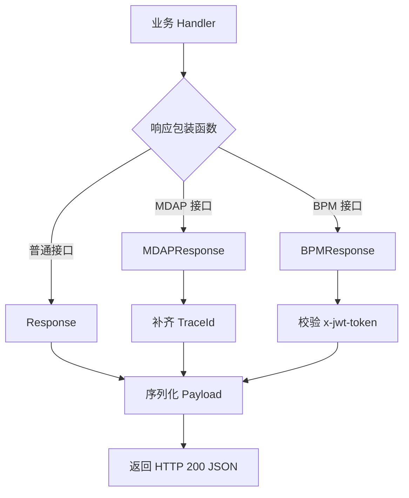
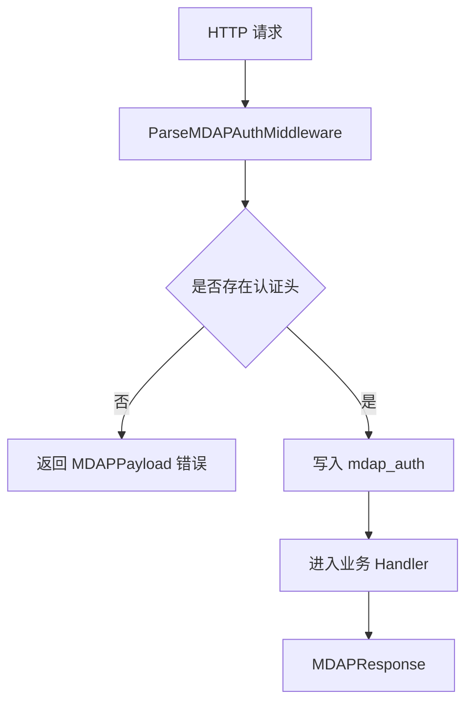

# Middleware and Request Authentication

## 中间件与请求认证模块

该模块位于 `biz/middleware`，负责统一包装 Handler 返回值、补齐 MDAP 响应链路追踪信息，以及在部分 BPM/MDAP 请求入口上处理鉴权相关逻辑。

模块中的 Handler 约定为：

```go
type MyHandlerFunc func(context.Context, *app.RequestContext) errno.Payload
```

业务 Handler 不直接写 HTTP 响应，而是返回 `errno.Payload`。`Response`、`MDAPResponse` 或 `BPMResponse` 负责序列化 payload、写入 JSON 响应，并在请求上下文中记录 `mkey`。

## 主要组件

### `InitJwtValidator`

```go
func InitJwtValidator(region string)
```

初始化包级变量 `jwtValidator`：

```go
jwtValidator = jwt.NewValidator([]string{"cn", "i18n", "us", "tx", "sinfi18n", "i18nbd"})
```

当前实现没有使用 `region` 参数，而是固定允许多个 region。`main` 会调用该函数完成 JWT 校验器初始化。依赖 `BPMResponse` 的路由必须确保该初始化已执行，否则 `jwtValidator.Validate` 会在未初始化状态下被调用。

### `Response`

```go
func Response(ctx context.Context, c *app.RequestContext, key string, f MyHandlerFunc)
```

用于普通 DevSRE 风格接口。典型调用方包括：

- `PageGetGeneralAccounts`
- `GetAccountDetail`
- `GetAllDomain`
- `AuthorizeAccountUser`
- `CheckUserAuthorized`
- `GetConfigByModule`
- `ScriptUploadFile`

执行流程：

1. 调用业务函数 `f(ctx, c)` 获取 `errno.Payload`。
2. 使用 `json.Marshal` 序列化返回值。
3. 如果序列化失败，返回 `errno.DevSreErrorWithCode(errno.CodeInternalErr, err)`。
4. 使用 `c.Data(http.StatusOK, "application/json", bytes)` 写入响应体。
5. 通过 `c.Set(MKeyContextKey, key)` 保存当前路由或业务 key。

需要注意：HTTP 状态码固定为 `200 OK`，真实业务状态通过 payload 中的 code 表达。

### `MDAPResponse`

```go
func MDAPResponse(ctx context.Context, c *app.RequestContext, key string, f MyHandlerFunc)
```

用于 MDAP 风格接口。典型调用方包括：

- `QueryArtifacts`
- `ListVODSpaces`
- `GetMDAPAssetGroup`
- `CreateMDAPAssetGroup`
- `UpdateMDAPSpace`
- `DeleteMDAPAssetGroup`
- `CheckMDAPSpaceAuth`

它在 `Response` 的基础上增加了 trace id 处理：

1. 调用业务函数 `f(ctx, c)` 获取 payload。
2. 从 `logid.GetLogIDFromCtx(ctx)` 读取 trace id。
3. 如果上下文中没有 trace id，则调用 `logid.GenLogID()` 生成。
4. 如果返回值是 `errno.MDAPPayload` 或 `*errno.MDAPPayload`，并且 `TraceId` 为空，则填充 trace id。
5. 序列化 payload 并返回 JSON。
6. 如果序列化失败，返回 `errno.MDAPErrorWithCode(errno.CodeInternalErr, err)`，并设置 `TraceId`。

这个函数保证 MDAP 响应尽量带有 `TraceId`，方便前端、调用方和日志系统关联问题。

### `BPMResponse`

```go
func BPMResponse(ctx context.Context, c *app.RequestContext, key string, f MyHandlerFunc)
```

用于 BPM 相关接口，并在执行业务逻辑前校验用户 JWT。

执行流程：

1. 从请求头 `x-jwt-token` 读取 token。
2. 调用 `jwtValidator.Validate(ctx, token)` 校验。
3. 校验失败时记录错误日志，并返回：

```go
errno.DevSreErrorWithCode(errno.CodeUnauthorized, err)
```

4. 校验成功时记录操作用户：

```go
logs.CtxInfo(ctx, "user operate bpm: %s", payload.Username)
```

5. 调用业务函数 `f(ctx, c)`。
6. 序列化并返回 JSON。
7. 设置 `mkey`。

当前实现还会通过 `pretty.Println(callPath)` 输出请求路径：

```go
callPath := string(c.Path())
pretty.Println(callPath)
```

这是调试式输出，贡献代码时需要留意它是否符合运行环境的日志规范。

### `ParseMDAPAuthMiddleware`

```go
func ParseMDAPAuthMiddleware() app.HandlerFunc
```

用于 MDAP 请求入口的认证头预处理。它不解析 JWT 内容，只负责从请求头提取认证字符串并放入 Hertz 请求上下文。

读取顺序：

1. `X-Jwt-Token`
2. `Authorization`

如果两个 header 都为空，直接中断请求并返回：

```go
errno.MDAPPayload{
    Code:    4001,
    Message: "empty auth, need X-Jwt-Token or Authorization header",
    TraceId: traceID,
}
```

`traceID` 优先来自 `logid.GetLogIDFromCtx(ctx)`，没有时由 `logid.GenLogID()` 生成。

如果认证头存在，则写入：

```go
c.Set(MDAPAuth, auth)
```

其中 `MDAPAuth` 常量值为：

```go
const MDAPAuth = "mdap_auth"
```

后续 Handler 可以通过该 key 从 `RequestContext` 中取出认证信息。

## 请求处理流程



MDAP 认证头处理通常发生在响应包装之前：



## 与 `errno` 模块的关系

该模块不定义业务错误结构，而是依赖 `biz/errno` 中的 payload 构造函数和结构体：

- `errno.Payload`
- `errno.DevSreErrorWithCode`
- `errno.MDAPErrorWithCode`
- `errno.MDAPPayload`
- `errno.CodeInternalErr`
- `errno.CodeUnauthorized`

普通接口走 `DevSREPayload` 风格，MDAP 接口走 `MDAPPayload` 风格。调用图中可以看到典型链路：

```text
PageGetGeneralAccounts
-> Response
-> DevSreErrorWithCode
-> DevSREPayload
```

```text
GetMDAPSpaceDetail
-> MDAPResponse
-> MDAPErrorWithCode
-> MDAPPayload
```

```text
BPMCheckAccountName
-> BPMResponse
-> DevSreErrorWithCode
-> DevSREPayload
```

## 上下文 key

模块定义了两个上下文 key：

```go
const MKeyContextKey = "mkey"
const MDAPAuth = "mdap_auth"
```

`MKeyContextKey` 由 `Response`、`MDAPResponse`、`BPMResponse` 设置，用于记录调用时传入的 `key`。

`MDAPAuth` 由 `ParseMDAPAuthMiddleware` 设置，用于保存请求头中的认证字符串。

贡献代码时应复用这些常量，避免直接散落字符串字面量。

## 错误处理约定

该模块的错误处理有几个一致特征：

- HTTP 状态码通常保持 `http.StatusOK`。
- 业务错误通过 payload 中的 code/message 表达。
- JSON 序列化失败会转换为内部错误 payload。
- MDAP 错误响应会尽量携带 `TraceId`。
- `ParseMDAPAuthMiddleware` 缺少认证头时会调用 `AbortWithStatusJSON`，不会继续执行后续 Handler。

## 增加新接口时如何选择包装函数

普通 DevSRE 接口使用：

```go
middleware.Response(ctx, c, key, func(ctx context.Context, c *app.RequestContext) errno.Payload {
    // 返回 DevSRE 风格 payload
})
```

MDAP 接口使用：

```go
middleware.MDAPResponse(ctx, c, key, func(ctx context.Context, c *app.RequestContext) errno.Payload {
    // 返回 errno.MDAPPayload 或 *errno.MDAPPayload 时会自动补齐 TraceId
})
```

BPM 接口使用：

```go
middleware.BPMResponse(ctx, c, key, func(ctx context.Context, c *app.RequestContext) errno.Payload {
    // 只有 JWT 校验通过后才会执行这里
})
```

如果 MDAP 接口需要请求认证头，应在路由链路中挂载 `ParseMDAPAuthMiddleware()`，并在业务 Handler 中读取 `MDAPAuth` 对应的值。

## 维护注意事项

`base.go` 中引入的是：

```go
"code.byted.org/middleware/hertz/pkg/app"
```

`parse_mdap_auth.go` 中引入的是：

```go
"github.com/cloudwego/hertz/pkg/app"
```

这两个 `app` 包路径不同，但都被用作 `app.HandlerFunc` 和 `app.RequestContext`。修改中间件签名或升级 Hertz 依赖时，需要确认这两个包路径是否兼容，避免路由注册或 Handler 类型不匹配。

`Response` 和 `MDAPResponse` 在 `json.Marshal` 失败后会调用 `c.JSON` 写错误响应，但随后代码仍会继续执行 `c.Data`。如果后续要调整错误处理，应考虑在写入错误响应后立即 `return`，避免同一次请求写入多次响应。